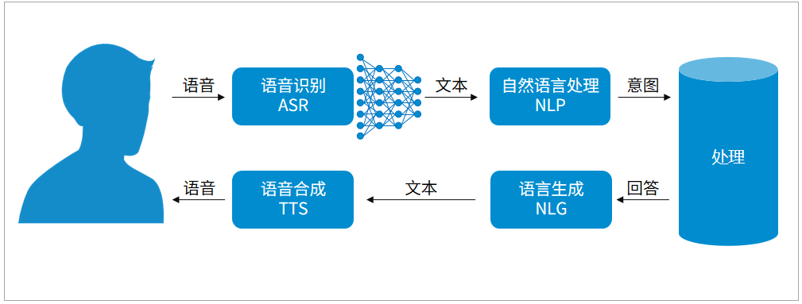
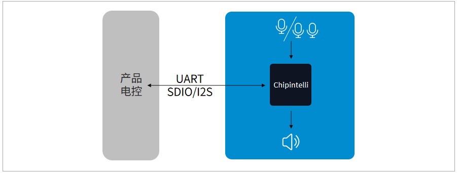
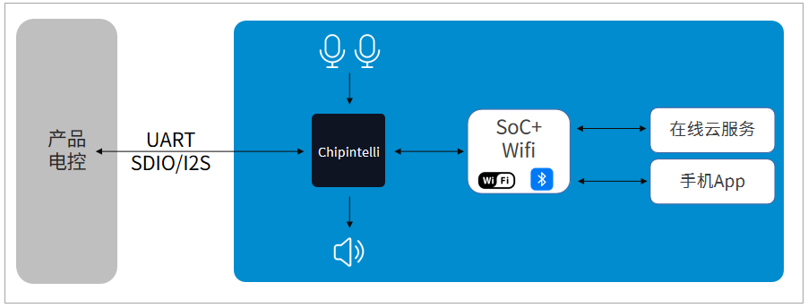
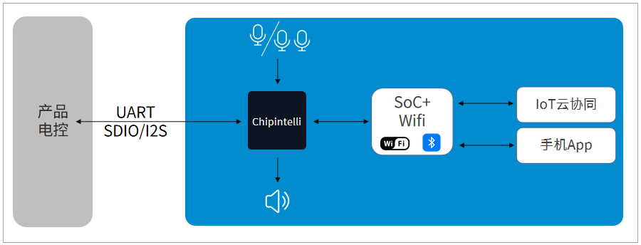

# 了解智能语音

## 基本知识

智能语音是人工智能技术的重要组成部分，包括语音识别、语义理解、自然语言处理、语音交互等。智能语音解决的问题，就是使得设备可以用听觉感知周围的世界，用声音和人做最自然的交互，让操控和生活更为便捷。

智能语音的基础在于通过神经网络技术，提升语音识别的识别率，同时可以用语义理解分析出人的意图，进行相应的操控，反馈时可以通过播放预设的声音或通过语音合成来合成声音播放，输出结果。

当前处理智能语音有多种方式，常见的有在线语音、离线语音等分类。因为智能语音处理需要用到算力，所以刚开始都是用云端服务器提供算力来进行识别和语义处理，一个常见的智能语音处理流程如下图所示。

{: .center}

常见的智能语音处理流程

随着技术的不断发展，出现了专用的终端智能语音芯片，可以通过芯片上的终端算力，将语音识别、语义理解等功能直接在终端设备上处理，离线语音开始兴起。因为离线语音具备保护用户隐私，响应速度快，无需网络即可控制等优势，目前已成为很多控制类设备的标准语音控制方式。未来，语音处理会更多在边缘端实现，以降低服务器的消耗和网络带宽，更节省社会资源，云端作为服务和内容的提供商，和端侧语音配合，共同为人们的生活服务。

***

## 离线语音介绍

离线语音方案采用本地处理语音识别等功能，其无需网络，响应速度、隐私安全等都优于在线方案。离线语音方案需要采用智能语音芯片处理智能语音功能，比较适合做控制类设备的处理，如控制类家电家居设备（空调、插座等）。

离线语音和在线语音功能的一个对比如下表所示。

项目 | 离线语音 | 在线语音
:--: | :--: | :--:
是否联网 | 不需联网 | 需要联网
响应速度 | 很快（通常0.2S左右） | 较快（受网络质量影响）
指令数量（语音库） | 1~1000条（本地语音库） | 无限量（云端语音库）
模糊识别 | 不支持，必须使用固定词条 | 支持
语音解析 | 单片机查询本地语音库解析 | 云端云计算查询数据库解析
扩展功能 | 无 | 具备娱乐、生活服务等功能

我司目前已推出多款离线语音解决方案，一个应用框图如下所示。

{: .center}

***

## AIoT语音介绍

当前物联网已经非常成熟，各类设备都可以通过以太网、WIFI、蓝牙等方式进行连接，实现互联控制。IOT控制特别是家居类目前还是需要使用手机等设备作为中心，在实际使用中特别是当设备就在眼前时，用手机启动并不是最方便的操控方式，而且当手机等中心设备有故障时，各个设备之间缺乏控制方式无法使用，存在一定的局限性。当前语音作为一种最自然的交互方式，和IOT结合可以解决IOT控制中配网麻烦、需要中心的一些痛点，又可以让设备互联后共同为用户提供服务，实现一个语音入口设备控制全部IOT设备，非常方便。特别是随着专用智能语音芯片的出现，使得其方案成本大大降低，已经广泛应用到了中控屏、面板、插座、大小家电等IOT设备中。

我司目前已推出语音AIOT解决方案，一个应用框图如下所示。

{: .center}

***

## 离在线语音介绍

离线语音具备无需联网，响应速度快的优势；在线语音具备能获取丰富的云端内容和服务的优势。实际方案中可以将两者优势结合，控制类功能用离线语音实现，内容和服务用在线语音，这样既可以保障基本功能的不依赖网络使用，保护用户隐私，又可以在用户控制并许可的情况下通过网络获取需要的内容和服务，非常方便。目前已经在智能家电等家具设备中得到了应用。

我司目前已推出离在线语音方案，可以实现离线控制和在线音乐、视频、社交、新闻、百科、股票、菜谱、儿童教育等高频生活场景在内的数百种服务技能，能满足大部分产品的需求。一个应用框图如下所示。

{: .center}