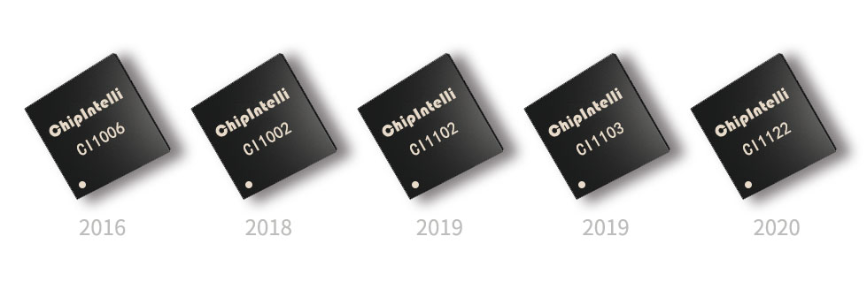
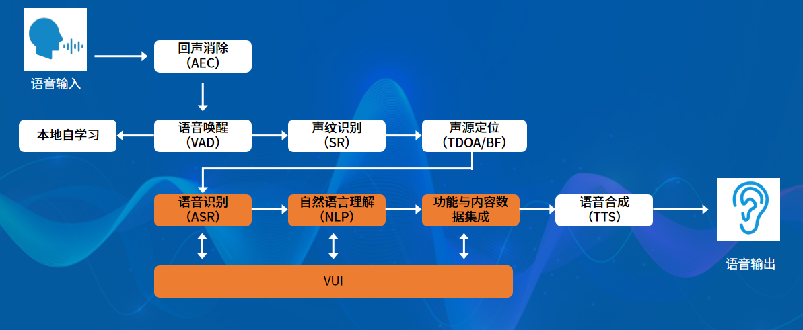
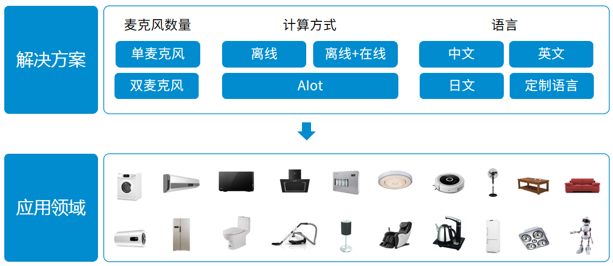

# 启英泰伦介绍

## 公司简介

启英泰伦于2015年成立，总部位于成都。公司专注于语音AI芯片及AI算法开发，是行业首家同时具备AI芯片、AI算法、开发平台、软硬件方案能力的全栈技术企业，现已成长为人工智能语音芯片领域的领导者，在端侧语音芯片市场占有率行业领先。

***

## 语音AI芯片

***成立至今，启英泰伦已推出多款芯片，均具备高性能、高集成、高可靠性、低功耗、低成本等优势。***

2016年，启英泰伦推出行业首款深度神经网络语音AI芯片CI1006，开启了智能语音离线控制智能家电，奠定了启英泰伦在离线语音家电领域的领先地位。经科学技术成果评价属国内首创（证书编号：9562018Y0009），也是唯一一款入选《人工智能浪潮》书籍的语音芯片。

2018年，推出语音AI芯片CI1002，该芯片在保持CI1006性能优势的基础上成本更低，应用领域更广泛。

2019年，推出行业首款降噪识别一体多核语音AI芯片CI110X系列（CI1102/CI1103），支持离线远场语音识别，离线+在线语音识别，离线+AIoT语音场景联控，且集成更丰富（集降噪拾音、麦阵处理、ASR、MCU控制等功能为一体)，成本更低（和DSP、MCU芯片同量级），功耗更低（待机功耗是实现相同功能性能的AP芯片的十分之一以下)。经科技成果评价，成果水平达到国际先进（证书编号：202051ZK3713），并入选AIIA发起的《AI芯片技术选型目录2020年》。

2020年，推出轻量级更高性价比的降噪识别一体多核语音AI芯片CI1122，实现高、中、低端市场全面覆盖，目前已大批量销售出货。

{: .center}

***

## AI算法
作为“芯片+算法”公司，启英泰伦拥有完全自主知识产权的全系列语音交互技术，包括单麦和麦阵语音增强、噪声抑制、回声消除、低功耗唤醒、本地语义理解、声纹识别等语音算法，并首创本地自学习技术，让用户可自定义词条，解决了方言识别、用户追求个性化等难题。语音识别率最高可达到97%以上，可实现最远10米识别距离，处于行业领先水平。

{: .center}

## 解决方案及应用

基于公司自研语音AI芯片及AI算法， 启英泰伦推出了丰富全面的各类产品解决方案，可应用于智能家居、智能家电、智能照明、智能玩具、智能机器人、智能汽车等领域。并开放 [启英泰伦语音AI平台](https://platform.chipintelli.com) ，旨在帮助开发者进行更高效率、更便捷的智能语音产品开发。 

{: .center}

经过多年的积累，公司目前基于端侧语音芯片的产品解决方案数量处于行业领先，已有数百家合作伙伴基于公司的芯片产品开发了数千种产品项目。公司将不断研发更适应市场和客户需求的人工智能语音芯片产品和应用解决方案，旨在通过技术和产品的不断迭代，加快智能语音产品的市场渗透速度，用智能语音让人们的生活更美好。

***

## 公司愿景

**Make AI Real**

**让语音交互走进千家万户**