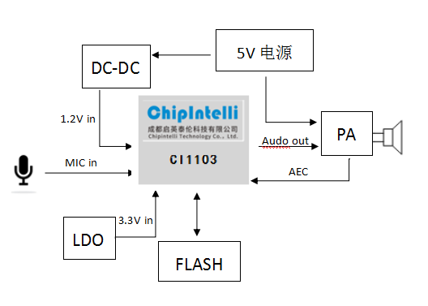
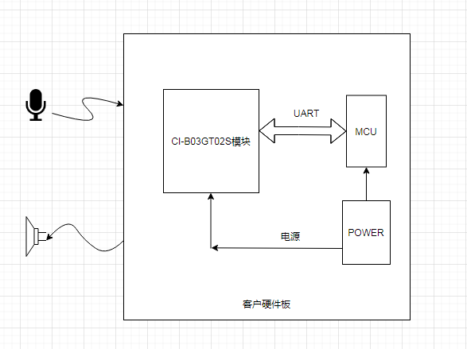
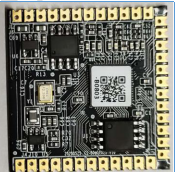
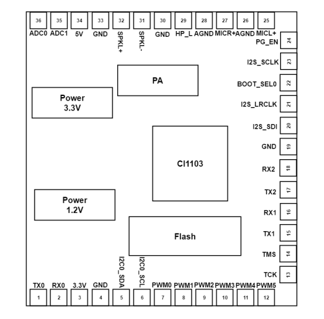
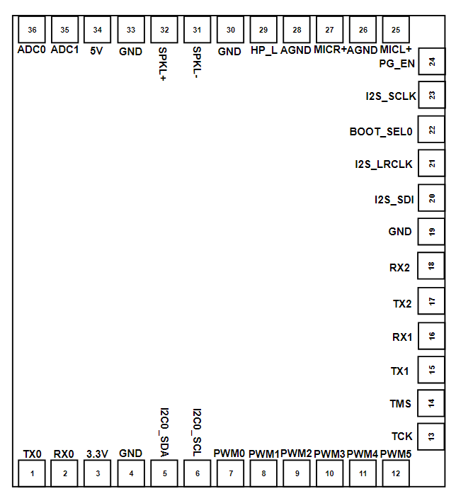
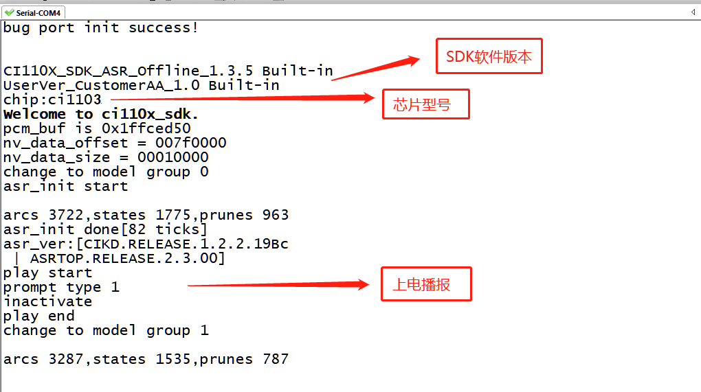
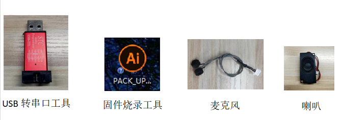
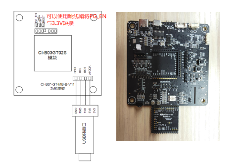
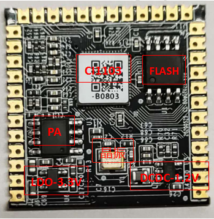
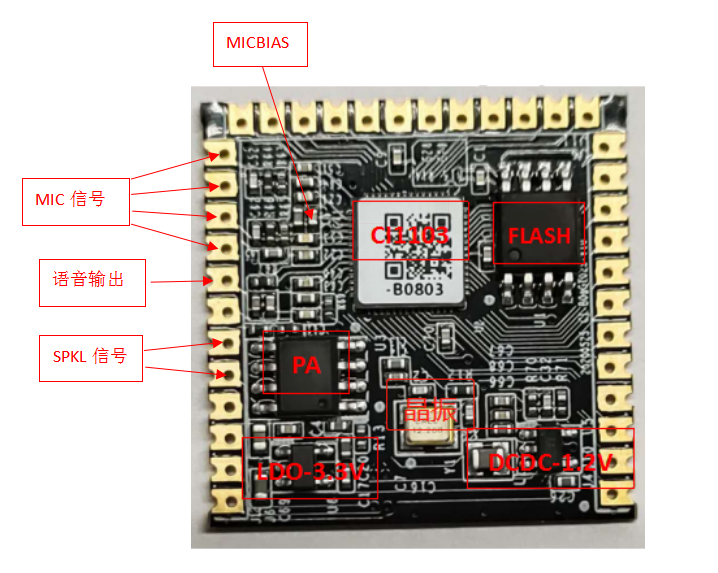

# CI-B0XGS01J模块数据手册

## 模块介绍

### 概述

本模块是针对低成本离线语音应用方案开发的一款通用、便携、低功耗高性能的语音识别模块，型号为：CI-B03GT02S，模块的主芯片为CI1103。CI-B03GS01J中的主芯片CI1103相比CI110X系列的CI1102芯片多2MB的DRAM，可以实现更多命令词和算法功能。

{: .center }

图1  模块框图

该模块具有以下特点：

模块体积小巧，长宽为27mm×27mm，工作电压为4.5V-5.5V，模块板载一颗8MB NorFlash、功放、LDO以及DCDC，外围电路设计简单。模块支持双麦克风输入，外围连接上喇叭和麦克风即可正常工作。模块采用单面贴装，通过插针将CI1103芯片大部分功能IO口引出，预留了3路UART接口，1组IIS接口，1组IIC接口，6路的PWM接口，调试和升级都非常方便。模块可以和配套的功能底板是使用。

* 模块主芯片支持离线神经网络计算，支持双麦克风降噪增强，回声消除，360度全方位拾音，可抑制环境噪音，保证嘈杂环境中语音识别的准确性。使用本模块进行离线语音识别不依赖网络，时延小，性能高，可实现97%以上的高识别率，10米超远距离识别，响应时间最快达到0.2S。
* 模块可以应用到有能耗等级要求的产品和电池类产品中，运行功耗≤150mW。
* 高可靠性，模块选材均选用工业级器件，通过了包括双85高温高湿测试在内的多项可靠性实验，可应用在对可靠性要求极高的家电产品中。

### 模块主芯片介绍

CI110X系列芯片（包含CI1102和CI1103）是一颗专用于语音处理的人工智能芯片，可广泛应用于家电、家居、照明、音箱、玩具、穿戴设备、汽车等产品领域，实现语音交互及控制。CI110X系列芯片内置自主研发的脑神经网络处理器BNPU，支持本地大词汇量语音识别和声纹识别，和内置的CPU核结合可以做各类智能语音方案应用。

想了解CI110X芯片更多的详细信息，请点击以下链接:

☞[CI1102芯片数据手册](../芯片数据手册/CI1102芯片数据手册/芯片概述.md)

☞[CI1103芯片数据手册](../芯片数据手册/CI1103芯片数据手册/芯片概述.md)

### 模块应用场景

该模块可用作语音识别前端+客户硬件主控板方案组合使用，也可以作为灯具、玩具等方案的单芯片主控模块。应用时需外接麦克风和喇叭，并通过外部接入的5V电源进行供电。

{: .center }

图2  模块作为语音识别前端应用示意图

CI-B03GT02S模块支持300条以内的离线语音识别命令词，可以用来做空调、洗衣机、中控等要求较多命令词的产品，还可以通过CI1103的计算能力，支持本地命令词自学习等扩展功能，增强产品的体验感。

{: .center }

图3  模块可应用的产品

## 模块规格

### 模块实物图

{: .center }

{: .center }

图4  模块实物和芯片对应位置图

模块实物如图4所示，语音识别模块为单面贴装，主要IC包括语音识别芯片CI1103、8MB的NorFlash、功放等。声音从双麦克风输入，经语音IC识别后送给功放驱动喇叭播放声音，功放最大驱动功率为1.5W@8Ω和2W@4Ω。模块内部通过一路Codec实现了回声消除，正常运行下回声有效抑制的信噪比最大范围为-10dB到-15dB。

### 模块尺寸图

{: .center }

图5  模块尺寸图

如图5所示，模块形状为正方形，尺寸为27mm*27mm，PCB板厚为1.6mm，模块高度为2.92mm，用户可根据此尺寸设计结构。

### 模块硬件接口定义

{: .center }

图6  模块引脚图

模块全部对外引脚的功能描述如表1所示：

表1 模块引脚对照表

管脚号 | 管脚名称 | I/O类型 | IO驱动能力 | IO上电默认状态 | 功能定义
:--: | :--: | :--: | :--: | :--: | :--:
1 | UART0_TX | IO | 4mA | IN,T+U | 1.GPIO[0] 2.UART0_TX:Transmit channel of UART0
2 | UART0_RX | IO | 4mA | IN,T+U | 1.GPIO[1] 2.UART0_RX:Receive channel of UART0
3 | 3.3V | P | - | - | 3.3V电源输出
4 | GND | P | - | - | 地信号
5 | I2C0_SDA | IO | 4mA | IN,T+U | 1.GPIO[2] 2.I2C0_SDA:I2C0 Serial Data 3.SDC0_D1:SDC0 interface data 1 4.SPI2_CS:SPI2 interface chip selection signal
6 | I2C0_SCL | IO | 4mA | IN,T+U | 1.GPIO[3] 2.I2C0_SCL:I2C0 Serial Clock 3.SDC0_D0:SDC0 interface data 0 4.SPI2_D1:SPI2 interface data 1
7 | PWM0 | IO | 4mA | IN,T+D | 1.GPIO[15] 2.PWM0 Output 3.SDC_CARD_DETECT_N
8 | PWM1 | IO | 4mA | IN,T+D | 1.GPIO[16] 2.PWM1 Output
9 | PWM2 | IO | 4mA | IN,T+D | 1.GPIO[17] 2.PWM2 Output
10 | PWM3 | IO | 4mA | IN,T+D | 1.GPIO[18] 2.PWM3 Output 3.IPM_CS
11 | PWM4 | IO | 4mA | IN,T+D | 1.GPIO[19] 2.PWM4 Output 3.I2C1_SDA:I2C1 Serial Data
12 | PWM5 | IO | 4mA | IN,T+D | 1.GPIO[20] 2.PWM5 Output 3.I2C1_SCL:I2C1 Serial Clock
13 | JTAG_TCK | IO | 4mA | IN,T+D | 1.TCK:Serial Wire Debug port clock pin,Has intemal weak pull-down 2.GPIO[21]
14 | JTAG_TMS | IO | 4mA | IN,T+U | 1.TMS:Serial Wire Debug port data pin,Has intemal weak pull-up 2.GPIO[22]
15 | UART1_TX | IO | 4mA | IN,T+U | 1.GPIO[23], 2.UART1_TX:Transmit channel of UART1 3.I2C1_SDA:I2C1 Serial Data
16 | UART1_RX | IO | 4mA | IN,T+U | 1.GPIO[24] 2.UART1_RX:Receive channel of UART1 3.I2C1_SCL:I2C1 Serial Clock
17 | UART2_TX | IO | 4mA | IN,T+U | 1.GPIO[25], 2.UART2_TX:Transmit channel of UART2 3.I2C1_SDA:I2C1 Serial Data
18 | UART2_RX | IO | 4mA | IN,T+U | 1.GPIO[26] 2.UART1_RX:Receive channel of UART2 3.I2C1_SCL:I2C1 Serial Clock 4.EXT_INT[1]
19 | GND | P | - | - | 地信号
20 | I2S1_SDI | IO | 4mA | OUT,T+D | 1.GPIO[27] 2.I2S1_SDI:Serial Data Input for I2S1 interface 3.SPII_CS:SPI1 interface chip selection signal
21 | I2S1_LRCLK | IO | 4mA | IN,T+D | 1.GPIO[28] 2.I2S1_LRCLK:I2S1 LRCLK clock 3.SPI1_DIN:SPI1 interface data input
22 | I2S1_SDO | IO | 4mA | IN,T+D | 11.GPIO[29] (BOOT_SEL[1])
*  | (BOOT_SEL0) |  |  |   | At startup,Boot1 option bit is used to select one of two modes: 0---Normal functional model 1---Debug mode 2.I2S1_SDO:Serial Data Output for I2S1 interface
23 | I2S1_SCLK | IO | 4mA | IN,T+D | 1.GPIO[30] 2.I2S1_SCLK:Serial Clock for I2S1 interface 3.SPI1_DOUT:Transmit channel of SPI1 
24 | I2S1_MCLK (PG_EN) | IO | 4mA | IN,T+D | 1.GPIO[31] (UART_UPDATE_EN) At startup,this pin is used to select one of two functional modes: 1---Start serial port upgrade service and program 0---Start directly from Flash 2.I2S1_MCLK:Master Clock for I2S1 reference 3.SPI1_CLK:Serial Clock for SPI1 interface
25 | MICL+ | - | - | - | 麦克风输入
26 | AGND | P | - | - | 模拟地信号
27 | MICL+ | - | - | - | 麦克风输入
28 | AGND | P | - | - | 模拟地信号
29 | HP_L | O | - | O | Left DAC channel output
30 | GND | P | - | - | 地信号
31 | SKP- | - | - | - | 喇叭输出
32 | SKP+ | - | - | - | 喇叭输出
33 | GND | P | - | - | 地信号
34 | 5V | P | - | - | 5V电源输入
35 | ADC1 | IO | - | IN，T+D | 1.GPIO[36] 2.ADC1 Input 3.PWM1 4.I2C0_SDA
35 | ADC0 | IO | - | IN，T+D | 1.GPIO[37] 2.ADC0 Input 3.PWM0 4.I2C0_SDA 4.I2C0_SCL

上表中的一些符号的说明如下：

I		input

O		output

IO		bidirectional

P		power or ground

T+D		tristate plus pull-down 

T+U		tristate plus pull-up

OUT		power-on defaults to output mode

IN		power-on defaults to input mode

### 模块电气特性参数

表2 模块引脚对照表

参数 | 条件 | 最小值 | 典型值 | 最大值 | 单位 | 备注
:--: | :--: | :--: | :--: | :--: | :--: | :--:
模块供电电压 | / | 4.5 | 5 | 5.5 | V | NOTE1
模块播音状态电流（正常音量） | 8欧2W喇叭 | / | 70 | / | mA | NOTE2
模块工作电流 | / | / | 40 | / | mA | NOTE3
安静环境下监听状态电流 | 5V供电 | / | 32 | / | mA | /
芯片IO接口电压 | / | 3 | 3.3 | 3.6 | V | /
模块UART接口电压 | / | 4.5 | 5 | 5.5 | V | /

***NOTE1：5V为模块典型供电电压，输入超过5.5V电压会损坏模块。***

***NOTE2：模块播音状态下最大电流能达到250mA，按照两倍余量原则上需要为模块提供一组驱动能力为500mA的电源供电。***

***NOTE3：典型值测试时为静音状态。最大值测试时为识别并播音状态。***

### 模块温湿度参数

模块的温湿度参数如表4所示。

表3 温湿度参数表

参数 | 最小值 | 典型值 | 最大值 | 单位 | 备注
:--: | :--: | :--: | :--: | :--: | :--:
模块工作环境温度 | -20 | 25 | 85 | °C | /
模块存储环境温度 | -20 | 25 | 100 | °C | /
模块存储湿度 | 0% | / | 5% | RH |  /
焊接温度 | / |  220 | 245 | 5°C | /

## 模块应用

### 模块上电及启动

使用该模块时搭配配套的底板，接上喇叭和麦克风，将5V电源输入到模块，模块通电后会启动，上电正常喇叭会播报提示音频，此时UART口会有打印信息出现，用户可以将该UART口用USB串口调试助手等工具接到电脑上，在电脑中的串口调试软件中看到打印信息后表明模块启动成功，如图3-1所示。

输入模块的5V电源会经过模块上的LDO和DCDC芯片降压为3.3V和1.2V，供主芯片使用。模块上的功放芯片采用5V电源供电。5V供电需保证500mA的额定供电电流，要求电源稳定，纹波在30mV以内。

{: .center }

图7  模块启动后的一个参考打印信息

### 模块默认命令词

如果为用户量产模块，一般出厂前会烧录用户指定的命令词条固件。如果客户未指定，模块会自带默认固件，该固件带默认命令词，供用户测试使用，其命令词如下图所示：

{: .center }

图8  模块默认命令词

### 模块默认串口通讯协议

本模块默认的固件中支持串口通讯协议，用于和上位机的通讯使用。该串口协议可扩展，有以下特点:

* 完整传输包，包含：头尾，长度，校验，消息类型，消息序列号。
* 支持变长命令，方便扩展。
* 消息类型(命令，通知，回复)。
* 命令消息，可配置，回复ACK。通知消息无ACK。
* 消息格式将与bootloader升级的相同，通过header来与bootloader协议区分。
* 默认波特率使用9600。
* 注意：模块预留的UART0接口，UART0接口默认为打印输出接口。如需UART0作为上述串口协议接口，必须修改代码，修改方式可参照☞[CI110X芯片SDK](../../软件开发/SDK/CI110X芯片SDK/CI110X芯片SDK.md) 的串口协议部分文档实现。
* 支持的命令：查询协议版本号，查询系统版本号，设置音量（音量分级在user_config.h中定义），播放本地播报音，复位命令等，具体协议格式如下图所示：

{: .center }

图9  串口协议格式

**举例说明1：**

A5 FC 07 00 A0 91 18 01 55 E0 01 00 00 1B 9B 02 FB解析如下，

A5 FC：head

07 00:有效数据为7byte

A0 ：这是命令词信息

91 ：命令号码为0x91（本次数据内容为命令词数据）

18 ：包序号，本串口第0x08次外发数据，该数值不断累加

01 55 E0 01 00 00：当前命令词的唯一数据

1B ：命令词阈值

9B 02：累加和 

FB：结尾数据

备注：如果应用中仅关注命令词和阈值，则只关注蓝色部分的7个有效数据就可以了。

**举例说明2：**

A5 FC 02 00 A3 9A 17 00 B1 05 02 FB 解析如下：

A5 FC ：head

02 00：有效数据2byte

A3 ：当前为通知数据

9A ：命令号码为0X9A（本次数据内容为语音模块内容改变）

17 ：本串口第0x07次外发数据，该数值不断累加

00 B1：有效数据。（本数据表示进入唤醒状态）

05 02：累加和

FB：结尾数据

备注：改数据为通知数据，用户根据情况选择使用该信息。

更多的内容解析数据可以可参照☞[CI110X芯片SDK](../../软件开发/SDK/CI110X芯片SDK/CI110X芯片SDK.md) 中的串口协议部分。下图为一个协议数据参考截图：

{: .center }

图10  串口协议数据参考截图

### 软件开发

如果模块自带的默认固件无法满足用户需求，用户可以自行进行软件开发，修改该模块的命令词、播报音、串口通讯协议以及其他功能。

软件开发流程主要包含以下几个步骤：

* SDK开发包资料下载
* 模型制作（语言模型+声学模型）
* 语音合成
* 命令词信息表与音频文件关联
* 固件打包

详细开发流程请点击☞[CI110X芯片SDK](../../软件开发/SDK/CI110X芯片SDK/CI110X芯片SDK.md)  了解。

### 固件烧录

#### 烧录前准备工作

用户要烧录模块前，需要准备以下物品：

* 待烧录的模块
* USB转串口工具
* 固件烧录工具（pack_update_tool.exe）
* 固件信息（*.bin格式的文件）
* 1.25mm间距-4P的麦克风
* 2.0mm间距喇叭
* 杜邦线若干
* 跳线帽

{: .center }

图11  固件烧录需准备的物品

#### 硬件连接并烧录

以上图的USB转串口工具为例，在烧录前需要先将USB转串口的电源、地、串口收发引脚分别和模块对应的引脚连接起来，（注意USB转串口的RXD和TXD分别对应模块的UART0_TX和UART0_RX），这里以配套的底板作相应说明，连接方式如下图所示，接着，短接模块的PG_EN和旁边的引脚（模块背面有关的丝印，可根据丝印提示查找相关的位置）。模块烧录的接线图、以及模块背面的丝印图如下图所示。

{: .center }

图12  模块和USB转串口工具连接及模块背面丝印图

打开固件烧录工具（该工具可以在SDK开发包中CI110X_SDK\tools目录找到PACK_UPDATE_TOOL.exe），根据芯片选择对应的型号，点击固件升级按钮，选择制作好的固件文件，并找到对应的电脑分配给USB转串口工具的串口端口号。准备工作就绪后，通过瞬间上电时短接PG_EN和旁边的引脚（拉高PG_EN管脚的电平）进入编程模式，此时可下载固件。如果遇到USB转串口工具在电脑上无法识别，请在电脑装上相应的驱动。

{: .center }

图13  固件烧录工具示意图

#### 烧录后功能测试

固件烧录成功后，建议对模块进行功能测试，以验证烧录固件是否成功。功能测试时给待测模块插上麦克风以及喇叭，通电观察是否能正常上电播报，同时用唤醒词和命令词测试是否能正常唤醒和识别，如果均能正常工作，则模块功能正常，烧录成功；否则，烧录失败，需进一步探其原因。

### 使用中可能出现的问题和解决方法

本章节列举了一些模块使用中可能遇到的问题和对应的解决方法。

1. 模块不能烧录并更新固件。
出现上述问题后，请检查以下操作点：
    1. 模块上电前是否已拉高PG_EN管脚（按上文3.5.2节描述和旁边的管脚短接）；
    2. 串口管脚是否接对，TX和RX是否有接反，电脑端USB转串口工具驱动是否正常，PC端烧录工具是否选择了正确的串口号；
    3. 如以上两点检查无误后，模块还不能烧录，需要使用万用表测量模块供电电压5V、3.3V、1.2V是否正确，用示波器测量晶体是否起振，频率是否为12.288Mhz。各个硬件测量点参考下图。如果发现有电压或晶体出问题，考虑为模块硬件故障，请更换模块或针对模块硬件进行维修。如上述检查均无问题，请联系我司技术支持人员获取帮助。

{: .center }

图14  模块测试点分布图

2. 模块烧录完成，上电后无播报。
出现上述问题后，请检查以下操作点：
    1. 确认烧录固件是否与板子匹配；
    2. 确认喇叭正确接好，供电正常；
采用示波器测量主芯片的语音输出测试点。无输出需检查请固件是否正确，有输出需检查模块上的功放期间是否焊接出现异常，如果功放有异常可更换后再测试。测量点见下图。如上述检查均无问题，请联系我司技术支持人员获取帮助。

3. 模块烧录完成，上电后有播报但是不识别命令词：
    1. 检查麦克风和插口的连接是否完好；
    2. 检查麦克风正负极方向是否与模块板上标示一致，没有插反；
    3. 使用万用表测量主芯片对应的MICBIAS管脚是否为2.8V左右电压，使用示波器测量麦克风输入管脚是否有输入语音波形（示波器每格电压调整为100mv档位），若信号正常需考虑固件是否正确，若信号异常需观察板子硬件是否有物理损伤。测量点见下图。如上述检查均无问题，请联系我司技术支持人员获取帮助。

{: .center }

图15  模块其它测试点分布图

### 其它应用注意事项
* (1)5V供电需保证500mA的额定供电能力，要求电源干净，纹波在30mV左右。

* (2)此模块板的IO电平部分为3.3V系统，如果需要接 5V或2.5V逻辑电平，必须加转接电路。

* (3)模块功能板上PG_EN与3v3短接，模块进入JLINK升级模式；BOOT_与33v3短接，模块进入调试模式。

注意本模块串口是5V供电，请使用5V电平的串口进行通讯。用户可采用USB转串口工具对开发的软件进行调试，调试时需在SDK软件中相应位置加上串口打印命令，编译后生成固件并烧录，就可以进行调试验证。

## 存储和包装订购信息

### 存储条件

模块有真空包装，因此对存储条件要求不高，可储存在 < 40℃/90%RH 的非冷凝大气环境中。模块的潮湿敏感度等级MSL为3级，真空袋开封或者漏气后，请按照3级潮湿敏感度等级管控。

### 包装订购信息

表4 模块批量订购及包装信息

产品型号 | 包装方式 | 每个托盘装模块数量 | 每包装模块数量 | 每箱装模块数量
:--: | :--: | :--: | :--: | :--:
CI-B03GT02S | 托盘+静电袋+纸箱 | 50pcs | 共500pcs | 2000pcs

## 联系方式

如果您想购买模块或获取联系方式，请查看☞[样品和批量采购](../../样品和批量采购.md)。 

如果您想获取技术支持，请登录☞[启英泰伦语音AI平台](https://platform.chipintelli.com)  或☞[开发者论坛](https://bbs.chipintelli.com/)。