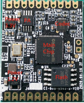

# 硬件选型指南

本文档将芯片和模块的主要功能参数以表格方式列举，供开发者选型使用。您可以点击下述表格中芯片和模块的型号，进入对应的数据手册文档页面。

## 语音芯片选型指南

芯片硬件参数选型表

硬件参数 | [CI1102](芯片数据手册/CI1102芯片数据手册/芯片概述.md "点击查看数据手册") | [CI1103](芯片数据手册/CI1103芯片数据手册/芯片概述.md "点击查看数据手册") | [CI1122](芯片数据手册/CI1122芯片数据手册/芯片概述.md "点击查看数据手册")
:--: | :--: | :--: | :--:
BNPU版本 | BNPU V2 | BNPU V2 | BNPU V2
CPU主频 | 160MHz | 160MHz | 180MHz
SRAM | 512KB | 512KB | 512KB
DRAM | / | 2MB | /
CODEC | Stereo Codec | Stereo Codec | Mono Codec
UART接口数 | 3 | 3 | 2
I2S接口数 | 1 | 1 | 1
SDIO接口数 | 1 | 1 | /
PWM接口数 | 6 | 6 | 6
SPI接口数 | 1 | 1 | /
I2C接口数 | 2 | 2 | 1
VCC33供电电压 | 3.3V | 3.3V | 3.3V
VCC12供电电压 | 1.2V | 1.2V | 1.2V
封装 | QFN56 | QFN56 | QFN48

芯片应用功能选型表

应用功能 | [CI1102](芯片数据手册/CI1102芯片数据手册/芯片概述.md "点击查看数据手册") | [CI1103](芯片数据手册/CI1103芯片数据手册/芯片概述.md "点击查看数据手册") | [CI1122](芯片数据手册/CI1122芯片数据手册/芯片概述.md "点击查看数据手册")
:--: | :--: | :--: | :--:
本地语音识别 | 支持 | 支持 | 支持
支持语言 | 中、英、日 | 中、英、日 | 中、英、日
词条数量 | 100~200 | 300+ | 100~200
语音降噪 | 支持 | 支持 | 支持
AEC播放打断 | 支持 | 支持 | 支持
语音增强 | 不支持 | 支持 | 不支持
语音定向 | 不支持 | 支持 | 不支持
本地自学习 | 不支持 | 支持 | 不支持
本地声纹识别 | 不支持 | 支持 | 不支持
麦克风数量 | 内置Codec支持单双麦 | 内置Codec支持单双麦 | 内置Codec支持单麦
ADPCM解码 | 支持 | 支持 | 支持
mp3解码 | 支持 | 支持 | 支持
m4a(aac)解码 | 不支持 | 支持 | 不支持
speex/opus数据压缩 | 不支持 | 支持 | 不支持
外置IOT Wifi 模块 | 支持 | 支持 | 支持

备注：

1、开启一些算法功能后，词条数量可能会小于标注值。

2、外部增加IOT Wifi模块后，根据不同wifi型号支持的词条数量有差异。

## 语音模块选型指南

模块类型 | 模块型号 | 模块尺寸和框图 | 模块实物图 | 功能简述
:--: | :--: | :--: | :--: | :--
单麦离线语音 | [CI-B02GS01S（主芯片CI1102）](模块数据手册/CI-B0XGS01S模块数据手册.md "点击查看数据手册") | 模块尺寸：27*22mm  |  | 1、采用单颗麦克风实现5米远距离语音识别，支持远场降噪和回声消除，安静环境下识别率可达97%，支持200条以内词条命令； 2、具有2路UART，3路PWM，1路IIC，板载8MB Flash； 3、供电电压5V，可适用于SMD和插针焊接； 4、CI-B02GS01S与CI-B03GS01S完全兼容仅主芯片不同，可以配合底板（型号CI-B02-MB-V10）进行调试开发。
单麦离线语音 | [CI-B03GS01S（主芯片CI1103）](模块数据手册/CI-B0XGS01S模块数据手册.md "点击查看数据手册")  | 模块尺寸：27*22mm  |  | 1、采用单颗麦克风实现5米远距离语音识别，支持远场降噪和回声消除，安静环境下识别率可达97%，支持300条以上词条命令，支持本地自学习功能； 2、具有2路UART，3路PWM，1路IIC，板载8MB Flash； 3、供电电压5V，可适用于SMD和插针焊接； 4、CI-B02GS01S与CI-B03GS01S完全兼容仅主芯片不同，可以配合底板（型号CI-B02-MB-V10）进行调试开发。
单麦离线语音 | [CI-B02GS01S-H（主芯片CI1102）](模块数据手册/CI-B0XGS01S-H模块数据手册.md "点击查看数据手册")  | 模块尺寸：27*22mm  |  | 1、采用单颗麦克风实现10米超远距离语音识别，通过外置Codec更适应噪声大的环境，支持远场降噪和回声消除，识别率可达97%，支持200条以内词条命令； 2、具有2路UART，3路PWM，1路IIC，板载8MB Flash； 3、供电电压5V，可适用于SMD和插针焊接； 4、CI-B02GS01S-H与CI-B03GS01S-H完全兼容仅主芯片不同，可以配合底板（型号CI-B02-MB-V10）进行调试开发，CI-B02GS01S-H和CI-B02GS01S管脚和尺寸完全兼容。
单麦离线语音 | [CI-B03GS01S-H（主芯片CI1103）](模块数据手册/CI-B0XGS01S-H模块数据手册.md "点击查看数据手册")  | 模块尺寸：27*22mm  |  | 1、采用单颗麦克风实现10米超远距离语音识别，通过外置Codec更适应噪声大的环境，支持远场降噪和回声消除，识别率可达97%，支持300条以上词条命令，支持本地自学习功能； 2、具有2路UART，3路PWM，1路IIC，板载8MB Flash； 3、供电电压5V，可适用于SMD和插针焊接； 4、CI-B02GS01S-H与CI-B03GS01S-H完全兼容仅主芯片不同，可以配合底板（型号CI-B02-MB-V10）进行调试开发，CI-B03GS01S-H和CI-B03GS01S管脚和尺寸完全兼容。
单麦离线语音 | [CI-B02GS01J（主芯片CI1102）](模块数据手册/CI-B0XGS01J模块数据手册.md "点击查看数据手册") | 模块尺寸：30*40mm  |  | 1、采用单颗麦克风实现5米远距离语音识别，支持远场降噪和回声消除，安静环境下识别率可达97%，支持200条以内词条命令； 2、具有1路5V电源输入和5V UART接口，1路麦克风接口，1路喇叭接口，板载8MB Flash； 3、供电电压5V，可直接用排线连接使用； 4、CI-B02GS01J与CI-B03GS01J完全兼容仅主芯片不同，无需底板可以直接使用UART进行调试和烧录，供电后插上麦克风和喇叭即可使用。
单麦离线语音 | [CI-B03GS01J（主芯片CI1103）](模块数据手册/CI-B0XGS01J模块数据手册.md "点击查看数据手册") | 模块尺寸：30*40mm  |  | 1、采用单颗麦克风实现5米远距离语音识别，支持远场降噪和回声消除，安静环境下识别率可达97%，支持300条以上词条命令，支持本地自学习功能； 2、具有1路5V电源输入和5V UART接口，1路麦克风接口，1路喇叭接口，板载8MB Flash； 3、供电电压5V，可直接用排线连接使用； 4、CI-B02GS01J与CI-B03GS01J完全兼容仅主芯片不同，无需底板可以直接使用UART进行调试和烧录，供电后插上麦克风和喇叭即可使用。
单麦离线语音 | [CI-B02GS03T（主芯片CI1102）](模块数据手册/CI-B0XGS03T模块数据手册.md "点击查看数据手册") | 模块尺寸：20*20mm  |  | 1、采用单颗麦克风实现5米远距离语音识别，支持远场降噪和回声消除，安静环境下识别率可达97%，支持200条以内词条命令； 2、具有2路UART，4路PWM，板载8MB Flash； 3、供电电压5V，模块采用金手指方式，适用于SMD焊接； 4、CI-B02GS03T与CI-B03GS03T完全兼容仅主芯片不同，需要焊接到底板才能使用。
单麦离线语音 | [CI-B03GS03T（主芯片CI1103）](模块数据手册/CI-B0XGS03T模块数据手册.md "点击查看数据手册") | 模块尺寸：20*20mm  |  | 1、采用单颗麦克风实现5米远距离语音识别，支持远场降噪和回声消除，安静环境下识别率可达97%，支持300条以上词条命令，支持本地自学习功能； 2、具有2路UART，4路PWM，板载8MB Flash； 3、供电电压5V，模块采用金手指方式，适用于SMD焊接； 4、CI-B02GS03T与CI-B03GS03T完全兼容仅主芯片不同，需要焊接到底板才能使用。

