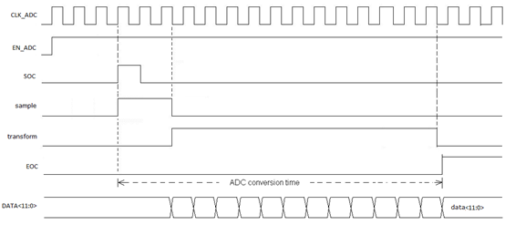
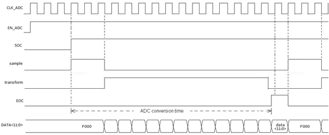

# ADC

## 功能介绍

CI1102集成了一个12位的ADC，其主要特点如下：

* ADC分辨率为12-bit；
* 采样率可达1MSPS（一次转换需15cycles，所以若要达到1MSPS的采样速率，必须保证时钟频率为15MHz）；
* 4通道单端输入；
* 1MSPS时，工作电流350μA；关闭时电流小于1μA；
* 具有单次采样和连续采样模式，采样模式时序如下图所示。

图8  ADC单次采样模式时序图

 

图9  ADC连续采样模式时序图

下表10是ADC的特征参数。

表10 ADC特征参数

Parameter | Symbol | Min | Typ | Max | Unit 
:--: | :--: | :--: | :--: | :--: | :--:
Reference voltage | Vref | - | AVDD | - | 
Resolution |  | - | 12 | - | bit
Input signal frequency | Fin | - | - | 20 | KHz
Input clock frequency | Fclk | - | - | 15 | MHz
Input Capacitance | Cin | - | 5 | - | pF
DNL | DNL | - | ±1 | - | LSB
INL | INL | - | ±2 | - | LSB
Offset error |  | - | ±2 | - | LSB
SNR | SNR | - | 65 | - | dB
Sample rate |  | - | - | 1 | MHz
Operation current | Ion | - | 350 | - | uA
Off current | Ioff | - | - | 1 | uA

## 寄存器映射

ADC寄存器映射的基地址为0x40012000，具体的寄存器映射见表11。

表11 ADC寄存器映射

偏移量 | 名称 | 位宽 | 类型 | 复位值 | 描述
:--: | :--: | :--: | :--: | :--: | :--
0x00 | ADCCTRL | 32 | R/W | 0x00000000 | ADC控制寄存器
0x04 | ADCINTMASK | 16 | R/W | 0x0000 | ADC中断屏蔽寄存器
0x08 | ADCINTFLG | 16 | RO | 0x0000 | ADC中断标志寄存器
0x0C | ADCINTCLR | 16 | WO | 0x0000 | ADC中断清除寄存器
0x10 | ADCSOFTSOC | 16 | R/W | 0x0000 | ADC软件触发寄存器
0x14 | ADCSOCCTRL | 32 | R/W | 0x00000000 | ADC转换控制寄存器
0x18-0x24 | ADCRESULT0-ADCRESULT3 | 16 | R/W | 0x0000 | ADC转换结果寄存器
0x38 | CH0PERIOD | 16 | RO | 0x0000 | 通道0采样周期
0x3C | CH1PERIOD | 16 | R/W | 0x0000 | 通道1采样周期
0x40 | CH2PERIOD | 16 | R/W | 0x0000 | 通道2采样周期
0x44 | CH3PERIOD | 16 | R/W | 0x0000 | 通道3采样周期
0x48 | CH0MINVALUE | 16 | R/W | 0x0000 | 通道0下限阈值
0x4C | CH0MAXVALUE | 16 | R/W | 0x0FFF | 通道0上限阈值
0x50 | CH1MINVALUE | 16 | R/W | 0x0000 | 通道1下限阈值
0x54 | CH1MAXVALUE | 16 | R/W | 0x0FFF | 通道1上限阈值
0x58 | CH2MINVALUE | 16 | R/W | 0x0000 | 通道2下限阈值
0x5C | CH2MAXVALUE | 16 | R/W | 0x0FFF | 通道2上限阈值
0x60 | CH3MINVALUE | 16 | R/W | 0x0000 | 通道3下限阈值
0x64 | CH3MAXVALUE | 16 | R/W | 0x0FFF | 通道3上限阈值
0x68 | ADCSTAT | 16 | R | 0x0000 | ADC状态寄存器

## ADC控制寄存器（ADCCTRL）

偏移量：0x00

复位值：0x00000000

位域 | 名称 | 复位值 | 类型 | 描述
:--: | :--: | :--: | :--: | :--
31:24 | Reserved | 0x00 | R/W | 保留
23 | CH3MAXEN | 0 | R/W | CH3采样结果阈值上限中断使能 0：关闭 1：开启
22 | CH2MAXEN | 0 | R/W | CH2采样结果阈值上限中断使能 0：关闭 1：开启
21 | CH1MAXEN | 0 | R/W | CH1采样结果阈值上限中断使能 0：关闭 1：开启
20 | CH0MAXEN | 0 | R/W | CH0采样结果阈值上限中断使能 0：关闭 1：开启
19 | CH3MINEN | 0 | R/W | CH3采样结果阈值下限中断使能 0：关闭 1：开启
18 | CH2MINEN | 0 | R/W | CH2采样结果阈值下限中断使能 0：关闭 1：开启
17 | CH1MINEN | 0 | R/W | CH1采样结果阈值下限中断使能 0：关闭 1：开启
16 | CH0MINEN | 0 | R/W | CH0采样结果阈值下限中断使能 0：关闭 1：开启
15:13 | Reserved | 0x0 | R/W | 保留
12 | INTSEL | 0 | R/W | 中断产生条件选择 0：每次采样结束都产生中断请求 1：采样值异常（超过阈值）时产生中断请求 必须在监测模式下，即ADCCTRL[8]配置为1时，此位才能被配置为1
11:9 | Reserved | 0x0 | R/W | 保留
8 | PERIODEN | 0 | R/W | 周期监测使能（只能工作于单次采样模式下） 0：关闭 1：开启
7 | CH3EN | 0 | R/W | 通道3周期监测使能 0：关闭 1：开启
6 | CH2EN | 0 | R/W | 通道2周期监测使能 0：关闭 1：开启
5 | CH1EN | 0 | R/W | 通道1周期监测使能 0：关闭 1：开启
4 | CH0EN | 0 | R/W | 通道0周期监测使能 0：关闭 1：开启
2 | Reserved | 0 | R/W | 保留
1 | CONTEN | 0 | R/W | 连续转换使能 0：单次转换模式 1：如果SOCSOFT位保持为高，则ADC连续转换
0 | ADCEN | 0 | R/W | ADC电路使能 0：关闭ADC 1：正常工作（置1后需等待3个AD cycle）

## ADC中断屏蔽寄存器（ADCINTMSK）

偏移量：0x04

复位值：0x0000

位域 | 名称 | 复位值 | 类型 | 描述
:--: | :--: | :--: | :--: | :--
15:1 | Reserved | 0x0000 | R/W | 保留
0 | MASK | 0 | R/W | ADC中断屏蔽位 0：不屏蔽 1：屏蔽

## ADC中断标志寄存器（ADCINTFLG）

偏移量：0x08

复位值：0x0000

位域 | 名称 | 复位值 | 类型 | 描述
:--: | :--: | :--: | :--: | :--
15:4 | Reserved | 0x000 | RO | 保留
3 | ADCFLG3 | 0 | RO | ADC通道3转换完成中断标志位，高有效
2 | ADCFLG2 | 0 | RO | ADC通道2转换完成中断标志位，高有效
1 | ADCFLG1 | 0 | RO | ADC通道1转换完成中断标志位，高有效
0 | ADCFLG0 | 0 | RO | ADC通道0转换完成中断标志位，高有效

## ADC中断清除寄存器（ADCINTCLR）

偏移量：0x0C

复位值：0x0000

位域 | 名称 | 复位值 | 类型 | 描述
:--: | :--: | :--: | :--: | :--
15:9 | Reserved | 0x00 | WO | 保留
8 | AD1CLR0 | 0 | WO | 清除所有通道中断标志，高有效
7:4 | Reserved | 0x0 | WO | 保留
3 | ADCCLR3 | 0 | WO | ADC通道3转换完成中断标志清除，高有效
2 | ADCCLR2 | 0 | WO | ADC通道2转换完成中断标志清除，高有效
1 | ADCCLR1 | 0 | WO | ADC通道1转换完成中断标志清除，高有效
0 | ADCCLR0 | 0 | WO | ADC通道0转换完成中断标志清除，高有效

## ADC软件触发寄存器（SOCSOFTCTRL）

偏移量：0x10

复位值：0x0000

位域 | 名称 | 复位值 | 类型 | 描述
:--: | :--: | :--: | :--: | :--
15:1 | Reserved | 0x0000 | R/W | 保留
0 | SOCSOFT | 0 | R/W | ADC开始转换 0：无动作 1：ADC开始转换

## ADC转换控制寄存器（ADCSOCCTRL）

偏移量：0x14

复位值：0x00000000

位域 | 名称 | 复位值 | 类型 | 描述
:--: | :--: | :--: | :--: | :--
31:15 | Reserved | 0x00000 | R/W | 保留
14:12 | SHTIME | 0x0 | R/W | 采样保持时间选择： 0x0：SOC长度为1个AD_CLK cycle 0x1：SOC长度为2个AD_CLK cycle 0x2：SOC长度为3个AD_CLK cycle 0x3：SOC长度为4个AD_CLK cycle 0x4：SOC长度为5个AD_CLK cycle other：invalid value 
11:8 | Reserved | 0x0 | R/W | 保留
7:5 | CHSEL | 0x0 | R/W | 转换通道选择 0x0：ADC_IN0 0x1：ADC_IN1 0x2：ADC_IN2 0x3：ADC_IN3
4:0 | Reserved | 0x00 | R/W | 保留

## ADC转换结果寄存器（ADCRESULTx）

偏移量：0x10-0x24

复位值：0x0000

位域 | 名称 | 复位值 | 类型 | 描述
:--: | :--: | :--: | :--: | :--
31:16 | Reserved | 0x0000 | RO | 保留
15:12 | Reserved | 0x0 | RO | 保留
11:0 | ADCOUT | 0x000 | RO | ADC转换结果

***注：x=0,1,…,3，ADCRESULTx分别对应通道x的转换结果。***

## 通道0采样周期寄存器（CH0PERIOD）

偏移量：0x38

复位值：0x0000

位域 | 名称 | 复位值 | 类型 | 描述
:--: | :--: | :--: | :--: | :--
15:0 | CH0PERIOD | 0x0000 | R/W | 通道0采样周期：(CH0PERIOD+1) * 512

## 通道1采样周期寄存器（CH1PERIOD）

偏移量：0x3C

复位值：0x0000

位域 | 名称 | 复位值 | 类型 | 描述
:--: | :--: | :--: | :--: | :--
15:0 | CH1PERIOD | 0x0000 | R/W | 通道1采样周期：(CH1PERIOD+1) * 512

## 通道2采样周期寄存器（CH2PERIOD）

偏移量：0x40

复位值：0x0000

位域 | 名称 | 复位值 | 类型 | 描述
:--: | :--: | :--: | :--: | :--
15:0 | CH2PERIOD | 0x0000 | R/W | 通道1采样周期：(CH2PERIOD+1) * 512

## 通道3采样周期寄存器（CH3PERIOD）

偏移量：0x44

复位值：0x0000

位域 | 名称 | 复位值 | 类型 | 描述
:--: | :--: | :--: | :--: | :--
15:0 | CH3PERIOD | 0x0000 | R/W | 通道1采样周期：(CH3PERIOD+1) * 512

## 通道0下限阈值寄存器（CH0MINVALUE）

偏移量：0x48

复位值：0x0000

位域 | 名称 | 复位值 | 类型 | 描述
:--: | :--: | :--: | :--: | :--
15:0 | MINVALUE | 0x0000 | R/W | 通道0下限阈值

## 通道0上限阈值寄存器（CH0MAXVALUE）

偏移量：0x4C

复位值：0x0FFF

位域 | 名称 | 复位值 | 类型 | 描述
:--: | :--: | :--: | :--: | :--
15:0 | MAXVALUE | 0x0FFF | R/W | 通道0上限阈值

## 通道1下限阈值寄存器（CH1MINVALUE）

偏移量：0x50

复位值：0x0000

位域 | 名称 | 复位值 | 类型 | 描述
:--: | :--: | :--: | :--: | :--
15:0 | MINVALUE | 0x0000 | R/W | 通道1下限阈值

## 通道1上限阈值寄存器（CH1MAXVALUE）

偏移量：0x54

复位值：0x0FFF

位域 | 名称 | 复位值 | 类型 | 描述
:--: | :--: | :--: | :--: | :--
15:0 | MAXVALUE | 0x0FFF | R/W | 通道1上限阈值

## 通道2下限阈值寄存器（CH2MINVALUE）

偏移量：0x58

复位值：0x0000

位域 | 名称 | 复位值 | 类型 | 描述
:--: | :--: | :--: | :--: | :--
15:0 | MINVALUE | 0x0000 | R/W | 通道2下限阈值

## 通道2上限阈值寄存器（CH2MAXVALUE）

偏移量：0x5C

复位值：0x0FFF

位域 | 名称 | 复位值 | 类型 | 描述
:--: | :--: | :--: | :--: | :--
15:0 | MAXVALUE | 0x0FFF | R/W | 通道2上限阈值

## 通道3下限阈值寄存器（CH3MINVALUE）

偏移量：0x60

复位值：0x0000

位域 | 名称 | 复位值 | 类型 | 描述
:--: | :--: | :--: | :--: | :--
15:0 | MINVALUE | 0x0000 | R/W | 通道3下限阈值

## 通道3上限阈值寄存器（CH3MAXVALUE）

偏移量：0x64

复位值：0x0FFF

位域 | 名称 | 复位值 | 类型 | 描述
:--: | :--: | :--: | :--: | :--
15:0 | MAXVALUE | 0x0FFF | R/W | 通道3上限阈值

## ADC状态寄存器（ADCSTAT）

偏移量：0x68

复位值：0x0000

位域 | 名称 | 复位值 | 类型 | 描述
:--: | :--: | :--: | :--: | :--
15:1 | Reserved | 0x0000 | RO | 保留
0 | PRDBSY | 0 | RO | 当前ADC工作状态 0：ADC转换完成，处于空闲状态 1：ADC正在工作中

