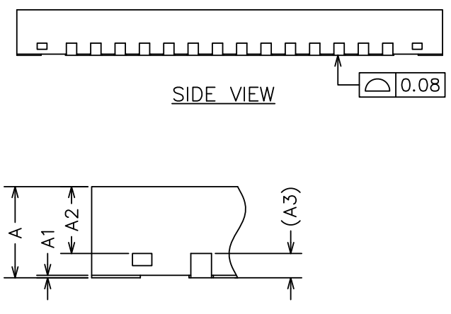

# 封装信息

图25  芯片封装外形图

上图是芯片的封装外形图，具体尺寸参数见下表21所示。

表21 封装尺寸参数（单位为毫米）

SYMBOL | 最小值 | 典型值 | 最大值
:--: | :--: | :--: | :--:
A | 0.70 | 0.75 | 0.80
A1 | 0.00 | 0.02 | 0.05
A2 | 0.50 | 0.55 | 0.60
A3 | - | 0.20REF | -
b | 0.15 | 0.20 | 0.25
D | 6.90 | 7.00 | 7.10
E | 6.90 | 7.00 | 7.10
D2 | 5.10 | 5.20 | 5.30
E2 | 5.10 | 5.20 | 5.30
e | 0.3 | 0.40 | 0.5
H | - | 0.35REF | -
K | - | 0.50REF | -
L | 0.35 | 0.40 | 0.45
R | 0.09 | - | -

