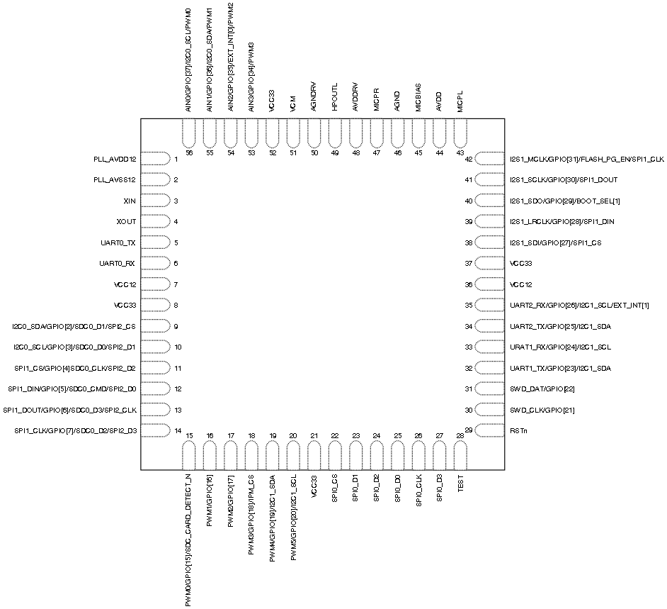

# 引脚描述

CI1102芯片引脚图如图2所示:

图2  CI1102芯片引脚图

芯片各个引脚功能如下表描述：

表2 芯片引脚功能描述

Pin Number | Pin name | Pin type | IO driving capability | IO power-on default state | Alternate functions
:-- | :-- | :-- | :-- | :-- | :--
1 | PLL_AVDD12 | P | - | - | PLL 1.2V power supply
2 | PLL_AVSS12 | P | - | - | PLL ground
3 | XIN | I | - | - | 12.288MHZ crystal oscillator interface
4 | XOUT | O | - | - | 12.288MHZ crystal oscillator interface
5 | UART0_TX | IO | 4mA | IN,T+U | 1.GPIO[0] 2.UART0_TX: Transmit channel of UART0
6 | UART0_RX | IO | 4mA | IN,T+U | 1.GPIO[1] 2.UART0_RX: Receive channel of UART0
7 | VCC12 | P | - | - | 1.2V Core power supply
8 | VCC33 | P | - | - | 3.3V power supply
9 | IIC0_SDA | IO | 4mA | IN,T+U | 1.GPIO[2] 2.IIC0_SDA:IIC0 serial data 3.SDC0_D1:SDC0 interface data1 4.SPI2_CS:SPI2 interface chip selection signal
10 | IIC0_SCL | IO | 4mA | IN,T+U | 1.GPIO[3] 2.IIC0_SCL:IIC0 serial clock 3.SDC0_D0:SDC0 interface data0 4.SPI2_D1:SPI2 interface data1
11 | SPI1_CS | IO | 4mA | IN,T+U | 1.GPIO[4] 2.SPI1_CS:SPI1 interface chip selection signal 3.SDC0_CLK:SDC0 serial clock 4.SPI2_D2:SPI2 interface data2
12 | SPI1_DIN |	IO | 4mA | IN,T+D | 1.GPIO[5] 2.SPI1_DIN:SPI1 interface data input 3.SDC0_CMD:Command pin for SDC0 interface 4.SPI2_D0:SPI2 interface data 0
13 | SPI1_DOUT | IO	| 8mA |	IN,T+D |1.GPIO[6] 2.SPI1_DOUT:Transmit channel of SPI1 3.SDC0_D3:SDC0 interface data 3 4.SPI2_CLK:SPI2 Serial Clock
14 | SPI1_CLK | IO | 8mA | IN,T+D | 1.GPIO[7] 2.SPI1_CLK:Serial Clock for SPI1 interface 3.SDC0_D2:SDC0 interface data 2 4.SPI2_D3:SPI2 interface data 3
15 | PWM0 | IO | 4mA | IN,T+D |	1.GPIO[15] 2.PWM0 Output 3.SDC_CARD_DETECT_N
16 | PWM1 |	IO | 4mA | IN,T+D |	1.GPIO[16] 2.PWM1 Output 
17 | PWM2 | IO | 4mA | IN,T+D |	1.GPIO[17] 2.PWM2 Output 
18 | PWM3 | IO | 4mA | IN,T+D | 1.GPIO[18] 2.PWM3 Output 3.IPM_CS
19 | PWM4 |	IO | 4mA | IN,T+D | 1.GPIO[19] 2.PWM4 Output 3.I2C1_SDA:I2C1 Serial Data
20 | PWM5 |	IO | 4mA | IN,T+D |	1.GPIO[20] 2.PWM5 Output 3.I2C1_SCL:I2C1 Serial Clock 
21 | VCC33 | P | - | - | 3.3V power supply
22 | SPI0_CS | IO |	8mA	| OUT,T | QSPI interface chip selection signal
23 | SPI0_D1 | IO |	8mA | OUT,T+U | QSPI interface data 1
24 | SPI0_D2 | IO |	8mA | OUT,T | QSPI interface data 2
25 | SPI0_D0 | IO | 8mA | IN,T | QSPI interface data 0
26 | SPI0_CLK | IO | 8mA | IN,T | Serial Clock for QSPI interface
27 | SPI0_D3 | IO |	8mA	| IN,T | QSPI interface data 3
28 | TEST | I | - | IN,L | Internal pull-down 0—functional mode 1—test mode 
29 | RSTn |	I |	- |	IN,H | External reset input.Pull this pin low to reset device to initial state.Has internal weak pull-up.
30 | SWD_CLK | IO |	4mA	| IN,T+D | 1.TCK:Serial Wire Debug port clock pin.Has internal weak pull-down. 2.GPIO[21]
31 | SWD_DAT | IO | 4mA | IN,T+U | 1.TMS:Serial Wire Debug port data pin.Has internal weak pull-up. 2.GPIO[22]
32 | UART1_TX |	IO | 4mA | IN,T+U |	1.GPIO[23] 2.UART1_TX:Transmit channel of UART1 3.I2C1_SDA:I2C1 Serial Data 
33 | UART1_RX |	IO | 4mA | IN,T+U |	1.GPIO[24] 2.UART1_RX:Receive channel of UART1 3.I2C1_SCL:I2C1 Serial Clock
34 | UART2_TX |	IO | 4mA | IN,T+U |	1.GPIO[25] 2.UART2_TX:Transmit channel of UART2 3.I2C1_SDA:I2C1 Serial Data 
35 | UART2_RX |	IO | 4mA | IN,T+U |	1.GPIO[26] 2.UART2_RX:Receive channel of UART2 3.I2C1_SCL:I2C1 Serial Clock 4.EXT_INT[1]
36 | VCC12 | P | - | - | Core 1.2V power supply
37 | VCC33 | P | - | - | 3.3V power supply
38 | I2S1_SDI |	IO | 4mA | OUT,T+D | 1.GPIO[27] 2.I2S1_SDI:Serial Data Input for I2S1 interface 4.SPI1_CS:SPI1 interface chip selection signal
39 | I2S1_LRCLK | IO | 4mA | IN,T+D | 1.GPIO[28] 2.I2S1_LRCLK:I2S1 interface LRCLK clock 4.SPI1_DIN:SPI1 interface data input
40 | I2S1_SDO |	IO | 4mA | IN,T+D |	1.GPIO[29](BOOT_SEL[1])(BOOT_SEL[1]) At startup,Boot1 option bit is used to select one of two modes: 0---Normal functional model 1---Debug mode 2.I2S1_SDO:Serial Data Output for I2S1 interface
41 | I2S1_SCLK | IO | 4mA |	IN,T+D | 1.GPIO[30] 2.I2S1_SCLK:Serial Clock for I2S1 interface 4.SPI1_DOUT:Transmit channel of SPI1 
42 | I2S1_MCLK | IO | 4mA |	IN,T+D | 1.GPIO[31](UART_UPDATE_EN)(UART_UPDATE_EN) At startup,this pin is used to select one of two functional modes: 1---Start serial port upgrade service and program 0---Start directly from Flash 2.I2S1_MCLK:Master Clock for I2S1 reference 4.SPI1_CLK:Serial Clock for SPI1 interface
43 | MICPL | I | IN | Left ADC channel input
44 | AVDD | P | - | - |	3.3V analog supply
45 | MICBIAS | O | Microphone bias output
46 | AGND |	P |	- |	- |	Analog ground
47 | MICPR | I | - | IN | Right ADC channel input
48 | AVDDRV	| P | - | - | 3.3V analog supply
49 | HPOUTL	| O	| - | OUT | Left DAC channel output
50 | AGNDRV	| P	| - | -	| Analog ground
51 | VCM | O | - | - | OUT	Reference voltage output
52 | VCC33 | P | - | - | 3.3V power supply
53 | AIN3 | IO | - | IN,T+D | 1.GPIO[34] 2.ADC3 Input 4.PWM3 Output
54 | AIN2 |	IO | - | IN,T+D	| 1.GPIO[35] 2.ADC2 Input 3.EXT_INT[0] 4.PWM2 Output
55 | AIN1 |	IO | - | IN,T+D	| 1.GPIO[36] 2.ADC1 Input 3.I2C0 Serial Data 4.PWM1 Output
56 | AIN0 | IO | - | IN,T+D	| 1.GPIO[37] 2.ADC0 Input 3.I2C0 Serial Clock 4.PWM0 Output

***上表中 IO引脚的状态定义如下：***

I 输入

O 输出

IO 双向

P 电源或地

T+D	三态正下拉

T+U	三态正上拉

OUT	上电默认为输出模式

IN 上电默认为输入模式