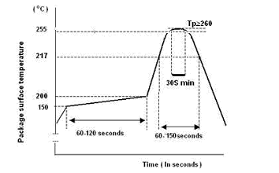

# 电气特性

CI1102电气特性参数见下表。

表20 电气参数表

符号 | 参数 | 最小值 | 典型值 | 最大值 | 单位
:--: | :--: | :--: | :--: | :--: | :--:
VCC | 芯片IO供电电压 | 2.97 | 3.3 | 3.63 | V
VDD | 芯片内核供电电压 | 1.08 | 1.2 | 1.32 | V
VIH | 输入高电压 | 2.0 | - | 3.6 | V
VIL | 输入低电压 | -0.3 | - | 0.8 | V
VOL | 输出低电压 @IOL = 2,4,8mA | - | - | 0.4 | V
VOH | 输出高电压 @IOH = 2,4,8mA | 2.4 | - | - | V
ADC_VREF33 | SAR ADC参考电压 | 2.97 | 3.3 | 3.63 | V
PLL_AVDD12 | PLL模拟供电电压 | 1.08 | 1.2 | 1.32 | V
I3.3v | 芯片3.3V供电工作电流 | 9.5 | 11 | 13 | mA
I1.2v | 芯片1.2V供电工作电流 | 49 | 51 | 53 | mA 
Is3.3v | 芯片3.3V供电睡眠模式工作电流 | 8.5 | 8.75 | 9 | mA |
Is1.2v | 芯片1.2V供电睡眠模式工作电流 | 4.5 | 4.75 | 5 | mA |
Ta  | 芯片工作环境温度 | -20 | - | +85 | ℃
Tst | 芯片储存环境温度 | -55 | - | +150 | ℃

CI1102进行SMT焊接时请控制炉温和时间，一个SMT焊接的温度曲线如下图26所示。

图24  CI1102 SMT焊接温度曲线

CI1102的潮湿敏感度等级为MSL3级，使用前请按照MSL3级条件存储。如果开包装后存放时间超过MSL3级的要求，请在SMT焊接前先进行烘烤。

芯片采用无铅环保工艺制造，SMT焊接时请按照无铅标准设置炉温和时间等参数。 芯片取用、包装时需注意静电影响，建议采用抗静电材料隔离。