# 硬件设计

硬件设计分为原理图设计和PCB layout设计两个部分。

## 原理图设计

### 应用参考设计图

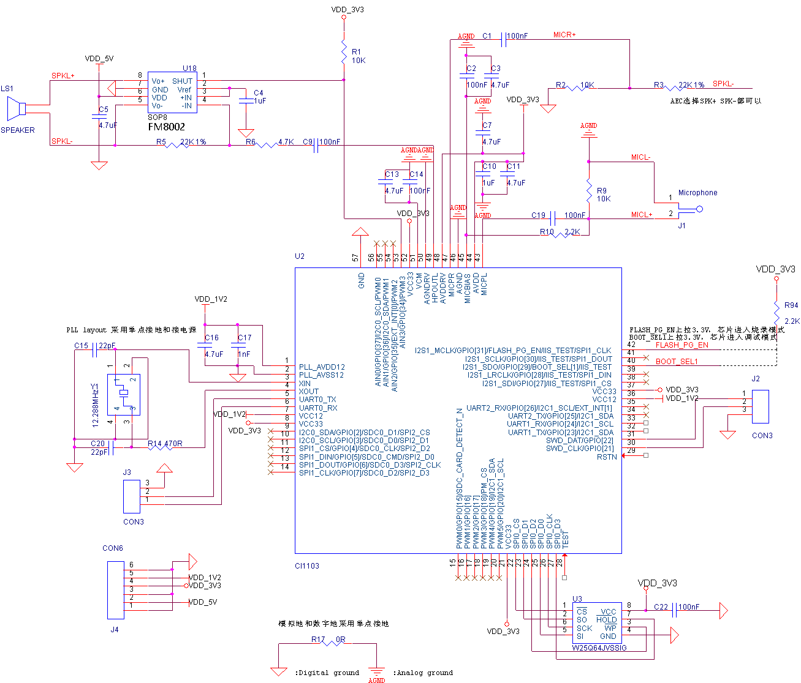

图10  单麦本地语音识别应用系统图

上图为单麦克风输入，单喇叭输出的应用原理图，可以实现单麦AEC回声消除离线语音识别应用方案。用户也可根据应用要求设计多种原理图。

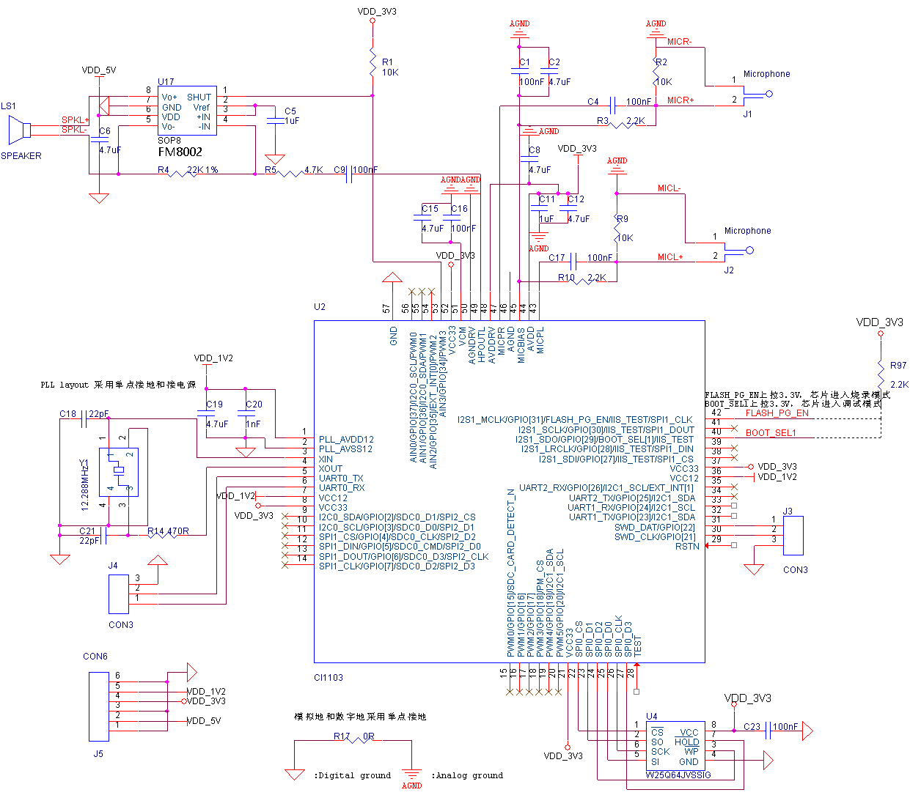

图11  双麦本地语音识别应用系统图

上图为双麦克风输入，单喇叭输出的应用原理图，可以实现双麦降噪下的远场离线语音识别应用方案。用户也可根据应用要求设计单麦克风等多种原理图。

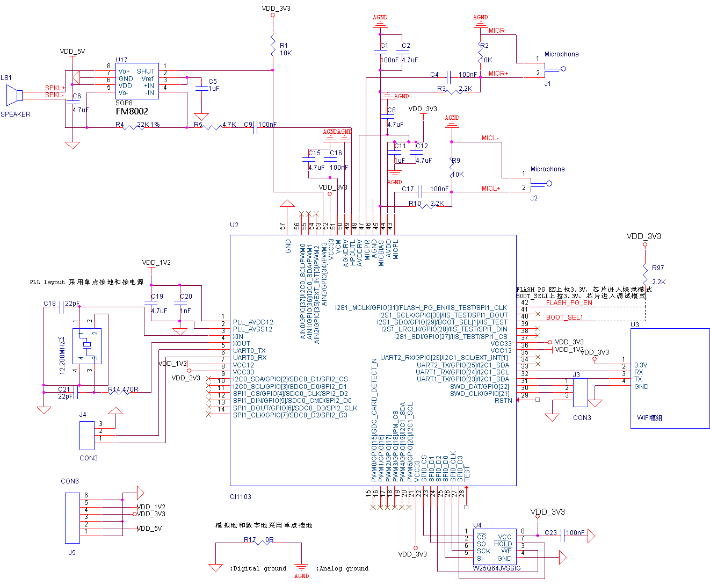

图12  双麦本地+云端语音识别应用系统图

上图为双麦克风输入，单喇叭输出的应用原理图，可以实现双麦降噪下的远场离在线语音识别应用方案。

### 电源设计电路

CI1103需要3.3V和1.2V两组电压，可选择直接外部输入，也可通过电压转换，电压转换电路如图13、图14。CI1103有上电时序要求，即1.2V上电需比3.3V上电延迟至少0.1ms。

电源芯片型号仅供参考，电流参数300mA以上，纹波小于30mV，满足即可。如使用DC/DC芯片，FB反馈采样电阻必须使用1%精度，功率电感的感量和饱和电流等参数必须符合芯片以及实际输出电流需求。

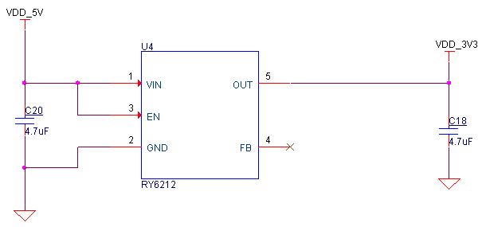

图13  DC 5V转3.3V电路原理图

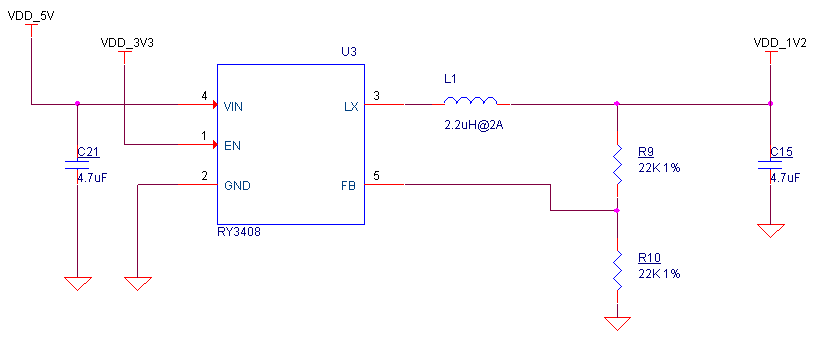

图14  DC 5V转1.2V电路原理图

### 电源滤波电路

CI1103各个电源输入均需作滤波处理，3.3V、1.2V、PLL、AVDD供电管脚滤波处理电路图如下。

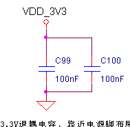

图15  CPU 3.3V滤波电路图

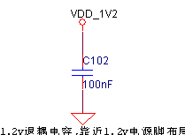

图16  CPU 1.2V滤波电路图

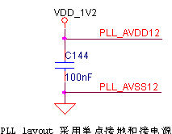

图17  CPU PLL电源滤波电路图

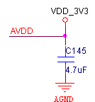

图18  AVDD模拟电源滤波电路图

模拟地和数字地的分割，采用电阻或者覆铜的方式进行单点连接，如图19采用0R电阻相连。

图19  模拟地和数字地的分割

### 时钟电路

CI1103需要外加时钟电路，如图20设计芯片工作性能最佳，12.288MHz无源时钟晶体，XOUT上串联470R电阻，12.288MHz晶体的频率偏差≤20ppm，即≤240Hz。

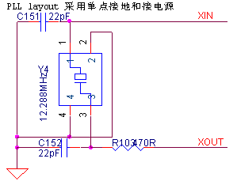

图20  时钟电路参考设计图

### 麦克风输入偏置电路

麦克风输入偏置电路如图21所示，在麦克风输入口增加ESD保护器件可提升防静电等级。MICBIAS电压做图21中所示滤波处理，VCM做图22所示滤波处理。

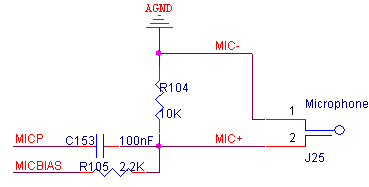

图21  麦克风输入偏置电路图

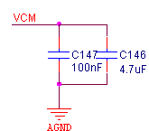

图22  VCM滤波电路

### 功放电路

如图23，功放芯片使能引脚选用GPIO[34]进行控制，功放上电默认关闭，播音开启。根据功放逻辑预留上拉电阻10K确保初始逻辑状态正确。功放输出增加ESD保护器件，可提升防静电等级。功放供电采用5V，加大电容4.7uF稳压。

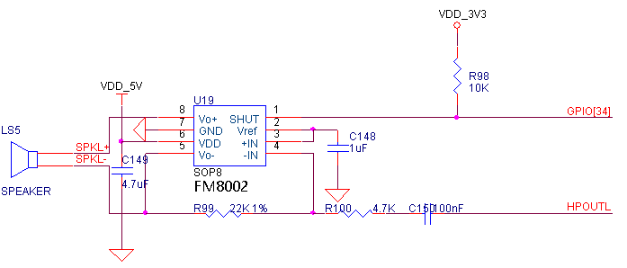

图23  功放电路图

### 芯片上电模式选择电路

CI1103上电时管脚IIS1_MCLK的电平会作为升级模式判断信号，当上电判断为高时，启动串口升级服务，可使用配套的升级工具对板上的Nor Flash进行编程。上电判断为低时直接从板上的Nor Flash启动。

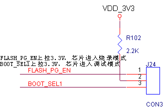

图24  模式选择脚

## PCB Layout设计

### 电源电路

1. 电源走线
    电源走线直径依据实际电路电流大小而定，3.3V电源的走线线宽不小于15mil，1.2V电源的走线线宽不小于15mil。尽量使用覆铜方式走线，电源走线尽量短而粗，电源走线最窄处不低于8mil线宽，避免电源走线形成闭环线路。

2. DC/DC走线
    电路布局参考DC/DC芯片手册，功率电感远离易被干扰的器件，DC/DC芯片的输入电容和输出电容尽量靠近芯片管脚，FB反馈信号远离其他干扰信号，滤波电容地和芯片的地回路尽量短，放置过孔保证地回路阻抗小。功率电感焊盘禁止覆铜，两层板设计时保证电感背面地平面完整，不能有敏感信号穿越电感和DC/DC下方。DC/DC芯片的下方和周围尽量多的过孔到底层 GND，增加散热。

3. PLL退耦电容
    CI1103的PLL退耦电容，布局时靠近管脚2（PLL_AVDD12）和管脚3（PLL_AVSS12）。

### 时钟晶体电路

晶体的布局位置尽量远离干扰源或者易被干扰的器件。晶体与匹配电阻电容紧凑布局，XIN和XOUT信号走线尽量短，做包地处理，两层板设计时保证晶体电路和走线背面的地平面完整。

### 静电防护要求

两层板设计时，尽量走线在TOP层，保持BOTTOM地平面的完整性。如设计有ESD器件，将ESD器件尽量靠近插件的引脚，提高防护效果。

## 其它注意事项

1. KEY_RSTn为复位引脚，该引脚输入一个低电平时芯片进入复位。
2. TEST_EN引脚为测试模式选择，正常使用该引脚应保持低电平。
3. 芯片上电时管脚IIS1_SDO的电平会作为芯片启动模式判断信号，当上电判断为高时，则会进入调试模式，上电判断为低时进入正常启动模式。正常使用时应该保持该引脚为
低电平信。
4. 芯片上电时管脚IIS1_MCLK的电平会作为升级模式判断信号，当上电判断为高时，启动串口升级服务，这时可使用配套的升级工具对板上的Nor Flash进行编程。上电判断为低时直接从板上的Nor Flash启动。
