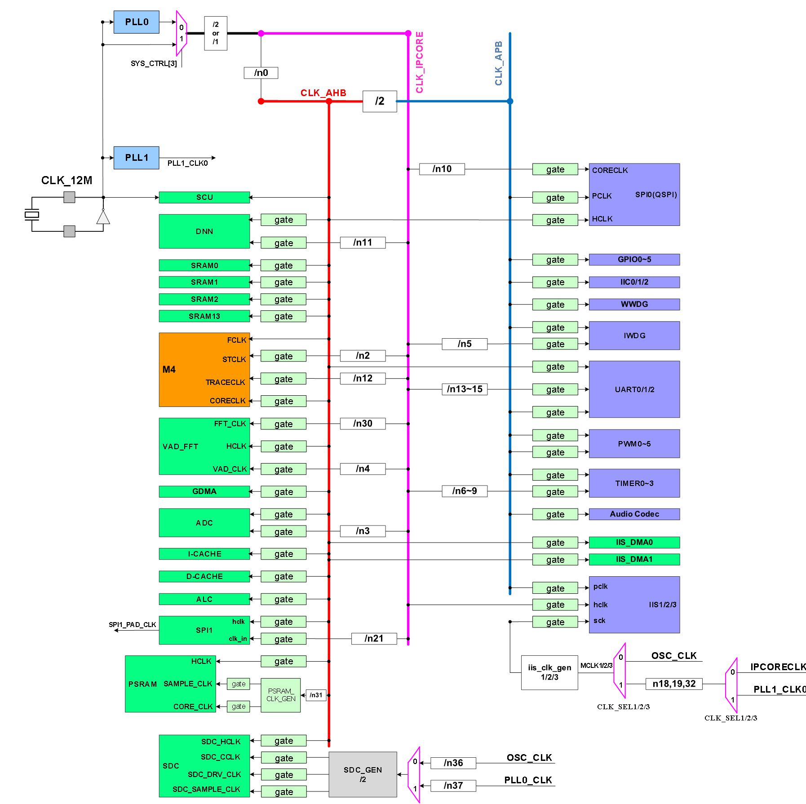
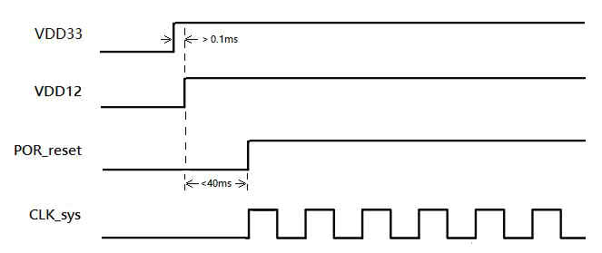

# 系统控制单元SCU

系统控制单元主要是负责芯片的上电时序控制、外部唤醒中断的监控、时钟复位信号的产生与控制、以及引脚复用的切换控制等功能。

## 系统时钟

本系统的时钟源如下：

* 片外振荡器输入时钟，兼容5MHz~27MHz,为方便语音识别功能，推荐使用12.288Mhz晶振；
* 片上PLL产生的时钟，PLL输入时钟源为片外振荡器，PLL输出时钟范围为20MHz~1280MHz。

系统时钟结构如图5所示。整个系统的时钟输入来源有两个：片外晶振和片内PLL。通过这两个时钟进行分频，产生系统各个时钟，其中AHB时钟命名为HCLK，APB时钟命名为PCLK，系统滴答时钟命名为STCLK，其余各路时钟命名见图5。

AHB最高频率可达160MHz，APB与AHB间保持偶数倍的分频关系（默认APB为AHB的2分频）。各外设IP模块的时钟可通过CPU配置SCU中的时钟控制寄存器来进行软件clock gating，这样可以降低IP模块上的动态功耗。

图5  时钟结构

为兼容不同的外部晶振（12M~27M），系统PLL默认的10倍频输出时钟为122.88Mhz（12.288Mhz外部晶振），系统启动后需要重新配置PLL参数，从正常工作模式切换到低功耗模式或其他应用场景下。修改PLL参数时，需先将系统时钟切换到外部晶振（通过SYS_CTRL[3]配置），如图6所示，待PLL稳定（软件等待2-5ms）后再将系统时钟切换回PLL时钟。

图6  时钟切换图

PLL支持小数分频，可以灵活的配置不同频率，方便不同的系统时钟和音频时钟输出。

## 系统复位

SCU中的复位控制单元负责控制两种类型的复位：电源复位和系统复位。电源复位由上电复位产生，将所有寄存器恢复到初始值。上电复位能够在上电过程中复位整个系统，系统复位可复位处理器内核以及外设功能模块部分。系统复位可由如下复位源产生：

* 上电复位：在芯片上电时，当电压达到设定值后释放复位，否则处于复位状态；
* 独立看门狗产生的复位：看门狗计数递减到0时如CPU还未喂狗，则产生复位；
* 窗口看门狗产生的复位：窗口看门狗模块计数后若软件在时间窗口内没有喂狗，则产生复位；
* 系统产生的复位请求：由CPU配置中断控制器产生复位请求，SCU收到后会产生复位；
* 系统软件复位：CPU配置SCU的系统软件复位寄存器，产生复位；
* 调试复位JTAG_TRSTn：调试逻辑的复位信号，只复位调试逻辑。

在SCU系统控制模块内会保留芯片系统当前复位是由哪个复位源引起的状态，此状态只会被上电复位。

***注意芯片供电有上电时序要求：需要先上VDD33电源，再上VDD12电源。***

如图8所示，VDD33电源上电与VDD12电源上电间隔时间需要大于0.1ms，VDD12上电后在小于40ms时间内，芯片POR复位完成，同时系统时钟有效输出。

图7  上电时序图

## SCU寄存器映射

系统控制单元寄存器映射基地址为0x40010000，详见表5。

表5 系统控制单元寄存器映射

偏移量 | 名称 | 位宽 | 类型 | 复位值 | 描述 |
:--: | :--: | :--: | :--: | :--: | :-- |
0x00 | SYS_PLL_REG | 32 | R/W | 0x000CA015 | sysPLL参数配置寄存器
0x04 | SYS_CTRL | 32 | R/W | 0x00801002 | 系统配置寄存器
0x08 | SYS_CLKDIV_PAPAM0 | 32 | R/W | 0x30180200 | 时钟分频参数寄存器0
0x0C | SYS_CLKDIV_PAPAM1 | 32 | R/W | 0x0410120C | 时钟分频参数寄存器1
0x10 | SYS_CLKDIV_PAPAM2 | 32 | R/W | 0x10101010 | 时钟分频参数寄存器2
0x14 | SYS_CLKDIV_PAPAM3 | 32 | R/W | 0x08080203 | 时钟分频参数寄存器3
0x18 | SYS_CLKDIV_PAPAM4 | 32 | R/W | 0x04080808 | 时钟分频参数寄存器4
0x1C | SYS_CLKDIV_PAPAM5 | 32 | R/W | 0x01A00404 | 时钟分频参数寄存器5
0x20 | SYS_CLKGATE | 32 | R/W | 0x0000038E | 低功耗系统时钟门控寄存器
0x24 | PER_CLKGATE0 | 32 | R/W | 0xFFFFFFFF | 外设时钟门控寄存器0
0x28 | PER_CLKGATE1 | 32 | R/W | 0xFFFFFFFF | 外设时钟门控寄存器1
0x2C | SOFT_RST_PAPAM | 32 | R/W | 0x00000000 | 软件复位特征值寄存器
0x30 | SOFT_SYSRST_CTRL | 32 | R/W | 0x00000000 | 系统软件复位寄存器
0x34 | SOFT_PRERST_CTRL0 | 32 | R/W | 0xFFFFFFFF | 外设软件复位寄存器0
0x38 | SOFT_PRERST_CTRL1 | 32 | R/W | 0xFFFFFFFF | 外设软件复位寄存器1
0x3C | SYS_CLKDIV_EN | 32 | R/W | 0x00000000 | 分频参数使能寄存器
0x40 | RSTCFG_LOCK | 32 | R/W | 0x00000000 | 软件复位配置锁定寄存器
0x44 | CKCFG_LOCK | 32 | R/W | 0x00000000 | 软件时钟配置锁定寄存器
0x4C | IIS1_CLK_CFG | 32 | R/W | 0x0000010A | IIS1时钟配置寄存器
0x50 | IIS2_CLK_CFG | 32 | R/W | 0x0000010A | IIS2时钟配置寄存器
0x54 | SCU_STATE_CLR | 32 | W | 0x00000000 | SCU状态清除控制寄存器
0x58 | SCU_INT_MASK | 32 | R/W | 0x00000000 | 低功耗中断唤醒屏蔽控制寄存器
0x5C | INT_STATE | 32 | R/W | 0x00000000 | 低功耗中断状态寄存器
0x60 | SCU_STATE | 32 | R | 0x00000001 | SCU状态寄存器
0x6C | WAKE_UP_MASK | 32 | R/W | 0x00000000 | 唤醒中断屏蔽寄存器
0x74 | EXT0_FILTER | 20 | R/W | 0x0FFFF | 外部中断0滤波参数寄存器
0x78 | EXT1_FILTER | 20 | R/W | 0x0FFFF | 外部中断1滤波参数寄存器
0x8C | IO_REUSE_CFG0 | 32 | R/W | 0x00000000 | IO复用配置寄存器0
0x90 | IO_REUSE_CFG1 | 32 | R/W | 0x00000000 | IO复用配置寄存器1
0x9C | AD_IO_REUSE_CFG | 16 | R/W | 0x7FFF | 模拟/数字IO复用配置寄存器
0xA0 | DIV_RST_CFG | 32 | R/W | 0x007FFFFF | 分频器参数更改复位配置寄存器
0xA4 | DIV_RST_RELEASE_CFG | 32 | R/W | 0x00000000 | 分频器参数更改复位释放使能寄存器
0xA8 | NEW_CLKGATE_CFG | 32 | R/W | 0xFFFFFFFF | 新时钟门控使能寄存器
0xAC | NEW_CLKSEL_CFG | 32 | R/W | 0x00000003 | 新时钟sel寄存器
0xB0 | NEW_CLKDIV_CFG | 32 | R/W | 0x04100102 | 新时钟分频参数寄存器
0xB4 | NEW_CLKDIV_EN_CFG | 32 | R/W | 0x00000000 | 新时钟分频参数使能寄存器
0xB8 | NEW_RESET_CFG | 32 | R/W | 0xFFFFFFFF | 新增模块软复位寄存器
0xBC | NEW_DI_RESET_CFG | 32 | R/W | 0xFFFFFFFF | 新增模块软复位寄存器
0xC8 | IIS3_CLK_CFG | 32 | R/W | 0x0000010A | IIS3时钟配置寄存器
0xD0 | INNO_I2S_CFG | 32 | R/W | 0x00000000 | INNO IIS 相关配置寄存器
0xD4 | SPI0_CLK_CFG | 32 | R/W | 0x00110006 | SPI0 coreclk额外配置寄存器
0xF0 | IOPULL_CFG0 | 32 | R/W | 0x00000000 | IO上下拉使能寄存器0
0xF4 | IOPULL_CFG0 | 32 | R/W | 0x00000000 | IO上下拉使能寄存器1
0x130 | SYS_PLL1 | 32 | R/W | 0x0 | sysPLL配置寄存器1

## PLL频率参数配置寄存器（SYS_PLL_REG）

偏移量：0x00

复位值：0x000CA015

位域 | 名称 | 复位值 | 类型 | 描述 |
:--: | :--: | :--: | :--: | :-- |
31:28 | Reserved | 0x0000 | R/W | 保留
27 | RESETLOCK | 0 | R/W | PLL时钟复位 0：正常工作 1：重置锁定检测器，PLL继续运行
26 | BP | 0 | R/W | PLL旁路，FREF绕过PLL至FOUTPOSTDIV
25:22 | POSTDIV2 | 0x0 | R/W | 后分频器2的分频值（1-16）
21:18 | POSTDIV1 | 0x3 | R/W | 后分频器1的分频值（1-16）
17:10 | FBDIV | 0x28 | R/W | 反馈分频值（4-255表示整数，8-251表示小数）
9:4 | REFDIV | 0x1 | R/W | 参考时钟分频值（1-63）
3 | FOUTVCOPD | 0 | R/W | 掉电缓冲VCO时钟
2 | FOUT2PD | 1 | R/W | 后分频器2掉电
1 | FOUT1PD | 0 | R/W | 后分频器1掉电
0 | DSMPD | 1 | R/W | 掉电δ-σ调制器

## 系统控制寄存器（SYS_CTRL）

偏移量：0x04

复位值：0x00801002

 位域 | 名称 | 复位值 | 类型 | 描述 
 :--: | :--: | :--: | :--: | :-- 
 31:20 | Reserved | 0x0000 | R/W | 保留 
 23 | CACHE_DEBUG_EN | 0x1 | R/W | Debug时是否可以访问cache 
20 | RUN_IN_PSRAM_EN | 0 | R/W | 控制程序是否可以在PSRAM内运行： 0：不可以 1：可以
19 | RUN_IN_QSPI_EN | 0x0 | R/W | 控制程序是否可以在QSPI flash内运行： 0：不可以 1：可以
17 | CLKDIV1_DIV2_SEL | 0x0 | R/W | PLL和晶振时钟选择后，时钟1分频2分频选择 0：2分频 1：1分频
14:12 | Reserved | 0 | R/W | 保留
11 | ADCCORECLK | 0 | R/W | ADC时钟正反向选择 0：正向时钟 1：反向时钟
10:7 | NMI_INT | 0x0 | R/W | 非屏蔽中断选择 0x1：IWTD_INT 0x2：WWTD_INT 0x3：ADC_INT 0x4：UART0_INT 0x5：UART1_INT 0x6：UART2_INT 0x7：TIMER0_INT 0x8：TIMER1_INT 0x9：IIS_DMA_INT 0xA：EXT_EVENT[0] 0xB：IIS_DMA1_INT 其他值: 无
6:4 | Reserved | 0x0 | R/W | 保留
3 | CLKMUXSEL2 | 0 | R/W | 系统时钟选择控制位 0：PLL输出时钟 1：晶振时钟
2 | MPUDISABLE | 0 | R/W | MPU开关控制 0：关闭 1：开启
1 | SPI_BOOT | 1 | R/W | SPI工作模式选择位 0：正常模式 1：BOOT模式
0 | FPUDISABLE | 0 | R/W | FPU开关控制 0：关闭 1：开启

## 时钟分频器配置寄存器0（SYS_CLKDIV_PAPAM0）

偏移量：0x08

复位值：0x30180200

位域 | 名称 | 复位值 | 类型 | 描述
:--: | :--: | :--: | :--: | :--
31:22 | Reserved | 0x0C0 | R/W | 保留
21:16 | DIVISOR2 | 0x18 | R/W | STCLK时钟分频参数
15:14 | Reserved | 0x0 | R/W | 保留
13:8 | DIVISOR1 | 0x02 | R/W | APB时钟分频参数
7:6 | Reserved | 0x0 | R/W | 保留
5:0 | DIVISOR0 | 0x00 | R/W | AHB时钟分频参数

## 时钟分频器配置寄存器1（SYS_CLKDIV_PAPAM1）

偏移量：0x0C

复位值：0x0410120C

位域 | 名称 | 复位值 | 类型 | 描述
:--: | :--: | :--: | :--: | :--
31:30 | Reserved | 0x0 | R/W | 保留
29:24 | DIVISOR21 | 0x04 | R/W | SPI1 时钟分频参数
23:22 | Reserved | 0x0 | R/W | 保留
21:16 | DIVISOR5 | 0x10 | R/W | IWTD core时钟分频参数
15:14 | Reserved | 0x48 | R/W | 保留
13:8 | DIVISOR4 | 0x12 | R/W | VAD的分频参数
7:6 | Reserved | 0x48 | R/W | 保留
5:0 | DIVISOR3 | 0x0C | R/W | ADC时钟分频参数，但需注意ADC最高工作频率为16M

## 时钟分频器配置寄存器2（SYS_CLKDIV_PAPAM2）

偏移量：0x10

复位值：0x10101010

位域 | 名称 | 复位值 | 类型 | 描述
:--: | :--: | :--: | :--: | :--
31:30 | Reserved | 0x0 | R/W | 保留
29:24 | DIVISOR9 | 0x10 | R/W | TIMER3时钟分频参数
23:22 | Reserved | 0x0 | R/W | 保留
21:16 | DIVISOR8 | 0x10 | R/W | TIMER2时钟分频参数
15:14 | Reserved | 0x0 | R/W | 保留
13:8 | DIVISOR7 | 0x10 | R/W | TIMER1时钟分频参数
7:6 | Reserved | 0x0 | R/W | 保留
5:0 | DIVISOR6 | 0x10 | R/W | TIMER0时钟分频参数

## 时钟分频器配置寄存器3（SYS_CLKDIV_PAPAM3）

偏移量：0x14

复位值：0x08080203

位域 | 名称 | 复位值 | 类型 | 描述
:--: | :--: | :--: | :--: | :--
31:30 | Reserved | 0x0 | R/W | 保留
29:24 | DIVISOR13 | 0x08 | R/W | UART0时钟分频参数
23:22 | Reserved | 0 | R/W | 保留
21:16 | DIVISOR12 | 0x8 | R/W | TRACECLKIN时钟分频参数
15:14 | Reserved | 0 | R/W | 保留
13:8 | DIVISOR11 | 0x2 | R/W | DNN时钟分频参数
7:6 | Reserved | 0x0 | R/W | 保留
5:0 | DIVISOR10 | 0x03 | R/W | SPI0时钟分频参数

## 时钟分频器配置寄存器4（SYS_CLKDIV_PAPAM4）

偏移量：0x18

复位值：0x04080808

位域 | 名称 | 复位值 | 类型 | 描述
:--: | :--: | :--: | :--: | :--
31:14 | Reserved | 0x0 | R/W | 保留
13:8 | DIVISOR15 | 0x08 | R/W | UART2时钟分频参数
7:6 | Reserved | 0x0 | R/W | 保留
5:0 | DIVISOR14 | 0x08 | R/W | UART1时钟分频参数

## 时钟分频器配置寄存器5（SYS_CLKDIV_PAPAM5）

偏移量：0x1C

复位值：0x01A00404

位域 | 名称 | 复位值 | 类型 | 描述
:--: | :--: | :--: | :--: | :--
31:14 | Reserved | 0x00 | R/W | 保留
13:8 | DIVISOR19 | 0x04 | R/W | MCLK2时钟分频参数
7:6 | Reserved | 0x040 | R/W | 保留
5:0 | DIVISOR18 | 0x04 | R/W | MCLK1时钟分频参数

##  系统时钟门控使能寄存器（SYS_CLKGATE）

偏移量：0x20

复位值：0x0000038E

位域 | 名称 | 复位值 | 类型 | 描述
:--: | :--: | :--: | :--: | :--
31:10 | Reserved | 0x000000 | R/W | 保留
9 | SLEEPDEEP | 1 | R/W | SLEEPDEEP下是否自动关闭内核时钟 0：禁止 1：使能
8 | SLEEPING | 1 | R/W | SLEEPING下是否自动关闭内核时钟 0：禁止 1：使能
7 | CM4_GATEHCLK | 1 | R/W | 内核时钟gate控制 0：禁止 1：使能 如果使能在低功耗模式自动关闭内核时钟
6 | M4_CORECLK | 0 | R/W | 在低功耗模式M4_CORECLK模块时钟是否关闭 1: 打开 0: 关闭
5 | STCLKEN | 0 | R/W | 低功耗模式下STCLK时钟是否关闭 0：关闭 1：打开
4 | Reserved | 0 | R/W | 保留
3 | SRAM1CLKEN | 1 | R/W | 低功耗模式下SysRAM1时钟是否关闭 0：关闭 1：打开
2 | SRAM0CLKEN | 1 | R/W | 低功耗模式下SysRAM0时钟是否关闭 0：关闭 1：打开
1 | SRAM3CLKEN | 1 | R/W | 低功耗模式下SysRAM3时钟是否关闭 0：关闭 1：打开
0 | Reserved | 0 | R/W | 保留

## 外设模块时钟门控寄存器0（PER_CLKGATE0）

偏移量：0x24

复位值：0xFFFFFFFF

 

位域 | 名称 | 复位值 | 类型 | 描述
:--: | :--: | :--: | :--: | :--
31 | Reserved | 0x0 | R/W | 保留
30 | VAD_FFT_HCLKEN | 1 | R/W | VAD_FFT_HCLK时钟门控 0：关闭 1：打开
29 | DNN_CKEN | 1 | R/W | DNN时钟门控 0：关闭 1：打开
27 | VAD_CKEN | 1 | R/W | VAD时钟门控 0：关闭 1：打开
26 | Reserved | 0x0 | R/W | 保留
25 | IWTDCKEN | 1 | R/W | IWTD时钟门控 0：关闭 1：打开
24 | WWTDCKEN | 1 | R/W | WWTD时钟门控 0：关闭 1：打开
23 | IIC1CKEN | 1 | R/W | IIC1时钟门控 0：关闭 1：打开
22 | IIC0CKEN | 1 | R/W | IIC0时钟门控 0：关闭 1：打开
21 | GPIO1CKEN | 1 | R/W | GPIO1时钟门控 0：关闭 1：打开
20 | GPIO0CKEN | 1 | R/W | GPIO0时钟门控 0：关闭 1：打开
19:14 | Reserved | 0x1F | R/W | 保留
13 | SPI1CKEN | 1 | R/W | SPI1时钟门控 0：关闭 1：打开
12 | SPI0CKEN | 1 | R/W | SPI0时钟门控 0：关闭 1：打开
11:8 | Reserved | 0xF | R/W | 保留
7 | ADCCKEN | 1 | R/W | ADC时钟门控 0：关闭 1：打开
6:3 | Reserved | 0xF | R/W | 保留
2 | GDMACKEN | 1 | R/W | GDMA时钟门控 0：关闭 1：打开
0 | IISDMA_CKEN | 1 | R/W | IIS DMA时钟是否关闭 0：关闭 1：打开

## 外设模块时钟门控寄存器1（PER_CLKGATE1）

偏移量：0x28

复位值：0xFFFFFFFF

位域 | 名称 | 复位值 | 类型 | 描述
:--: | :--: | :--: | :--: | :--
31:27 | Reserved | 0x3FF | R/W | 保留
26 | M4 TRACECKEN | 1 | R/W | M4 TRACECLKIN时钟门控 0：关闭 1：打开
22 | IIS2CKEN | 1 | R/W | IIS2时钟门控 0：关闭 1：打开
21 | IIS1CKEN | 1 | R/W | IIS1时钟门控 0：关闭 1：打开
18 | UART2CKEN | 1 | R/W | UART2时钟门控 0：关闭 1：打开
17 | UART1CKEN | 1 | R/W | UART1时钟门控 0：关闭 1：打开
16 | UART0CKEN | 1 | R/W | UART0时钟门控 0：关闭 1：打开
14 | TIMER2CKEN | 1 | R/W | TIMER2时钟门控 0：关闭 1：打开
13 | TIMER1CKEN | 1 | R/W | TIMER1时钟门控 0：关闭 1：打开
12 | TIMER0CKEN | 1 | R/W | TIMER0时钟门控 0：关闭 1：打开
7:6 | Reserved | 0x7 | R/W | 保留
8 | TIMER3CKEN | 1 | R/W | TIMER3时钟门控 0：关闭 1：打开
5 | PWM5CKEN | 1 | R/W | PWM5时钟是否关闭 0：关闭 1：打开
4 | PWM4CKEN | 1 | R/W | PWM4时钟是否关闭 0：关闭 1：打开
3 | PWM3CKEN | 1 | R/W | PWM3时钟是否关闭 0：关闭 1：打开
2 | PWM2CKEN | 1 | R/W | PWM2时钟是否关闭 0：关闭 1：打开
1 | PWM1CKEN | 1 | R/W | PWM1时钟是否关闭 0：关闭 1：打开
0 | PWM0CKEN | 1 | R/W | PWM0时钟是否关闭 0：关闭 1：打开

## 软件复位特征值寄存器（SOFT_RST_PAPAM）

偏移量：0x2C

复位值：0x00000000

位域 | 名称 | 复位值 | 类型 | 描述
:--: | :--: | :--: | :--: | :--
31:0 | SOFT_RST_PAPAM | 0x000000000 | R/W | 写入该寄存器的值与特征值0xdeadbeef匹配，才能产生软件复位。

## 系统软件复位控制寄存器（SOFT_SYSRST_CTRL）

偏移量：0x30

复位值：0x00000000

位域 | 名称 | 复位值 | 类型 | 描述
:--: | :--: | :--: | :--: | :--
31:14 | Reserved | 0x0_0000 | R/W | 保留
13:12 | SOFT_GRSTn | 0x0 | R/W | 软件复位范围 0x2：复位全系统 0x3：复位系统总线 0x0、0x1：不复位
11:10 | M4_LOCKUP | 0x0 | R/W | 内核发生不可恢复一次复位控制 0x2：复位全系统 0x3：复位系统总线 0x0、0x1：不复位
9:8 | M4_SYSRESETREQ | 0x0 | R/W | 内核发生不可恢复一次复位控制 0x2：复位内核 0x3：复位系统总线 0x0、0x1：不复位
7:6 | WWTD_GRSTn | 0x0 | R/W | WWTD异常复位范围 0x2：复位全系统 0x3：复位系统总线 0x0、0x1：不复位
5:4 | IWTD_GRSTn | 0x0 | R/W | IWTD异常复位范围 0x2：复位全系统 0x3：复位系统总线 0x0、0x1：不复位
3:0 | Reserved | 0x0 | R/W | 保留

## 外设软件复位控制寄存器0（SOFT_PERRST_CTRL0）

偏移量：0x34

复位值：0xFFFFFFFF

位域 | 名称 | 复位值 | 类型 | 描述
:--: | :--: | :--: | :--: | :--
31 | Reserved | 1 | R/W | 保留
30 | VAD_FFT_HRSTEN | 1 | R/W | VAD_FFT软件复位控制 0：复位 1：不复位
29 | DNN_RSTEN | 1 | R/W | DNN软件复位控制 0：复位 1：不复位
28 | PSRAM_RSTEN | 1 | R/W | PSRAM软件复位控制 0：复位 1：不复位
27 | VAD_RSTEN | 1 | R/W | VAD软件复位控制 0：复位 1：不复位
25 | IWTDRSTEN | 1 | R/W | IWTD软件复位控制 0：复位 1：不复位
24 | WWTDRSTEN | 1 | R/W | WWTD软件复位控制 0：复位 1：不复位
23 | IIC1RSTEN | 1 | R/W | IIC1软件复位控制 0：复位 1：不复位
22 | IIC0RSTEN | 1 | R/W | IIC0软件复位控制 0：复位 1：不复位
21 | GPIO1RSTEN | 1 | R/W | GPIO1软件复位控制 0：复位 1：不复位
20 | GPIO0RSTEN | 1 | R/W | GPIO0软件复位控制 0：复位 1：不复位
18 | UART2RSTEN | 1 | R/W | UART2软件复位控制 0：复位 1：不复位
17 | UART1RSTEN | 1 | R/W | UART1软件复位控制 0：复位 1：不复位
16 | UART0RSTEN | 1 | R/W | UART0软件复位控制 0：复位 1：不复位
14 | SPI1RSTEN | 1 | R/W | SPI1软件复位控制 0：复位 1：不复位
13 | SPI0RSTEN | 1 | R/W | SPI0软件复位控制 0：复位 1：不复位
11 | TIMER1RSTEN | 1 | R/W | TIMER2/TIMER3软件复位控制 0：复位 1：不复位
10 | TIMER0RSTEN | 1 | R/W | TIMER0/TIMER1软件复位控制 0：复位 1：不复位
9 | Reserved | 1 | R/W | 保留
7 | PWM2RSTEN | 1 | R/W | PWM4/ PWM5软件复位控制 0：复位 1：不复位
6 | PWM1RSTEN | 1 | R/W | PWM2/ PWM3软件复位控制 0：复位 1：不复位
5 | PWM0RSTEN | 1 | R/W | PWM0/ PWM1软件复位控制 0：复位 1：不复位
4 | ADCRSTEN | 1 | R/W | ADC软件复位控制 0：复位 1：不复位
2 | GMDARSTEN | 1 | R/W | DMA软件复位控制 0：复位 1：不复位
0 | IISDMA_RSTEN | 1 | R/W | IISDMA软件复位控制 0：复位 1：不复位

## 外设软件复位控制寄存器1（SOFT_PERRST_CTRL1）

偏移量：0x38

复位值：0xFFFFFFFF

位域 | 名称 | 复位值 | 类型 | 描述
:--: | :--: | :--: | :--: | :--
31:6 | Reserved | 0x3FFFFFF | R/W | 保留
5 | IIS PLLRSTEN | 1 | R/W | IIS PLL软件复位控制 0：复位 1：不复位
4 | PLLRSTEN | 1 | R/W | PLL软件复位控制 0：复位 1：不复位
3:2 | Reserved | 0x3 | R/W | 保留
2 | IIS2RSTEN | 1 | R/W | IIS2软件复位控制 0：复位 1：不复位
1 | IIS1RSTEN | 1 | R/W | IIS1软件复位控制 0：复位 1：不复位

## 分频参数使能寄存器（SYS_CLKDIV_EN）

偏移量：0x3C

复位值：0x0000000

位域 | 名称 | 复位值 | 类型 | 描述
:--: | :--: | :--: | :--: | :--
31:25 | Reserved | 0x000 | R/W | 保留
24 | IIS_PLL_LDEN | 0 | R/W | IIS_PLL(PLL1)分频参数更新使能 0：不更新 1：更新
23 | DNN_DIV_EN | 0 | R/W | DNN分频参数更新使能 0：不更新 1：更新
22 | TRACECLK_DIV_EN | 0 | R/W | TRACECLK分频参数更新使能 0：不更新 1：更新
21 | PLLLDEN | 0 | R/W | PLL参数更新使能 0：不更新 1：更新
20 | Reserved | 0 | R/W | 保留
19 | IIS2LDEN | 0 | R/W | MCLK2时钟分频参数更新使能 0：不更新 1：更新
18 | IIS1LDEN | 0 | R/W | MCLK1时钟分频参数更新使能 0：不更新 1：更新
15 | UART2LDEN | 0 | R/W | UART2时钟分频参数更新使能 0：不更新 1：更新
14 | UART1LDEN | 0 | R/W | UART1时钟分频参数更新使能 0：不更新 1：更新
13 | UART0LDEN | 0 | R/W | UART0时钟分频参数更新使能 0：不更新 1：更新
12 | SPI1LDEN | 0 | R/W | SPI1时钟分频参数更新使能 0：不更新 1：更新
10 | SPI0LDEN | 0 | R/W | SPI0时钟分频参数更新使能 0：不更新 1：更新
9 | TIMER3LDEN | 0 | R/W | TIMER3时钟分频参数更新使能 0：不更新 1：更新
8 | TIMER2LDEN | 0 | R/W | TIMER2时钟分频参数更新使能 0：不更新 1：更新
7 | TIMER1LDEN | 0 | R/W | TIMER1时钟分频参数更新使能 0：不更新 1：更新
6 | TIMER0LDEN | 0 | R/W | TIMER0时钟分频参数更新使能 0：不更新 1：更新
5 | IWTDLDEN | 0 | R/W | IWTD时钟分频参数更新使能 0：不更新 1：更新
4 | VAD_DIV_EN | 0 | R/W | VAD时钟分频参数更新使能 0：不更新 1：更新
3 | ADCLDEN | 0 | R/W | ADC时钟分频参数更新使能 0：不更新 1：更新
2 | STCLKLDEN | 0 | R/W | STCLK时钟分频参数更新使能 0：不更新 1：更新
1 | Reserved | 0 | R/W | 保留
0 | HCLKLDEN | 0 | R/W | AHB时钟分频参数更新使能 0：不更新 1：更新

## 复位配置锁定寄存器（RSTCFG_LOCK）

偏移地址：0x40

复位值：0x00000000

位域 | 名称 | 复位值 | 类型 | 描述
:--: | :--: | :--: | :--: | :--
31:0 | RSTCFG_LOCK | 0x00000000 | R/W | 需要进行系统/外设软件复位时，需先向此寄存器写入0x51AC0FFE进行解锁。 受此寄存器影响的寄存器有SOFT_RST_PAPAM、SOFT_SYSRST_CTRL、SOFT_PERRST_CTRL0/1。 读此寄存器时： 0x0：未解锁 0x1：已解锁

## 时钟配置锁定寄存器（CKCFG_LOCK）

偏移地址：0x44

复位值：0x00000000

位域 | 名称 | 复位值 | 类型 | 描述
:--: | :--: | :--: | :--: | :--
31:0 | CKCFG_LOCK | 0x00000000 | R/W | 需要改变时钟相关配置时，需先向此寄存器写入0x51AC0FFE进行解锁。 受此寄存器影响的寄存器有SYS_PLL_REG、SYS_CTRL、SYS_CLKDIV_PAPAM0、SYS_CLKDIV_PAPAM1、SYS_CLKDIV_PAPAM2、SYS_CLKDIV_PAPAM3、SYS_CLKGATE、PER_CLKGATE0/1、SYS_CLKDIV_EN。 读此寄存器时： 0x0：未解锁 0x1：已解锁

## IIS1时钟配置寄存器（IIS1_CLK_CFG）

偏移量：0x4C

复位值：0x0000010A

位域 | 名称 | 复位值 | 类型 | 描述
:--: | :--: | :--: | :--: | :--
31:15 | Reserved | 0x00000 | R/W | 保留
14 | Core_div_sel | 0 | R/W | Core_div时钟选择 0：IPCORECLK 1：IIS_PLL0
13 | Mclk_sel | 0 | R/W | MCLK时钟选择 0：core_div分频时钟 1：osc时钟
12 | SCKINSEL | 0 | R/W | SCK_EXT和SCK_EXT_INV选择 0：SCK_EXT 1：SCK_EXT_INV
11 | Reserved | 0 | R/W | 保留
10:9 | MCLKSEL | 0x0 | R/W | MCLK选择 0x0：由SCU内部产生 0x1：配置无效 0x2：没有MCLK输出 0x3：配置无效
8 | SCKWID | 1 | R/W | SCK和LRCK的频率关系比值 1：SCK/LRCK=64 0：SCK/LRCK=32
7:4 | Reserved | 0x0 | R/W | 保留
3:2 | OVERSAMPLE | 0x2 | R/W | 过采样率 0x0：128FS 0x1：192FS 0x2：256FS 0x3：384FS
1:0 | MODESEL | 0x2 | R/W | 主从配置 0x0：IIS1时钟由SCU产生 0x1：配置的模式无效 0x2：IIS1时钟由外部音频设备产生 0x3：配置的模式无效

## IIS2时钟配置寄存器（IIS2_CLK_CFG）

偏移量：0x50

复位值：0x0000010A

位域 | 名称 | 复位值 | 类型 | 描述
:--: | :--: | :--: | :--: | :--
31:15 | Reserved | 0x00000 | R/W | 保留
14 | Core_div_sel | 0 | R/W | Core_div时钟选择 0：IPCORECLK 1：IIS_PLL0
13 | Mclk_sel | 0 | R/W | MCLK时钟选择 0：core_div分频时钟 1：osc时钟
12 | SCKINSEL | 0 | R/W | SCK_EXT和SCK_EXT_INV选择 0：SCK_EXT 1：SCK_EXT_INV
11 | Reserved | 0 | R/W | 保留
10:9 | MCLKSEL | 0x0 | R/W | MCLK选择 0x0：由SCU内部产生 0x1：配置无效 0x2：没有MCLK输出 0x3：配置无效
8 | SCKWID | 1 | R/W | SCK和LRCK的频率关系比值 1：SCK/LRCK=64 0：SCK/LRCK=32
7:4 | Reserved | 0x0 | R/W | 保留
3:2 | OVERSAMPLE | 0x2 | R/W | 过采样率 0x0：128FS 0x1：192FS 0x2：256FS 0x3：384FS
1:0 | MODESEL | 0x2 | R/W | 主从配置 0x0：IIS0时钟由SCU产生 0x1：配置的模式无效 0x2：IIS0时钟由外部音频设备产生 0x3：配置的模式无效

## 状态清除寄存器（SCU_STATE_CLR）

偏移量：0x54

复位值：0x0000_0000

位域 | 名称 | 复位值 | 类型 | 描述
:--: | :--: | :--: | :--: | :--
31:7 | Reserved | 0x0000000 | R/W | 保留
6 | STATCLR | 0 | R/W | 复位状态清除
5:0 | Reserved | 0x00 | R/W | 保留

## SCU中断屏蔽寄存器（SCU_INT_MASK）

偏移量：0x58

复位值：0x00000000

位域 | 名称 | 复位值 | 类型 | 描述
:--: | :--: | :--: | :--: | :--
31:25 | Reserved | 0x00 | R/W | 保留
24 | MASK | 0 | R/W | SCU中断屏蔽 0：不屏蔽 1：屏蔽
23:0 | Reserved | 0x000000 | R/W | 保留

## 低功耗唤醒中断状态寄存器（INT_STATE）

偏移量：0x5C

复位值：0x00000000

位域 | 名称 | 复位值 | 类型 | 描述
:--: | :--: | :--: | :--: | :--
31:25 | Reserved | 0x00 | R/W | 保留
24 | SCUINT | 0 | R/W1C | SCU中断状态标志位，写1清除
23 | VADINT | 0 | R/W1C | VAD中断唤醒状态标志位，写1清除
21 | FFTINT | 0 | R/W1C | FFT中断唤醒状态标志位，写1清除
20:19 | Reserved | 0 | R/W | 保留
18 | IISDMA1INT | 0 | R/W1C | IISDMA1中断唤醒状态标志位，写1清除
17 | IISDMA0INT | 0x0 | R/W1C | IISDMA0中断唤醒状态标志位，写1清除
16 | ADCINT | 0 | R/W1C | ADC中断唤醒状态标志位，写1清除
14 | UART2INT | 0 | R/W1C | UART2中断唤醒状态标志位，写1清除
13 | UART1INT | 0 | R/W1C | UART1中断唤醒状态标志位，写1清除
12 | UART0INT | 0 | R/W1C | UART0中断唤醒状态标志位，写1清除
11 | TIMER3INT | 0 | R/W1C | 定时器3中断唤醒状态标志位，写1清除
10 | TIMER2INT | 0 | R/W1C | 定时器2中断唤醒状态标志位，写1清除
9 | TIMER1INT | 0 | R/W1C | 定时器1中断唤醒状态标志位，写1清除
8 | TIMER0INT | 0 | R/W1C | 定时器0中断唤醒状态标志位，写1清除
7:6 | Reserved | 0x0 | R/W | 保留
5 | IIS3INT | 0 | R/W1C | IIS3中断唤醒状态标志位，写1清除
4 | IIS2INT | 0 | R/W1C | IIS2中断唤醒状态标志位，写1清除
3 | IIS1INT | 0 | R/W1C | IIS1中断唤醒状态标志位，写1清除
2 | ALCINT | 0 | R/W1C | ALC中断唤醒状态标志位，写1清除
1 | EXT1INT | 0 | R/W1C | 外部中断1中断唤醒状态标志位，写1清除
0 | EXT0INT | 0 | R/W1C | 外部中断0中断唤醒状态标志位，写1清除

## 系统状态寄存器（SCU_STATE）

偏移量：0x60

复位值：0x0000_0001

位域 | 名称 | 复位值 | 类型 | 描述
:--: | :--: | :--: | :--: | :--
31:12 | Reserved | - | R | 保留
11 | PLLLOCK | 0 | R | 1:处于LOCK 0:未LOCK
10 | SOFTRST | 0 | R | 软件复位状态
9 | SRSTREQ | 0 | R | 内核复位请求状态
8 | LOCKUP | 0 | R | 内核异常复位状态
7 | WWTD | 0 | R | WWTD复位状态
6 | IWTD | 0 | R | IWTD复位状态
5:4 | Reserved | - | R | 保留
3 | JTAG | 0 | R | JTAG复位状态
2 | KEY | 0 | R | 复位按键复位状态
1 | Reserved | - | R | 保留
0 | POR | 1 | R | 上电复位状态

## 唤醒中断屏蔽寄存器（WAKE_UP_MASK）

偏移量：0x6C

复位值：0x00000000

位域 | 名称 | 复位值 | 类型 | 描述
:--: | :--: | :--: | :--: | :--
31:24 | Reserved | 0x000 | R/W | 保留
23 | VADMASK | 0 | R/W | VAD中断唤醒屏蔽 0：不屏蔽 1：屏蔽
21 | FFTMASK | 0 | R/W | FFT中断唤醒屏蔽 0：不屏蔽 1：屏蔽
20：19 | Reserved | 0 | R/W | 保留
18 | IISDMA1MASK | 0 | R/W | IISDMA1中断唤醒屏蔽 0：不屏蔽 1：屏蔽
17 | IISDMA0MASK | 0 | R/W | IISDMA0中断唤醒屏蔽 0：不屏蔽 1：屏蔽
16 | ADCMASK | 0 | R/W | ADC中断唤醒屏蔽 0：不屏蔽 1：屏蔽
15 | ICACHEMASK | 0 | R/W | ICACHE中断唤醒屏蔽 0：不屏蔽 1：屏蔽
14 | UART2MASK | 0 | R/W | UART2中断唤醒屏蔽 0：不屏蔽 1：屏蔽
13 | UART1MASK | 0 | R/W | UART1中断唤醒屏蔽 0：不屏蔽 1：屏蔽
12 | UART0MASK | 0 | R/W | UART0中断唤醒屏蔽 0：不屏蔽 1：屏蔽
11 | TIMER3MASK | 0 | R/W | 定时器3中断唤醒屏蔽 0：不屏蔽 1：屏蔽
10 | TIMER2MASK | 0 | R/W | 定时器2中断唤醒屏蔽 0：不屏蔽 1：屏蔽
9 | TIMER1MASK | 0 | R/W | 定时器1中断唤醒屏蔽 0：不屏蔽 1：屏蔽
8 | TIMER0MASK | 0 | R/W | 定时器0中断唤醒屏蔽 0：不屏蔽 1：屏蔽
7:6 | Reserved | 0x0 | R/W | 保留
5 | IIS3MASK | 0 | R/W | IIS3中断唤醒屏蔽 0：不屏蔽 1：屏蔽
4 | IIS2MASK | 0 | R/W | IIS2中断唤醒屏蔽 0：不屏蔽 1：屏蔽
3 | IIS1MASK | 0 | R/W | IIS1中断唤醒屏蔽 0：不屏蔽 1：屏蔽
2 | ALCMASK | 0 | R/W | ALC中断唤醒屏蔽 0：不屏蔽 1：屏蔽
1 | EXT1MASK | 0 | R/W | 外部中断1中断唤醒屏蔽 0：不屏蔽 1：屏蔽
0 | EXT0MASK | 0 | R/W | 外部中断0中断唤醒屏蔽 0：不屏蔽 1：屏蔽

## 外部中断0滤波参数（EXT0_FILTER）

偏移量：0x74

复位值：0x0FFFF

位域 | 名称 | 复位值 | 类型 | 描述
:--: | :--: | :--: | :--: | :--
31:20 | Reserved | - | - | 保留
19:0 | EXT0_FILTER | 0x0FFFF | R/W | 外部中断0滤波参数，设置该参数后滤波时间为该数值乘以外部晶振时钟周期

## 外部中断1滤波参数（EXT1_FILTER）

偏移量：0x78

复位值：0x0FFFF

位域 | 名称 | 复位值 | 类型 | 描述
:--: | :--: | :--: | :--: | :--
31:20 | Reserved | - | - | 保留
19:0 | EXT1_FILTER | 0x0FFFF | R/W | 外部中断1滤波参数，设置该参数后滤波时间为该数值乘以外部晶振时钟周期

## IO复用切换控制寄存器0（IO_REUSE_CFG0）

偏移量：0x8C

复位值：0x00000000

## IO复用切换控制寄存器1（IO_REUSE_CFG1）

偏移量：0x90

复位值：0x00000000

系统IO复用切换控制寄存器0和1决定芯片的管脚复用关系。CI1103芯片的芯片管脚功能由分组决定，其分组状态如下表6：

表6 GPIO复用列表

名称 | IO_REUSE_CFG | IO_PULL_CFG |第1功能（0x0） | 第2功能（0x1） | 第3功能（0x2） | 第4功能（0x3
 :--: | :--: | :--: | :--: | :--: | :--: | :--:
UART0_TX | reg0[1:0] | reg0[0] | GPIO[0] | UART0_TX   |  | 
UART0_RX | reg0[3:2] | reg0[1] | GPIO[1] | UART0_RX   |  | 
UART1_TX | reg0[5:4] | reg0[2] | GPIO[23] | UART1_TX   | I2C1_SDA  | 
UART1_RX | reg0[7:6] | reg0[3] | GPIO[24] | UART1_RX   | I2C1_SCL  | 
I2C0_SCL | reg0[9:7] | reg0[4] | GPIO[3] | I2C0_SCL   | SDC_D0    | SPI2_D1
I2C0_SDA |  | reg0[5] | GPIO[2] | I2C0_SDA   | SDC_D1    | SPI2_CS
UART2_TX | reg0[11:10] | reg0[6] | GPIO[25] | UART2_TX   | I2C1_SDA  | 
UART2_RX | reg0[13:12] | reg0[7] | GPIO[26] | UART2_RX   | I2C1_SCL  | EXT_INT[1]
I2C1_SCL | reg0[15:14] | reg0[8] | GPIO[32] | I2C1_SCL   |  | 
I2C1_SDA |  | reg0[9] | GPIO[33] | I2C1_SDA   |  | 
I2S1_MCLK | reg0[17:16] | reg0[10] | GPIO[31] | I2S1_MCLK  |  | SPI1_CLK 
I2S1_SCLK |  | reg0[11] | GPIO[30] | I2S1_SCLK  |  | SPI1_DOUT
I2S1_SDO |  | reg0[12] | GPIO[29] | I2S1_SDO   |  | 
I2S1_LRCLK |  | reg0[13] | GPIO[28] | I2S1_LRCLK |  | SPI1_DIN
I2S1_SDI |  | reg0[14] | GPIO[27] | I2S1_SDI   |  | SPI1_CS 
SWD_CLK | reg0[19:18] | reg0[15] | TCK  | GPIO[21]  |  | 
SWD_DAT |  | reg0[16] | TMS  | GPIO[22]  |  | 
SPI1_CS | reg0[21:20] | reg0[17] | GPIO[4] | SPI1_CS   | SDC_CLK  | SPI2_D2  
SPI1_DIN |  | reg0[18] | GPIO[5] | SPI1_DIN  | SDC_CMD  | SPI2_D0  
SPI1_DOUT | reg0[23:22] | reg0[19] | GPIO[6] | SPI1_DOUT | SDC_D3   | SPI2_CLK 
SPI1_CLK |  | reg0[20] | GPIO[7] | SPI1_CLK  | SDC_D2   | SPI2_D3  
SPI0_CS | reg0[25:24] | reg0[21] | SPI0_CS |  |  | 
SPI0_D1 |  | reg0[22] | SPI0_D1 |  |  | 
SPI0_D2 |  | reg1[0] | SPI0_D2 |  |  | 
SPI0_D0 |  | reg1[1] | SPI0_D0 |  |  | 
SPI0_CLK |  | reg1[2] | SPI0_CLK |  |  | 
SPI0_D3 |  | reg1[3] | SPI0_D3 |  |  | 
PWM0 | reg1[1:0] | reg1[4] | GPIO[15] | PWM0     | SDC_DET | 
PWM1 |  | reg1[5] | GPIO[16] | PWM1     |  | 
PWM2 | reg1[3:2] | reg1[6] | GPIO[17] | PWM2     |  | 
PWM3 |  | reg1[7] | GPIO[18] | PWM3     | IPM_CS    | 
PWM4 | reg1[5:4] | reg1[8] | GPIO[19] | PWM4     | I2C1_SDA  | 
PWM5 |  | reg1[9] | GPIO[20] | PWM5     | I2C1_SCL  | 
SDC_DET | reg1[7:6] | reg1[10] | GPIO[14] | SDC_DET  |  | 
SDC_D2 |  | reg1[11] | GPIO[13] | SDC_D2   |  | 
SDC_D3 |  | reg1[12] | GPIO[12] | SDC_D3   |  | 
SDC_CMD |  | reg1[13] | GPIO[11] | SDC_CMD  |  | 
SDC_CLK |  | reg1[14] | GPIO[10] | SDC_CLK  |  | 
SDC_D0 |  | reg1[15] | GPIO[9] | SDC_D0   |  | 
SDC_D1 |  | reg1[16] | GPIO[8] | SDC_D1   |  | 
AIN0 | reg1[9:8] | reg1[17] | GPIO[37] | AIN0     | I2C0_SCL   | PWM0
AIN1 | reg1[11:10] | reg1[18] | GPIO[36] | AIN1     | I2C0_SDA   | PWM1
AIN2 | reg1[13:12] | reg1[19] | GPIO[35] | AIN2     | EXT_INT[0] | PWM2
AIN3 | reg1[15:14] | reg1[20] | GPIO[34] | AIN3     |  | PWM3
SPI2_CLK | reg1[17:16] | reg1[21] | SPI2_CLK | GPIO[42] |  | 
SPI2_CS |  | reg1[22] | SPI2_CS | GPIO[41] |  | 
SPI2_D0 |  | reg1[23] | SPI2_D0 | GPIO[38] |  | 
SPI2_D1 |  | reg1[24] | SPI2_D1 | GPIO[40] |  | 
SPI2_D2 |  | reg1[25] | SPI2_D2 | GPIO[39] |  | 
SPI2_D3 |  | reg1[26] | SPI2_D3 | GPIO[43] |  | 

***注：AIN0-AIN3默认上电为模拟功能，用户可配置为数字功能***

每一组管脚功能使用时需要配置对应的IO_REUSE_CFG寄存器位，举例如下：如果用户想将UART0_TX配置成UART0功能，则需要将寄存器IO_REUSE_CFG0的第0位和第1位配置为0x1；如果想将这个引脚配置为GPIO功能，则将寄存器IO_REUSE_CFG0的第0位和第1位配置为0x0，以此类推。注意：如果是模拟管脚需要根据复用情况先选择是作为模拟管脚还是数字管脚使用。

## 模数IO复用配置寄存器（AD_IO_REUSE_CFG）

偏移量：0x9C

复位值：0x7FFF

位域 | 名称 | 复位值 | 类型 | 描述
:--: | :--: | :--: | :--: | :--
31:16 | Reserved | - | - | 保留
15:4 | Reserved | 0x00 | R/W | 保留
3 | AIN3 | 1 | R/W | AIN3 IO模拟/数字功能复用： 0：数字功能 1：模拟功能
2 | AIN2 | 1 | R/W | AIN2 IO模拟/数字功能复用： 0：数字功能 1：模拟功能
1 | AIN1 | 1 | R/W | AIN1 IO模拟/数字功能复用： 0：数字功能 1：模拟功能
0 | AIN0 | 1 | R/W | AIN0 IO模拟/数字功能复用： 0：数字功能 1：模拟功能

***注：AIN0-AIN3默认上电为模拟功能，用户可配置为数字功能***

 
 ## 分频参数更改复位配置寄存器（DIV_RST_CFG）

偏移量：0xA0

复位值：0x00000000

位域 | 名称 | 复位值 | 类型 | 描述
:--: | :--: | :--: | :--: | :--
31 | Reserved | 1 | R/W | 保留
21 | DIV21 | 1 | R/W | DIV21分频器分频参数更改复位寄存器（SPI） 1：复位 0：不复位
19 | DIV19 | 1 | R/W | DIV19分频器分频参数更改复位寄存器（MCLK2） 1：复位 0：不复位
18 | DIV18 | 1 | R/W | DIV18分频器分频参数更改复位寄存器（MCLK1） 1：复位 0：不复位
15 | DIV15 | 1 | R/W | DIV15分频器分频参数更改复位寄存器（UART2） 1：复位 0：不复位
14 | DIV14 | 1 | R/W | DIV14分频器分频参数更改复位寄存器（UART1） 1：复位 0：不复位
13 | DIV13 | 1 | R/W | DIV13分频器分频参数更改复位寄存器（UART0） 1：复位 0：不复位
12 | DIV12 | 1 | R/W | DIV12分频器分频参数更改复位寄存器（TRACECLKIN） 1：复位 0：不复位
11 | DIV11 | 1 | R/W | DIV11分频器分频参数更改复位寄存器（DNN） 1：复位 0：不复位
10 | DIV10 | 1 | R/W | DIV10分频器分频参数更改复位寄存器（QSPI0） 1：复位 0：不复位
9 | DIV9 | 1 | R/W | DIV9分频器分频参数更改复位寄存器（TIM3） 1：复位 0：不复位
8 | DIV8 | 1 | R/W | DIV8分频器分频参数更改复位寄存器（TIM2） 1：复位 0：不复位
7 | DIV7 | 1 | R/W | DIV7分频器分频参数更改复位寄存器（TIM1） 1：复位 0：不复位
6 | DIV6 | 1 | R/W | DIV6分频器分频参数更改复位寄存器（TIM0） 1：复位 0：不复位
5 | DIV5 | 1 | R/W | DIV5分频器分频参数更改复位寄存器（IWDG） 1：复位 0：不复位
4 | DIV4 | 1 | R/W | DIV4分频器分频参数更改复位寄存器（VAD） 1：复位 0：不复位
3 | DIV3 | 1 | R/W | DIV3分频器分频参数更改复位寄存器（ADC） 1：复位 0：不复位

## 分频参数更改复位释放使能寄存器（DIV_RST_RELEASE_CFG）

偏移量：0xA4

复位值：0x00000000

位域 | 名称 | 复位值 | 类型 | 描述
:--: | :--: | :--: | :--: | :--
31:1 | Reserved | 0 | R/W | 保留
0 | DIV_RST_RELEASE | 1 | R/W | 分频器分频参数复位释放寄存器（ADC） 1：释放（硬件自动清除） 0：保持

***注意：偏移为0xA0/0xA4两组寄存器使用方法为：*** 当需要改变某个或某几个时钟的分频系数，且需要时钟相位对齐时，配置0xA0对应的寄存器位为零，然后更改分频系数（这两个步骤顺序可以调换），完成后配置0xA4为0，释放复位，释放后软件不需要再配置这个寄存器为1，硬件会自动清除。

## 新时钟门控寄存器（NEW_CLKGATE_CFG）

偏移量：0xA8

复位值：0xFFFFFFFF

位域 | 名称 | 复位值 | 类型 | 描述
:--: | :--: | :--: | :--: | :--
31：23 | Reserved | 0x0 | R/W | 保留
22 | PSRAM_CKEN | 1 | R/W | PSRAM时钟门控 0：关闭 1：打开
21 | ALC_CKEN | 1 | R/W | ALC时钟门控 0：关闭 1：打开
19 | SDC_CKEN | 1 | R/W | SDC时钟门控 0：关闭 1：打开
18 | SCACHE_CKEN | 1 | R/W | S-CACHE时钟门控 0：关闭 1：打开
16 | ICACHE_CKEN | 1 | R/W | I-CACHE时钟门控 0：关闭 1：打开
14 | SRAM2_CKEN | 1 | R/W | 在低功耗模式SRAM2模块时钟是否关闭 0：关闭 1：打开
11 | MCLK3_CKEN | 1 | R/W | IIS/MCLK3时钟门控 0：关闭 1：打开
9 | IIS_DMA1_CKEN | 1 | R/W | IIS DMA1 HCLK时钟门控 0：关闭 1：打开
8 | CODEC_PCLK_CKEN | 1 | R/W | CODEC PCLK时钟门控 0：关闭 1：打开
6 | GPIO4_PCLK_CKEN | 1 | R/W | GPIO4时钟门控 0：关闭 1：打开
5 | GPIO3_PCLK_CKEN | 1 | R/W | GPIO3时钟门控 0：关闭 1：打开
4 | GPIO2_PCLK_CKEN | 1 | R/W | GPIO2时钟门控 0：关闭 1：打开
3 | FFT_CORE_CKEN | 1 | R/W | FFT CORE时钟门控 0：关闭 1：打开
2 | GPIO5_PCLK_CKEN | 1 | R/W | GPIO5时钟门控 0：关闭 1：打开

## 新时钟分频器配置寄存器（NEW_CLKDIV_CFG）

偏移量：0xB0

复位值：0x04100102

位域 | 名称 | 复位值 | 类型 | 描述
:--: | :--: | :--: | :--: | :--
31:22 | Reserved | 0x10 | R/W | 保留
21:16 | DIVISOR32 | 0x10 | R/W | MCLK3时钟分频参数
15:14 | Reserved | 0x0 | R/W | 保留
13:8 | DIVISOR31 | 0x01 | R/W | PSRAM时钟分频参数
7:6 | Reserved | 0x0 | R/W | 保留
5:0 | DIVISOR30 | 0x02 | R/W | FFT CORE时钟分频参数

## 新时钟分频参数使能寄存器（NEW_CLKDIV_EN_CFG）

偏移量：0xB4

复位值：0x00000000

位域 | 名称 | 复位值 | 类型 | 描述
:--: | :--: | :--: | :--: | :--
31:8 | Reserved | - | - | 保留
7 | DIV_N37_EN | 0 | R/W | SDC时钟分频参数更新使能 0：不更新 1：更新
6 | DIV_N36_EN | 0 | R/W | SDC时钟分频参数更新使能 0：不更新 1：更新
3 | DIV_N33_EN | 0 | R/W | QSPI0时钟分频参数更新使能 0：不更新 1：更新
2 | DIV_N32_EN | 0 | R/W | MCLK3时钟分频参数更新使能 0：不更新 1：更新
1 | DIV_N31_EN | 0 | R/W | PSRAM时钟分频参数更新使能 0：不更新 1：更新
0 | DIV_N30_EN | 0 | R/W | FFT时钟分频参数更新使能 0：不更新 1：更新

## 新增外设软件复位控制寄存器（NEW_RERST_CFG）

偏移量：0xB8

复位值：0xFFFFFFFF

位域 | 名称 | 复位值 | 类型 | 描述
:--: | :--: | :--: | :--: | :--
31 | Reserved | 1 | R/W | 保留
19 | ALC_RSTEN | 1 | R/W | ALC软件复位控制 0：复位 1：不复位
18 | SCACHE_RSTEN | 1 | R/W | SCACHE软件复位控制 0：复位 1：不复位
16 | ICACHE_RSTEN | 1 | R/W | ICACHE软件复位控制 0：复位 1：不复位
14 | SDC_RSTEN | 1 | R/W | SDC软件复位控制 0：复位 1：不复位
11 | IIS3_RSTEN | 1 | R/W | IIS3软件复位控制 0：复位 1：不复位
9 | IISDMA1_RSTEN | 1 | R/W | IISDMA1软件复位控制 0：复位 1：不复位
8 | CODEC_RSTEN | 1 | R/W | CODEC软件复位控制 0：复位 1：不复位
6 | GPIO4_RSTEN | 1 | R/W | GPIO4软件复位控制 0：复位 1：不复位
5 | GPIO3RSTEN | 1 | R/W | GPIO3软件复位控制 0：复位 1：不复位
4 | GPIO2RSTEN | 1 | R/W | GPIO2软件复位控制 0：复位 1：不复位
3 | FFTRSTEN | 1 | R/W | FFT core软件复位控制 0：复位 1：不复位
2 | GPIO5RSTEN | 1 | R/W | GPIO5软件复位控制 0：复位 1：不复位

## 新增模块分频参数更改复位配置寄存器（NEW_DIV_RESET_CFG）

偏移量：0xBC

复位值：0xFFFFFFFF

位域 | 名称 | 复位值 | 类型 | 描述
:--: | :--: | :--: | :--: | :--
31:3 | Reserved | 1 | R/W | 保留
4 | DIV36_37 | 1 | R/W | DIV36_DIV37分频器（SDC）分频参数更改复位寄存器 1：复位 0：不复位
2 | DIV32 | 1 | R/W | DIV32分频器分频参数更改复位寄存器 1：复位 0：不复位
1 | DIV31 | 1 | R/W | DIV31分频器分频参数更改复位寄存器（PSRAM） 1：复位 0：不复位
0 | DIV30 | 1 | R/W | DIV30分频器分频参数更改复位寄存器（FFT） 1：复位 0：不复位

## IIS3时钟配置寄存器（IIS3_CLK_CFG）

偏移量：0xC8

复位值：0x0000010A

位域 | 名称 | 复位值 | 类型 | 描述
:--: | :--: | :--: | :--: | :--
31:15 | Reserved | 0x00000 | R/W | 保留
14 | Core_div_sel | 0 | R/W | Core_div时钟选择 0：IPCORECLK 1：IIS_PLL0
13 | Mclk_sel | 0 | R/W | MCLK时钟选择 0：core_div分频时钟 1：osc时钟
12 | SCKINSEL | 0 | R/W | SCK_EXT和SCK_EXT_INV选择 0：SCK_EXT 1：SCK_EXT_INV
11 | Reserved | 0 | R/W | 保留
10:9 | MCLKSEL | 0x0 | R/W | MCLK选择 0x0：由SCU内部产生 0x1：配置无效 0x2：没有MCLK输出 0x3：配置无效
8 | SCKWID | 1 | R/W | SCK和LRCK的频率关系比值 1：SCK/LRCK=64 0：SCK/LRCK=32
7:4 | Reserved | 0x0 | R/W | 保留
3:2 | OVERSAMPLE | 0x2 | R/W | 过采样率 0x0：128FS 0x1：192FS 0x2：256FS 0x3：384FS
1:0 | MODESEL | 0x2 | R/W | 主从配置 0x0：IIS0时钟由SCU产生 0x1：配置的模式无效 0x2：IIS0时钟由外部音频设备产生 0x3：配置的模式无效

## SPIO时钟配置寄存器（SPIO_CLK_CFG）

偏移量：0xD4

复位值：0x0000010A

位域 | 名称 | 复位值 | 类型 | 描述
:--: | :--: | :--: | :--: | :--
31:7 | Reserved | 0x00000 | R/W | 保留
6 | SPI_CLK_SEL | 0x0 | R/W | SPI0 CORE 时钟选择 0x0：DIV10(IPCORE)分出的时钟 0x1：DIV33（PLL0）分出的时钟
5:0 | DIV33 | 0x6 | R/W | PLL_OUT时钟分频出SPI0coreclk的分频系数

## IO上下拉控制寄存器（IO_PULL_CFG0）

偏移量：0xF0

复位值：0x00000000

位域 | 名称 | 复位值 | 类型 | 描述
:--: | :--: | :--: | :--: | :--
31:0 | IOPULL_CFG0 | 0 | R/W | 0：上下拉使能 1：上下拉关闭

## IO上下拉控制寄存器（IO_PULL_CFG1）

偏移量：0xF4

复位值：0x00000000

位域 | 名称 | 复位值 | 类型 | 描述
:--: | :--: | :--: | :--: | :--
31:0 | IOPULL_CFG1 | 0 | R/W | 0：上下拉使能 1：上下拉关闭

本寄存器可以控制IO引脚的上下拉功能是否使能，注意每一个IO引脚只提供上拉或下拉中的一种功能，IO上拉和下拉的对应关系请查看☞[引脚描述](引脚描述.md)中的表2。寄存器位和控制的IO引脚对应关系请查看☞[IO复用配置寄存器1（IO_REUSE1_CFG）](系统控制单元SCU.md#IO_multireg1)中的表6。

## SYS PLL配置寄存器（SYS_PLL_REG1）

偏移量：0x130

复位值：0x00000000

位域 | 名称 | 复位值 | 类型 | 描述
:--: | :--: | :--: | :--: | :--
31:24 | Reserved | 0 | R/W | 保留
23:0 | FRAC | 0 | R/W |

