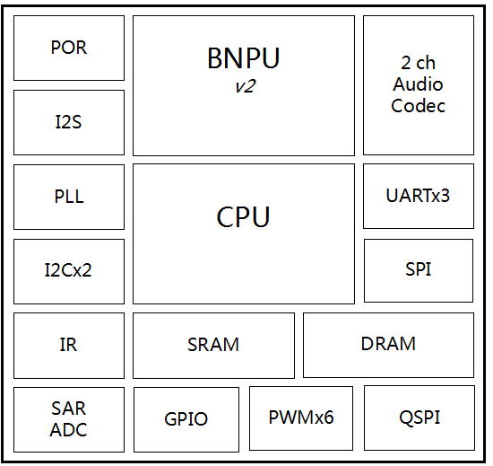
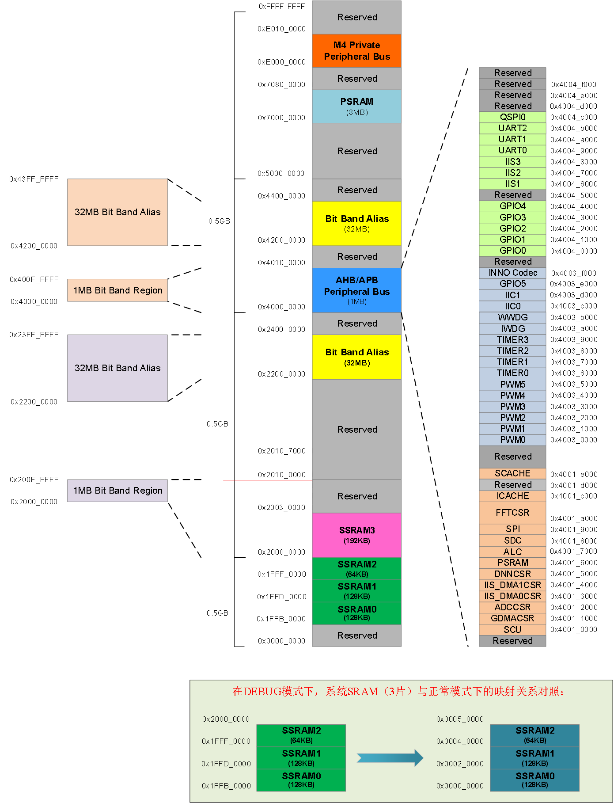

# 系统描述

CI1103芯片系统框图如图3所示，其内部由多个模块组成，包含脑神经网络处理器BNPU等，下面分别针对各个模块进行描述。

图3  CI1103系统框图

## 存储空间映射关系

CI1103的存储空间映射如图4所示，所有外设控制寄存器均位于0x40000000~0x400FFFFF存储段内。

CI1103提供了位操作功能，可将位映射为字进行访问。存储器映射表中包含了2个1MB的位带区，分别位于0x20000000~0x200FFFFF以及0x40000000~0x400FFFFF。为软件便于编程以及外设寄存器访问的位操作需求，将SRAM和外设的配置寄存器分别映射到两个位带区。每个1M的位带区映射到32M的位带别名区，对位带别名区的字进行操作，即可实现对位带区的位的操作。位带区到位带别名区的映射关系如下：位带别名区地址=位带别名区基地址+（字节偏移地址x32）+（位偏移地址x4）。例如要对位带区0x20000100的第3位进行位操作，其对应的位带别名区地址为：位带别名区地址=0x22000000+（0x100x32）+（3x4）=0x2200200C，对0x2200200C进行操作即可实现对0x20000100的第3位进行操作。对位带区进行写操作时，bit[0]决定了写入该位的值；对位带区进行读操作时，bit[0]反映了该位的值，bits[31:1]都为0。

图4  CI1103存储空间映射关系

## 存储和启动

CI1103提供512KB的片内SRAM用于存放数据和程序，该SRAM映射到三段地址空间，如下，用户使用时可以把这三段地址空间看成一个连续的SRAM。
SysRAM0（128KB）：0x1FFB0000~0x1FFCFFFF；
SysRAM1（128KB）：0x1FFFD000~0x1FFEFFFF；
SysRAM2（64KB） ：0x1FFF0000~0x1FFFFFFF；
SysRAM3（192KB）：0x20000000~0x2002FFFF。

CI1103最大可接8MB的PSRAM，存储空间地址为0x70000000~0x70FFFFFF，同时可以通过cache alias功能将地址映射到与SysRAM空间连续，方便软件使用。当前CI1103内部PSRAM大小为2MB。

CI1103通过片外SPI Flash存储固件代码，芯片的QSPI0接口最大支持16MB的4线SPI Flash。芯片IIS1_SDO（BOOT_SEL[1]）管脚复用为芯片Boot Select功能，上电时该管脚为高从片内SRAM启动，一般用于调试；上电时该管脚为低从片内maskrom启动，会从SPI0读取SPI Flash 内代码启动。当选择启动模式后，CI1103的地址空间映射会自动进行配置，系统不支持在启动之后通过软件配置remap地址空间。两种启动配置对地址空间的影响如下： 
当选择片内maskrom启动时，0x00000000~0x00002000被设置为片内maskrom的镜像地址，即CPU在之后过程执行片内maskrom内的代码，将SPI Flash内数据加载到SRAM内开始运行，或者根据IIS1_MCLK（UART_UPDATE_EN）管脚的上电状态进入烧录更新模式，进行更新SPI Flash。 
当选择片内SRAM启动时，0x00000000~0x0FFFFFFF 被设置为SySRAM的镜像地址，即CPU在之后过程中访问上述区域，均会访问到SySRAM上，其它存储的地址仍然映射到其默认地址状态。需要注意的是，从0x00000000起始的区域，其实只是0x1FFB0000起始SRAM的镜像。所以，该配置下CPU、DMA通过0x1FFB0000仍然可以访问该SRAM内容，即0x00000000和0x1FFB0000开始的地址空间在硬件物理上是等效的。

## 中断

### 中断向量列表

CI1103集成了多种中断，其中断向量列表如下：

表3 异常/中断向量列表

编号 | 类型 | 优先级 | 入口地址 | 简介 
:-- | :-- | :-- | :-- | :-- |
0 | - | - | 0x00 | 初始SP值
1 | 复位 | -3 | 0x04 | 复位
2 | NMI | -2 | 0x08 | 不可屏蔽中断
3 | Hard Fault | -1 | 0x0C | 所有被禁止使能的故障
4 | 存储器管理 | 可配置 | 0x10 | 存储器管理
5 | 总线故障 | 可配置 | 0x14 | 预取指故障，存储器访问故障
6 | 用法故障 | 可配置 | 0x18 | 未定义的指令，或非法的处理器工作状态
7-10 | - | - | 0x1C-0x28 | 预留，不建议用户进行操作
11 | 服务调用 | 可配置 | 0x2C | 通过SWI指令实现的系统服务调用
12 | 调试监控 | 可配置 | 0x30 | 调试监控器
13 | - | - | 0x34 | 预留，不建议用户进行操作
14 | 挂起服务 | 可配置 | 0x38 | 可挂起的系统服务请求
15 | 滴答时钟 | 可配置 | 0x3C | 系统滴答时钟定时器
16（IRQ0） | INT_WWDG | 可配置 | 0x40 | 窗口Watchdog中断
17（IRQ1） | INT_IWDG | 可配置 | 0x44 | 独立Watchdog中断
18（IRQ2） | INT_FPU | 可配置 | 0x48 | FPU中断。
19（IRQ3） | - | - | 0x4C | 预留，不建议用户进行操作
20（IRQ4） | - | - | 0x50 | 预留，不建议用户进行操作
21（IRQ5） | - | - | 0x54 | 预留，不建议用户进行操作
22（IRQ6） | INT_ADC | 可配置 | 0x58 | ADC转换完成中断
23（IRQ7） | INT_SDC | 可配置 | 0x5C | SDC中断
24（IRQ8） | INT_GDMA | 可配置 | 0x60 | 通用DMA中断
25（IRQ9） | INT_IIS_DMA0 | 可配置 | 0x64 | IIS DMA0 中断
26（IRQ10） | INT_IIS_DMA1 | 可配置 | 0x68 | IIS DMA1 中断
27（IRQ11） | INT_SCU | 可配置 | 0x6C | SCU唤醒源中断
28（IRQ12） | INT_EXT0 | 可配置 | 0x70 | 外部中断0
29（IRQ13） | INT_EXT1 | 可配置 | 0x74 | 外部中断1
30（IRQ14） | - | - | 0x78 | 预留，不建议用户进行操作
31（IRQ15） | INT_TIMER0 | 可配置 | 0x7C | 定时器0中断
32（IRQ16） | INT_TIMER1 | 可配置 | 0x80 | 定时器1中断
33（IRQ17） | INT_TIMER2 | 可配置 | 0x84 | 定时器2中断
34（IRQ18） | INT_TIMER3 | 可配置 | 0x88 | 定时器3中断
35（IRQ19） | INT_UART0 | 可配置 | 0x8C | UART0中断
36（IRQ20） | INT_UART1 | 可配置 | 0x90 | UART1中断
37（IRQ21） | INT_UART2 | 可配置 | 0x94 | UART2中断
38（IRQ22） | INT_IIC0 | 可配置 | 0x98 | IIC0中断
39（IRQ23） | INT_IIC1 | 可配置 | 0x9C | IIC1中断
40（IRQ24） | INT_GPIO5 | 可配置 | 0xA0 | GPIO5中断
41（IRQ25） | INT_SPI1 | 可配置 | 0xA4 | SPI1中断
42（IRQ26） | INT_GPIO0 | 可配置 | 0xA8 | GPIO0中断
43（IRQ27） | INT_GPIO1 | 可配置 | 0xAC | GPIO1中断
44（IRQ28） | INT_GPIO2 | 可配置 | 0xB0 | GPIO2中断
45（IRQ29） | INT_GPIO3 | 可配置 | 0xB4 | GPIO3中断
46（IRQ30） | INT_GPIO4 | 可配置 | 0xB8 | GPIO4中断
47（IRQ31） | - | - | 0xBC | 预留，不建议用户进行操作
48（IRQ32） | - | - | 0xC0 | 预留，不建议用户进行操作
49（IRQ33） | INT_IIS1 | 可配置 | 0xC4 | IIS1中断
50（IRQ34） | - | - | 0xC8 | 预留，不建议用户进行操作
51（IRQ35） | INT_IIS3 | 可配置 | 0xCC | IIS3中断

### 中断控制寄存器映射

中断寄存器的基地址为0xE000E000，所有中断控制/状态寄存器都只能在特权级下访问（除软件触发中断寄存器外），寄存器映射列表见表4。也可以参考cortex-m4使用手册，并推荐使用CMSIS函数来访问相关功能。

表4 中断寄存器映射表

偏移量 | 名称 | 位宽 | 类型 | 复位值 | 描述 |
:--: | :--: | :--: | :--: | :--: | :-- |
0x100-0x11C | ISER0-ISER7 | 32 | R/W | 0x00000000 | 中断使能寄存器，寄存器0为（IRQ0~IRQ31），以此类推
0x180-0x19C | ICER0-ICER7 | 32 | R/W | 0x00000000 | 中断清除使能寄存器，寄存器0为（IRQ0~IRQ31），以此类推
0x200-0x21C | ISPR0-ISPR7 | 32 | R/W | 0x00000000 | 中断挂起寄存器，寄存器0为（IRQ0~IRQ31），以此类推
0x280-0x29C | ICPR0-ICPR7 | 32 | R/W | 0x00000000 | 中断挂起清除寄存器，寄存器0为（IRQ0~IRQ31），以此类推
0x300-0x31C | IABR0-IABR7 | 32 | RO | 0x00000000 | 中断活动状态寄存器，寄存器0为（IRQ0~IRQ31），以此类推
0x400-0x4EF | IPR0-IPR59 | 32 | R/W | 0x00000000 | 中断优先级寄存器，寄存器0为（IRQ0~IRQ3），以此类推
0xD08 | VTOR | 32 | R/W | 0x00000000 | 向量表偏移寄存器
0xD0C | AIRCR | 32 | R/W | 0x00000000 | 应用中断控制寄存器

上表中将同类寄存器放在同一行描述，每个寄存器按4字节偏移增加，用户可自行计算出所需的寄存器地址偏移量。例如：要获取IPR2的地址，则在IPR0的基地址偏移量上增加8个字节，偏移量为0x400 + 0x8 = 0x408，则其实际地址为0xE000E408，其余寄存器偏移量计算以此类推。

### 中断使能寄存器（ISER）

偏移量：0x100

复位值：0x00000000

位域 | 名称 | 复位值 | 类型 | 描述 |
:--: | :--: | :--: | :--: | :-- |
 31:0 | SETENA | 0x00000000 | R/W | 中断使能控制： 1：使能中断 0：不影响

 

### 中断清除使能寄存器（ICER）

 偏移量：0x180
 
 复位值：0x00000000

位域 | 名称 | 复位值 | 类型 | 描述 |
:--: | :--: | :--: | :--: | :-- |
 31:0 | CLRENA | 0x00000000 | R/W | 中断清除使能控制： 1：禁止中断 0：不影响

 

### 中断挂起寄存器（ISPR）

偏移量：0x200

复位值：0x00000000

位域 | 名称 | 复位值 | 类型 | 描述 |
:--: | :--: | :--: | :--: | :-- |
 31:0 | SETPEND | 0x00000000 | R/W | 中断挂起控制： 1：中断挂起 0：中断未挂起

 

### 中断挂起清除寄存器（ICPR）

偏移量：0x280

复位值：0x00000000

位域 | 名称 | 复位值 | 类型 | 描述 |
:--: | :--: | :--: | :--: | :-- |
 31:0 | CLRPEND | 0x00000000 | R/W | 中断挂起清除控制： 1：清除挂起中断 0：不清除挂起中断

 

### 中断活动状态寄存器（IABR）

偏移量：0x300

复位值：0x00000000

位域 | 名称 | 复位值 | 类型 | 描述 |
:--: | :--: | :--: | :--: | :-- |
 31:0 | ACTIVE | 0x00000000 | RO | 中断挂起清除控制： 1：ISR执行中或者被抢占或者压线 0：ISR未执行或者压线

 

### 中断优先级寄存器（IPR）

偏移量：0x400~0x41C

复位值：0x00000000

位域 | 名称 | 复位值 | 类型 | 描述 |
:--: | :--: | :--: | :--: | :-- |
31:24 | PRI_n+3 | - | - | 保留
23:16 | PRI_n+2 | - | - | 保留
15:8 | PRI_n+1 | - | - | 保留
 7:0 | PRI_n | 0x00 | R/W | 中断n的优先级控制，受AIRCR影响。

 

### 向量表偏移寄存器（VTOR）

偏移量：0xD08C

复位值：0x00000000

位域 | 名称 | 复位值 | 类型 | 描述 |
:--: | :--: | :--: | :--: | :-- |
31:30 | Reserved | 0x0 | R/W | 保留
29 | TBLBASE | 0 | R/W | 向量表映射域： 0:Code 1:RAM
28:7| TBLOFF | 0x000000 | R/W | 向量表偏移地址
 6:0 | Reserved | 0x00 | R/W | 保留

 

### 应用中断控制寄存器（AIRCR）

偏移量：0xD0CC

复位值：0x00000000

位域 | 名称 | 复位值 | 类型 | 描述 |
:--: | :--: | :--: | :--: | :-- |
31:16 | VECTKEY | 0x0000 | R/W | 寄存器配置解锁控制。写该寄存器时，该段位域须为0x05FA，否则写操作被忽略。 读该寄存器时，该段位域值为0xFA05
15:2 | Reserved | 0x0000 | R/W | 保留
1 | VECTCLR | 0 | R/W | 清除正在执行的中断： 1：清除所有中断信息，包括NMI和fault 0：不清除
0 | VECTRESET | 0 | R/W | 系统复位位，复位整个系统（除调试系统）： 1：复位系统 0：不复位系统 在调试时，当core被挂起（halted）时才能写该位

 
