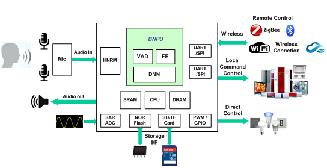

# 芯片概述

CI1103是一颗专用于语音处理的人工智能芯片，可广泛应用于家电、家居、照明、玩具等产品领域，实现语音交互及控制。

CI1103内置自主研发的脑神经网络处理器BNPU，支持200条命令词以内的本地语音识别，内置CPU核和高性能低功耗Audio Codec模块，集成多路UART、IIC、PWM、GPIO等外围控制接口，可以开发各类高性价比单芯片智能语音产品方案。

表1 芯片信息

芯片型号 | DRAM容量 | RAM容量 | 封装信息
:--: | :--: | :--: | :--:
CI1103 | 2MByte | 512KByte | QFN56L(7mmx7mmx0.85mm)

CI1103可应用的部分产品领域：

* 智能家电
* 智能玩具
* 智能照明
* 智能遥控器

图1  芯片应用框图

芯片特性如下：

* 神经网络处理器BNPU
    - 采用硬件进行神经网络运算，内核可配置并独立处理AI语音功能
    - 支持大词汇量语音识别和本地声纹识别
    - 支持VAD语音检测和打断唤醒
* CPU
    - 180MHz运行频率
    - 32-bit单周期乘法器
    - 支持24-bit系统timer
    - 内置DMA控制器
    - 支持Serial Wire Debug Port(SW-DP) debug
* 存储器
    - 支持4线QSPI Nor Flash
    - 内置512KB SRAM
    - 内置ROM
    - 内置2MB DRAM
* 音频接口
    - 内置高性能低功耗Audio Codec模块，支持两路ADC采样和DAC播放
    - 支持Automatic Level Control (ALC)功能
    - 支持16kHz/24kHz/32kHz/44.1kHz/48kHz采样率，支持44.1kHz时钟频点
    - 支持一路IIS音频扩展通路
* SAR ADC
    - 4路12bit SAR ADC输入通道
    - ADC IO可与数字GPIO进行功能复用
* 外设和定时器
    - 3路UART接口，最高可支持3M波特率
    - 2路IIC接口
    - 1路通用SPI接口
    - 6路PWM接口
    - 内置4组32-bit timer
    - 内置1组独立看门狗（IWDG）
    - 内置1组窗口看门狗（WWDG）
* GPIO
    - 支持超30个GPIO口（IO功能复用）
    - 每个GPIO口可配置中断功能
    - 支持两路带滤波功能外部中断
* 时钟及复位
    - 支持外接晶体或有源晶振
    - 内置PLL和上电及欠压复位电路