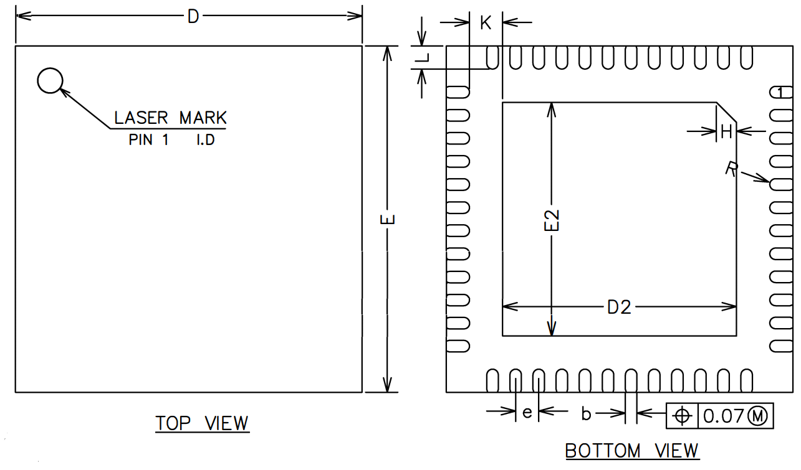
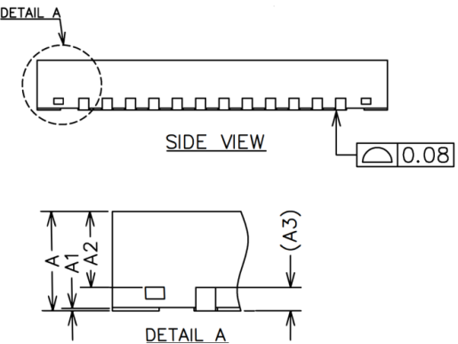

# 封装信息

{: .center }

图X25  芯片封装外形图

上图是芯片的封装外形图，具体尺寸参数见下表所示。

表20 封装尺寸参数（单位为毫米）

SYMBOL | 最小值 | 典型值 | 最大值
:--: | :--: | :--: | :--:
A | 0.80 | 0.85 | 0.90
A1 | 0.00 | 0.02 | 0.05
A2 | 0.60 | 0.65 | 0.70
A3 | - | 0.20REF | -
b | 0.15 | 0.20 | 0.25
D | 5.90 | 6.00 | 6.10
E | 5.90 | 6.00 | 6.10
D2 | 3.95 | 4.05 | 4.15
E2 | 3.95 | 4.05 | 4.15
e | 0.35 | 0.40 | 0.45
H | - | 0.35REF | -
K | 0.20 | - | -
L | 0.35 | 0.40 | 0.45
R | 0.09 | - | -

