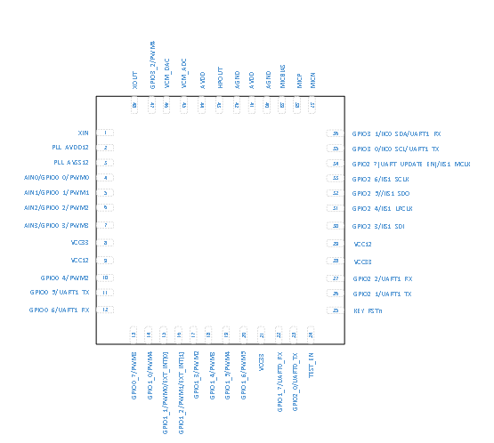

# 引脚描述

CI1122芯片引脚图如图2所示：

{: .center }

图2  CI1122芯片引脚图

芯片各个引脚功能如下表描述：

表2 芯片引脚功能描述

Pin Number | Pin name | Pin type | IO driving capability | IO power-on default state | Alternate functions
:--: | :--: | :--: | :--: | :--: | :--:
1 | XIN | I | - | - | 12.288MHZ crystal oscillator interface
2 | PLL_AVDD12 | P | - | - | PLL 1.2V power supply
3 | PLL_AVSS12 | P | - | - | PLL ground
4 | AIN0 | IO | 4mA | IN,T+D | Default:ADC0 Input Can be configured as Digital functions pin. 1.GPIO0_0 2.PWM0 Output
5 | AIN1 | IO | 4mA | IN,T+D | Default:ADC1 Input Can be configured as Digital functions pin. 1.GPIO0_1 2.PWM1 Output
6 | AIN2 | IO | 4mA | IN,T+D | Default:ADC2 Input Can be configured as Digital functions pin. 1.GPIO0_2 2.PWM2 Output
7 | AIN3 | IO | 4mA | IN,T+D | Default:ADC3 Input Can be configured as Digital functions pin. 1.GPIO0_3 2.PWM3 Output
8 | VCC33 | P | - | - | 3.3V power supply
9 | VCC12 | P | - | - | 1.2V Core power supply
10 | GPIO0_4 | IO | 4mA | IN,T+D | 1.GPIO0_4 2.PWM2 Output
11 | GPIO0_5 | IO | 4mA | IN,T+U | 1.GPIO0_5 2.UART1_TX
12 | GPIO0_6 | IO | 4mA | IN,T+D | 1.GPIO0_6 2.UART1_RX
13 | GPIO0_7 | IO | 4mA | IN,T+U | 1.GPIO0_7 2.PWM3
14 | GPIO1_0 | IO | 4mA | IN,T+D | 1.GPIO1_0 2.PWM4
15 | PWM0 | IO | 4mA | IN,T+D | 1.GPIO1_1 2.PWM0 Output 3.EXT_INT[0]
16 | PWM1 | IO | 4mA | IN,T+D | 1.GPIO1_2 2.PWM1 Output 3.EXT_INT[1]
17 | PWM2 | IO | 4mA | IN,T+D | 1.GPIO1_3 2.PWM2 Output
18 | PWM3 | IO | 4mA | IN,T+D | 1.GPIO1_4 2.PWM3 Output
19 | PWM4 | IO | 4mA | IN,T+D | 1.GPIO1_5 2.PWM4 Output
20 | PWM5 | IO | 4mA | IN,T+D | 1.GPIO1_6 2.PWM5 Output
21 | VCC33 | P | - | - | 3.3V power supply
22 | UART0_RX | IO | 4mA | IN,T+U | 1.GPIO1_7 2.UART0_RX: Receive channel of UART0
23 | UART0_TX | IO | 4mA | IN,T+U | 1.GPIO2_0 2.UART0_TX: Transmit channel of UART0
24 | TEST_EN | I | - | - | Internal pull-down 0—functional mode 1—TEST mode 
25 | KEY_RSTn | I | - | - | External reset input. Pull this pin low to reset device to initial state. Has internal weak pull-up.
26 | UART1_TX | IO | 4mA | IN,T+U | 1.GPIO2_1 2.UART1_TX: Transmit channel of UART1 
27 | UART1_RX | IO | 4mA | IN,T+U | 1.GPIO2_2 2.UART1_RX: Receive channel of UART1 
28 | VCC33 | P | - | - | 3.3V power supply
29 | VCC12 | P | - | - | 1.2V Core power supply
30 | IIS1_SDI | IO | 4mA | IN,T+D | 1.GPIO2_3 2.IIS1_SDI: Serial Data Input for IIS1 interface
31 | IIS1_LRCLK | IO | 4mA | IN,T+D | 1.GPIO2_4 2.IIS1_LRCLK: IIS1 interface LRCLK clock
32 | IIS1_SDO | IO | 4mA | IN,T+D | 1.GPIO2_5 2.IIS1_SDO: Serial Data Output for IIS1 interface
33 | IIS1_SCLK | IO | 4mA | IN,T+D | 1.GPIO2_6 2.IIS1_SCLK: Serial Clock for IIS1 interface
34 | IIS1_MCLK | IO | 4mA | IN,T+D | 1.GPIO2_7(UART_UPDATE_EN) At start-up, this pin is used to select one of two functional modes: 1---Start serial port upgrade service and program 0---Start directly from Flash 2.IIS1_MCLK:Master Clock for IIS1 reference
35 | IIC0_SCL | IO | 4mA | IN,T+U | 1.GPIO3_0 2.IIC0_SCL: IIC0 Serial Clock 3.UART1_TX
36 | IIC0_SDA | IO | 4mA | IN,T+U | 1.GPIO3_1 2.IIC0_SDA: IIC0 Serial Data 3.UART1_RX
37 | MICN | I | - | - | Microphone N input
38 | MICP | I | - | - | Microphone P input
39 | MICBIAS | O | - | - | Microphone bias output
40 | AGND | P | - | - | Analog ground
41 | AVDD | P | - | - | 3.3V analog supply
42 | AGND | P | - | - | Analog ground
43 | HPOUT | O | - | - | DAC output
44 | AVDD | P | - | - | 3.3V analog supply
45 | VCM_ADC | O | - | - | ADC VCM output
46 | VCM_DAC | O |  | - | DAC VCM output
47 | GPIO3_2 | IO | 4mA | IN,T+D | 1.GPIO3_2 2.PWM4 Output
48 | XOUT | O | - | - | 12.288MHZ crystal oscillator interface

***上表中 IO引脚的状态定义如下：***

I 输入

O 输出

IO 双向

P 电源或地

T+D	三态正下拉

T+U	三态正上拉

OUT	上电默认为输出模式

IN 上电默认为输入模式