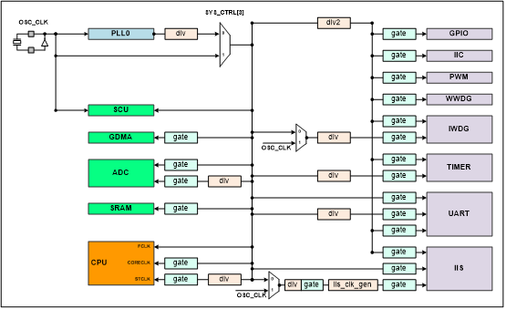
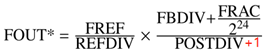

# 系统控制单元SCU

系统控制单元主要是负责芯片的上电时序控制、外部唤醒中断的监控、时钟复位信号的产生与控制、以及引脚复用的切换控制等功能。

## 系统时钟

本系统的时钟源如下：

* 片外振荡器输入时钟，使用12.288Mhz晶振；
* 片上PLL产生的时钟，PLL输入时钟源为片外振荡器，PLL输出时钟范围为20MHz~1280MHz。

整个系统的时钟输入来源有两个：片外晶振和片内PLL。通过这两个时钟进行分频，产生系统各个时钟，其中AHB时钟命名为HCLK，APB时钟命名为PCLK，其余各路时钟命名见图6。

AHB最高频率可达180MHz，APB与AHB间保持偶数倍的分频关系（默认APB为AHB的2分频）。各外设IP模块的时钟可通过CPU配置SCU中的时钟控制寄存器来进行软件clock gating，这样可以降低IP模块上的动态功耗。

{: .center }

图6  时钟结构

## 系统复位

SCU中的复位控制单元负责控制两种类型的复位：电源复位和系统复位。电源复位由上电复位产生，将所有寄存器恢复到初始值。上电复位能够在上电过程中复位整个系统，系统复位可复位处理器内核以及外设IP部分。系统复位可由如下复位源产生：

* 上电复位：在芯片上电时，当电压达到设定值后释放复位，否则处于复位状态；
* 独立看门狗产生的复位：看门狗计数递减到0时如CPU还未喂狗，则产生复位；
* 窗口看门狗产生的复位：窗口看门狗模块计数后若软件在时间窗口内没有喂狗，则产生复位；
* 系统产生的复位请求：由CPU配置中断控制器产生复位请求，SCU收到后会产生复位；
* 系统软件复位：CPU配置SCU的系统软件复位寄存器，产生复位。

在SCU系统控制模块内会保留芯片系统当前复位是由哪个复位源引起的状态，此状态只会被上电复位。

***注意芯片供电有上电时序要求：需要先上VDD33电源，再上VDD12电源。***如图7所示，VDD33电源上电与VDD12电源上电间隔时间需要大于0.1ms，VDD12上电后在小于40ms时间内，芯片POR复位完成，同时系统时钟有效输出。

{: .center }

图7  上电时序图

## SCU寄存器映射

系统控制单元寄存器映射基地址为0x40010000，详见表5。

表5 系统控制单元寄存器映射

偏移量 | 名称 | 位宽 | 类型 | 复位值 | 描述
:--: | :--: | :--: | :--: | :--: | :--:
0x00 | SYS_CTRL_CFG | 32 | R/W | 0x00000001 | 系统控制寄存器
0x0C | EXT_INT_CFG | 32 | R/W | 0x00000000 | 外部中断配置寄存器
0x50 | SYSCFG_LOCK_CFG | 32 | R/W | 0x00000000 | 系统锁定配置寄存器
0x54 | RSTCFG_LOCK_CFG | 32 | R/W | 0x00000000 | 系统复位锁定配置寄存器
0x58 | CKCFG_LOCK_CFG | 32 | R/W | 0x00000000 | 时钟配置锁定配置寄存器
0x60 | CLK_SEL_CFG | 32 | R/W | 0x00000001 | 时钟选择配置寄存器
0x68 | SYS_PLL0_CFG | 32 | R/W | 0x000CA015 | PLL配置寄存器0
0x6C | SYS_PLL1_CFG | 32 | R/W | 0x00000000 | PLL配置寄存器1
0x78 | PLL_UPDATE_CFG | 32 | R/W | 0x00000000 | PLL配置参数更新寄存器
0x80 | CLKDIV_PARAM0_CFG | 32 | R/W | 0x00902181 | 分频参数寄存器0
0x84 | CLKDIV_PARAM1_CFG | 32 | R/W | 0x00002062 | 分频参数寄存器1
0x88 | CLKDIV_PARAM2_CFG | 32 | R/W | 0x00000208 | 分频参数寄存器2
0x8C | CLKDIV_PARAM3_CFG | 32 | R/W | 0x00545454 | 分频参数寄存器3
0xB0 | PARAM_EN0_CFG | 32 | R/W | 0x00000000 | 分频参数使能寄存器
0xD4 | IIS1_CLK_CFG | 32 | R/W | 0x00000040 | IIS1时钟配置寄存器
0x120 | SYS_CLKGATE_CFG | 32 | R/W | 0x000003F0 | 系统时钟门控配置寄存器
0x124 | PRE_CLKGATE0_CFG | 32 | R/W | 0x00003FFF | 模块时钟门控配置寄存器0
0x128 | PRE_CLKGATE1_CFG | 32 | R/W | 0x00FFFFFF | 模块时钟门控配置寄存器1
0x170 | SOFT_RST_CFG | 32 | R/W | 0x00000000 | 软件复位配置寄存器
0x174 | SOFT_SYSRST_CFG | 32 | R/W | 0x00000000 | 软件系统复位配置寄存器
0x178 | SCU_STATE_REG | 32 | R/W | 0x00000001 | SCU状态寄存器
0x18C | SOFT_PLLRST_CFG | 32 | R/W | 0x00000001 | PLL软件复位配置寄存器
0x190 | SOFT_PRERST0_CFG | 32 | R/W | 0x00000FFF | 模块软件复位配置寄存器0
0x194 | SOFT_PRERST1_CFG | 32 | R/W | 0x00000FFF | 模块软件复位配置寄存器1
0x1E0 | WAKEUP_MASK_CFG | 32 | R/W | 0x00000000 | 唤醒Mask配置寄存器
0x1E4 | EXT0_FILTER_CFG | 32 | R/W | 0x0000FFFF | 外部中断0滤波使能配置寄存器
0x1E8 | EXT1_FILTER_CFG | 32 | R/W | 0x0000FFFF | 外部中断1滤波使能配置寄存器
0x1F4 | INT_STATE_REG | 32 | R/W | 0x00000000 | 中断状态寄存器
0x220 | IO_REUSE0_CFG | 32 | R/W | 0x00000000 | IO复用配置寄存器0
0x224 | IO_REUSE1_CFG | 32 | R/W | 0x00000000 | IO复用配置寄存器1
0x230 | AD_IO_REUSE0_CFG | 32 | R/W | 0x0000000F | ADC IO复用配置寄存器
0x238 | IOPULL_CFG | 32 | R/W | 0x00000000 | IO上拉配置寄存器

## 系统控制寄存器（SYS_CTRL_CFG）

偏移量：0x00

复位值：0x00000001

位域 | 名称 | 复位值 | 类型 | 描述
:--: | :--: | :--: | :--: | :--:
31:7 | Reserved | 0x0 | RW | Reserved
6:3 | NMI_INT_CTRL | 0x0 | RW | 将CPU快速中断配置为如下中断源： 0x0001:  IWTD_INT 0x0010:  WWTD_INT 0x0011:  EXT0_INT 0x0100:  EXT1_INT 0x0101-0x1000:  Reserved 0x1001:  ADC_INT 0x1010:  UART0_INT 0x1011:  UART1_INT 0x1100:  TIMER0_INT 0x1101:  TIMER1_INT 其它值：不产生快速中断
2:0 | Reserved | 0x1 | RW | Reserved

## 外部中断配置寄存器（EXT_INT_CFG）

偏移量：0x0C

复位值：0x00000000

位域 | 名称 | 复位值 | 类型 | 描述
:--: | :--: | :--: | :--: | :--:
31:4 | Reserved | 0x0 | RW | Reserved
3 | EXT1_INT_EN | 0x0 | RW | 外部中断1中断使能: 1:发生外部中断请求时产生对应中断 0:中断不使能
2 | EXT0_INT_EN | 0x0 | RW | 外部中断0中断使能: 1:发生外部中断请求时产生对应中断 0:中断不使能
1 | EXT1_INT_STATE | 0x0 | RW | 外部中断1状态位: 1:发生外部中断请求 0:未发生外部中断请求 该位写1清除
0 | EXT0_INT_STATE | 0x0 | RW | 外部中断0状态位: 1:发生外部中断请求 0:未发生外部中断请求 该位写1清除

## 系统锁定配置寄存器（SYSCFG_LOCK_CFG）

偏移量：0x50

复位值：0x00000000

位域 | 名称 | 复位值 | 类型 | 描述
:--: | :--: | :--: | :--: | :--:
31:0 | SYSCFG_LOCK | 0x0 | RW | 软件配置系统时需先向此寄存器写0x51AC0FFE解锁，才能写入配置。读此寄存器的值有以下含义: 1:本寄存器已解锁，可以写入； 0:本寄存器未解锁，不能写入。

## 系统复位锁定配置寄存器（RSTCFG_LOCK_CFG）

偏移量：0x54

复位值：0x00000000

位域 | 名称 | 复位值 | 类型 | 描述
:--: | :--: | :--: | :--: | :--:
31:0 | RSTCFG_LOCK | 0x0 | RW | 软件配置系统时需先向此寄存器写0x51AC0FFE解锁，才能写入配置。读此寄存器的值有以下含义: 1:本寄存器已解锁，可以写入； 0:本寄存器未解锁，不能写入。

## 时钟配置锁定配置寄存器（CKCFG_LOCK_CFG）

偏移量：0x58

复位值：0x00000000

位域 | 名称 | 复位值 | 类型 | 描述
:--: | :--: | :--: | :--: | :--:
31:0 | CKCFG_LOCK | 0x0 | RW | 软件配置PLL和时钟门控相关寄存器时需要先向此寄存器写0x51AC0FFE解锁，然后才能进行配置，写其他任意值锁定。读此寄存器的值有以下含义: 1:本寄存器已解锁，可以写入； 0:本寄存器未解锁，不能写入。 PLL和时钟门控相关寄存器包括如下： CLK_SEL_CFG SYS_PLL0_CFG SYS_PLL1_CFG PLL_UPDATE_CFG CLKDIV_PARAM0_CFG CLKDIV_PARAM1_CFG CLKDIV_PARAM2_CFG CLKDIV_PARAM3_CFG PARAM_EN0_CFG IIS1_CLK_CFG SYS_CLKGATE_CFG PRE_CLKGATE0_CFG PRE_CLKGATE1_CFG

## 时钟选择配置寄存器（CLK_SEL_CFG）

偏移量：0x60

复位值：0x00000000

位域 | 名称 | 复位值 | 类型 | 描述
:--: | :--: | :--: | :--: | :--:
31:5 | Reserved | 0x0 | RW | Reserved
6 | IWDG_CLK_SEL | 0x0 | RW | 选择IWDG模块的时钟来源: 0:内核分频时钟 1:外部晶振分频时钟
5:4 | Reserved | 0x0 | RW | Reserved
3:1 | MCLK_SCU_SEL | 0x0 | RW | 选择IIS1模块的MCLK时钟来源: 0:内核分频时钟 1:外部晶振分频时钟
0 | SYS_CLK_SEL | 0x0 | RW | 选择CPU时钟来源： 1: 外部晶振 0: PLL 倍频后时钟

## PLL配置寄存器0（SYS_PLL0_CFG）

偏移量：0x68

复位值：0x000CA015

位域 | 名称 | 复位值 | 类型 | 描述
:--: | :--: | :--: | :--: | :--:
31:28 | Reserved | 0x0 | RW | Reserved
27 | RESETLOCK | 0x0 | RW | 锁定检测电路的复位： 1：复位 0：不复位
26 | BYPASS | 0x0 | RW | PLL时钟bypass使能： 0：输出PLL处理（倍频、分频）后的时钟 1：输出PLL处理前的时钟
25:22 | POSTDIV2 | 0x0 | RW | PLL_CLK2(IIS使用）的内部分频参数
21:18 | POSTDIV1 | 0x3 | RW | PLL_CLK1(系统使用）的内部分频参数
17:10 | FBDIV | 0x28 | RW | PLL内部反馈分频系数
9:4 | REFDIV | 0x1 | RW | PLL内部参考时钟分频系数
3 | FOUTVCOPD | 0x0 | RW | VCO时钟输出控制 0：正常工作 1：低功耗模式
2 | FOUT2PD | 0x1 | RW | PLL_CLK2内部分频器低功耗模式控制 0:正常工作 1:低功耗模式
1 | FOUT1PD | 0x0 | RW | PLL_CLK1内部分频器低功耗模式控制 0:正常工作 1:低功耗模式
0 | DSMPD | 0x1 | RW | PLL内部delta-segma调制器低功耗模式控制 0:正常工作 1:低功耗模式

## PLL配置寄存器1（SYS_PLL1_CFG）

偏移量：0x6C

复位值：0x00000000

位域 | 名称 | 复位值 | 类型 | 描述
:--: | :--: | :--: | :--: | :--:
31:24 | Reserved | 0x0 | RW | Reserved
23:0 | FRAC | 0x0 | RW | PLL小数分频系数

PLL倍频频率可以用下述公式计算。公式中FOUT为PLL倍频后的频率，其余为上述寄存器中对应位配置的值。FREF为输入的参考时钟，一般为外部晶振的频率。

{: .center }

## PLL配置参数更新寄存器（PLL_UPDATE_CFG）

偏移量：0x78

复位值：0x00000000

位域 | 名称 | 复位值 | 类型 | 描述
:--: | :--: | :--: | :--: | :--:
31:1 | Reserved | 0x0 | RW | Reserved
0 | SYS_PLL_UPDATE | 0x0 | RW | PLL配置(PLL0_CFG/PLL1_CFG)参数更新使能 1:使能 0:不使能

## 分频参数寄存器0（CLKDIV_PARAM0_CFG）

偏移量：0x80

复位值：0x00902181

位域 | 名称 | 复位值 | 类型 | 描述
:--: | :--: | :--: | :--: | :--:
31:22 | Reserved | 0x0 | RW | Reserved
21:16 | IWDG_DIV | 0x10 | RW | IWDG时钟的分频参数
15:4 | ST_DIV | 0x18 | RW | CPU内核滴答(SysTick)时钟的分频参数
3:0 | AHB_DIV | 0x1 | RW | AHB时钟的分频参数 选择0或者1时为2分频

## 分频参数寄存器1（CLKDIV_PARAM1_CFG）

偏移量：0x84

复位值：0x00002062

位域 | 名称 | 复位值 | 类型 | 描述
:--: | :--: | :--: | :--: | :--:
31:15 | Reserved | 0x0 | RW | Reserved
14:9 | TIME_DIV | 0x10 | RW | TIME时钟的分频参数
8:3 | ADC_DIV | 0xc | RW | ADC时钟的分频参数
2:0 | Reserved | 0x0 | RW | Reserved

## 分频参数寄存器2（CLKDIV_PARAM2_CFG）

偏移量：0x88

复位值：0x00000208

位域 | 名称 | 复位值 | 类型 | 描述
:--: | :--: | :--: | :--: | :--:
31:12 | Reserved | 0x0 | RW | Reserved
11:6 | UART_DIV1 | 0x8 | RW | UART1时钟的分频参数
5:0 | UART_DIV0 | 0x8 | RW | UART0时钟的分频参数

## 分频参数寄存器3（CLKDIV_PARAM3_CFG）

偏移量：0x8C

复位值：0x00545454

位域 | 名称 | 复位值 | 类型 | 描述
:--: | :--: | :--: | :--: | :--:
31:24 | Reserved | 0x0 | RW | Reserved
23:16 | MCLK_DIV3 | 0x54 | RW | MCLK3时钟的分频参数
15:8 | MCLK_DIV2 | 0x54 | RW | MCLK2时钟的分频参数
7:0 | MCLK_DIV1 | 0x54 | RW | MCLK1时钟的分频参数

## 分频参数使能寄存器（PARAM_EN0_CFG）

偏移量：0xB0

复位值：0x00000000

位域 | 名称 | 复位值 | 类型 | 描述
:--: | :--: | :--: | :--: | :--:
31:15 | Reserved | 0x0 | RW | Reserved
14 | MCLK3_DIV_EN | 0x0 | RW | 分频参数MCLK3_DIV的更新使能: 1:使能 0:不使能
13 | MCLK2_DIV_EN | 0x0 | RW | 分频参数MCLK2_DIV的更新使能: 1:使能 0:不使能
12 | MCLK1_DIV_EN | 0x0 | RW | 分频参数MCLK1_DIV的更新使能: 1:使能 0:不使能
11 | UART1_DIV_EN | 0x0 | RW | 分频参数UART1_DIV的更新使能: 1:使能 0:不使能
10 | UART0_DIV_EN | 0x0 | RW | 分频参数UART0_DIV的更新使能: 1:使能 0:不使能
9 | TIME_DIV_EN | 0x0 | RW | 分频参数TIME_DIV的更新使能: 1:使能 0:不使能
8 | ADC_DIV_EN | 0x0 | RW | 分频参数ADC_DIV的更新使能: 1:使能 0:不使能
7:4 | Reserved | 0x0 | RW | Reserved
3 | IWDG_DIV_EN | 0x0 | RW | 分频参数IWDG_DIV的更新使能: 1:使能 0:不使能
2:1 | Reserved | 0x0 | RW | Reserved
0 | AHB_DIV_EN | 0x0 | RW | 分频参数AHB_DIV的更新使能: 1:使能 0:不使能

## IIS1时钟配置寄存器（IIS1_CLK_CFG）

偏移量：0xD4

复位值：0x00000040

位域 | 名称 | 复位值 | 类型 | 描述
:--: | :--: | :--: | :--: | :--:
31:8 | Reserved | 0x0 | RW | Reserved
7 | UPDATE_EN | 0x0 | RW | 将本寄存器配置值更新到SCU内部的使能信号: 1:使能 0:不使能
6 | CLK_EN | 0x1 | RW | SCU内部产生的SCK和LRCK的使能: 1:使能 0:不使能
5 | MCLK_EN | 0x0 | RW | MCLK引脚输出使能: 1:使能 0:不使能
4:3 | FS_SEL | 0x0 | RW | 过采样率: 0x00=128FS 0x01=192FS 0x10=256FS 0x11=384FS
2 | BIT_SEL | 0x0 | RW | SCK和LRCK的频率关系比值: 1:SCK/LRCK=64 0:SCK/LRCK=32
1 | SCK_EXT_INV_SEL | 0x0 | RW | SCK_EXT和SCK_EXT_INV选择: 0:SCK_EXT 1:SCK_EXT_INV
0 | CLK_SEL | 0x0 | RW | 主从配置: 0:IIS时钟由SCU产生 1:IIS时钟由外部引脚输入

## 系统时钟门控配置寄存器（SYS_CLKGATE_CFG）

偏移量：0x120

复位值：0x000003F0

位域 | 名称 | 复位值 | 类型 | 描述
:--: | :--: | :--: | :--: | :--:
31:5 | Reserved | 0x0 | RW | Reserved
9 | Reserved | 0x1 | RW | Reserved
8 | Reserved | 0x1 | RW | Reserved
7 | Reserved | 0x1 | RW | Reserved
6 | Reserved | 0x1 | RW | Reserved
5 | Reserved | 0x1 | RW | Reserved
4 | CPU_CORECLK | 0x1 | RW | 关闭系统CPU CORECLK时钟门控 0:关闭时钟 1:打开时钟
3 | Reserved | 0x0 | RW | Reserved
2 | SLEEPDEEP | 0x0 | RW | CPU SLEEPDEEP时自动关闭系统相关时钟 0:禁止 1:使能
1 | SLEEPING | 0x0 | RW | CPU SLEEPING时自动关闭系统相关时钟 0:禁止 1:使能
0 | Reserved | 0x0 | RW | Reserved

## 模块时钟门控配置寄存器0（PRE_CLKGATE0_CFG）

偏移量：0x124

复位值：0x00003FFF

位域 | 名称 | 复位值 | 类型 | 描述
:--: | :--: | :--: | :--: | :--:
31:14 | Reserved | 0x0 | RW | Reserved
13 | GDMA_CKEN | 0x1 | RW | GDMA_CKEN模块时钟门控 0:关闭时钟 1:打开时钟
12 | Reserved | 0x1 | RW | Reserved
11 | Reserved | 0x1 | RW | Reserved
10 | Reserved | 0x1 | RW | Reserved
9 | ADC_CKEN | 0x1 | RW | ADC模块时钟门控 0:关闭时钟 1:打开时钟
8 | Reserved | 0x1 | RW | Reserved
7 | Reserved | 0x1 | RW | Reserved
6 | Reserved | 0x1 | RW | Reserved
5 | Reserved | 0x1 | RW | Reserved
4 | WWDG_HALT_CKEN | 0x1 | RW | CPU HALT时WWDG模块时钟门控 0:关闭时钟 1:打开时钟
3 | IWDG_HALT_CKEN | 0x1 | RW | CPU HALT时IWDG模块时钟门控 0:关闭时钟 1:打开时钟
2 | WWDG_CKEN | 0x1 | RW | WWDG模块时钟门控 0:关闭时钟 1:打开时钟
1 | IWDG_CKEN | 0x1 | RW | IWDG模块时钟门控 0:关闭时钟 1:打开时钟
0 | Reserved | 0x1 | RW | Reserved

## 模块时钟门控配置寄存器1（PRE_CLKGATE1_CFG）

偏移量：0x128

复位值：0x00FFFFFF

位域 | 名称 | 复位值 | 类型 | 描述
:--: | :--: | :--: | :--: | :--:
31:24 | Reserved | 0x0 | RW | Reserved
23 | IIC_CKEN | 0x1 | RW | IIC模块时钟门控 0:关闭时钟 1:打开时钟
22 | PWM5_CKEN | 0x1 | RW | PWM0模块时钟门控 0:关闭时钟 1:打开时钟
21 | PWM4_CKEN | 0x1 | RW | PWM4模块时钟门控 0:关闭时钟 1:打开时钟
20 | PWM3_CKEN | 0x1 | RW | PWM3模块时钟门控 0:关闭时钟 1:打开时钟
19 | PWM2_CKEN | 0x1 | RW | PWM2模块时钟门控 0:关闭时钟 1:打开时钟
18 | PWM1_CKEN | 0x1 | RW | PWM1模块时钟门控 0:关闭时钟 1:打开时钟
17 | PWM0_CKEN | 0x1 | RW | PWM0模块时钟门控 0:关闭时钟 1:打开时钟
16 | UART1_CKEN | 0x1 | RW | UART1模块时钟门控 0:关闭时钟 1:打开时钟
15 | UART0_CKEN | 0x1 | RW | UART0模块时钟门控 0:关闭时钟 1:打开时钟
14 | GPIO4_CKEN | 0x1 | RW | GPIO4模块时钟门控 0:关闭时钟 1:打开时钟
13 | GPIO3_CKEN | 0x1 | RW | GPIO3模块时钟门控 0:关闭时钟 1:打开时钟
12 | GPIO2_CKEN | 0x1 | RW | GPIO2模块时钟门控 0:关闭时钟 1:打开时钟
11 | GPIO1_CKEN | 0x1 | RW | GPIO1模块时钟门控 0:关闭时钟 1:打开时钟
10 | GPIO0_CKEN | 0x1 | RW | GPIO0模块时钟门控 0:关闭时钟 1:打开时钟
9 | TIMER3_CKEN | 0x1 | RW | TIME3模块时钟门控 0:关闭时钟 1:打开时钟
8 | TIMER2_CKEN | 0x1 | RW | TIME2模块时钟门控 0:关闭时钟 1:打开时钟
7 | TIMER1_CKEN | 0x1 | RW | TIME1模块时钟门控 0:关闭时钟 1:打开时钟
6 | TIMER0_CKEN | 0x1 | RW | TIME0模块时钟门控 0:关闭时钟 1:打开时钟
5:4 | Reserved | 0x0 | RW | Reserved
3 | IIS1_CKEN | 0x1 | RW | IIS1模块时钟门控 0:关闭时钟 1:打开时钟
2 | MCLK3_CKEN | 0x1 | RW | MCLK3模块时钟门控 0:关闭时钟 1:打开时钟
1 | MCLK2_CKEN | 0x1 | RW | MCLK2模块时钟门控 0:关闭时钟 1:打开时钟
0 | MCLK1_CKEN | 0x1 | RW | MCLK1模块时钟门控 0:关闭时钟 1:打开时钟

## 软件复位配置寄存器（SOFT_RST_CFG）

偏移量：0x170

复位值：0x00000000

位域 | 名称 | 复位值 | 类型 | 描述
:--: | :--: | :--: | :--: | :--:
31:0 | SOFT_RST_PARAM | 0x00000000 | RW | 提供软件可操作的系统复位方式，当软件写入本寄存器的参数与固定特征值deadbeef匹配，产生软件复位请求 软件复位范围见SOFT_SYSRST_CFG寄存器9:8位

## 软件系统复位配置寄存器（SOFT_SYSRST_CFG）

偏移量：0x174

复位值：0x00000000

位域 | 名称 | 复位值 | 类型 | 描述
:--: | :--: | :--: | :--: | :--:
31:10 | Reserved | 0x0 | RW | Reserved
9:8 | SOFT_RST_SEL | 0x0 | RW | 软件复位范围: 0x10:复位全系统（PLL\CPU\外设\SCU内部时钟分频器被复位） 0x11:复位系统总线（CPU\外设\SCU内部时钟分频器被复位） 其它值:无复位操作
7:6 | Reserved | 0x0 | RW | Reserved
5:4 | CPU_CPURSTREQ_RST_SEL | 0x0 | RW | CPU内核发出复位请求时的复位范围: 0x10:复位CPU内核 0x11:复位系统总线（CPU\外设\SCU内部时钟分频器被复位） 其它值:无复位操作
3:2 | WWDG_RST_SEL | 0x0 | RW | WWDG模块检测到系统喂狗异常时的复位范围: 0x10:复位全系统（PLL\CPU\外设\SCU内部时钟分频器被复位） 0x11:复位系统总线（CPU\外设\SCU内部时钟分频器被复位） 其它值:无复位操作
1:0 | IWDG_RST_SEL | 0x0 | RW | IWDG模块检测到系统喂狗异常时的复位范围: 0x10:复位全系统（PLL\CPU\外设\SCU内部时钟分频器被复位） 0x11:复位系统总线（CPU\外设\SCU内部时钟分频器被复位） 其它值:无复位操作

## SCU状态寄存器（SCU_STATE_REG）

偏移量：0x178

复位值：0x00000001

位域 | 名称 | 复位值 | 类型 | 描述
:--: | :--: | :--: | :--: | :--:
31:11 | Reserved | 0x0 | RW | Reserved
23:11 | Reserved_RW | 0x0 | RW | 系统数据存储预留寄存器，除掉电或上电复位外，数据能保持
10 | PLL0_LOCK_STATE | 0x0 | RO | PLL0锁定状态查询: 1:处于锁定状态 0:未锁定
9:8 | BOOT_MODE | 0x0 | RO | 系统BOOT模式查询： 0x01:片内ROM boot 0x11:片内SRAM boot 0x00:片外Nor Flash boot
7 | SOFT_STATE | 0x0 | RW | 系统复位由系统软件复位引起，高有效 写1清除
6 | SYSRESETREQ_STATE | 0x0 | RW | 系统复位由cpu内核复位请求引起，高有效 写1清除
5 | Reserved | 0x0 | RW | Reserved
4 | WWTD_STATE | 0x0 | RW | WWTD复位请求记录： 1：WWTD检测到系统喂狗异常时引起了系统复位 0：WWTD未引起系统复位 写1清除
3 | IWTD_STATE | 0x0 | RW | IWTD复位请求记录： 1：IWTD检测到系统喂狗异常时引起了系统复位 0：IWTD未引起系统复位 写1清除
2 | Reserved | 0x0 | RW | Reserved
1 | KEY_STATE | 0x0 | RW | KEY复位记录： 1：发送过按键复位 0：未发生按键复位 写1清除
0 | POR_STATE | 0x1 | RW | POR复位记录： 1：发送过上电复位 0：未发生过上电复位 写1清除

## PLL软件复位配置寄存器（SOFT_PLLRST_CFG）

偏移量：0x18C

复位值：0x00000001

位域 | 名称 | 复位值 | 类型 | 描述
:--: | :--: | :--: | :--: | :--:
31:1 | Reserved | 0x0 | RW | Reserved
0 | PLL0_RSTEN | 0x1 | RW | PLL模块软件复位控制 1:不复位 0:复位

## 模块软件复位配置寄存器0（SOFT_PRERST0_CFG）

偏移量：0x190

复位值：0x00000FFF

位域 | 名称 | 复位值 | 类型 | 描述
:--: | :--: | :--: | :--: | :--:
31:12 | Reserved | 0x0 | RW | Reserved
11 | GDMA_RSTEN | 0x1 | RW | GDMA模块软件复位控制 1:不复位 0:复位
10 | Reserved | 0x1 | RW | Reserved
9 | Reserved | 0x1 | RW | Reserved
8 | Reserved | 0x1 | RW | Reserved
7 | ADC_RSTEN | 0x1 | RW | ADC模块软件复位控制 1:不复位 0:复位
6 | Reserved | 0x1 | RW | Reserved
5 | Reserved | 0x1 | RW | Reserved
4 | Reserved | 0x1 | RW | Reserved
3 | Reserved | 0x1 | RW | Reserved
2 | Reserved | 0x1 | RW | Reserved
1 | WWDG_RSTEN | 0x1 | RW | WWDG模块软件复位控制 1:不复位 0:复位
0 | IWDG_RSTEN | 0x1 | RW | IWDG模块软件复位控制 1:不复位 0:复位

## 模块软件复位配置寄存器1（SOFT_PRERST1_CFG）

偏移量：0x194

复位值：0x00000FFF

位域 | 名称 | 复位值 | 类型 | 描述
:--: | :--: | :--: | :--: | :--:
31:16 | Reserved | 0x0 | RW | Reserved
15 | IIC_RSTEN | 0x1 | RW | IIC模块软件复位控制 1:不复位 0:复位
14 | PWM45_RSTEN | 0x1 | RW | PWM4/PWM5模块软件复位控制 1:不复位 0:复位
13 | PWM23_RSTEN | 0x1 | RW | PWM2/PWM3模块软件复位控制 1:不复位 0:复位
12 | PWM01_RSTEN | 0x1 | RW | PWM0/PWM1模块软件复位控制 1:不复位 0:复位
11 | UART1_RTSEN | 0x1 | RW | UART1模块软件复位控制 1:不复位 0:复位
10 | UART0_RTSEN | 0x1 | RW | UART0模块软件复位控制 1:不复位 0:复位
9 | GPIO4_RSTEN | 0x1 | RW | GPIO4模块软件复位控制 1:不复位 0:复位
8 | GPIO3_RSTEN | 0x1 | RW | GPIO3模块软件复位控制 1:不复位 0:复位
7 | GPIO2_RSTEN | 0x1 | RW | GPIO2模块软件复位控制 1:不复位 0:复位
6 | GPIO1_RSTEN | 0x1 | RW | GPIO1模块软件复位控制 1:不复位 0:复位
5 | GPIO0_RSTEN | 0x1 | RW | GPIO0模块软件复位控制 1:不复位 0:复位
4 | TIMER23_RSTEN | 0x1 | RW | TIMER2/TIMER3模块软件复位控制 1:不复位 0:复位
3 | TIMER01_RSTEN | 0x1 | RW | TIMER0/TIMER1模块软件复位控制 1:不复位 0:复位
2:0 | Reserved | 0x7 | RW | Reserved
0 | IIS1_RSTEN | 0x1 | RW | IIS1模块软件复位控制 1:不复位 0:复位

## 唤醒Mask配置寄存器（WAKEUP_MASK_CFG）

偏移量：0x1E0

复位值：0x00000000

位域 | 名称 | 复位值 | 类型 | 描述
:--: | :--: | :--: | :--: | :--:
31:21 | Reserved | 0x0 | RW | Reserved
20 | GPIO1_INT_WAKE_EN | 0x0 | RW | GPIO0中断唤醒使能: 0:禁止 1:使能
19 | GPIO0_INT_WAKE_EN | 0x0 | RW | GPIO1中断唤醒使能: 0:禁止 1:使能
18 | Reserved | 0x0 | RW | Reserved
17 | Reserved | 0x1 | RW | Reserved
16:15 | Reserved | 0x0 | RW | Reserved
14 | IIS1_INT_WAKE_EN | 0x0 | RW | IIS1中断唤醒使能: 0:禁止 1:使能
13 | TIMER3_INT_WAKE_EN | 0x0 | RW | TIMER3中断唤醒使能: 0:禁止 1:使能
12 | TIMER2_INT_WAKE_EN | 0x0 | RW | TIMER2中断唤醒使能: 0:禁止 1:使能
11 | TIMER1_INT_WAKE_EN | 0x0 | RW | TIMER1中断唤醒使能: 0:禁止 1:使能
10 | TIMER0_INT_WAKE_EN | 0x0 | RW | TIMER0中断唤醒使能: 0:禁止 1:使能
9 | UART1_INT_WAKE_EN | 0x0 | RW | UART1中断唤醒使能: 0:禁止 1:使能
8 | UART0_INT_WAKE_EN | 0x0 | RW | UART0中断唤醒使能: 0:禁止 1:使能
7 | ADC_INT_WAKE_EN | 0x0 | RW | ADC中断唤醒使能: 0:禁止 1:使能
6:3 | Reserved | 0x0 | RW | Reserved
2 | EXT_INT1 | 0x0 | RW | 外部事件1中断唤醒使能: 0:禁止 1:使能
1 | EXT_INT0 | 0x0 | RW | 外部事件0中断唤醒使能: 0:禁止 1:使能
0 | SCU_INT | 0x0 | RW | SCU总中断使能: 0:禁止 1:使能

## 外部中断0滤波使能配置寄存器（EXT0_FILTER_CFG）

偏移量：0x1E4

复位值：0x0000FFFF

位域 | 名称 | 复位值 | 类型 | 描述
:--: | :--: | :--: | :--: | :--:
31:21 | Reserved | 0x0 | RO | Reserved
20 | FILTER0_EN | 0x0 | RW | EXT0（外部中断事件0）滤波使能
19:0 | EXT0_FILTER | 0x0FFFF | RW | EXT0（外部中断事件0）滤波参数

## 外部中断1滤波使能配置寄存器（EXT1_FILTER_CFG）

偏移量：0x1E8

复位值：0x0000FFFF

位域 | 名称 | 复位值 | 类型 | 描述
:--: | :--: | :--: | :--: | :--:
31:21 | Reserved | 0x0 | RO | Reserved
20 | FILTER0_EN | 0x0 | RW | EXT1（外部中断事件1）滤波使能
19:0 | EXT0_FILTER | 0x0FFFF | RW | EXT1（外部中断事件1）滤波参数

外部中断0和外部中断1可以进行数字滤波，滤波时以一个晶振时钟周期进行计数，累计计数值大于等于EXT0_FILTER/EXT1_FILTER的值时，才会触发对应的外部中断。EXT0_FILTER/EXT1_FILTER的值越大，需要外部中断保持有效触发电平的时间越长。

## 中断状态寄存器（INT_STATE_REG）

偏移量：0x1F4

复位值：0x00000000

位域 | 名称 | 复位值 | 类型 | 描述
:--: | :--: | :--: | :--: | :--:
31:21 | Reserved | 0x0 | RW | Reserved
20 | GPIO1_INT_WAKE | 0x0 | RW | GPIO0中断唤醒状态: 0:中断未引起系统唤醒 1:中断引起系统唤醒 写1清该位
19 | GPIO0_INT_WAKE | 0x0 | RW | GPIO1中断唤醒状态: 0:中断未引起系统唤醒 1:中断引起系统唤醒 写1清该位
18 | Reserved | 0x0 | RW | Reserved
17 | Reserved | 0x1 | RW | Reserved
16:15 | Reserved | 0x0 | RW | Reserved
14 | IIS1_INT_WAKE | 0x0 | RW | IIS1中断唤醒状态: 0:中断未引起系统唤醒 1:中断引起系统唤醒 写1清该位
13 | TIMER3_INT_WAKE | 0x0 | RW | TIMER3中断唤醒状态: 0:中断未引起系统唤醒 1:中断引起系统唤醒 写1清该位
12 | TIMER2_INT_WAKE | 0x0 | RW | TIMER2中断唤醒状态: 0:中断未引起系统唤醒 1:中断引起系统唤醒 写1清该位
11 | TIMER1_INT_WAKE | 0x0 | RW | TIMER1中断唤醒状态: 0:中断未引起系统唤醒 1:中断引起系统唤醒 写1清该位
10 | TIMER0_INT_WAKE | 0x0 | RW | TIMER0中断唤醒状态: 0:中断未引起系统唤醒 1:中断引起系统唤醒 写1清该位
9 | UART1_INT_WAKE | 0x0 | RW | UART1中断唤醒状态: 0:中断未引起系统唤醒 1:中断引起系统唤醒 写1清该位
8 | UART0_INT_WAKE | 0x0 | RW | UART0中断唤醒状态: 0:中断未引起系统唤醒 1:中断引起系统唤醒 写1清该位
7 | ADC_INT_WAKE | 0x0 | RW | ADC中断唤醒状态: 0:中断未引起系统唤醒 1:中断引起系统唤醒 写1清该位
6:3 | Reserved | 0x0 | RW | Reserved
2 | EXT_INT1_MASK | 0x0 | RW | 外部事件1中断唤醒状态: 0:中断未引起系统唤醒 1:中断引起系统唤醒 写1清该位
1 | EXT_INT0_MASK | 0x0 | RW | 外部事件0中断唤醒状态: 0:中断未引起系统唤醒 1:中断引起系统唤醒 写1清该位
0 | SCU_INT | 0x0 | RW | SCU中断状态 写1清该位

## IO复用配置寄存器0（IO_REUSE0_CFG）

偏移量：0x220

复位值：0x00000000

位域 | 名称 | 复位值 | 类型 | 描述
:--: | :--: | :--: | :--: | :--:
31:0 | IO_REUSE0_CFG | 0x0 | RW | 芯片管脚复用控制，对应和位和控制的复用功能请详见表6

系统IO复用切换控制寄存器0和1决定芯片的管脚复用关系。CI1122芯片的芯片管脚功能由分组决定，其分组状态如表6。每一组管脚功能使用时需要配置对应的IO_REUSE_CFG寄存器位，举例如下：如果用户想将UART0_TX配置成UART0功能，则需要将寄存器IO_REUSE0_CFG的第0位和第1位配置为0x1；如果想将这个引脚配置为GPIO功能，则将寄存器IO_REUSE0_CFG的第0位和第1位配置为0x0，以此类推。注意如果是模拟管脚，需要先选择是模拟功能还是数字功能，通过AD_IO_REUSE0_CFG寄存器配置。

表6 GPIO复用列表0

名称 | IO_REUSE0_CFG | IO_PULL_CFG | 数字第1功能（0x0） | 数字第2功能（0x1） | 数字第3功能（0x2）
:--: | :--: | :--: | :--: | :--: | :--:
UART0_TX | reg[1:0] | reg0[0] | GPIO2_0 | UART0_TX | /
UART0_RX | reg[3:2] | reg0[1] | GPIO1_7 | UART0_RX | /
UART1_TX | reg[5:4] | reg0[2] | GPIO2_1 | UART1_TX | /
UART1_RX | reg[7:6] | reg0[3] | GPIO2_2 | UART1_RX | /
IIC0_SCL | reg[9:8] | reg0[4] | GPIO3_0 | IIC0_SCL | UART1_TX
IIC0_SDA | reg[9:8] | reg0[5] | GPIO3_1 | IIC0_SDA | UART1_RX
IIS1_MCLK | reg[11:10] | reg0[6] | GPIO2_7 | IIS1_MCLK | /
IIS1_SCLK | reg[11:10] | / | GPIO2_6 | IIS1_SCLK | /
IIS1_LRCK | reg[11:10] | / | GPIO2_4 | IIS1_LRCK | /
IIS1_SDO | reg[13:12] | / | GPIO2_5 | IIS1_SDO | /
IIS1_SDI | reg[15:14] | / | GPIO2_3 | IIS1_SDI | /
GPIO0_6 | reg[17:16] | reg0[11] | / | GPIO0_6 | UART1_RX
GPIO0_5 | reg[17:16] | reg0[12] | / | GPIO0_5 | UART1_TX
PWM0 | reg[19:18] | reg0[19] | GPIO1_1 | PWM0 | EXT_INT[0]
PWM1 | reg[21:20] | reg0[20] | GPIO1_2 | PWM1 | EXT_INT[1]
PWM2 | reg[23:22] | reg0[21] | GPIO1_3 | PWM2 | /
PWM3 | reg[25:24] | reg0[22] | GPIO1_4 | PWM3 | /
PWM4 | reg[27:26] | reg0[23] | GPIO1_5 | PWM4 | /
PWM5 | reg[29:28] | reg0[24] | GPIO1_6 | PWM5 | /
AIN0 | reg[31:30] | reg0[25] | GPIO0_0 | PWM0 | /

***注：AIN0-AIN3默认上电为模拟功能，用户可配置为数字功能***

## IO复用配置寄存器1（IO_REUSE1_CFG）

偏移量：0x224

复位值：0x00000000

位域 | 名称 | 复位值 | 类型 | 描述
:--: | :--: | :--: | :--: | :--:
31:0 | IO_REUSE1_CFG | 0x0 | RW | 芯片管脚复用控制，对应和位和控制的复用功能请详见表7

系统IO复用切换控制寄存器0和1决定芯片的管脚复用关系。上一节中已举例说明用法。

表7 GPIO复用列表1

名称 | IO_REUSE0_CFG | IO_PULL_CFG | 数字第1功能（0x0） | 数字第2功能（0x1） | 数字第3功能（0x2）
:--: | :--: | :--: | :--: | :--: | :--:
AIN1 | reg[1:0] | reg0[26] | GPIO0_1 | PWM1 | /
GPIO0_7 | reg[3:2] | reg0[27] | / | GPIO0_7 | PWM3
GPIO1_0 | reg[5:4] | reg0[28] | / | GPIO1_0 | PWM4
GPIO0_4 | reg[7:6] | / | GPIO0_4 | PWM4 | /
GPIO3_2 | reg[9:8] | reg0[29] | GPIO3_2 | PWM4 | /
AIN2 | reg[11:10] | reg0[30] | GPIO0_2 | PWM2 | /
AIN3 | reg[13:12] | reg0[31] | GPIO0_3 | PWM3 | /
RESERVED | reg[31:14] | / | / | / | /

***注：AIN0-AIN3默认上电为模拟功能，用户可配置为数字功能***

## ADC IO复用配置寄存器（AD_IO_REUSE0_CFG）

偏移量：0x230

复位值：0x0000000F

位域 | 名称 | 复位值 | 类型 | 描述
:--: | :--: | :--: | :--: | :--:
31:4 | Reserved | 0x0 | RW | Reserved
3 | AIN3 | 0x1 | RW | AIN3 IO模拟/数字功能复用选择: 0:数字功能 1:模拟功能
2 | AIN2 | 0x1 | RW | AIN2 IO模拟/数字功能复用选择: 0:数字功能 1:模拟功能
1 | AIN1 | 0x1 | RW | AIN1 IO模拟/数字功能复用选择: 0:数字功能 1:模拟功能
0 | AIN0 | 0x1 | RW | AIN0 IO模拟/数字功能复用选择: 0:数字功能 1:模拟功能

## IO上拉配置寄存器（IOPULL_CFG）

偏移量：0x238

复位值：0x00000000

位域 | 名称 | 复位值 | 类型 | 描述
:--: | :--: | :--: | :--: | :--:
31:0 | IOPULL_CFG | 0x0 | RW | IO上下拉控制寄存器 对应每个bit位说明 0：上下拉功能使能 1：上下拉功能不使能

本寄存器可以控制IO引脚的上下拉功能是否使能，注意每一个IO引脚只提供上拉或下拉中的一种功能，IO上拉和下拉的对应关系请查看☞[引脚描述](引脚描述.md)中的表2。寄存器位和控制的IO引脚对应关系请查看☞[IO复用配置寄存器0（IO_REUSE0_CFG）](系统控制单元SCU.md#IO_multireg0)中的表6和☞[IO复用配置寄存器1（IO_REUSE1_CFG）](系统控制单元SCU.md#IO_multireg1)中的表7。