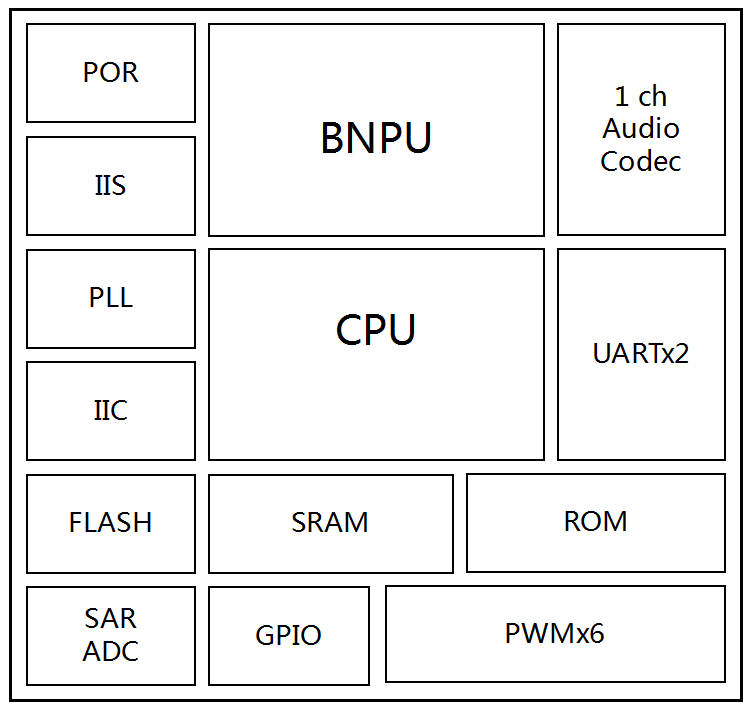
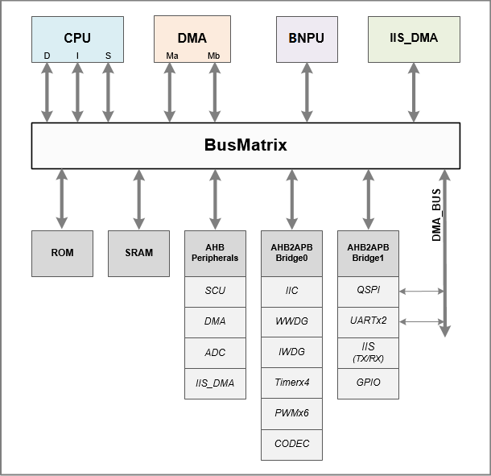
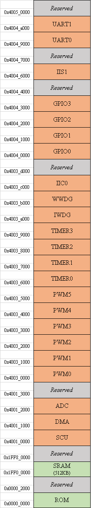

# 系统描述

CI1122芯片系统框图如图3所示，其内部由多个模块组成，包含脑神经网络处理器BNPU等，下面分别针对各个模块进行描述。

{: .center }

图3  CI1122系统框图

## 系统架构

芯片系统包含了BNPU、CPU、ROM、SRAM、DMA和各类外设接口。各功能模块通过支持多核并行处理架构的总线进行通信和控制，其架构如图4所示。

{: .center }

图4  CI1122系统架构

## 寄存器映射

芯片寄存器映射如图5所示，内部ROM起始地址从0x00000000开始，共4Mbyte；SRAM起始地址从0x1FF00000开始到0x1FF7FFFF结束，共512Kbyte。其余是各外设接口的起始地址。

{: .center }

图5  CI1122寄存器映射

## 启动模式配置

芯片有两种启动模式，一种为上电后从芯片内部的ROM启动，该模式为正常工作的模式；另一种为上电后从芯片内部的SRAM启动，该模式主要用于将代码下载到SRAM中运行的调试模式。

两种启动模式通过芯片的BOOT_SEL功能引脚（与芯片IIS1_SDO引脚复用）进行区分。在芯片复位阶段，将BOOT_SEL引脚置为0，为ROM启动；置为1，为SRAM启动。当芯片配置为SRAM启动时，需要提前将代码下载到SRAM中，进入调试模式后，芯片内部的SRAM会自动映射到0x00000000地址，CPU会直接从SRAM中进行取指访问。

表3 芯片启动模式配置

启动模式选择引脚（BOOT_SEL）上电时电平 | 启动模式 | 说明
:--: | :--: | :--:
0 | ROM | 正常启动，内部ROM作为启动区域
1 | SRAM | 调试模式，内部SRAM作为启动区域

## 中断

芯片集成了内核中断控制器，可进行高效的中断处理。该控制器功能描述如下：

* 支持软件中断、计时器中断和外部中断；
* 32路可编程外部中断；
* 3 bits中断优先级配置，即8个优先级等级；
* 支持软件动态可编程修改中断级别和中断优先级的数值；
* 支持基于中断级别的中断嵌套；
* 支持快速向量中断处理机制；
* 支持快速中断咬尾机制；
* 支持 NMI（Non-Maskable Interrupt）。

中断向量表如下表所示，发生相应中断后，CPU会从对应的中断入口地址执行指令。

表4 芯片中断向量表

IRQ号 | 中断源 | 说明 | 向量编译
:--: | :--: | :--: | :--:
0 | INT_WWDG | 窗口watchdog中断 | 0x40
1 | INT_IWDG | 指令watchdog中断 | 0x44
2 | Reserved | 保留 | 0x48
3 | Reserved | 保留 | 0x4C
4 | Reserved | 保留 | 0x50
5 | INT_ADC | ADC控制器中断 | 0x54
6 | INT_DMA | 系统DMA中断 | 0x58
7 | INT_IIS_DMA | IIS DMA中断 | 0x5C
8 | INT_SCU | SCU中断 | 0x60
9 | INT_EXT0 | 外部中断0 | 0x64
10 | INT_EXT1 | 外部中断1 | 0x68
11 | INT_TIMER0 | 定时器0中断 | 0x6C
12 | INT_TIMER1 | 定时器1中断 | 0x70
13 | INT_TIMER2 | 定时器2中断 | 0x74
14 | INT_TIMER3 | 定时器3中断 | 0x78
15 | INT_UART0 | UART0中断 | 0x7C
16 | INT_UART1 | UART1中断 | 0x80
17 | INT_IIC0 | IIC0中断 | 0x84
18 | INT_GPIO0 | GPIO0中断 | 0x88
19 | INT_GPIO1 | GPIO1中断 | 0x8C
20 | INT_GPIO2 | GPIO2中断 | 0x90
21 | INT_GPIO3 | GPIO3中断 | 0x94
22 | INT_GPIO4 | GPIO4中断 | 0x98
23 | INT_IIS1 | IIS1中断 | 0x9C

