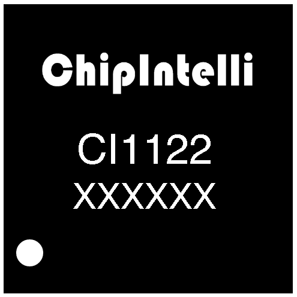
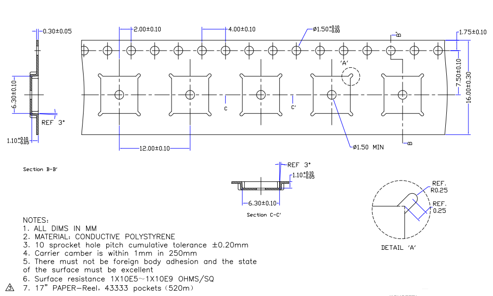
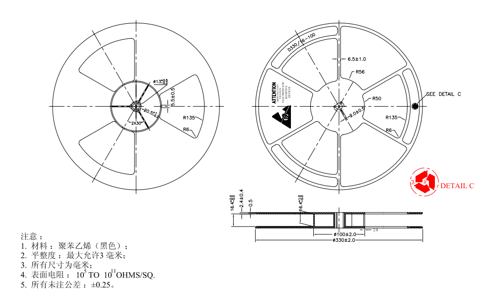

# 芯片订购信息

ChipIntelli：Logo

CI1122：product part number

XXXXXX：internal control code

* ：pin 1

上图是芯片的Logo及Pin 1说明，订购信息和包装说明如下所示。

表21 CI1122订购信息表

IC Model | Batch Number | Packaging Dimensions | Packing
:--: | :--: | :--: | :--:
CI1122 | XXXXXX | QFN48L(6mm*6mm*0.85mm) | Tape & Reel

{: .center }
{: .center }