# 回声消除使用说明

***

回声消除(Acoustic Echo Cancellation，简称AEC)用于在有参考声源信号的情况下，自适应追踪回声路径的变换，实时抑制扬声器到达麦克风终端的回声信号，以提升目标语音的识别效果。AEC的应用原理示意框图如下，参考声源信号经过喇叭产生播放信号B，人声为目标语音信号A，当播放声音时，信号B和信号A在应用环境进行复杂的混合后进入芯片，AEC算法根据参考声源信号和混合后的信号，抑制信号B，提高信号A的信噪比，再进入语音识别引擎，从而提升识别效果。

  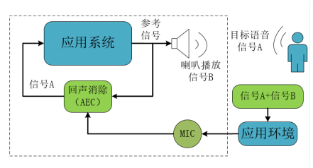{: .center }

  <div align=center>图1-1 AEC应用原理示意框图</div>

AEC参考声源信号有以下两种来源方式：

* 参考来源于语音模组本身的喇叭播放，这种应用简称内部AEC；
* 参考来源于外部其他播放器的喇叭声音播放，这种应用简称外部AEC。

用户在应用中可以根据实际场景评估是否开启AEC功能，如需要在播放音频媒体资源时（例如音箱播放MP3歌曲）要进行语音识别打断，则需要开启该功能。AEC功能开启后，需要额外占用芯片中40KB的代码空间，并且会占用一定CPU资源，会降低CI110X支持的最大命令词条数量。

**下面介绍一些回声消除相关的配置和操作：**

***

## 1. **SDK中AEC功能的默认配置和对应硬件板**

所有CI110X的SDK都带AEC功能，但不同SDK中，该功能的默认打开状态是不一样的，同时该功能的实现也需要硬件的支持，具体为：

* 纯离线SDK：CI110X_SDK_ASR_OfflineV1.2及以上版本，AEC功能默认关闭，可配置为打开。该SDK可用于启英泰伦提供的CIB02GS01/ CIB03GS01/CIB02CS01/CIB03CS01等模组板，或用户自行开发的带AEC参考线路的模组板，具体硬件选型可咨询启英泰伦技术支持人员；
* 算法SDK：CI110X_SDK_ALG_Application_V1.0及以上版本，AEC功能默认关闭，可配置为打开。 该SDK可用于启英泰伦提供的CIB02GS01/ CIB03GS01/CIB02CS01/CIB03CS01等模组板，或用户自行开发的带AEC参考线路的模组板，具体硬件选型可咨询启英泰伦技术支持人员；
* 离在线SDK：CI110X_SDK_Combine_Cloud_V1.5及以上版本，AEC功能默认打开，可配置为关闭。该SDK可用于启英泰伦提供的CIB03ST01J-WL21等离在线模组板，或用户自行开发的带AEC参考线路的模组板，具体硬件选型可咨询启英泰伦技术支持人员。

另如果用户需要测试AEC效果，还需要准备录音板（该录音板可在启英泰伦官网中的启英商城中购买）。用该录音板可以实现直接观察AEC的效果，用于调试。录音板的使用方法请参考语音AI平台中的《CI110X模组底噪录音分析》文档。

***

## 2. **内部AEC使用介绍**

 **内部AEC的硬件处理方法如下：**

* 内部AEC只支持单麦方式，通过CI110X芯片的另外一路未使用的麦克风通道作为AEC反馈信号输入通道；
* 功放推荐采用AB类功放（如SMG4890），用户如果采用D类功放，则需要增加滤波线路（参考下文中外部AEC消除中的D类功放滤波线路）；
* AEC反馈信号为模拟信号，该反馈信号电压幅度一般为300mV~2.9V，需进行电阻分压后再输入到芯片未使用的麦克风通道中，下图为一个参考硬件线路图；

  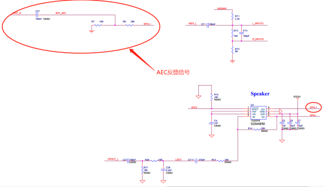{: .center }

  <div align=center>图2-1 内部AEC参考硬件线路图</div>

* 用户如采用立体声双声道做声音输出，需要将两个声道混音为一路后再按照上述硬件连接方法作AEC处理。

**内部AEC的软件设置方法如下：**

打开SDK包中的user_config.h 文件，该文件路径为 \工程名称（如\sample\internal\sample_light）\src\user_config.h。

在该文件中找到USE_SINGLE_MIC_AEC 宏定义，按照下面进行配置就可以打开或关闭AEC。

```c
打开AEC：

#define USE_SINGLE_MIC_AEC         1

关闭AEC：

#define USE_SINGLE_MIC_AEC         0
```

***

## 3. **外部AEC使用介绍**

外部AEC应用中，如果外部参考声源信号是模拟信号，可以从芯片上未使用的麦克风通道以模拟信号的方式进行输入；如果外部参考声源信号是数字信号，可以从芯片上的IIS接口输入，以下从参考声源信号分类分别说明如何应用。

**外部AEC且参考声源信号为模拟信号时的硬件处理方法如下：**

* 只能用于单麦识别方案，外部参考声源模拟信号通过CI110X芯片的另外一路未使用的麦克风通道作为输入通道；
* 该反馈信号电压幅度一般为300mV~2.9V，需进行电阻分压后再输入到芯片未使用的麦克风通道中，功放推荐采用AB类功放（如SMG4890），下图为一个参考硬件线路图；

  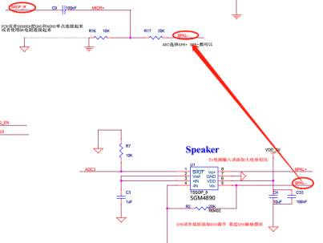{: .center }

  <div align=center>图3-1 外部AEC参考信号为模拟信号时硬件线路图</div>

* 如果用户采用D类功放，当D类功放时延不高并且无EQ调整时，可以从功放前端将输入的模拟信号作为参考声源信号，下图为一个参考硬件线路图。如果从D类功放后端采集参考信号，则需要外加codec芯片，将该参考信号转为数字信号输入到主芯片；

  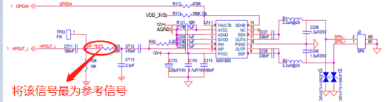{: .center }

  <div align=center>图3-2 功放前端输入模拟信号作为参考时硬件线路图</div>

* 用户如采用立体声双声道做声音输出，需要将两个声道混音为一路后再按照上述硬件连接方法作AEC处理。

**外部AEC且参考声源信号为模拟信号的软件设置方法如下：**

要打开AEC功能时，请打开SDK包中的user_config.h 文件，该文件路径为 \工程名称（如\sample\internal\sample_light）\src\user_config.h。先在该文件中，将USE_SINGLE_MIC_AEC设为1，如下：

```c
#define USE_SINGLE_MIC_AEC         1
```

同时，在同一个user_config.h文件中，添加：

```c
#define AUDIO_CAPTURE_USE_MULTI_CODEC   0（此宏在platform\sdk_default_config.h默认定义为0）
```

外部AEC使用时还需要将外部播放器的状态同步给SDK中的AEC模块，该同步可以通过CI110X芯片的GPIO口来完成，设置方法举例如下：

在  \工程名称（如\sample\internal\sample_light）\src\system_msg_deal.c 中，找到check_current_playing() 函数，该函数为AEC模块获取播放状态的函数。用户可以在外部播放器播放音乐的时候将某个GPIO口（如GPIO2的pin7）拉高，停止播放的时候将该GPIO口拉低，例程如下：

```c
bool check_current_playing(void)
{
  if(gpio_get_input_level_single(GPIO2, gpio_pin_7)==1)  //当为高时表示外部播放器正在播放
  {
​    return true;
  }
  else
  {
​    return false;
  }
}
```

完成上述代码后，SDK内部的AEC模块工作时可以和外部声源信号对应，以达到AEC的效果。

**外部AEC且参考声源信号为数字信号时的硬件处理方法如下：**

* 该方法用于双麦克风方案，外部声源参考信号通过IIS通道作为AEC反馈信号输入通道，数字信号需为标准IIS信号，位宽16bits，16KHz采样率；
* 采用AB类功放的方案，可以采用外部单端输入ADC芯片（如顺芯ES7241） 作为参考声源信号的模数转换，转换为数字信号输入给主芯片，参考声源信号的ADC采样范围建议为300mV~2.9V，如下图所示；

  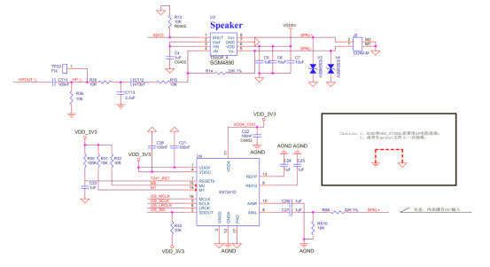{: .center }

  <div align=center>图3-3 外部AEC参考声源信号为数字信号采用AB类功放的方案</div>

* 采用D类功放（如AD51050）的方案，可以采用外部差分输入ADC芯片 （如顺芯ES7243） 作为参考声源信号的模数转换，转换为数字信号输入给主芯片，参考信号的adc采样范围建议300mV~2.9V，如下图所示；

  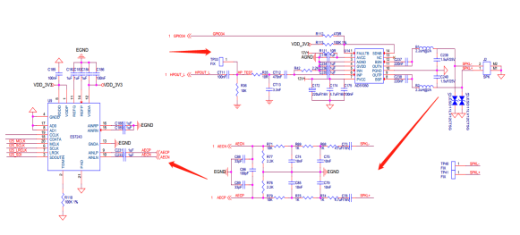{: .center }

  <div align=center>图3-4 外部AEC参考声源信号为数字信号采用D类功放方案</div>

* 用户如采用立体声双声道做声音输出，需要将两个声道混音为一路后再按照上述硬件连接方法作AEC处理。。

**外部AEC且参考声源信号为数字信号的软件设置方法如下：**

要打开AEC功能时，请打开SDK包中的user_config.h 文件，该文件路径为 \工程名称（如\sample\internal\sample_light）\src\user_config.h。先在该文件中，将USE_SINGLE_MIC_AEC设为1，如下：

```c
#define USE_SINGLE_MIC_AEC         1
```

同时，在同一个user_config.h文件中，添加：

```c
#define AUDIO_CAPTURE_USE_MULTI_CODEC   1（此宏在platform\sdk_default_config.h默认定义为0，此处设为1表明使用了另外的CODEC）
```

外部AEC使用时还需要将外部播放器的状态同步给SDK中的AEC模块，该同步可以通过CI110X芯片的GPIO口来完成，设置方法举例如下：

在  \工程名称（如\sample\internal\sample_light）\src\system_msg_deal.c 中，找到check_current_playing() 函数，该函数为AEC模块获取播放状态的函数。用户可以在外部播放器播放音乐的时候将某个GPIO口（如GPIO2的pin7）拉高，停止播放的时候将该GPIO口拉低，例程如下：

```c
bool check_current_playing(void)
{
  if(gpio_get_input_level_single(GPIO2, gpio_pin_7)==1)  //当为高时表示外部播放器正在播放
  {
​    return true;
  }
  else
  {
​    return false;
  }
}
```

完成上述代码后，SDK内部的AEC模块工作时可以和外部声源信号对应，以达到AEC的效果。

***

## 4. **应用中注意事项**

* AEC的参考模拟信号为模拟小信号，容易受到干扰，需要特别注意layout的时候参考信号的干净程度。设计时参考模拟信号尽量包地和远离高频信号。如电路设计存在问题，通常会在采集信号或麦克风信号中引入不良信号，如脉冲、杂波、混叠等，会导致丢数据情况出现，影响效果。  

  建议出现该情况时应首先修改硬件电路设计，保证电路信号干净后，再进行声学测试，参考信号受到干扰对AEC效果影响非常明显。

* 应避免采集到的模拟信号被截幅，注意调整分压电阻控制采集到的参考信号的幅值范围保持在2000-20000采样值范围内。

  建议应用前先驱动扬声器在最大音量下播放满幅扫频信号，要求扬声器不能出现破音、共振等现象，麦克风采集的信号及参考信号不出现截幅现象。喇叭音量过大会导致失真更严重，在实际应用中需要选择合适的音量范围保障喇叭不失真。

* 应避免出现谐波失真现象，该现象是系统不完全线性造成的。在整个音频通路中，造成信号谐波失真影响因素有：扬声器单体的失真曲线、扬声器后腔结构设计、喇叭前网罩、麦克风收音孔结构等；这些都会造成麦克风信号的失真度增加。麦克风信号失真越大，麦克风信号和回采信号的相似度越差，回声消除的性能越差。喇叭的频响在200~4KHz范围内一致性太差，结构存在共振情况，都会影响AEC效果。

  建议尽量不要用微型扬声器、超薄扬声器等共振频率较高的扬声器单元，该类单体低频失真大；扬声器后腔结构允许的话，加被动辐射器或导向管设计，可以增加低频，同时减小喇叭的非线性振动。

* AEC一般选择从功放后端采集参考信号，这样的信号最接近喇叭的真实声音。当功放无延迟的情况可以用功放前端信号作为参考，功放有延迟（尤其有些自带EQ的功放）的时候，建议从功放后端取参考信号。如果从功放后端引出信号，注意功放的输出范围不要超过ADC采样范围。

* 在家用电器或机器人等产品设备中，风扇噪声和电机噪声引入的变量会导致麦克信号的底噪特别大，识别效果受较大影响。

  建议在该类设备中，要特别注意内部风扇、电机与麦克风的距离，如结构空间允许，可对麦克风单独做密封处理，防止内部传音。

* 要考虑麦克风与喇叭的位置关系。原则上在结构空间允许的条件下，麦克风需尽可能的远离喇叭位置，麦克风不超出喇叭朝向所在水平面，麦克风离喇叭越近，信噪比越低，麦克风失真的可能性越大，考虑结构大小建议麦克风离喇叭10cm左右，麦克风与喇叭的位置关系左右上下对AEC处理效果影响不大。

  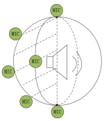{: .center }

  <div align=center>图4-1 麦克风与喇叭的位置</div>

***

## 5. **调试效果的方法**

* 为了更直观的观察AEC的效果，可以借助录音板进行调试，录音板的使用请参考语音AI平台上的《CI110X模组底噪录音分析》文档。

* 在SDK \components\audio_in_manage\alg_preprocess.c文件中，alg_preprocess_two_ch()函数或alg_preprocess_four_ch_single_aec()函数调用的

  audio_pre_rslt_write_data(  (int16_t*)dst, (int16_t*)micl )函数为IIS输出的数据内容，开启后，录音板可以从IIS接口录制到声音，该函数说明如下：

  audio_pre_rslt_write_data函数中第一个参数为IIS输出的右声道的数据，第二个参数为IIS输出的左声道的数据，可以填写以下参数：

  dst：输出算法处理结果的数据

  Ref：输出原始获取到的参考声音

  Micl：输出麦克风左声道获取到的原始声音

  MicR：输出麦克风右声道获取到的原始声音

  例如，当设置为：audio_pre_rslt_write_data(  (int16_t*)dst, (int16_t*)micl )时，意思为右声道输出算法处理后的结果（AEC算法），左声道为原始的麦克风左声道的数据。

* 下图为录音板采音时域效果，该图上可以看到原始的左声道数据（上半图）为目标语音和喇叭播放声音的混合，经过aec算法处理后，抑制喇叭播放的声音，提高目标语音的信噪比，如下图中右声道数据（下半图）所示。

  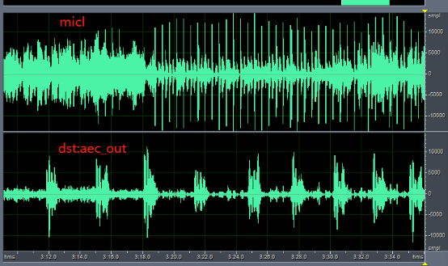{: .center }

  <div align=center>图5-1 录音板采音时域效果</div>

* 下面为同样该音频的频域显示，该结果为正常结果。

  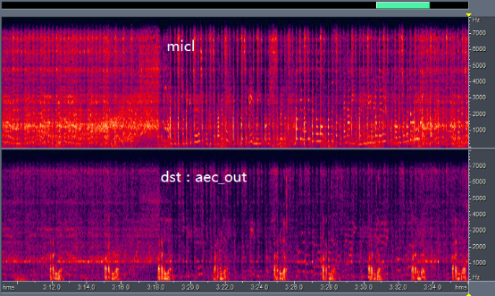{: .center }

  <div align=center>图5-2 音频的频域显示</div>

* 设置IIS输出参数为audio_pre_rslt_write_data((int16_t*)ref, (int16_t*)micl )时，输出参考信号数据和麦克风左声道采音数据，如下图，图中可以看到当有播放的时候参考信号有数据，无播放的时候，参考信号非常小接近为0。

  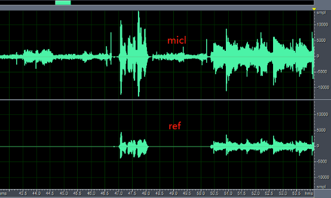{: .center }

  <div align=center>图5-3 参考信号数据和麦克风左声道采音数据</div>

* 下图为同样声音的频域显示：

  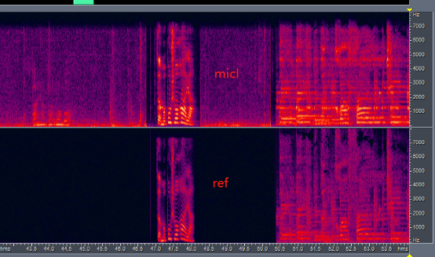{: .center }

  <div align=center>图5-4 声音的频域显示</div>

!!! note "注意"
         尽量保证参考信号和麦克风信号不削顶失真，不能过小，幅值上参考尽量满足平均在2000-20000采样值范围内。

* 通常喇叭都会有一定的失真，音量接近喇叭播放极限的时候，会加剧失真度，尽量在使用的时候，使喇叭工作在失真范围小的幅度，不同喇叭会有不同固定自带的失真干扰。

  选择喇叭也需要选择失真小的喇叭，参考下图，下图为4个喇叭播放的声音的情况，图中可以看到，有些喇叭的在不同的频段上失真比较大，如下图的后面三个，这些不同频段的语音失真，会严重影响AEC效果，尽量不用采用这种喇叭。下图中第一个喇叭的频响比较好。

  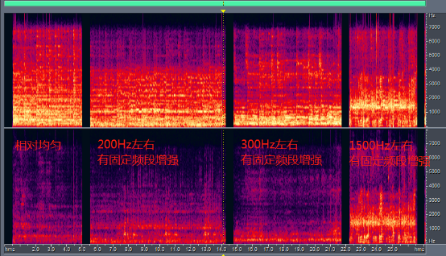{: .center }

  <div align=center>图5-5 4个喇叭播放的声音的情况</div>

  喇叭使用的时候，要避免喇叭声音过大导致的麦克风信号削顶。

  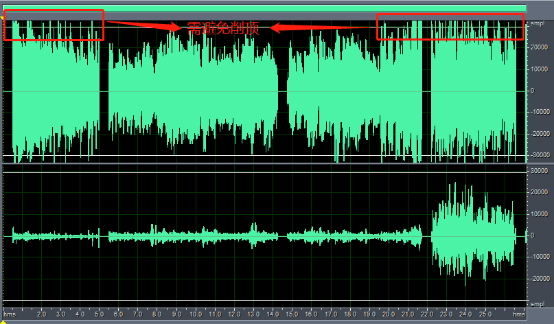{: .center }

  <div align=center>图5-6 避免麦克风信号削顶</div>
