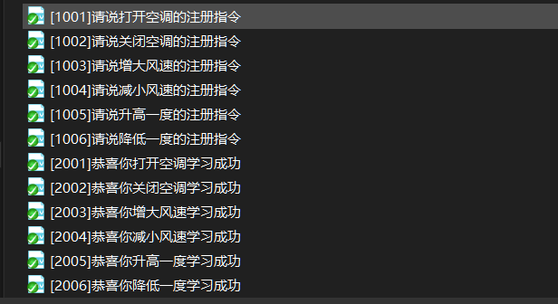
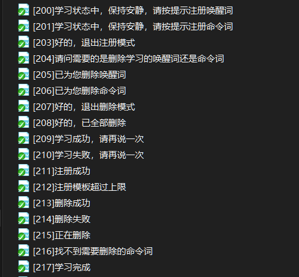

# 离线命令词自学习使用说明

***

## 1. 内容概述

​     本文档主要对CI1103芯片的算法SDK（CI110X_SDK_ALG_Application）中离线命令词自学习工程进行说明。内容包括离线命令词自学习的概念、场景、使用说明、调试以及注意事项。

***

## 2. 离线命令词自学习基本概念

​     在非联网状态，用户通过语音对话的方式，更改默认的命令词；该种更改方式满足终端用户的个性化自定义的需求，可以给客户带来更好的用户体验。

***

## 3. 离线命令词自学习适用场景

​	本方案适用于各种语音控制相关的智能家电，家居等产品，实现用户离线自定义命令词。

***

## 4. 离线命令词自学习工程说明

   CI110X_SDK_ALG_Application里面增加了命令词自学习的demo,工程名称sample_cwsl 。编译下载后，即可进行使用。

!!! important  "注意"
	离线命令词自学习的功能仅CI1103芯片支持，CI1102芯片不支持该功能。

***

## 5. 离线命令词自学习使用说明
  离线命令词自学习底层代码在CI110X_SDK_ALG_Application\components\ci_cwsl\下，应用层代码在CI110X_SDK_ALG_Application\sample\internal\sample_cwsl\src\下，相关函数都有详细的注释,本文列出部分重要函数

```c
/**
 * @brief 命令词自学习消息队列创建接口函数
 * @param 无
 * @return 无
 */
void Creat_CWSLQueue_port(void)
{
#if USE_CWSL
    CreatCWSLQueue();
#endif
}
```

```c
/**
 * @brief 命令词自学习任务创建接口函数
 * @param 无
 * @return 无
 */
void Creat_CWSLTask_port(void)
{
#if USE_CWSL
    set_cwsl_vad_alc_config(1);
    xTaskCreate(vTask_CWSL, "vTaskCWSL", 256, NULL, 4, NULL); 
    //新增user_CWSL_registration_process_vTask 命令词自学习应用层注册流程
    xTaskCreate(user_CWSL_registration_process_vTask, "user_CWSl", 256, NULL, 4, NULL);
    //新增vTask_CWSL_ASR 命令词自学习应用层识别流程
    xTaskCreate(vTask_CWSL_ASR, "vTask_CWSL_ASR", 256, NULL, 4, NULL); 
#endif
}
```

```c
/**
 * @brief 用户注册逻辑示例函数
 * @param cmd_id 需要注册的命令词ID
 * @return 0 数据无效,1 数据有效，且进行播报,2 数据有效，屏蔽播报
 */
uint16_t user_deal_cwsl_registration_process_wakeup(uint16_t *cmd_id);
```

```c
/**
 * @brief 发送注册命令词ID，并且系统进入注册模式
 * @param cmd_id 需要注册的命令词ID
 */
int send_regword_cmd_id(uint16_t cmd_id);
```

```c
/**
 * @brief 命令词删除模式用户逻辑处理示例函数
 * @param asr_msg ASR识别结果消息
 * @param index 命令词ID
 * @return 0 数据无效,1 数据有效，且进行播报,2 数据有效，屏蔽播报
 */
uint16_t user_deal_cwsl_delete_process(sys_msg_asr_status_t asr_status, uint16_t *index);
```

```c
/**
 * @brief 发送删除命令词信息
 * @attention 该函数用于切换命令词自学习功能模式为删除模式
 * @param cmd_id 需要删除命令词注册ID
 * @return 无
 */
void send_delete_msg(uint16_t cmd_id);
```

### 5.1. 离线命令词自学习相关宏定义

在CI110X_SDK_ALG_Application\sample\internal\sample_cwsl\src文件下，打开user_config.h文件。

```c
#define USE_CWSL        1 //1打开离线命令词自学习，0：关闭离线命令词自学习
```

!!! important  "说明"
	工程默认开启离线命令词自学习。

```c
#define CICWSL_TOTAL_TEMPLATE 5//离线命令词自学习可存储模板数量，默认5个
```

!!! important  "说明"
	离线命令词自学习的模板存放在NVDATA区域，一个命令词模板大小占4KB，目前测试模板最大个数为10个。请根据实际项目需求进行配置个数，不能超过NVDATA区的总的大小。

### 5.2. 离线命令词自学习唤醒词和命令词个数配置

在CI110X_SDK_ALG_Application\components\ci_cwsl\下，打开ci_cwsl_port.h文件。

```c
#define CWSL_WAKEUP_NUMBER  1//唤醒词个数
#define CWSL_CMD_NUMBER     ((sizeof(cwsL_reg_buff)/sizeof(cwsL_reg_buff[0])))//命令词个数
#define WAKE_UP_ID          1 //要注册的唤醒词ID
```

### 5.3. 离线命令词自学习命令词学习播报音配置

* **配置cwsL_reg_buff结构体数组**

  在CI110X_SDK_ALG_Application\components\ci_cwsl\下，打开ci_cwsl_port.c文件。

```c
//左边一列表示的是要学习的命令词ID,右边一列表示需要播报的ID
cwsl_reg_asr_struct_t cwsL_reg_buff[]=
{
    {2,1001},
    {5,1002},
    {25,1003},
    {27,1004},
    {31,1005},
    {40,1006},
    {43,1007},
    {45,1008},
};
```

* **配置命令词列表**

  在SDK\sample\internal\sample_cwsl\firmware\user_file\cmd_info\下，打开[60000]{xxxx}cmd_info.xls文件。

| 命令词                                                   | 命令词ID | 命令词语义ID | 置信度 | 唤醒词 | 组合词 | 期望词 | 不期望词 | 特殊词计数 | 播报音类型 | 播报音1ID | 播报音2ID |
| -------------------------------------------------------- | -------- | ------------ | ------ | ------ | ------ | ------ | -------- | ---------- | ---------- | --------- | --------- |
| [1001]请说打开空调的注册指令[2001]恭喜你打开空调学习成功 | 1001     | 0x00         | 27     | NO     | NO     | NO     | NO       | 0          | 自定义     | 1001      | 2001      |
| [1002]请说关闭空调的注册指令[2002]恭喜你关闭空调学习成功 | 1002     | 0x00         | 27     | NO     | NO     | NO     | NO       | 0          | 自定义     | 1002      | 2002      |
| [1003]请说增大风速的注册指令[2003]恭喜你增大风速学习成功 | 1003     | 0x00         | 27     | NO     | NO     | NO     | NO       | 0          | 自定义     | 1003      | 2003      |
| [1004]请说减小风速的注册指令[2004]恭喜你减小风速学习成功 | 1004     | 0x00         | 27     | NO     | NO     | NO     | NO       | 0          | 自定义     | 1004      | 2004      |
| [1005]请说升高一度的注册指令[2005]恭喜你升高一度学习成功 | 1005     | 0x00         | 27     | NO     | NO     | NO     | NO       | 0          | 自定义     | 1005      | 2005      |
| [1006]请说降低一度的注册指令[2006]恭喜你降低一度学习成功 | 1006     | 0x00         | 27     | NO     | NO     | NO     | NO       | 0          | 自定义     | 1006      | 2006      |

* **增加对应的播报音**

  添加到SDK\sample\internal\sample_cwsl\firmware\voice\xxx[0]文件夹下

  可根据自己需要注册的命令词（可对应cwsL_reg_buff结构体数组制定ID的命令词字串），修改播报音的内容

  {: .center }

  <div align=center>图5-1 修改播报音的内容</div>

### 5.4. 离线命令词自学习模版保存

开启命令词自学习后，在cinv_init函数里有如下代码：

```c
/* 如果开启了命令词自学习（USE_CWSL定义为1），则从nvdata size里划出用了存CWSL模板的空间 */ 
#if USE_CWSL
if(size>(get_cwsl_template_size()*CICWSL_TOTAL_TEMPLATE))
{
    size -= get_cwsl_template_size()*CICWSL_TOTAL_TEMPLATE;
	cwsl_flash_addr = flash_addr+size;
}
else
{
	/*nvdata 空间不足，进入断言*/
	CI_ASSERT(0,"nvdata size too small\n");
 }
#endif

```

### 5.5. 离线命令词自学习默认命令词

目前命令词自学习的demo针对唤醒词/命令词做了一套标准流程。如果用户需要使用命令词自学习功能，需要更新ASR(语言模型)、命令词表格和播报音。具体方法如下：

* **ASR（语言模型）新增命令词列表：**

  学习唤醒词

  学习命令词

  重新注册

  退出注册

  我要删除

  删除命令词

  删除唤醒词

  退出删除

  全部删除

* **命令词表格增加的命令词：**

| 学习唤醒词 | 200  | 0x00 | 27   | NO   | NO   | NO   | NO   | 0    | 自定义 | 200  |      |
| ---------- | ---- | ---- | ---- | ---- | ---- | ---- | ---- | ---- | ------ | ---- | ---- |
| 学习命令词 | 201  | 0x00 | 27   | NO   | NO   | NO   | NO   | 0    | 自定义 | 201  |      |
| 重新注册   | 202  | 0x00 | 27   | NO   | NO   | NO   | NO   | 0    | 自定义 | 200  | 201  |
| 退出注册   | 203  | 0x00 | 27   | NO   | NO   | NO   | NO   | 0    | 自定义 | 203  |      |
| 我要删除   | 204  | 0x00 | 27   | NO   | NO   | NO   | NO   | 0    | 自定义 | 204  |      |
| 删除唤醒词 | 205  | 0x00 | 27   | NO   | NO   | NO   | NO   | 0    | 自定义 | 205  |      |
| 删除命令词 | 206  | 0x00 | 27   | NO   | NO   | NO   | NO   | 0    | 自定义 | 206  |      |
| 退出删除   | 207  | 0x00 | 27   | NO   | NO   | NO   | NO   | 0    | 自定义 | 207  |      |
| 全部删除   | 208  | 0x00 | 27   | NO   | NO   | NO   | NO   | 0    | 自定义 | 208  |      |

如果对sdk\sample\internal\sample_cwsl\firmware\user_file\cmd_info\下的命令词列表中命令词ID进行修改，还需要将sdk\components\ci_cwsl\ci_cwsl_port.h文件中枚举cicwsl_func_index进行修改；枚举如下：

```c
typedef enum
{
    CWSL_REGISTRATION_WAKE          = 200,      ///< 命令词：学习唤醒词
    CWSL_REGISTRATION_CMD           = 201,      ///< 命令词：学习命令词
    CWSL_REGISTER_AGAIN             = 202,      ///< 命令词：重新注册
    CWSL_EXIT_REGISTRATION          = 203,      ///< 命令词：退出注册
    CWSL_DELETE_FUNC                = 204,      ///< 命令词：我要删除
    CWSL_DELETE_WAKE                = 205,      ///< 命令词：删除唤醒词
    CWSL_DELETE_CMD                 = 206,      ///< 命令词：删除命令词
    CWSL_EXIT_DELETE                = 207,      ///< 命令词：退出删除模式
    CWSL_DELETE_ALL                 = 208,      ///< 命令词：全部删除

    CWSL_DATA_ENTERY_SUCCESSFUL     = 209,      ///< 播报：录入成功
    CWSL_DATA_ENTERY_FAILED         = 210,      ///< 播报：录入失败
    CWSL_REGISTRATION_SUCCESSFUL    = 211,      ///< 播报：注册成功
    CWSL_TEMPLATE_FULL              = 212,      ///< 播报：注册模板超过上限

    CWSL_DELETE_SUCCESSFUL          = 213,      ///< 播报：删除成功
    CWSL_DELETE_FAILED              = 214,      ///< 播报：删除失败
    CWSL_DELETING                   = 215,      ///< 播报：删除中
    CWSL_DONT_FIND_WORD             = 216,      ///< 播报：找不到删除的词
    CWSL_REGISTRATION_ALL           = 217,      ///< 播报：学习完成

}cicwsl_func_index;
```

* **需要增加播报音：**

  {: .center }

  <div align=center>图5-2 添加注册流程的播报音</div>

### 5.6. 离线命令词自学习使用步骤

* **注册功能：**

  唤醒词注册：

  ​	系统唤醒状态下（标准demo唤醒词为“智能管家”），用户通过念命令词“学习唤醒词”进入注册模式。根据播报语音提示，念三次自定义的命令词完成注册。注册过程中，模型根据录入的三次自定义语音实现特征提取和学习，幷为该命令词创建特征模板并保存。注册完成后，语音播报“注册成功”。识别时，用户念自定义命令词，模型将该词的语音特征与存储空间中的各个注册模板进行相似度比较，将相似度高的注册模板与当前语音进行匹配，认为当前语音为匹配的注册命令词，从而完成识别进行相关命令词操作。

  命令词注册：

  ​	系统唤醒状态下（标准demo唤醒词为“智能管家”），用户通过念命令词“学习命令词”进入注册模式。根据播报语音提示，念三次自定义的命令词后，完成本次的命令词注册，同时系统会提升用户继续注册下一个命令词，直到用户定义的命令词全部学习完成。在注册命令词过程中，支持退出注册，系统会保存已经注册成功的命令词。

* **重新注册功能：**

  进入注册模式后，用户可以念命令词“重新注册”重新对本次注册的词进行重新注册。

* **退出注册功能：**

   进入注册模式后，用户可以念命令词“退出注册”退出注册模式。

* **删除功能：**

  用户通过念命令词“我要删除”进入删除模式，进入删除模式后，支持三种模式进行删除。

  模式一：全部删除，系统删除所有注册的命令词。

  模式二：删除唤醒词，系统删除注册的所有唤醒词。

  模式三：删除命令词，系统删除注册的所有命令词。

* **退出删除功能：**

  处于删除模式下，用户可以念命令词“退出删除”退出删除模式。

### 5.7. 离线命令词自学习调试

* 唤醒系统后（标准demo唤醒词为“智能管家”），用户说命令词“我要注册”，系统进入注册模式，系统播报内容“欢迎使用注册功能，请根据提示念命令词3遍”，Debug打印如下：

send result:学习唤醒词 41
进入注册模式，需要替换命令词为reg_index = 1
asr cmd_id:206,semantic_id:00000000
play start
play end

* 如果录入失败，系统播报“录入失败请重新录入”，Debug打印会有多种：

（1）录入失败打印一：

-- disturb voice!

asr cmd_id:208,semantic_id:00000000

play start

play end

原因：语音太短，有效语音长度小于700ms。

（2）录入失败打印二：

registration failed, distance is greater than the threshold

asr cmd_id:208,semantic_id:00000000

play start

play end

原因：注册的语音不一致。

* 如果用户需要重新注册，系统播报“欢迎使用注册功能，请根据提示念命令词3遍”，Debug打印如下：

send result:重新注册 44

进入注册模式，需要替换命令词为reg_index = 1 

asr cmd_id:206,semantic_id:00000000

play start

play end

* 注册成功后,系统播报“恭喜你，注册成功”，Debug打印如下：

注册成功

asr cmd_id:209,semantic_id:00000000

play start

play end

### 5.8. 离线命令词自学习注册要求以及注意事项

#### 5.8.1. 注册要求

* **注册必须在安静环境下、正常语速、声音洪亮、距离1米内**。

* **注册的词字数为3到5个**。

* **如果多次注册失败，需重新注册命令词**。

#### 5.8.2. 注意事项

* **固件制作时必须使用特定的语言模型，使用CWLS文件下的任意.dat文件**

***

## 6. 离线命令词自学习Q&A

Q1：如何进入注册模式？

A1：唤醒后（标准demo的唤醒词为“智能管家”），念命令词“学习唤醒词”或者“学习命令词”就可以进入注册模式。

Q2：如何退出注册模式？

A2：退出方式有两种，第一种用户主动退出，唤醒后，进入注册模式后，通过念命令词”退出注册“可以退出注册模式。第二种：每次注册成功后，系统自动退出注册模式，进行识别模式。

Q3：如果多次注册失败怎么处理？

A3：唤醒进入注册模式后，需要念3次注册的语音。原因一：可能是第一次注册时，周围有噪音干扰，导致后续注册不成功，用户可以在安静环境下，念命令词“重新注册”就可解决。原因二：注册的语音太短或者太长，建议3~5个字，正常语速注册。原因三：语言模型（ASR）不正确，参考下述问题5进行解决。

Q4：如果进入注册模式，念语音无任何反馈，怎么处理？

A4：原因一：可能是声音太小了，注册时提高了VAD的阈值，解决方式：保持和设备的距离在1米内，声音洪亮进行注册。原因二：系统退出唤醒状态了，解决方式：唤醒后重新进入注册模式就可解决。

Q5：为什么自己在平台制作的模型，使用命令词自学习效果不好？

A5：命令词自学习需要特定的语言模型，平台作词下载后，请使用CWSL文件夹下任意.dat文件


 
