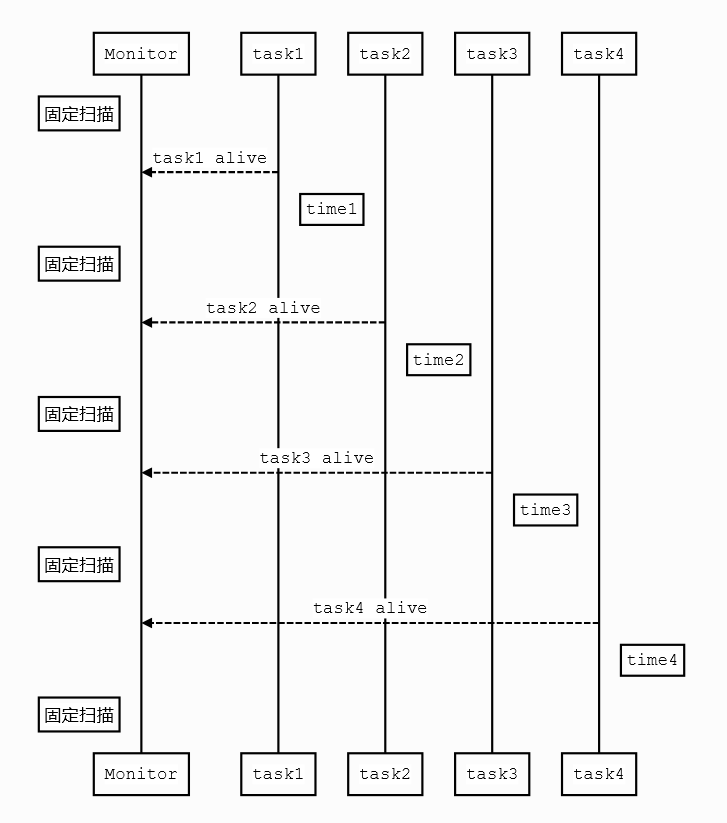

# 系统监控(SYS MONITOR)

***

## 1. 概述

SDK内置组件系统监控是系统内尤为重要的一个组件，它负责监视控制加入监控队列里的每一个任务，以防有任务出现异常情况，避免因异常未及时处理而造成的损失。本组件以硬件看门狗为基础，在此基础之上实现了对多个任务同时进行监控的监控策略，以此来保证系统正常稳定的运行。

***

## 2. 源文件

| 文件名                | 说明     |
| --------------------- | -------- |
| ci110x_task_monitor.c | 具体实现 |
| ci110x_task_monitor.h | 用户API  |

***

## 3. 流程图

 {: .center }

 <div align=center>图3-1 流程图</div>

* 相关宏配置说明如下：

```c
/*监控任务的个数,最大为23*/
#define MONITOR_TAST_MAX_COUNT (23)/* 范围：0 - 23 根据实际情况合理设置*/
/*监控周期(单位：MS)*/
#define MONITOR_PERIOD (1000)
```

* 相关API接口如下：

| 函数          | 描述               |
| ------------- | ------------------ |
| monitor_creat | 监控事件组创建函数 |
| join_monitor  | 任务加入监控函数   |
| exit_monitor  | 任务退出监控       |
| task_alive    | 被监控任务上报函数 |
| task_monitor  | 监控任务函数       |

***

## 4. 使用示例：

```c
#include "ci110x_task_monitor.h"

uint8_t vTask_test1_id,vTask_test2_id,vTask_test3_id;

void vTask_test1(void *pvParameters)
{
	int count = 0;
	for(;;)
	{
		vTaskDelay(pdMS_TO_TICKS(500));
		count++;
		task_alive(vTask_test1_id);
	}
}

void vTask_test2(void *pvParameters)
{
	int count = 0;
	for(;;)
	{
		vTaskDelay(pdMS_TO_TICKS(4000));
		count++;
		task_alive(vTask_test2_id);
	}
}

void vTask_test3(void *pvParameters)
{
	int count = 0;
	for(;;)
	{
		vTaskDelay(pdMS_TO_TICKS(12000));
		count++;
		task_alive(vTask_test3_id);
	}
}

void call_back(void)
{
    mprintf("call back func\n");
}

void iwdg_test(void)
{
	monitor_creat(call_back);

	TaskHandle_t task1_handle = NULL,task2_handle = NULL,task3_handle = NULL;

	xTaskCreate(vTask_test1,"vTask_test1",256,NULL,1,&task1_handle);
	join_monitor(&vTask_test1_id,1000,task1_handle);

	xTaskCreate(vTask_test2,"vTask_test2",256,NULL,2,&task2_handle);
	join_monitor(&vTask_test2_id,5000,task2_handle);

	xTaskCreate(vTask_test3,"vTask_test3",256,NULL,3,&task3_handle);
	join_monitor(&vTask_test3_id,10000,task3_handle);

	xTaskCreate(task_monitor,"task_monitor",256,NULL,4,NULL);
}

```
