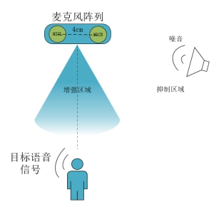
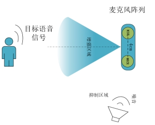
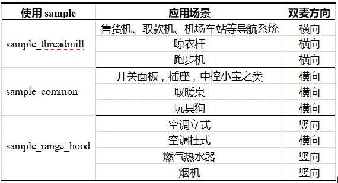
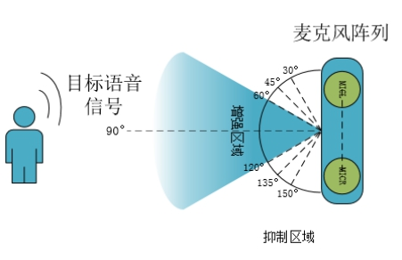
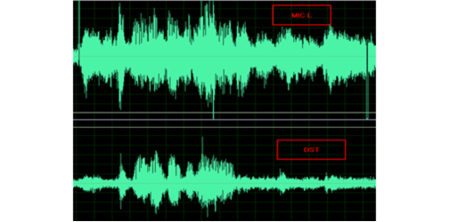

#  **DOA和语音增强使用说明**	

***

波束达到方向（Direct of Arrival,DOA）估计算法、语音增强算法用于声源方位角度估计及语音增强目的。本文档主要介绍其适用的场景，以及如何开启该功能。

***

## 1. **SDK中DOA和语音增强算法的默认配置和对应硬件板** 

CI110X纯离线SDK不支持DOA和语音增强算法，算法SDK和离在线SDK中DOA和语音增强算法默认为打开状态。使用上述两种算法必须采用双麦克风硬件方案，可以用于启英泰伦提供的CIB03ST01J-WL21等离在线组板，或用户自行开发的双麦克风模组板，具体硬件选型可咨询启英泰伦技术支持人员。

如果用户需要测试算法效果，还需要准备录音板（该录音板可在启英泰伦官网中的启英商城中购买）。用该录音板可以实现直接观察分析算法效果用于调试。录音板的使用方法请参考语音AI平台中的《CI110X模组底噪录音分析》文档。

***

## 2. **应用场景**

 DOA和语音增强算法适应的典型应用环境示意图如下图所示，图a、b中，麦克风阵列为线性双麦阵列，麦间距推荐为4cm，其结构方向与实际应用环境中的噪音源方向与目标人声方向相适应，目标人声在语音增强范围内，噪音信号在抑制范围内。语音增强算法可以起到在嘈杂环境中抑制噪声与增强目标人声的作用，开启可以提升语音识别的效果。DOA算法可以获取目标人声方位角度，如果需要在目标人声位置不固定时对语音进行增强，请同时打开DOA算法。

{: .center }

<div align=center>图2-1 DOA和语音增强算法适应的典型应用环境示意图</div>

{: .center }

<div align=center>图2-2 麦克风阵列竖向结构噪声和目标信号示意图</div>

***

## 3. SDK开发示例的选择

**离在线SDK：**

* CI110X_SDK_Combine_Cloud/sample/internal/sample_media

sample_media是针对离在线方案场景的应用。该示例中算法功能配置方法与下文中算法SDK的sample中所提到的配置方法一致，因此不单独为其进行介绍。

**算法SDK：**

* CI110X_SDK_ALG_Application/sample/internal/sample_threadmill

sample_threadmill是针对跑步机场景的应用，该应用方案中，目标方向位于双麦的正前方，而噪声方向位于双麦的一侧。

*  CI110X_SDK_ALG_Application/sample/internal/sample_range_hood

sample_range_hood是针对烟机场景的应用，该应用方案中，目标方向位于双麦的正前方，而噪声方向位于双麦的一侧， 烟机，风扇场景的应用可以使用该示例来开发。

* CI110X_SDK_ALG_Application/sample/internal/sample_common

sample_common是一个通用的场景（说话人位置、噪声方位不固定时），用户可以选择开启或者关闭算法模块，如DOA估计算法模块、denoise算法模块、语音增强算法模块、回声消除算法模块等，以满足产品需求，对应算法模块使用请参考对应说明文档。

**实际应用参考**

以下推荐情况还需与实际场景相结合，关键在声源和噪音源方向上的判断进行选择对应的sample，对应关系如下表a所示。mic方向参考上图（a、b）所示。下表为应用场景的搭配使用参考。

{: .center }

<div align=center>图3-1 应用场景的搭配使用参考</div>

***

## 4. **sample_threadmill工程使用说明**

**步骤一：** 用户开发 请在sample\internal\sample_threadmill\src\user_msg_deal.c里填写自己对应的处理逻辑。

**步骤二：** 波束宽度选择，在sample\internal\sample_threadmill\src\user_config.h开启对应的宏选择波束宽度

```c
#define BEAMFORMING_ BEAMWIDTH _CONFIG    BEAMWIDTH_L
```

有三种波束宽度可供选择，BEAMWIDTH_L/ BEAMWIDTH_M/ BEAMWIDTH_S，分别针对的目标方位角度范围为30~150， 45~135，60~120， 用户可根据需要调整（双麦正前方为90度方位角），如下图示

{: .center }

<div align=center>图4-1 波束宽度可供选择</div>

图示的波束宽度为60~120度

**步骤三：** 开启语音增强算法

在文件sample\internal\sample_*\src\user_config.h开启相关的宏以开启语音增强算法，在配置宏的过程中需结合声学回声消除(AEC，Acoustic Echo Cancellation)算法的使用情况：

应用一：开启AEC功能的应用，需要使用外部codec

```c
#define AUDIO_CAPTURE_USE_MULTI_CODEC     	1
#define USE_TWO_MIC_ BEAMFORMING   			1 // 1为开启，0为关闭
```

应用二：关闭AEC功能的应用，无需外部codec

```c
#define AUDIO_CAPTURE_USE_MULTI_CODEC     	0
#define USE_TWO_MIC_ BEAMFORMING   		  	1 // 1为开启，0为关闭
```

**步骤四：** 调整mic间距

在sdk\compoents\audio_in_manage\alg_preprocess.c文件中算法初始化过程中设置mic间距,代码如下

```c
bf = ci_bf_create(BF_DISTANCE_40MM);//默认间距40mm，目前该sample中可选间距为40mm
```

!!! important  "注意"
	sample_threadmill工程不支持配置MIC间距，只支持40mm

***

## 5. **sample_range_hood工程使用说明**

**步骤一：** 用户开发请在\sample_range_hood \src\user_msg_deal.c里填写自己对应的处理逻辑。

**步骤二：** 开启语音增强算法

在文件sample\internal\sample_*\src\user_config.h开启相关的宏以开启语音增强算法：

应用一：开启AEC功能的应用，需要使用外部codec

```c
#define AUDIO_CAPTURE_USE_MULTI_CODEC     	1
#define USE_TWO_MIC_ BEAMFORMING   			1 // 1为开启，0为关闭
```

应用二：关闭AEC功能的应用，无需外部codec

```c
#define AUDIO_CAPTURE_USE_MULTI_CODEC     	0
#define USE_TWO_MIC_ BEAMFORMING   		  	1 // 1为开启，0为关闭
```

**步骤三：** 开启语音降噪算法

根据不同的应用环境选择开启降噪算法，对于烟机、风扇场景的应用需开启降噪：

```c
#define USE_SINGLE_MIC_DENOISE        		1//开启降噪
#define USE_SINGLE_MIC_DENOISE        		0//关闭降噪
```

**步骤四：** 调整mic间距

在sdk\compoents\audio_in_manage\alg_preprocess.c文件中算法初始化过程中设置mic间距：

```c
#define MIC_DISTANCE    MIC_DISTANCE_40MM	//默认间距40mm
bf = ci_bf_create(MIC_DISTANCE,s_bf_filters);
```

!!! important  "注意"
	可选间距为:
	30mm: MIC_DISTANCE_30MM、
	40mm: MIC _DISTANCE_40MM、
	50mm: MIC_DISTANCE_50MM、
	80mm: MIC _DISTANCE_80MM

***

## 6. **sample_common工程使用说明**

### 6.1. DOA估计算法的使用

**步骤一：** 开启DOA估计算法

在文件sample\internal\sample_common\src\user_config.h开启相关的宏

应用一：开启AEC功能的应用，需要使用外部codec

```c
#define AUDIO_CAPTURE_USE_MULTI_CODEC      	1
#define USE_TWO_MIC_DOA         			1 // 1为开启，0为关闭，默认配置为开启
```

应用二：关闭AEC功能的应用，无需外部codec

```c
#define AUDIO_CAPTURE_USE_MULTI_CODEC     	0
#define USE_TWO_MIC_DOA          			1 // 1为开启，0为关闭，默认配置为开启
```

**步骤二：** 开启DOA的功能模式

在SDK\components\audio_in_manage\alg_doa_apply.h中设置DOA的功能模式

DOA存在3种工作模式：

模式一：DOA_MODEL_VAD_ALWAYS ，根据vad开始状态获取doa角度信息。

模式二：DOA_MODEL_WAKE_UP，  根据唤醒词结束状态获取doa角度信息。

模式三：DOA_MODEL_CMD ，          根据命令词结束状态获取doa角度信息。

```c
#define DOA_MODEL        DOA_MODEL_WAKE_UP //默认唤醒词模式 
```

**步骤三：** 角度获取、清除

```c
/**
* @brief  获取当前角度信息（只有开启了DOA算法模块才有意义）,
*         在被clear_current_doa_angle（）清除角度之前，一直保持角度信息；
*         默认情况下，开启DOA算法模块时，当说唤醒词后更新角度信息，
*         开启DOA_MODEL_CMD模式，当说本地命令词后也会更新角度信息，
*         开启DOA_MODEL_VAD_ALWAYS模式，根据唤醒词更新角度信息；
* @return int, 角度信息，正常的数值范围为 0~180， 若返回其它值则表示错误;
*/ 
int get_current_doa_angle( void );
```

该角度信息显示的为说话者的角度信息，在产品调试阶段，用户需要实际测试该API反馈的角度信息与实际产品中使用空间方位是否一致。

默认角度方位从左mic到右mic方向，doa的角度由0°到180°方向转变。

Mic方向确认测试方法：使用DOA估计算法功能，根据实际获取的角度信息对mic左右方向进行确定或调整。如用户站在产品左侧说唤醒词，得到的结果为140度，该方位信息实际表示方位为产品左侧， 那么40度就表示是产品的右侧。

```c
/**
 * @brief  清除当前角度信息（只有开启了DOA算法模块才有意义）
 * 
 * @return int, 若返回0，表示成功; 若返回其它值则表示错误;
 */ 
int clear_current_doa_angle( void );
```

**步骤四：** 调整mic间距

在sdk\compoents\audio_in_manage\alg_preprocess.c文件中算法初始化过程中设置mic间距：

```c
#define MIC_DISTANCE    MIC_DISTANCE_40MM	//系统默认间距40mm
doa = ci_doa_create(MIC_DISTANCE)
```

!!! important  "注意"
	可选间距为：
	30mm: MIC_DISTANCE_30MM、
	40mm: MIC _DISTANCE_40MM、
	50mm: MIC_DISTANCE_50MM、
	80mm: MIC _DISTANCE_80MM

### 6.2. 语音增强算法的使用

**步骤一：** 开启语音增强算法

在文件sample\internal\sample_*\src\user_config.h开启相关的宏以开启语音增强算法。

应用一：开启AEC功能的应用，需要使用外部codec
```c
#define AUDIO_CAPTURE_USE_MULTI_CODEC      	1
#define USE_TWO_MIC_ BEAMFORMING   			1 //1为开启，0为关闭， 默认配置为开启
```

应用二：关闭AEC功能的应用，无需外部codec
```c
#define AUDIO_CAPTURE_USE_MULTI_CODEC      	0
#define USE_TWO_MIC_ BEAMFORMING   			1//1为开启，0为关闭， 默认配置为开启
```

**步骤二：** 调整mic间距

在sdk\compoents\audio_in_manage\alg_preprocess.c文件中算法初始化过程中设置mic间距：	

```c
#define MIC_DISTANCE    MIC_DISTANCE_40MM				//默认间距40mm
bf = ci_bf_create( MIC_DISTANCE,s_bf_filters );	        //设置间距函数
```

!!! important  "注意"
	可选间距为:
	30mm: MIC_DISTANCE_30MM、
	40mm: MIC _DISTANCE_40MM、
	50mm: MIC_DISTANCE_50MM、
	80mm: MIC _DISTANCE_80MM

***

## 7. 语音数据通过IIS输出

### 7.1. 调试语音输出宏配置

CI110X_SDK_ALG_Application\components\voice_upload_manage\ voice_upload_manage.h中。

```c
//语音数据通过IIS输出调试功能开启
#define VOICE_UPLOAD_IIS_SHOW_DEBUG  (1)	//0为关闭，1为开启
```

### 7.2. 数据传输存在3种工作模式

模式一：WITH_WAKEUP_WORD_MODEL，唤醒词和命令词同时上传，一次唤醒一次上传。

模式二：WITHOUT_WAKEUP_WORD_MODEL ，只上传命令词，一次唤醒一次上传。

模式三：VAD_REPEATTED_MODEL ，唤醒时间段内，根据vad上传音频，多次上传。

```c
/*配置数据上传模式 ，默认为WITH_WAKEUP_WORD_MODEL*/
#define  UPLOAD_VOICE_DATA_MODEL    (WITH_WAKEUP_WORD_MODEL)
```

***

## 8. 效果确认与调试

### 8.1. 查看log

通过串口打印， 当识别到唤醒词后,可以看到打印的角度信息，例如打印显示**angle = 20**，表示声源在20°

不同方位说命令词时，打印不同的角度信息，角度信息与实际目标语音所在方向吻合（比如站在1米远，分别在mic两侧喊命令词，一侧显示的角度是0度左右，另一侧显示的是180度左右，然后在正前方喊唤醒词为90度左右），说明DOA估计算法模块工作正常。

### 8.2. 调试输出

**硬件配置：**

为了更直观的观察算法的效果，需要借助采音板录对语音数据进行分析。录音板的使用教程请参考《CI110X模组板录音分析》

**软件配置：**

在components\audio_in_manage\alg_preprocess.c中，alg_preprocess_two_ch函数或alg_preprocess_four_ch_single_aec函数中调用

audio_pre_rslt_write_data(  (int16_t*)dst, (int16_t*)micl )为IIS输出的数据内容，开启后，录音板才可以从iis录制到声音;

audio_pre_rslt_write_data函数中第一个参数为IIS输出的右声道的数据，第二个参数为IIS输出的左声道的数据，可以填写以下参数：

dst：输出算法处理结果的数据							Ref：输出原始获取到的参考声音

Micl：输出micL获取到的原始声音					 MicR：输出micR获取到的原始声音

当设置为：audio_pre_rslt_write_data(  (int16_t*)dst, (int16_t*)micl )时，意思为右声道输出算法处理后的结果，左声道为原始的micL的数据，

查看语音增强算法功能的效果如下图示，处理后有明显的抑制（目标人声位于mic中间90度，噪音源为音乐噪声，位于0度角位置），说明算法工作正常；

{: .center }

<div align=center>图8-1 语音增强算法功能的效果</div>

 

 