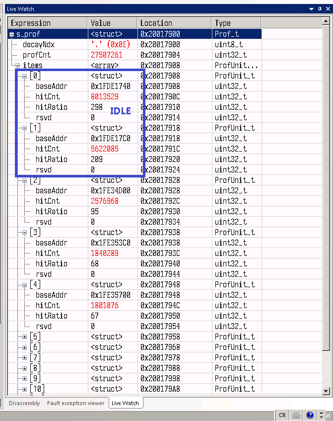
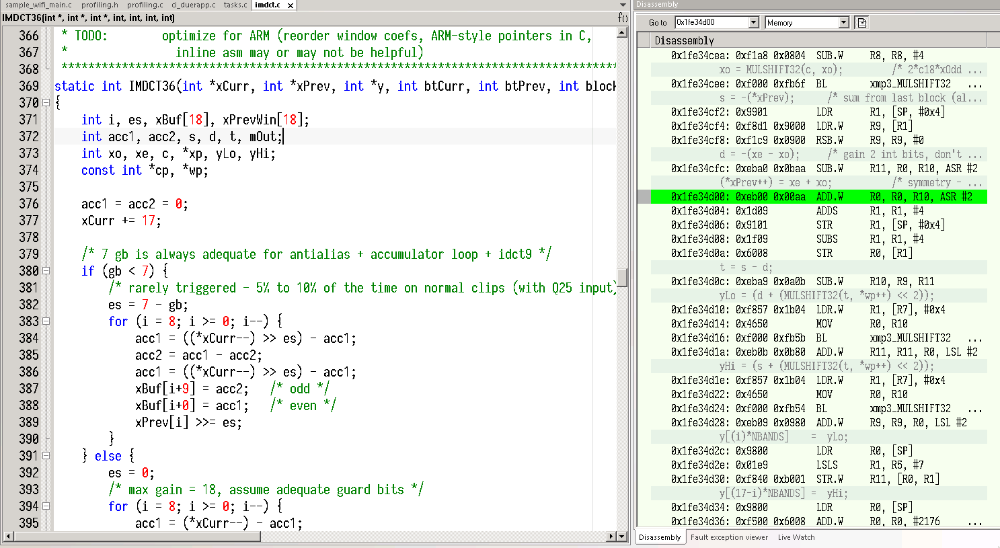
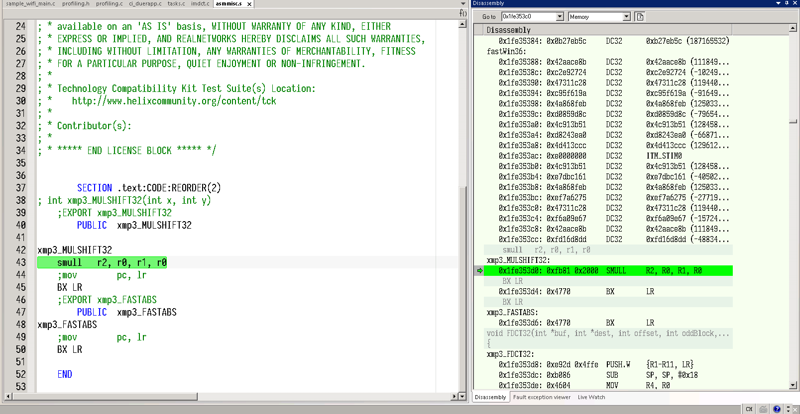
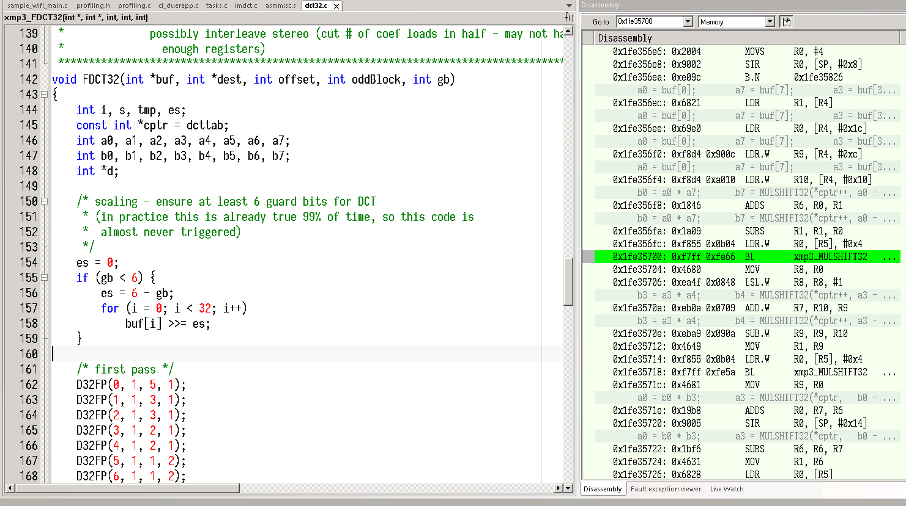
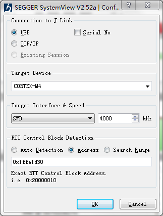
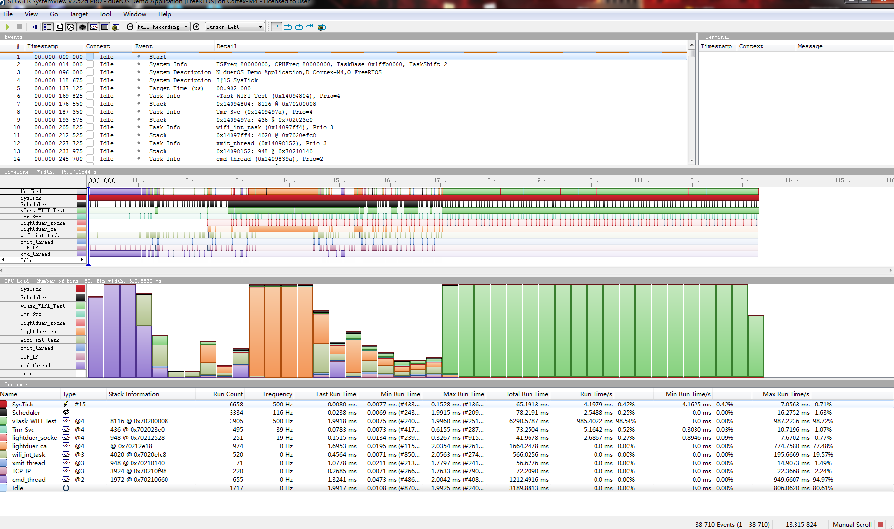

# 调试组件(DBG)

***

## 1. 概述

目前系统组件中有以下目录assist，其作用是方便进行代码调试的一些工具代码，产品发布时一般是不使能的，其中包括以下内容

* systeminfo：该组件包含了查询系统task运行状态以及heap内存的函数接口
* debugtimer：该组件包含启动一组硬件timer，用以检测某段程序代码运行时间的函数接口
* profiling：该组件包含一个通过硬件timer采样代码运行pc指针位置，给出代码性能动态分析的函数接口
* systemview：SEGGER公司的免费软件，可以通过PC工具+Jlink进行任务、中断Trace工具，帮助开发人员分析task调度，代码性能等问题
* cli：freertos生态插件，移植通过串口0输出命令行交互，相对于freertos官方代码增加了命令补全、历史命令记录，左右按键修改等功能。该CLI可以自由扩展命令以方便代码自动化单元测试

***

## 2. 使用说明

### 2.1. systeminfo

systeminfo相关接口使用较为简单，目前包含如下三个函数：

| 接口名称        | 功能说明             | 输出示例                                                     |
| --------------- | -------------------- | ------------------------------------------------------------ |
| get_mem_status  | 打印当前heap剩余大小 | main.c(180):HEAP alloc: 1024 free:1024                       |
| get_fmem_status | 打印fheap剩余大小    | main.c(181):freeRTOS HEAP alloc: 1024 free:1024              |
| get_task_status | 打印当前task状态     | TaskName Status PRI Stack TaskNumber<br>CLI&nbsp;&nbsp;&nbsp;&nbsp;&nbsp;&nbsp;&nbsp;&nbsp;&nbsp;&nbsp;&nbsp;&nbsp;&nbsp;X&nbsp;&nbsp;&nbsp;&nbsp;&nbsp;&nbsp;&nbsp;&nbsp;&nbsp;1&nbsp;&nbsp;&nbsp;&nbsp;&nbsp;948&nbsp;&nbsp;&nbsp;&nbsp;1<br>IDLE&nbsp;&nbsp;&nbsp;&nbsp;&nbsp;&nbsp;&nbsp;&nbsp;&nbsp;&nbsp;&nbsp;R&nbsp;&nbsp;&nbsp;&nbsp;&nbsp;&nbsp;&nbsp;&nbsp;&nbsp;0&nbsp;&nbsp;&nbsp;&nbsp;&nbsp;111&nbsp;&nbsp;&nbsp;&nbsp;2<br>Tmr Svc&nbsp;&nbsp;&nbsp;&nbsp;&nbsp;B&nbsp;&nbsp;&nbsp;&nbsp;&nbsp;&nbsp;&nbsp;&nbsp;&nbsp;4&nbsp;&nbsp;&nbsp;&nbsp;&nbsp;224&nbsp;&nbsp;&nbsp;&nbsp;3 |

### 2.2. debugtimer

timer计时使用极为简单，初始化后，每次调用start、end后就会打印这之间的时间，单位us，此接口不具备线程安全性，使用时切记注意线程调度

| 接口名称           | 功能说明           |
| ------------------ | ------------------ |
| init_timer0        | 初始化timer        |
| timer0_start_count | 启动timer计时      |
| timer0_end_count   | 停止计时并打印时长 |

### 2.3. profiling

profiling功能是用于动态分析代码密集度的工具，通俗说就是用来定位在运行时，那部分的代码经常被cpu执行，以此分析代码是否合理，以及将运行频繁的代码段放置在较高速的存储空间内。原理如下：

* 开启一个硬件Timer定时器，在固定的时间产生一次中断
* 在arm cortex-m系列CPU内核中，进入中断时会将部分通用寄存器压如栈中，包括R0-R3，R12，lr，pc，xpsr，这是，只需要获取到栈中的PC指针地址，即可采集到被打断前代码运行的PC位置，如此通过定时器周期性采样，即可从统计方式计算出PC出现概率最高的代码块，进而进行代码分析
* 在较为连续的地址范围内的pc指针，通常可以理解为同一片代码区域，这样我们可以定义宏来配置将多大的代码空间范围视为同一代码块
* 系统在初始化阶段往往会比较密集的集中在初始化代码部分，这里我们可以在定时器中断中增加一个衰减值，将统计到的代码进行衰减，如果被采集到的代码块在之后很长时间都不会出现，则其会随着时间衰减而逐渐消失
* 系统中可能存在idle任务，故在实现中包括一个忽略列表，pc采集时会将忽略列表中的地址不计入统计（如idle任务代码所在地址），以此方便统计展示。
* 最后，将统计到的数据结构化，配置iar等调试工具查看数据即可获取到密集代码区地址，命中此处，系统占用率等等。

使用示例如下:

* 在初始化函数调用profiling初始化函数，定义使用的timer中断

```c
#define Prof_IRQHandler TIM0_IRQHandler
prof_tmer_init();
```

* 下载运行程序，添加s_prof全局变量到Live Watch，运行许久后查看watch窗口
* 结果如下图所示，items中展示了命中次数最多的PC指针依次排序，这里第0和1中的pc地址均在idle任务附近，这里不再关心。

 {: .center }

 <div align=center>图2-1 结果</div>

* 第2的0x1fde17c0地址内的代码如下：

 {: .center }

 <div align=center>图2-2 第2的0x1fde17c0地址内的代码</div>

* 第3的0x1fde17c0地址内的代码如下：

 {: .center }

 <div align=center>图2-3 第3的0x1fde17c0地址内的代码</div>

* 第4的0x1fde17c0地址内的代码如下：

 {: .center }

 <div align=center>图2-4 第4的0x1fde17c0地址内的代码</div>

* 由此分析在网络下载播放mp3过程中，目前代码密集区在IMDCT36、MULSHIFT32、FDCT32中，可以针对此结论优化算法或分配其代码运行位置

### 2.4. systemview

systemview为SEGGER公司推出的Trace工具，SDK中已进行了集成，如需开启需要使能以下宏

```c
#define CONFIG_SYSTEMVIEW_EN            1
```

!!! important "提示"
    发布时不要开启此选项以免造成不必要的代码空间浪费

重新编译下载程序，代码将按照正常功能运行，此时systemview读取系统状态需要如需步骤:

* 查看编译后的map文件，找的_SEGGER_RTT变量地址

```
_SEGGER_RTT             0x2001'4420    0xa8  Data  Gb  SEGGER_RTT.o [1]
```

* 在PC中打开systemview工具，连接jlink，选择start后弹出以下界面，填入_SEGGER_RTT变量地址

 {: .center }

 <div align=center>图2-5 选择start后弹出界面</div>

* 点击开始即开启录制task状态事件，点击stop后停止录制得到如下界面即可查看系统信息分析。

 {: .center }

 <div align=center>图2-6 点击stop后停止录制得到界面</div>

### 2.5. cli

CLI是系统命令行组件，如要开启此功能需要开启以下宏

```c
#define CONFIG_CLI_EN                   1
```

目前命令行交互是通过串口0进行的，在串口0中键入help即可查看命令选项，当前SDK内预置了一些命令，代码实现于example\cli_sample.c文件内，如需添加注册自己的命令，可以参考其中代码，主要包括命令结构定义，命令处理函数以及调用注册函数注册,示例如下：

```c
static BaseType_t prvEchoCommand( char *pcWriteBuffer, size_t xWriteBufferLen, const char *pcCommandString )
{
    const char *pcParameter;
    BaseType_t xParameterStringLength;

    pcParameter = FreeRTOS_CLIGetParameter(pcCommandString,	1, &xParameterStringLength);

    configASSERT( pcParameter );

    memset( pcWriteBuffer, 0x00, xWriteBufferLen );
    strncat( pcWriteBuffer, pcParameter, ( size_t ) xParameterStringLength );

	return pdFALSE;
}
static const CLI_Command_Definition_t xEcho =
{
	"echo",
	"echo:\t\t\t\tEchos each in turn\r\n",
	"echo\r\n\
    <param>:\t\techos string\r\n",
	prvEchoCommand,
	1
};

/*调用注册函数*/
FreeRTOS_CLIRegisterCommand( &xEcho );
```

!!! important "提示"
	 使用help可以查询集成命令的描述说明，命令具体使用方法可以使用--help参数查询。


在cli_sample.c中vRegisterCLICommands注册了丰富的常见系统命令，包括系统打印，版本查看，任务运行状态，内存状态信息等。同时如果sdk开启了sdc或sdio功能还将注册文件枚举，本地/网络音频播放等命令。

```c
void vRegisterCLICommands( void )
{
	FreeRTOS_CLIRegisterCommand( &xUname );	
    FreeRTOS_CLIRegisterCommand( &xVersion );	
	FreeRTOS_CLIRegisterCommand( &xEcho );
    FreeRTOS_CLIRegisterCommand( &xPs );
    FreeRTOS_CLIRegisterCommand( &xFree );
    
    FreeRTOS_CLIRegisterCommand( &xPlayADPCM );
    FreeRTOS_CLIRegisterCommand( &xPlayStop );
    FreeRTOS_CLIRegisterCommand( &xPausePlay );

    #if USE_MOUNT_SDC
    FreeRTOS_CLIRegisterCommand( &xLs );
    FreeRTOS_CLIRegisterCommand( &xPlayMP3 );
    FreeRTOS_CLIRegisterCommand( &xPlayAAC );
    FreeRTOS_CLIRegisterCommand( &xTestAudio );
    #endif

    #if USE_SDIO
    FreeRTOS_CLIRegisterCommand( &xTestDuerOSSend );
    FreeRTOS_CLIRegisterCommand( &xTestDuerOSStop );
    #endif
}
```

!!! important "提示"
	 上述命令使用help可以查询中文使用说明哦！更多其他CLI信息请参考 ☞[ FreeRTOS官网 ](https://www.freertos.org/index.html)获取帮助。
