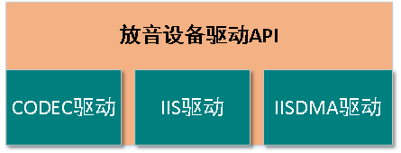
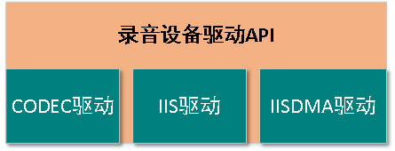

# 录音与放音驱动(CAP AND PLAY)

***

## 1. 特点

* 芯片内部自带CODEC
* 为内部CODEC专门设计的ALC处理逻辑
* IIS专用IISDMA
* 驱动程序简单易用，使用灵活


CI110X作为一款智能语音芯片，其语音通路（CODEC、IIS、IISDMA）占有非常重要的部分。CI110X在芯片内部设计了一个双通道的CODEC、也为IIS设计了专用的IISDMA。CI110X还拥有片内的CODEC，使用CI110X进行录音和放音，可以不再外接CODEC芯片，大大增加了系统的稳定性，且降低了成本。专用的IISDMA使得配置IIS接收或者发送数据更加灵活、方便，且不用考虑其他外设使用DMA对其造成影响。且CI110X为片内CODEC的ADC和DAC设计了单独的IIS，二者独立工作，互不影响，使用灵活。另外，CI110X还有一路IIS为外接CODEC预留，保证用户依然可以根据自己的需要选择其他的CODEC芯片，采集多路语音，已满足更复杂的算法需求。录音和放音组件将CODEC、IIS和IISDMA串联起来，形成了CI110X的语音通路。

***

## 2. 概述

 {: .center }

 <div align=center>图1-1 放音设备驱动API</div>

 {: .center }

 <div align=center>图1-2 录音设备驱动API</div>

CI110X SDK提供了一套录音设备和放音设备的驱动程序。通过调用这套驱动程序提供的API，用户就可以完成常规配置的录音和放音操作，而不需要考虑繁琐的IIS、IISDMA、CODEC的配置。这套驱动基于FreeRTOS编写，因此只能在FreeRTOS的基础上运行。

***

## 3. 录音设备API

<center>

| 函数名                  | 描述                   |
| ----------------------- | -----------------------|
| audio_capture_registe   | 录音设备注册            |
| audio_capture_init      | 录音设备初始化          |
| inner_codec_init        | 内部CODEC录音初始化函数 |
| audio_cap_start         | 录音设备开启采音        |
| audio_capture_getdata   | 获取录音数据            |
| audio_cap_stop          | 录音设备停止采音        |
| audio_cap_mute          | 录音设备静音            |
| audio_cap_delete        | 删除录音设备            |

</center>

录音设备驱动头文件地址："\driver\ci110x_chip_driver\inc\ci110x_audio_capture.h"

!!! note "注意"
    CI110X内部CODEC的ADC不支持在其slave模式下使用左对齐格式

### 3.1. 非直通模式

>非直通模式录音的方式是：接收完成一个block的数据就会产生中断，录音设备会自动处理这个中断。这种模式下，录音设备驱动会将采集到的数据缓存在buf中。当用户需要获取数据的时候，调用获取数据的API，可以得到当前数据的起始地址和大小。

### 3.2. 非直通模式代码示例
初始化代码示例：

```c
//内部CODEC启动
Scu_SetDeviceGate(HAL_CODEC_BASE,1);
Scu_Setdevice_Reset(HAL_CODEC_BASE);
Scu_Setdevice_ResetRelease(HAL_CODEC_BASE);
inner_codec_reset();
inner_codec_power_up(INNER_CODEC_CURRENT_128I);

audio_capture_init_t audio_cap_init_struct;
   
audio_cap_init_struct.codecx = AUDIO_CAP_INNER_CODEC;
audio_cap_init_struct.block_size = AUDIO_CAP_BLOCK_SIZE_1024;//每次中断，即每一帧数据期望的大小
audio_cap_init_struct.cha_num = AUDIO_CAP_CHANNEL_LEFT;//通道选择
audio_cap_init_struct.sample_rate = AUDIO_CAP_SAMPLE_RATE_16K;//采样率
audio_cap_init_struct.over_sample = AUDIO_CAP_OVER_SAMPLE_256;
audio_cap_init_struct.clk_source = AUDIO_CAP_CLK_SOURCE_DIVIDER_IISPLL;//时钟源选择;
audio_cap_init_struct.bit_wide = AUDIO_CAP_BIT_WIDE_16;//采样深度，一般16bit
audio_cap_init_struct.codec_mode = AUDIO_CAP_CODEC_SLAVE;//主从模式，CODEC做slave
audio_cap_init_struct.data_format = AUDIO_CAP_DATA_FORMAT_STANDARD_I2S;//标准IIS格式
audio_cap_init_struct.audio_capture_codec_init = inner_codec_init;//CODEC的初始化函数
audio_cap_init_struct.is_straight_to_vad = AUDIO_TO_VAD_NOT_STRAIGHT;//是否为直通模式

audio_capture_registe(&audio_cap_init_struct);
audio_capture_init(&audio_cap_init_struct);

audio_cap_start(AUDIO_CAP_INNER_CODEC);
```

获取数据的代码示例：

```c
audio_getdate_t audio_cap_data_str;

for(;;)
{
    audio_cap_data_str = audio_capture_getdata(AUDIO_CAP_DATA_GET_TIMEOUT,30);
    if(AUDIO_CAP_DATA_GET_STATE_YES == audio_cap_data_str.data_state)
    {
        if(AUDIO_CAP_INNER_CODEC == audio_cap_data_str.codec_num)//inner CODEC采到的数据
        {
            uint32_t block_size = audio_cap_data_str.block_size;//得到当前帧数据的大小
            uint32_t addr = audio_cap_data_str.current_data_addr;//得到当前帧数据的起始地址
            memcpy((void*)audio_buf_1,(void*)addr,block_size);
        }
        else
        {
            mprintf("codec err\n");
        }
    }
    else//获取数据失败
    {
        mprintf("data ERR:%d\n",audio_cap_data_str.data_state);
    }
}
```

### 3.3. 直通模式

>直通模式下的录音不会触发IISDMA接收完成一个block的数据的中断，因此也不会有block的概念。直通模式下的录音会直接将PCM数据顺序存放在一块规定好的memory中（事先指定好memory中buf的起始地址和大小）。录音设备启动之后，数据存储到这块区域，并会在到达缓存区边界的时候自动写绕回，又回到memroy中buf的起始地址存数据。

### 3.4. 直通模式代码示例

直通模式只要初始化：

```c
//内部CODEC启动
Scu_SetDeviceGate(HAL_CODEC_BASE,1);
Scu_Setdevice_Reset(HAL_CODEC_BASE);
Scu_Setdevice_ResetRelease(HAL_CODEC_BASE);
inner_codec_reset();
inner_codec_power_up(INNER_CODEC_CURRENT_128I);

audio_capture_init_t audio_cap_init_struct;
    
audio_cap_init_struct.codecx = AUDIO_CAP_INNER_CODEC;//选择CODEC编号
audio_cap_init_struct.block_size = AUDIO_CAP_BLOCK_SIZE_1024;//直通模式下，block_size无需关心
audio_cap_init_struct.cha_num = AUDIO_CAP_CHANNEL_STEREO;//通道选择
audio_cap_init_struct.sample_rate = AUDIO_CAP_SAMPLE_RATE_16K;//采样率设置
audio_cap_init_struct.bit_wide = AUDIO_CAP_BIT_WIDE_16;//采样深度
audio_cap_init_struct.codec_mode = AUDIO_CAP_CODEC_SLAVE;//CODEC主从模式，CODEC做slave
audio_cap_init_struct.data_format = AUDIO_CAP_DATA_FORMAT_STANDARD_I2S;//录音设备使用的格式
audio_cap_init_struct.audio_capture_codec_init = fake_capture_codec_init;//CODEC的初始化函数的函数名
audio_cap_init_struct.is_straight_to_vad = AUDIO_TO_VAD_NOT_STRAIGHT;//是否为直通模式
audio_cap_init_struct.addr_pcm_buf_for_straight = pcm_buf;//直通模式下pcmbuf的首地址
audio_cap_init_struct.size_pcm_buf_for_straight = frame_size*frame_count*sizeof(short);//直通模式下buf的大小
audio_capture_registe(&audio_cap_init_struct);//注册设备
audio_capture_init(&audio_cap_init_struct);//初始化设备
audio_cap_start(AUDIO_CAP_INNER_CODEC);//启动录音设备
```

### 3.5. 双CODEC同时使用的模式

>CI110X最多支持两个CODEC同时采音，一个必须是内部CODEC，另外一个挂接在IIS1上。使用双通道CODEC的时候，宏AUDIO_CAPTURE_USE_MULTI_CODEC要打开

### 3.6. 双CODEC代码示例

```c
void audio_capture_es8388_init(audio_cap_channel_num_t ch,audio_cap_sample_rate_t sr,audio_cap_bit_wide_t bw,
                                    audio_cap_codec_mode_t mode,audio_cap_data_format_t df)
{
    ES8388_play_init(ES8388_NUM1);
}

//内部CODEC启动
Scu_SetDeviceGate(HAL_CODEC_BASE,1);
Scu_Setdevice_Reset(HAL_CODEC_BASE);
Scu_Setdevice_ResetRelease(HAL_CODEC_BASE);
inner_codec_reset();
inner_codec_power_up(INNER_CODEC_CURRENT_128I);

audio_capture_init_t audio_cap_init_struct;
    
audio_cap_init_struct.codecx = AUDIO_CAP_INNER_CODEC;//选择CODEC编号
audio_cap_init_struct.block_size = AUDIO_CAP_BLOCK_SIZE_1024;//直通模式下，block_size无需关心
audio_cap_init_struct.cha_num = AUDIO_CAP_CHANNEL_STEREO;//通道选择
audio_cap_init_struct.sample_rate = AUDIO_CAP_SAMPLE_RATE_16K;//采样率设置
audio_cap_init_struct.bit_wide = AUDIO_CAP_BIT_WIDE_16;//采样深度
audio_cap_init_struct.codec_mode = AUDIO_CAP_CODEC_SLAVE;//CODEC主从模式，CODEC做slave
audio_cap_init_struct.data_format = AUDIO_CAP_DATA_FORMAT_STANDARD_I2S;//录音设备使用的格式
audio_cap_init_struct.audio_capture_codec_init = fake_capture_codec_init;//CODEC的初始化函数的函数名
audio_cap_init_struct.is_straight_to_vad = AUDIO_TO_VAD_NOT_STRAIGHT;//是否为直通模式
audio_cap_init_struct.addr_pcm_buf_for_straight = pcm_buf;//直通模式下pcmbuf的首地址
audio_cap_init_struct.size_pcm_buf_for_straight = frame_size*frame_count*sizeof(short);//直通模式下buf的大小
audio_capture_registe(&audio_cap_init_struct);//注册设备
audio_capture_init(&audio_cap_init_struct);//初始化设备

audio_cap_init_struct.codecx = AUDIO_CAP_ES8388_1;//CODEC选择
audio_cap_init_struct.block_size = (audio_cap_block_size_t)block_size;
audio_cap_init_struct.cha_num = ch;
audio_cap_init_struct.sample_rate = AUDIO_CAP_SAMPLE_RATE_16K;
audio_cap_init_struct.over_sample = AUDIO_CAP_OVER_SAMPLE_256;
audio_cap_init_struct.clk_source = AUDIO_CAP_CLK_SOURCE_DIVIDER_IISPLL;//时钟源选择;
audio_cap_init_struct.bit_wide = AUDIO_CAP_BIT_WIDE_16;//采样深度，一般16bit
audio_cap_init_struct.codec_mode = AUDIO_CAP_CODEC_SLAVE;//CODEC做slave
audio_cap_init_struct.data_format = AUDIO_CAP_DATA_FORMAT_STANDARD_I2S;//标准iis格式
audio_cap_init_struct.audio_capture_codec_init = audio_capture_es8388_init;//CODEC的初始化函数
audio_cap_init_struct.is_straight_to_vad = AUDIO_TO_VAD_NOT_STRAIGHT;//是否为直通模式

audio_capture_registe(&audio_cap_init_struct);
audio_capture_init(&audio_cap_init_struct);

audio_cap_start(AUDIO_CAP_INNER_CODEC|AUDIO_CAP_ES8388_1);

audio_getdate_t audio_cap_data_str;

//在任务中获取双CODEC的数据
for(;;)
{
    audio_cap_data_str = audio_capture_getdata(AUDIO_CAP_DATA_GET_BLOCK,30);

    if(AUDIO_CAP_DATA_GET_STATE_YES != audio_cap_data_str.data_state)/*used in timeout mode*/
    {
        /*do nothing*/
        ci_logwarn(LOG_AUDIO_IN,"timeout\n");
        continue;
    }

    if((AUDIO_CAP_INNER_CODEC != audio_cap_data_str.codec_num)||
        #if (AUDIO_CAPTURE_USE_MULTI_CODEC)/*if support multi codec, par add check codec_2*/    
        (AUDIO_CAP_ES8388_1 != audio_cap_data_str.codec_num_2)||
        #endif
        (block_size != audio_cap_data_str.block_size))
    {
        ci_logerr(LOG_AUDIO_IN,"wrong setting\n");
        continue;
    }

    /*audio_cap_data_str.current_data_addr就是此帧数据inner CODEC采集到的数据的起始地址
    audio_cap_data_str.current_data_addr_2就是此帧数据外部CODEC采集到的数据的起始地址*/
}
```

***

## 4. 放音设备API

<center>

| 函数名                       | 描述                 |
| ---------------------------- | ------------------- |
| audio_play_card_registe      | 放音设备注册         |
| audio_play_card_init         | 放音设备初始化       |
| audio_play_card_writedata    | 向放音设备写数据     |
| inner_codec_play_init        | 内部CODEC放音初始化  |
| audio_play_card_start        | 启动放音设备         |
| audio_play_card_stop         | 停止放音设备         |
| audio_play_card_delete       | 删除放音设备         |
| audio_play_card_set_vol_gain | 放音设备设置音量     |
| audio_play_card_force_mute   | 放音设备强制静音     |
| codec_play_inner_codec       | 内部CODEC放音启动    |

</center>


放音设备驱动头文件地址："\driver\ci110x_chip_driver\inc\ci110x_audio_play_card.h"

>放音设备使用的时候，只需事先配置好CODEC编号、播放码率等放音设备的信息，然后启动放音设备之前，将需要播放的音频数据的地址和大小告知放音设备，放音设备取到播放消息之后，就会将消息表示的数据播放。使用者通过查询放音设备的队列是否满，判断能否往播放队列发送消息。

### 4.1. 放音设备使用代码示例

```c
//内部CODEC启动
Scu_SetDeviceGate(HAL_CODEC_BASE,1);
Scu_Setdevice_Reset(HAL_CODEC_BASE);
Scu_Setdevice_ResetRelease(HAL_CODEC_BASE);
inner_codec_reset();
inner_codec_power_up(INNER_CODEC_CURRENT_128I);

pa_switch_io_init();
audio_play_card_init_t audio_play_card_init_str;
memset((void *)(&audio_play_card_init_str), 0, sizeof(audio_play_card_init_t));

audio_play_card_init_str.codecx = AUDIO_PLAY_INNER_CODEC;
audio_play_card_init_str.cha_num = AUDIO_PLAY_CHANNEL_STEREO;
audio_play_card_init_str.sample_rate = AUDIO_PLAY_SAMPLE_RATE_16K;
audio_play_card_init_str.over_sample = AUDIO_PLAY_OVER_SAMPLE_256;
audio_play_card_init_str.clk_source = AUDIO_PLAY_CLK_SOURCE_DIVIDER_IISPLL;
audio_play_card_init_str.bit_wide = AUDIO_PLAY_BIT_WIDE_16;
audio_play_card_init_str.codec_mode = AUDIO_PLAY_CARD_CODEC_SLAVE;               //主从模式，CODEC做slave
audio_play_card_init_str.data_format = AUDIO_PLAY_CARD_DATA_FORMAT_STANDARD_I2S;
audio_play_card_init_str.audio_play_codec_init = inner_codec_play_init;
audio_play_card_init_str.audio_play_buf_end_callback = send_one_buf_done_event;//需要发送的音频buf发送完成的回调函数
audio_play_card_init_str.audio_play_codec_start_callback = codec_play_inner_codec;
audio_play_card_init_str.block_size = 1024;//1152;

audio_play_card_registe(&audio_play_card_init_str);

audio_play_card_init(&audio_play_card_init_str);
audio_play_card_set_vol_gain(AUDIO_PLAY_INNER_CODEC,70,70);//设置默认音量

codec_play_inner_codec(AUDIO_PLAY_CHANNEL_STEREO,ENABLE);
```

