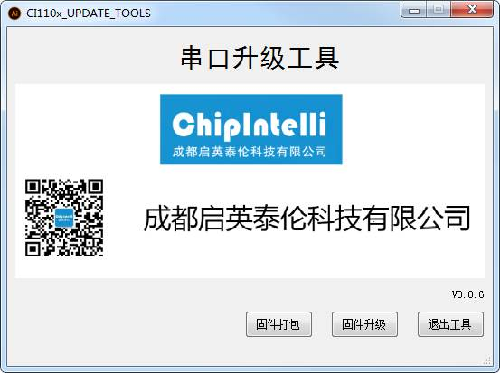

# SDK Quick Start

***

## 1. 概述

本文为CI110X软件开发包（SDK）快速开发手册，旨在方便开发人员快速开发代码。

***

## 2. 用户指南

### 2.1. 开发环境

以下是开发过程中需要的软件和硬件：

- IAR 8.30.1
- J-link V9
- CI110X SDK
- PACK_UPDATE_TOOL.exe

#### 2.1.1. IAR

SDK中所有的应用能够通过IAR编译以及使用，所以在进行软件开发之前，首先取得并且安装IAR，有关IAR的更多信息请访问: ☞    https://www.iar.com/iar-embedded-workbench/

CI110X使用的IAR版本信息如下所示。为避免产生兼容性问题，建议使用以下版本。

 {: .center}

#### 2.1.2. J-link 

J-link是开发调试必备工具，硬件必须使用V9。访问: ☞ https://www.segger.com 来下载相关的软件和文档，安装SEGGER J-Link软件。设备的驱动应该正确被安装，才能搭配IAR 使用J-link调试器。

#### 2.1.3. SDK

SDK包括示例工程，文档以及必要的工具。

#### 2.1.4. PACK_UPDATE_TOOL.exe

CI110X芯片串口升级工具，用于升级使用。关于串口升级步骤详见第4章烧录。

### 2.2. 开发板介绍

CI110X标准开发板由一块底板和一块子板组成。

#### 2.2.1. 开发板子板

子板型号：CI-B02-CS01-B-V30

 {: .center}

 <div align=center>图2-2 子板正面</div>

 {: .center}

 <div align=center>图2-3 子板背面</div>

#### 2.2.2. 开发板底板

底板型号：CI-B02-MB-V10

 {: .center}

 <div align=center>图2-4 底板正面</div>

 {: .center}

 <div align=center>图2-5 底板背面</div>

#### 2.2.3. 整体开发板

 {: .center}

- **1:  输入电源5V/GND**

- **2:  模式选择,支持调试模式、升级模式、正常模式**

短接SEL和EN     ---> **调试模式**：通过J-link下载代码到内存中运行，但是不会更新Flash里面的代码。

短接PG和EN      ---> **升级模式**：通过本司的串口升级工具（PACK_UPDATE_TOOL.exe），更新                      													   Flash 里面的固件。

不进行任何短接 ---> **正常模式**：不能通过J-link下载代码到内存，不能进行串口升级。如果Flash里固件														正确，系统正常启动。

!!! note "注意"
	短接SEL和EN或者PG和EN，必须重新上电，才会起作用。如果短接PG和EN后，1s内没有使用串口升级工	具进行升级，系统仍然会正常启动。

- **3 :  UART0_TX和UART0_RX**

处于升级模式时，TX0、RX0用于串口升级使用，升级完成进入系统后，TX0用于Log（Log详见第5章）输出。

- **4:  麦克风底座**

- **5:  喇叭底座**

- **6:  JLINK连接端口,TCK、TMS、GND**

***

## 3. 应用程序

目前公司提供了3套SDK，分别是CI110X_SDK_ASR_Offline(离线语音识别SDK）、CI110X_SDK_ALG_Application(算法SDK)、CI110X_SDK_Combine_Cloud(离在线语音识别SDK)

### 3.1. SDK整体架构介绍

| 文件名     | 作用                                                         |
| ---------- | ------------------------------------------------------------ |
| components | 目录为组件，包括播放器、ASR识别、按键、传感器、FreeRTOS操作系统等 |
| doc        | 文档目录                                                     |
| driver     | 目录包括CI110X芯片底层驱动                                   |
| platform   | 目录包括平台相关配置                                         |
| sample     | 目录包括示例工程                                             |
| startup    | 目录包括CI110X启动代码                                       |
| system     | 目录包括系统相关代码、中断处理程序文件                       |
| tools      | 工具目录，主要是合并、打包升级工具                           |

### 3.2. CI110X_SDK_ASR_Offline示例工程介绍

为了帮助开发者快速创建应用程序，CI110X_SDK_ASR_Offline中已经创建一些的示例工程。通过学习示例工程，开发者可以很容易的熟悉SDK。

示例工程路径：CI110X_SDK_ASR_Offline\sample\internal\

| 工程文件                      | 作用                |
| ----------------------------- | ------------------- |
| sample_light                  | CI1102 离线识别工程 |
| sample_light_large_vocabulary | CI1103 离线识别工程 |

### 3.3. CI110X_SDK_ALG_Application示例工程介绍

示例工程路径：CI110X_SDK_ALG_Application\sample\internal\

| 工程文件       | 作用                        |
| -------------- | --------------------------- |
| sample_cwsl    | CI1103 离线命令词自学习工程 |
| sample_doa_bf | CI1103 toda和bf工程         |

### 3.4. CI110X_SDK_Combine_Cloud示例工程介绍

示例工程路径：CI110X_SDK_Combine_Cloud\sample\internal\

| 工程文件             | 作用                            |
| -------------------- | ------------------------------- |
| sample_media         | CI1103 离在线工程，串口传输音频 |
| sample_i2s_interface | CI1103 离在线工程，IIS传输音频  |

***

## 4. 烧录

### 4.1. Images 相关

CI110X 应用要有5个images:asr.bin、dnn.bin、user.bin、user_file.bin和voice.bin

- asr.bin：语音模型

- dnn.bin：声学模型

- user.bin：开发者开发的应用程序

- user_file.bin：开发者定义的命令词列表以及开发者其他的bin文件

- voice.bin：播报音

### 4.2. Images 处理工具

- 路径：SDK\sample\internal\sample_light\firmware\

- 名称：合成分区bin文件.bat

- 作用： 调用本脚本后，会在firmware\asr、dnn、user_file、voice各自目录下自动生成asr.bin、dnn.bin、user_file.bin和voice.bin文件。

### 4.3. 烧录方式

使用串口升级工具进行升级固件，以sample_light工程为例进行烧录代码。

#### 步骤1：串口升级硬件连线

 {: .center}

- **1：电源(5V/GND)**

- **2：短接PG和EN**

- **3：TX0和RX0连接到USB转串口工具的RXD和TXD**

- **4：USB转串口工具，连接到PC**

#### 步骤2：编译代码生成user.bin文件

进入SDK\sample\internal\sample_light\ project\下， 如下图4-1所示：

 {: .center}

 <div align=center>图4-1 project目录</div>

首先使用IAR（详见2.1 开发环境）打开ci110_project.eww文件，然后clean工程，如下图4-2所示：

 {: .center}

 <div align=center>图4-2 clean工程</div>

最后make(编译)工程，入下图4-3所示：

 {: .center}

 <div align=center>图4-3 编译工程</div>

完成编译后，

SDK\sample\internal\sample_light\firmware\user_code生成的应用代码user.bin，如下图4-4 所示：

{: .center}

 <div align=center>图4-4 user.bin生成</div>

#### 步骤3：生成其他所需4个bin文件

进入SDK\sample\internal\sample_light\ firmware\下， 如下图4-5所示：

 {: .center}

 <div align=center>图4-5 firmware文件目录</div>

打开合成分区bin文件.bat

 {: .center}

10s处理完成后cmd.exe自动退出，如果没有自动退出，生成.bin文件失败，请检查asr、dnn、user_file、voice下文件或文件名是否正确。

#### 步骤4：将5个bin文件打包成一个bin文件

方式一：进入SDK\sample\internal\sample_light\ firmware\下， 如图4-5所示，打开打包升级.bat

方式二：进入SDK\tools\，打开PACK_UPDATE_TOOL.exe

界面如下图4-6所示：

 {: .center}

 <div align=center>图4-6 串口升级工具主界面</div>

点击固件打包，界面如下图4-7所示：

 {: .center}

 <div align=center>图4-7 串口升级工具打包界面</div>

确认5个分区预留大小是否适合，例如user.bin的实际大小为0x262A3字节，但是预留大小为0x23000字节。此时需要将user区的预留大小调整为0x27000字节。voice.bin的实际大小为0XD80B9字节，voice预留大小为0x25000字节，此时将voice预留大小重新设置为0XD9000字节。

!!! note "注意"
    1.预留大小按照0x1000的整数倍进行配置。
    2.配置预留大小后需要刷新地址。

点击打包固件，出现固件已生成的窗口，表示固件制作完成。如下图4-8所示：

 {: .center}

 <div align=center>图4-8 串口升级工具打包完成界面</div>

点击OK后，在SDK\sample\internal\sample_light\firmware目录下生成一个.bin文件。.bin文件的名字由打包界面软件名称和软件版本组成。如下图4-9所示：

 {: .center}

 <div align=center>图4-9 固件生成</div>

#### 步骤5：升级固件

完成上述步骤后。建议进行下面的确认：

1.确保连线正确（详见步骤1）

2.确保进入升级模式（详见2.2模块介绍）

3.确保USB转串口连接到PC，PC能够识别到COM端口

4.确保固件生成正确

5.确保麦克风和喇叭正确插入开发板

点击图4-9界面的固件升级按钮。界面如下图4-10所示：

 {: .center}

 <div align=center>图4-10 串口升级工具升级界面</div>

选择步骤4生成的固件或者本司提供的固件，如下图4-11所示：

 {: .center}

 <div align=center>图4-11 选择固件</div>

选择正确的COM端口，如下图4-12所示：

 {: .center}

 <div align=center>图4-12 选择COM端口</div>

复位（可通过断电重启的方式）开发板，开发板自动开始升级。升级完成后显示update successful界面如下图4-13所示。关闭串口升级工具。

 {: .center}

 <div align=center>图4-13 升级完成界面</div>
!!! important "提示"
    更多固件制作信息可以访问[命令词和固件制作指南](./命令词和固件制作指南.md)页面

#### 步骤6：验证固件

烧录完成后，系统会自动重启，sample_light工程启动后会有语音播报。播报完成后，说唤醒词“智能管家”后，播报“你好”，表示升级成功。

***

## 5. 调试

有两种方式可以调试应用程序：

- 使用log 机制跟踪代码的执行和数据。
- 使用IAR 和 Jlink调试代码，增加/删除breakpoints（断点）以及访问/追踪memory等。

### 5.1. Log机制

通过串口打印log的方式来追踪应用程序的执行情况。

#### 5.1.1. Log 输出管脚配置

UART0_TX管脚是默认Log UART的输出引脚(也可将log功能重新配置其他引脚)。如果配置其他串口作为log输出，配置宏CONFIG_CI_LOG_UART。下图5-1以sample_light工程（关于工程详见第三章）为例，使用UART2_TX作为Log输出：

 {: .center}

 <div align=center>图5-1  sample_light工程配置Log输出配置</div>

建议用户将该宏定义到工程目录下的user_config.h，不要直接修改sdk_default_config.h里面的宏定义。

#### 5.1.2 Log 串口工具配置

PC使用串口工具配置如下：

 {: .center}

!!! note "注意"
    由于串口输出的数据有中文，建议使用支持UTF-8字体的串口工具。

推荐串口工具SecureCRT，有关SecureCRT更多信息请问：☞ https://www.vandyke.com/products/securecrt/

#### 5.1.3 Log 打印通用接口

通用log打印接口：

mprintf(fmt, args...)，用法和printf相同。

#### 5.1.4 Log 打印封装接口

为了方便用户调试，SDK封装以下接口：

**表5-1** **打印API**

| Debug API                                  | Funtion        |
| ------------------------------------------ | -------------- |
| ci_logverbose(comlevel, message, args...)  | 日志打印--详细 |
| ci_logdebug(comlevel,   message, args...)  | 日志打印--调试 |
| ci_loginfo(comlevel, message, args...)     | 日志打印--信息 |
| ci_logwarn(comlevel,   message, args...)   | 日志打印--警告 |
| ci_logerr(comlevel,   message, args...)    | 日志打印--错误 |
| ci_logassert(comlevel,   message, args...) | 日志打印--断言 |

调试等级，表示log要打印的级别。定义了7种类别：

**表5-2** **调试等级**

| Debug Level            | Usage Scenario               |
| ---------------------- | ---------------------------- |
| #define CI_LOG_VERBOSE | 全部打印                     |
| #define CI_LOG_DEBUG   | 调试、信息、警告，错误、断言 |
| #define CI_LOG_INFO    | 信息、警告，错误、断言       |
| #define CI_LOG_WARN    | 警告、错误、断言             |
| #define CI_LOG_ERROR   | 错误、断言                   |
| #define CI_LOG_ASSERT  | 断言                         |
| #define CI_LOG_NONE    | 不打印                       |

!!! note "注意"
    使用表5-1封装接口，必须将CONFIG_CI_LOG_EN定义为1。

#### 5.1.5 Log 打印长度配置

```c
#define UART_LOG_BUFF_SIZE          512
```

默认打印长度512个字节，可配置宏UART_LOG_BUFF_SIZE修改打印长度。

### 5.2. IAR 和 Jlink调试代码

详见IAR内的使用手册，有关IAR的更多信息请访问 https://www.iar.com/iar-embedded-workbench/
