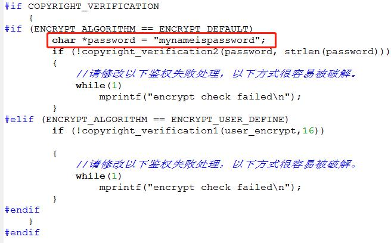
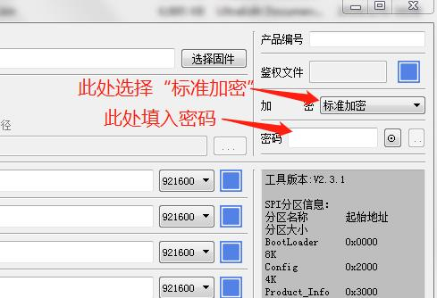
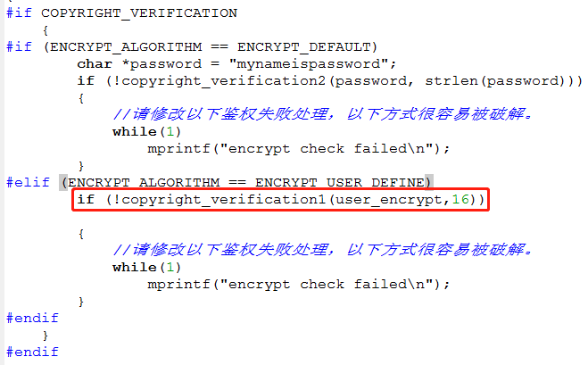
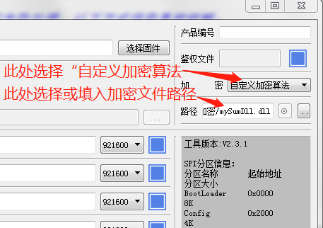

# FLASH加密功能使用说明

***

## 1. FLASH加密的目的

FLASH加密的目的是为了防止应用开发商开发的产品被不良厂商通过复制FLASH的方式，抄袭生产。如果不以此为目的，使用该加密功能将无任何意义。使用此加密功能后，如果FLASH固件被COPY到另一块FLASH中，将提示校验失败（用户也可以自定义其他处理方式）。

***

## 2. SDK支持的加密方式

SDK支持两种加密方式，一种是用户自定义加密算法，提供给升级工具和SDK调用，此种方式能让用户的加密算法得到保密，安全性更高，但复杂性和工作量也相对较大一些。另一种是SDK自带默认加密算法，用户只需要在升级工具和SDK中输入相同的密码，用户使用简单。

### 2.1. 默认加密算法方式

此种加密方式，使用简单，用户开发量小，对安全性要求不高的客户可以使用此式。

#### 2.1.1. SDK的相关修改

* 修改user_config.h, 开启加密功能，COPYRIGHT_VERIFICATION 定义为1。
* 修改user_config.h, 设置加密方式，ENCRYPT_ALGORITHM 默认定义为 ENCRYPT_DEFAULT。
* 修改ci_flash_data_info.c, 在函数 ci_flash_data_info_init中，copyright_verification2 被调用之前，修改加密密码为自己的密码，如下图：

 {: .center}

* 修改修改ci_flash_data_info.c, copyright_verification2 被调用之后，校验失败的处理方式，SDK中的示例代码是死循环不停打印校验失败的信息，建议用户修改此种方式，因为这种提示方式容易被逆向工程破解。

#### 2.1.2. 升级工具的使用

* 在用升级工具更新固件时，选择加密算法为“标准加密”，填入密码，如下图：

 {: .center}

* 打开串口正常升级即可。

### 2.2. 用户自定义加密算法方式  

此种加密方式，使用稍微复杂一些，用户开发量稍微大一点，对安全性要求高一点客户可以使用此式。

#### 2.2.1. 自定义加密算法接口  

##### 2.2.1.1. c++ 接口：

```c++
//psrc:     源数据buffer
//src_len:  源数据长度
//pdst:     输出buffer，用于保存加密结果
//dst_len:  输出buffer大小
//out_len:  用于输出结果数据的长度
//注意: 如果pdst为NULL,则只计算结果数据的长度
bool func(char *psrc, int src_len, char *pdst, int dst_len, int *out_len)
```

##### 2.2.1.2. python 接口：

```python
def encrypt(data):
    out_data = your_encrypt(data)   #示例代码，用户需要修改为自己的算法
    return out_data
```

#### 2.2.2. SDK的相关修改

* 修改user_config.h, COPYRIGHT_VERIFICATION 定义为1
* 修改user_config.h, ENCRYPT_ALGORITHM 定义为 ENCRYPT_USER_DEFINE
* 按照[自定义加密算法接口](#-自定义加密算法接口)2.2.1节所给接口编写自定义加密算法函数。
* 修改ci_flash_data_info.c, 在函数 ci_flash_data_info_init中，调用copyright_verification1的时候，修改参数，传入自定义的加密函数，如下图：

 {: .center}

* 修改ci_flash_data_info.c, copyright_verification1 被调用之后，校验失败的处理方式，SDK中的示例代码是死循环不停打印校验失败的信息，建议用户修改此种方式，因为这种提示方式容易被逆向工程破解。

#### 2.2.3. 升级工具的使用

* 按照[自定义加密算法接口](#-自定义加密算法接口)2.2.1节编写自定义加密算法函数，当前升级工具支持的调用方式有：C++动态链接库(.dll)、python源代码(.py)、python字节码文件(.pyc)。

* 在用升级工具更新固件时，选择加密算法为“标准加密”，填入密码，如下图：

 {: .center}

* 打开串口正常升级即可。

***

## 3. 适用环境

经测试已确认支持的flash:
* 华邦WINBOND
* 兆易创新GIGADEVICE
