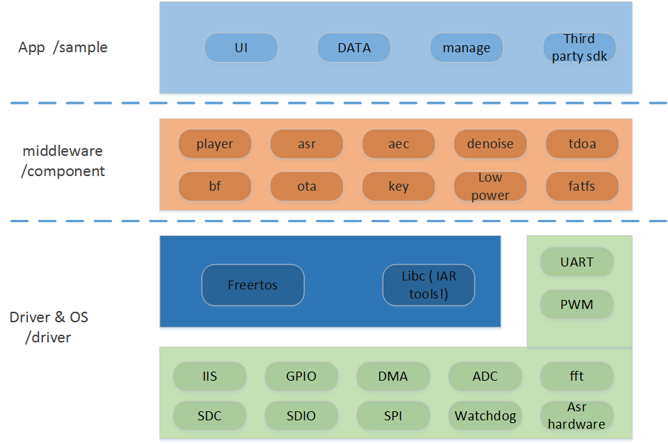
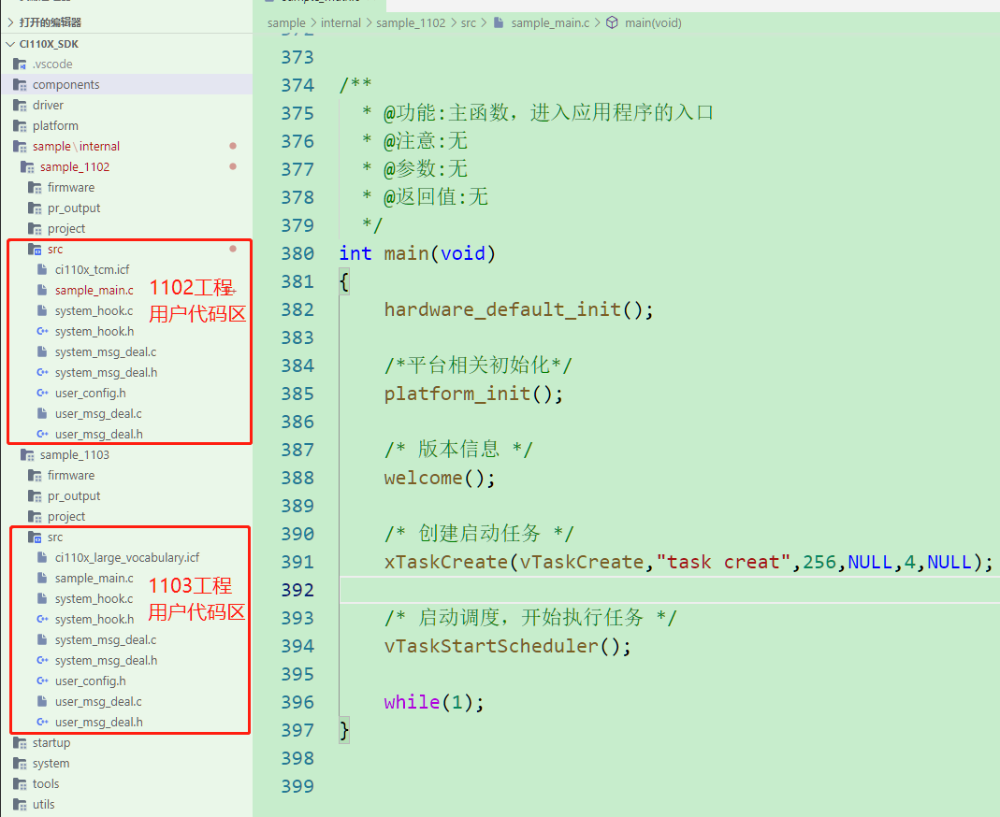
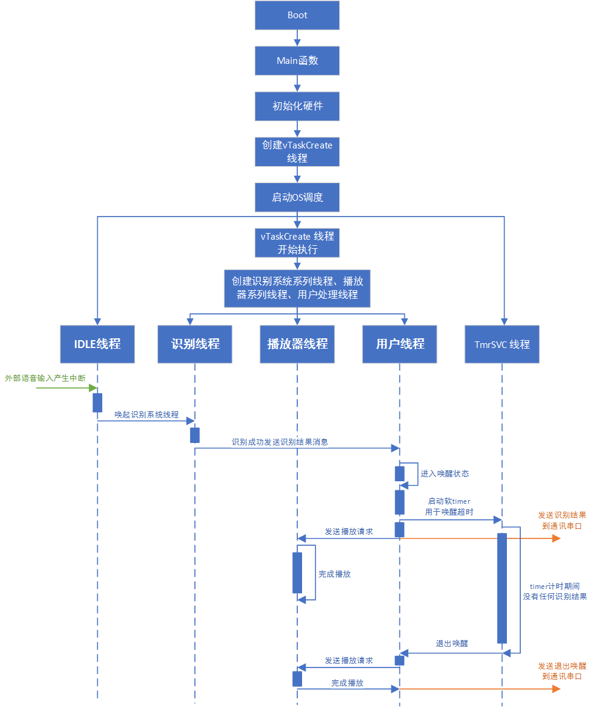

# SDK软件结构

***

## 1. SDK软件结构图

 {: .center }

 <div align=center>图1-1 SDK软件结构</div>

***

## 2. SDK目录结构

```
--components                 // 功能组件
----asr                      // 语音识别
----alg                      // 语音前处理算法库
------basic_alg              // 语音前处理算法库基础库
------beamforming            // 语音增强
------denoise                // 降噪
------iir_hpf                // 滤波
------doa                    // 声源定位
----assist                   // 辅助函数，例如：测试算法的计时函数等
----audio_in_manage          // 音频采集实时任务
----audio_pre_rslt_iis_out   // 语音前处理结果输出组件
----ci_key                   // 按键驱动管理组件
----ci_nvdm                  // 用户数据管理
----cmd_info                 // 固件信息解析
----cmsis                    // arm cmsis
----DLib_Port                // iar c库移植层
----example                  // 通用示例代码
----fatfs                    // 文件系统
----fft                      // fft管理器
----flash_control            // flash管理器
----flash_encrypt            // flash加密策略
----freertos                 // 操作系统
----http                     // http接口
----ir_remote_driver         // 红外驱动管理器
----led                      // 三色灯控管理器
----libduer                  // dueros移植层
----lwip_v1.4.1              // tcpip协议栈
----misc                     // 杂类
----msg_com                  // 串口协议
----one_wire                 // 单总线协议
----opus                     // opus音频编码算法  
----player                   // 播放器
----printf                   // 调试log输出
----sensor                   // 传感器管理器
----speex                    // speex音频编码算法  
----sys_monitor              // 系统监控器
----vad_for_cloud            // 云+端vad算法
--sample                     // 应用示例代码
----internal                 // 应用示例代码模板工程
------sample_1102            // ci1102灯控模板工程
------sample_1103            // ci1103大命令词灯控模板工程
------sample_media           // ci1103云+端模板工程
------sample_doa             // ci1103doa模板工程
------sample_wifi            // ci1103单麦dueros模板工程
--driver                     // 驱动
----ci110x_chip_driver       // 例如：IIC驱动
----third_device_driver      // 例如：外部codec驱动（例如ES8388）
--startup                    // 启动代码
--system                     // 统一使用的头定义等
--tools                      // 固件构建工具
--utils                      // 调试工具集
```

***

## 3. SDK用户代码说明

SDK用户代码区域如下图3-1所示：

 {: .center }

 <div align=center>图3-1 SDK用户代码区域</div>

下列文件所在目录：

* CI110X_SDK\sample\internal\sample_1102\src\

* CI110X_SDK\sample\internal\sample_1103\src\

| 文件名                | 描述                                                              |
| --------------------- | ----------------------------------------------------------------- |
|  sample_main.c        | 主函数所在文件：包含任务创建、平台初始化、系统启动代码            |
|  system_hook.c        | 事件钩子接口c文件：系统启动、唤醒、退出唤醒、语音识别事件钩子函数 |
|  system_hook.h        | 事件钩子接口h文件                                                 |
|  system_msg_deal.c    | 系统消息处理任务c文件                                             |
|  system_msg_deal.h    | 系统消息处理任务h文件                                             |
|  user_config.h        | 用户配置宏定义.h文件                                              |
|  user_msg_deal.c      | 用户代码.c文件：串口协议、IIC协议、按键消息等用户处理             |
|  user_msg_deal.h      | 用户代码.h文件                                                    |

***

## 4. 添加代码示例

（1）. 针对唤醒词添加协议等处理代码，找到CI110X_SDK\sample\internal\sample_1102\src，

* 先在user_msg_deal.h里添加处理接口声明，例如：

```c
void wake_up_xxx_deal(void);
```

* 然后在user_msg_deal.c里添加处理接口定义，例如：

```c
void wake_up_xxx_deal(void)
{
    /*处理接口逻辑代码*/
}
```

* 最后在system_hook.c里调用接口，例如：

```c
__WEAK void sys_weakup_hook(void)
{
    #if MSG_COM_USE_UART_EN
    vmup_send_notify(VMUP_MSG_DATA_NOTIFY_WAKEUPENTER);
    #endif

    /*此处添加处理接口调用*/
    wake_up_xxx_deal();
}

```

!!! note "注意"
     系统其他状态（系统启动、系统退出唤醒、语音识别），也可参照上述方式添加代码，但需在对应的事件钩子函数中调用。

（2）、根据命令词ID添加处理代码，找到CI110X_SDK\sample\internal\sample_1102\src\user_msg_deal.c的deal_asr_msg_by_cmd_id函数。

命令词ID的对应命令词，由CI110X_SDK\sample\internal\sample_1102\firmware\user_file\cmd_info\[60000]{xxx}cmd_info.xls指定

```c
uint32_t deal_asr_msg_by_cmd_id(xxx)
{
    uint32_t ret = 1;
    int select_index = -1;
    switch(cmd_id)
    {
        case 2://“打开空调”
        {
            /*此处根据命令词ID添加处理代码*/
            break;
        }
        /*自行添加case处理命令词ID*/
        /*省略部分代码*/
        default:
            ret = 0;
            break;
    }
    /*省略部分代码*/
}
```

（3）、根据语义ID添加处理代码，找到CI110X_SDK\sample\internal\sample_1102\src\user_msg_deal.c的deal_asr_msg_by_semantic_id函数。

更多语义ID信息可以访问 ☞[《CI110X语义ID文档说明》](./CI110X语义ID文档说明.md)页面

```c
uint32_t deal_asr_msg_by_cmd_id(xxx)
{
    uint32_t ret = 1;
    if (PRODUCT_GENERAL == get_product_id_from_semantic_id(semantic_id))
    {
        uint8_t vol;
        int select_index = -1;
        switch(get_function_id_from_semantic_id(semantic_id))
        {
        case VOLUME_UP:        //增大音量
            vol = vol_set(vol_get() + 1);
            select_index = (vol == VOLUME_MAX) ? 1:0;
            break;
        case XXX_XXX:
            /*此处根据语义ID添加处理代码*/
            break;
        /*自行添加case处理语义ID*/
        /*省略部分代码*/
        default:
            ret = 0;
            break;
        }
        /*省略部分代码*/
    }
    /*省略部分代码*/
}
```

## 5. SDK代码逻辑分析

由于语音识别的系统的特定需要，因此SDK中程序已经包含了大量初始化工作，为了帮助用户更快的熟悉代码结构流程，现将程序启动流程和工作状态做以简单说明。

 {: .center }

 <div align=center>图5-1 SDK程序启动流程和工作状态</div>

如上图所示，系统上电启动后进入main函数初始化相关硬件，然后创建一个vTaskCreate线程后启动FreeRTOS系统，vTaskCreate线程中会创建识别和播报的相关线程，之后系统进入sleep状态并采集语音输入，当正确的语音输入给识别线程后，识别线程将通过消息队列的机制将消息发送到用户线程中进行处理，在SDK的用户线程中，已经完成了一部分操作比如播放对应的播报语音，切换系统状态，发送串口协议等工作，用户增加代码时一般只需在用户线程中增加代码，因此理解用户线程的中的消息处理机制就可以轻松扩展功能。
