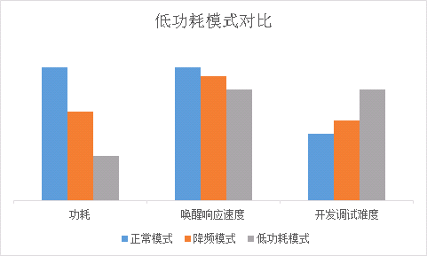

# 低功耗使用说明

***

## 1. 概述

目前CI110XSDK中支持以下两种低功耗模式:

- 降频模式
- 低功耗模式

启用这两种模式后，当系统处于非唤醒状态则进入对应模式，已达到降低功耗的目的，而处于唤醒状态下则不会受到影响。

***

## 2. 降频模式

降频模式是一种将系统主频降低为原频率一半的做法，由于保留了语音识别全流程所需外设的所有时钟，对系统流程影响极小，通过该模式可以降低接近一半的功耗。

使用方法：

- 在user_config.h中定义USE_LOWPOWER_DOWN_FREQUENCY宏为1
- 在user_config.h中定义USE_SEPARATE_WAKEUP_EN宏为1
- 打包固件时添加一个仅用于唤醒的模型(这种模型对芯片硬件资源消耗较少，适合在低频模式下工作)

按照上述操作即可在非唤醒状态下启用降频模式降低功耗

***

## 3. 低功耗模式

低功耗模式是在系统退出唤醒模式后，将芯片内倍频器关闭直接采用外部晶振时钟工作的方式，在这种模式下，会关闭大部分外设资源，仅保留语音输入系统（iis、codec）、语音检测（vad）的时钟，待vad开始到来会将系统主频提升至降频模式频率用于语音识别流程，当语音识别结果正确触发唤醒，则系统继续提升频率到全速模式，若未下发正确的唤醒词则再次回到低功耗模式。综上所述，低功耗模式存在三段频率模式的切换机制，对系统识别影响较小，通过该模式可以获得极低的功耗

使用方法：

- 在user_config.h中定义USE_LOWPOWER_OSC_FREQUENCY宏为1
- 在user_config.h中定义USE_SEPARATE_WAKEUP_EN宏为1
- 打包固件时添加一个仅用于唤醒的模型(这种模型对芯片硬件资源消耗较少，适合在低频模式下工作)

按照上述操作即可在非唤醒状态下启用降频模式降低功耗

!!! warning "警告"
    注意定义USE_LOWPOWER_OSC_FREQUENCY宏后，无论USE_LOWPOWER_DOWN_FREQUENCY宏为0还是1均会处于低功耗模式，而非降频模式

***

## 4. 功耗模式对比

 {: .center}
 
***

## 5. 低功耗模式用户扩展

在进入退出低功耗时，往往需要添加自己的操作代码，sdk中增加了一个注册接口用于注册低功耗用户hook函数，用法如下：

```c
extern void register_lowpower_user_fn(void * enter_lowpower_fn,void * exit_lowpower_fn);

void user_enter_lowpower(void)
{
    //进入低功耗
    uint32_t clk;
    clk = get_ipcore_clk(); //可以通过这一组函数获取进入低功耗模式后，当前时钟频率
    /* 省略处理函数 */
    clk = get_apb_clk();
    /* 省略处理函数 */
}

void user_exit_lowpower(void)
{
    //退出低功耗
    uint32_t clk;
    clk = get_ipcore_clk(); //可以通过这一组函数获取进入低功耗模式后，当前时钟频率
    /* 省略处理函数 */
    clk = get_apb_clk();
    /* 省略处理函数 */
}

int main(void)
{
    //注册用户扩展函数
    register_lowpower_user_fn((void*)user_enter_lowpower,(void*)user_exit_lowpower);
}
```
