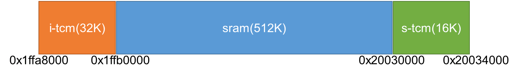
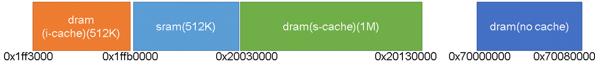
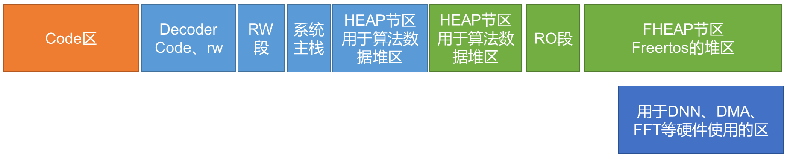

# 内存结构

***

## 1. 概述

CI110X系列包含两种型号，其中主要区别为片上DRAM大小，分别为无片上DRAM、2MDRAM。针对两种不同的芯片在sdk根目录的utils目录内提供了两种工程icf连接脚本文件以及用于iar调试的codeloader文件。下面对两种型号的内存分配作以介绍：

### 1.1. CI1102

CI1102由于没有片上DRAM，则系统cache不需要cache功能，通常我们将cache配置为TCMRAM增加RAM资源

- 下图为内存地址映射图

{: .center}

1.SRAM：512K，这片区域的内存空间使用没有任何限制

2.i-tcm：32K，tcm为紧耦合cpu的内存区域，而itcm顾名思义只能通过cpu的i-bus访问，因此如果将d-bus访问的数据放置在此处会出现错误，d-bus访问的数据包括：rw段、ro段以及code中dc32伪指令产生的地址数据

3.s-tcm：16K，只能通过cpu的s-bus访问的内存区域，对于m4内核s-bus，既读取指令也读取数据因此没有像itcm那样的限制，但是需要注意的是DMA、FFT等硬件外设是无法直接访问这里的

- 下图为系统初始化完成后的内存地址分配图

{: .center}

1.Itcm区放置算法的code段，目前sdk配置asr、aec、denoise算法的code代码位于此处

2.从sram开始的地址0x1ffb0000开始依次放置code、FHEAP、HEAP、RW，其中HEAP区通过malloc申请free释放，提供算法使用，FHEAP通过pvPortMalloc申请vPortFree释放，用于应用开发使用和os使用（在任务中的局部变量使用任务栈，即使用的FHEAP区），code区包括text段和ro段，RW包括data段bss段（即有无初值的全局变量）。

3.Stcm也作为rw数据的存放区，同时在尾部包括4K的系统主栈，主栈用于os启动调度前的栈空间和中断服务函数内使用的栈空间

!!! note "注意"
    紧耦合的RAM段即TCM区由于其仅连接系统某一条总线，故其仅能被固定的总线访问，对于ITCM仅可以被Ibus访问，因此此处不可作为数据段存放数据（包括RO、RW以及code中的立即数），而对于STCM则没有此限制（因为Sbus可以访问数据和地址）

!!! warning "警告"
    紧耦合的RAM段即TCM区无法被系统DMA使用

### 1.2. CI1103

对于2M片上DRAM的CI1103芯片，应用于大命令词的地址映射，一种典型分配如下：

{: .center}

1.SRAM：512K，这片区域的内存空间使用没有任何限制

2.DRAM(i-cache)：512K，这片区域映射的是2MDRAM物理器件的后512K空间，这片区域可以通过i-bus和d-bus访问，主要功能为运行代码，由于DRAM效率不高，所以使用了i-cache提高i-bus访问此空间的效率

3.DRAM(s-cache)：1M，这片区域映射的是2MDRAM物理器件的512K开始1M大小空间，这片区域可以通过s-bus访问，主要用于存放数据，由于DRAM效率不高，所以使用了s-cache提高s-bus访问此空间的效率，在开启s-cache情况下，dma、fft等硬件外设无法访问此处空间。

4.DRAM(no chache):512K，这片区域映射的是2MDRAM物理器件前512K空间，这片区域通过s-bus访问DRAM，未使用cache，因此可以正常使用dma、fft等硬件访问此处。

下图为系统初始化完成后的内存地址分配图:

{: .center}

1.Code区只包括text段和作为ro段LMA

2.Sram被分为三部分包括decoder专用code、rw区，heap区用于算法申请使用，rw用于bss，data，主栈

3.Scache区域有较大的空间用于应用开发所需的内存申请和作为ro段VMA以及部分用于heap区，之所以ro段要在这里运行的原因是dbus访问DRAM效率不高而没有cache所以将ro段搬运此处运行，最后此处的FHEAP位于scache上，申请的内存均不可以用于dma、fft等硬件使用，（再次强调：任务栈也是申请的FHEAP区域，因此任务中的局部变量亦不能用于dma、fft等硬件使用）

4.DRAM中的no cahe区用于dnn、dma、fft等硬件访问的地址，此区域不开启cache可以保证硬件访问的正确性但访问速度较慢，需根据情况使用

!!! warning "警告"
    psarm区地址本身可以被DMA访问，但cache区无法被系统DMA使用，所以开启cache后的psarm无法通过DMA访问

***

## 2. 如何修改各个区域大小（icf文件修改）

上文所述的典型的配置方案能满足绝大多数配置需求，但针对特定应用方案时往往需要对部分区域大小做适当调整，本节主要，描述系统连接脚本的修改方法

### 2.1. ci1102

以下代码块节选自ci1102工程模板icf文件

```
define symbol ROM_SIZE              = 1024*(120);
define symbol FHEAP_SIZE            = 1024*(32+32+34);/*asr pcmbuf:32KB,playbuf:32KB,*/
define symbol RAM_SIZE              = 1024*(20);
define symbol ASR_USED_SIZE         = 1024*(150+32+64+15+29);/*dec:150,fft:32,dnn:64,vp:15*/
define symbol STACK_SIZE            = 0x1000;/*inclued in RW*/

if(528*1024 != (ROM_SIZE+FHEAP_SIZE+RAM_SIZE+ASR_USED_SIZE))
{
    error "Unsupported configuration size";
}

```

其中

- ROM_SIZE对应用户code区，通常增加代码会导致对该区域内存大小需求增加

- FHEAP_SIZE为用户堆区，通常用户使用pvPortMalloc函数申请动态内存即从此区域申请，同时freertos中的相关接口也从该区域申请内存，例如创建任务、信号量、队列、事件组等，若用户程序增加了以上内容则需要适量增加该区域大小

- RAM_SIZE对应用户数据区，通常增加全局变量会导致对该区域内存大小需求增加

- ASR_USED_SIZE对应sdk中语音识别、aec、denoise等算法申请数据区大小，此区域通常情况是不需要变更的，但是注意在裁剪功能时可以对此区域进行减小，列如不需要使用aec、denoise算法时，且其他用户代码对内存要求较多时可以适量减小此区域大小，这里给出一个参考内存需求，关于asr部分内存需求请参考平台生成模型时提供的内存需求参考大小。

| 算法    | 内存需求 |
| ------- | -------- |
| aec     | 39K      |
| denoise | 31K      |

最后，了解了上述内存区域后，就可以自行修改这四个参数的大小，但要注意这四个参数之和为528K，如果大小不满这个要求，编译器将提示"Unsupported configuration size"错误。

### 2.2. ci1103

以下代码块节选自ci1103工程模板icf文件

```
define symbol ROM_SIZE                = 1024*(256);
define symbol DECODER_CODE_RW_SIZE    = 1024*(15);
define symbol RAM_SIZE                = 1024*(70);
define symbol DECODER_USED_SIZE       = 1024*(427);
define symbol RODATA_SIZE             = 1024*(30);
define symbol FHEAP_SIZE              = 1024*(1506);
define symbol NO_CACHE_PSRAM_SIZE     = 1024*(256);
define symbol STACK_SIZE              = 0x1000;

if(2*1024*1024+1*512*1024 != (ROM_SIZE+DECODER_CODE_RW_SIZE+DECODER_USED_SIZE+RAM_SIZE+RODATA_SIZE+FHEAP_SIZE+NO_CACHE_PSRAM_SIZE))
{
    error "Unsupported configuration size";
}

```

其中

- ROM_SIZE对应用户code区，通常增加代码会导致对该区域内存大小需求增加
- DECODER_CODE_RW_SIZE对应语音识别系统代码段和全局变量内存需要，此区域size以sdk发布时为准不可修改
- RAM_SIZE对应用户数据区，通常增加全局变量会导致对该区域内存大小需求增加
- DECODER_USED_SIZE对应sdk中语音识别、aec、denoise等算法申请数据区大小，此区域通常情况是不需要变更的，但是注意在裁剪功能时可以对此区域进行减小，列如不需要使用aec、denoise、bf、doa等算法时，且其他用户代码对内存要求较多时可以适量减小此区域大小，这里给出一个参考内存需求，关于asr部分内存需求请参考平台生成模型时提供的内存需求参考大小。

| 算法    | 内存需求 |
| ------- | -------- |
| aec     | 39K      |
| denoise | 31K      |

- RODATA_SIZE为只读数据段，通常增加const变量会导致对该区域内存大小需求增加
- FHEAP_SIZE为用户堆区，通常用户使用pvPortMalloc函数申请动态内存即从此区域申请，同时freertos中的相关接口也从该区域申请内存，例如创建任务、信号量、队列、事件组等，若用户程序增加了以上内容则需要适量增加该区域大小
- NO_CACHE_PSRAM_SIZE区域仅用于语音识别系统内dnn输出使用，此区域size以sdk发布时为准不可修改

最后，了解了上述内存区域后，就可以自行修改这六个参数的大小，但要注意这六个参数之和为2.5M，如果大小不满这个要求，编译器将提示"Unsupported configuration size"错误。

!!! warning "警告"
    需要强调的是DECODER_CODE_RW_SIZE、RAM_SIZE、DECODER_USED_SIZE三者之和应为512K，否则不能保证语音识别系统申请内存位于sram区域，影响性能或直接导致出现严重错误。

***

## 3. 常见问题

- 以上内存模型的链接脚本均提供在sdk根目录utils目录内提供模板，使用时需拷贝到工程目录中使用，不建议较大改动连接脚本内容，仅根据需要调整各部分区域size大小即可。
- 使用以上内存模型，系统会在bootloader中根据usercode.bin文件的信息检测出内存分配方式进而直接配置系统内存映射，使user程序运行之初便完成内存分配。
- 使用以上内存模型进行开发调试阶段，需要配置的.borad文件作为codeloader程序在调试前初始化系统内存映射关系，从而进行正常的调试，.borad文件位于sdk根目录utils目录内。
