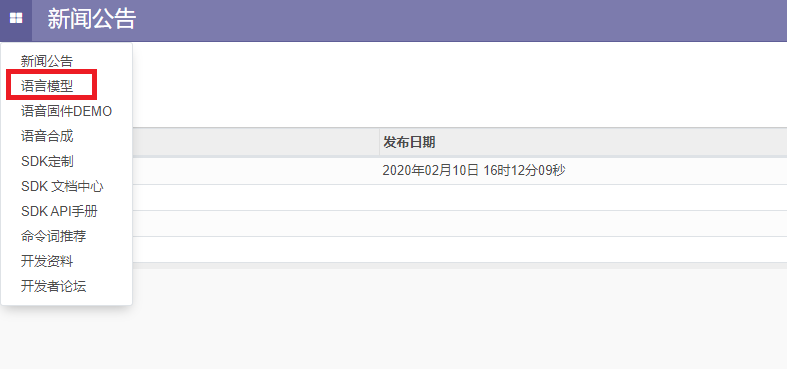
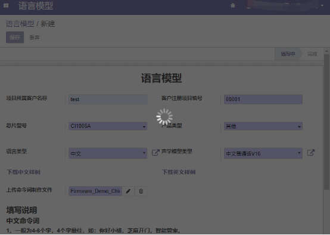

# 命令词和固件制作指南

***

## 1. 语音识别处理流程及所需资源

语音识别的流程及所需资源如下图所示，麦克风将语音转换为数字信号，送到DNN做识别。DNN识别需要两个资源，声学模型和语言模型，DNN识别后输出字符串。然后到命令词信息表里查找DNN输出的字符串，如果未找到，说明误识别，不处理。如果查找到，就是有效识别，然后根据查找到的命令词获取相关信息，进行相应应用功能处理，最后调用提示音播放器播放提示音。

 {: .center}

!!! note "注解"
        * 语言模型：根据命令词生成，用于DNN识别。
        * 声学模型：用与DNN识别，一般根据语言，应用场景等因数相关。
        * 命令词信息表: 用于保存命令词相关的信息，比如命令字符串、是否是唤醒词、对应的提示音等等。
        * 提示音：用于识别到命令词后，做相应的反馈提示，当前支持PCM和MP3格式，SDK中通过宏AUDIO_PLAY_SUPPT_MP3_PROMPT 切换。

后面的章节会介绍如何生成所需的资源。

***

## 2. 生成语言模型

### 2.1. 准备命令词字符串文件

- 登录[启英泰伦语音AI平台](http://platform.chipintelli.com), 进入语言模型界面：  

 {: .center}

- 创建项目： 

 {: .center}

- 点击模板按钮，下载对应的模板文件：

 {: .center} 

- 打开下载的模板文件，参照文件格式，编辑命令词：

 {: .center}

!!! note "注解"
        1. 命令词：需要语音识别的命令词字符串。  
        2. 命令词类型：指定命令词是否为唤醒词，如果指定了唤醒词，平台会生成双网络数据。  
        3. 双网络：是指为了改善唤醒词的识别效果，为唤醒词单独做一个识别模型，其也的命令词做一个识别模型，就相当于这个项目用到了两个神经网络模型，简称双网络。  

### 2.2. 生成命令词语言模型(ASR.dat)

- 在语言模型界面填写项目相关信息，声学模型选择项中，CI110X芯片必须选带SE的。上传编辑好的命令词文件：

 {: .center}

- 点击左上角的“保存”按钮。

 {: .center} 

- 然后平台有个加载和生成模型的过程，请等待页面自动刷新，不要手动刷新，如果有错误，请按提示修改，再保存。

 {: .center}

- 页面处动刷新后，会出现下载链接，点击下载生成的模型文件： 
r}

- 解压下载的压缩包，可以得到命令词信息表文件："[60000]{xxxx}.xls" 和语言模型文件 "asr_zn_xxx_xxx.dat"  

 {: .center} 

***

## 3. 生成播报音(voice)

- 从平台主菜单进入“语音合成”界面, 并创建项目： 

 {: .center}

- 下载样例文件：

 {: .center}

- 解压下载压缩包，得到如下文件夹：

 {: .center} 

- 按照模板格式，编辑需要生成的播报音：

 {: .center}  

!!! note "注解"
    1. 音频序号：指定生成音频文件的ID号。
    2. 音频名：指定生成音频文件的文件名。
    3. 合成内容：语音内容

!!! important "提示"
    制作播报音也有一些规则可以减小固件大小，节省FLASH空间。SDK支持组合播报和选择播报，就可以把某些具有共性的词提取出来，制作成一个音频文件。
    比如，打开空间，打开电视，打开风扇，打开台灯，打开客厅灯，打开书房灯，这么多词都有“打开”一词，就可把“打开”做成一个单独的文件，在命令词信息表文件中，用组合播报的方式关联到命令词。
    再比如一些可以更换名字的项目，上电播报可能是“我是xxx, 你可以使用xxx来唤醒我”，可以把这名话拆分成4个音频:
    > 1. 我是
    > 2. xxx
    > 3. 你可以使用
    > 4. 来唤醒我
    在命令词信息表中关联播报音ID时填入"1+2+3+2+4"。

    其中"xxx"可以是多个名字，通过组合加选择播报的功能，在程序中根据情况选择播报，就不需要为每个名字生成一套播报音了。

- 回到平台“语音合成”界面，填写项目相关信息，点击“上传您的文件”按钮上传已编辑好的音频字符串文件。  

 {: .center}

- 点击左上角“保存”按钮，平台开始生成语音，可以需要等待一段时间：

 {: .center}

- 等页面提示生成成功，出现“下载语音合成文件”按钮，点击即可下载。

 {: .center}

***

## 4. 制作固件

### 4.1. 编辑命令词信息表文件

将前面下载得到的命令词信息表文件("[60000]{xxxx}.xls")拷贝到路径：%SDK_PATH%\sample\internal\\%project%\firmware\user_file\cmd_info，并按照项目逻辑做相关修改，主要是关联播报音，设置唤醒词，调整识别灵敏度等。

 {: .center}

!!! note "注解"
        1. 模型名：用于设置当前这套命令词对应的模型名称，目前就3个：DNN ID(声学模型文件ID)、ASR ID(语言模型文件ID）、VOICE GROUP(播报音目录ID)。
        2. 模型ID：用于设置当前这套命令词对应的模型ID号。
        3. 命令词：命令词字符串。
        4. 命令词语义ID：语义ID，启英泰伦自定义的字符串语义ID，具有唯一性，如果产品考虑家庭组网的话，可以用此ID解决多个设备的命令词冲突问题。
        5. 命令词ID：开发者自定义的命令词ID ，方便快速开发实现逻辑。默认不支持不同命令词使用相同的命令词ID，如果一定要可以修改脚本文件“cmd_info.bat”,cmd_info.exe 命令后添加“--no-cmd-id-duplicate-check”。
        6. 置信度：用于调整命令词的识别灵敏度，解决误识别等。
        7. 唤醒词：用于指定唤醒词。
        8. 组合词：用于指定组合词，既是唤醒词，又是命令词，少了唤醒一步。
        9. 期望词：用在某些命令词特别不容易识别时使用。
        10. 不期望词：用在某些命令词特别容易识别，而不能识别另外一个相似的正确命令词，导致误识别。
        11. 特殊词计数：用于短的命令词截获具有相同内容的长命令词的情况。比如：“加热”和“加热三分钟”，可能说“加热三分钟”，也会得到“加热”的结果。解决方法是给“加热”命令词设置特殊词计数，在识别到“加热”后，再等待一会，看后续是否有相近命令结果，如果有就丢弃“加热”。也不能设置的太大，否则会明显增大“加热”的响应时间。
        12. 播报音类型：主要用于多个选择播报时，指定选择的方式。当前支持两种，“随机选择”（调用播报接口时，select_index设置为-1），“自定义选择”(调用播报接口时，select_index设置为要选择的值)。
        13. 播报音ID：播报音文件ID（也就是[生成播报音](#生成播报音)中的音频序号），组合播报用‘+’连接，如果有多个选择播报，每个选择项占一列，最多127列。
        14. 模型分组ID：用于多模型切换。SDK demo中默认0为命令词模型，1为唤醒词模型。

!!! important "提示"
        1. 如果有未关联到命令词的播报，可以创建一个假命令词，也就是命令词字符串未用于生成语言模型，不会被识别到，但可以通过些字符串播放出来。
        2. 编辑命令词信息表文件的ID必需为60000，不能修改。
        3. 注意适当应用组合播报，选择播报，多模型切换功能，可以减小固件大小，节省FLASH空间。

 {: .center}

### 4.2. 编辑代码，实现项目需求

* 用户逻辑的实现主要在“system_msg_deal.c”文件中。
* UserTaskManageProcess函数就是用户逻辑处理任务，在这个任务里处理种消息比如：语音识别消息，按键消息，串口消息等。所有的消息都可以从这里开始跟到。
* 找到要处理的消息，实现对应的逻辑功能。比如IO控制，播报音选择，切换模型，参数调整，串口上报等等。
* 如果有需要关机保存的信息，可以使用ci_nvdm模块保存，请参考SDK中标准demo中音量设置相关代码。

!!! note "注"
         * 如果有用命令词切换模型的，同时切换模型的命令有语音播报，注意切换模型接口与语音播报的调用顺序，需要根据播报音所在的模型来定。

### 4.3. 合成并烧录固件

#### 4.3.1. 拷贝资源文件

固件制作目录如下图：

 {: .center}
 
* 将语言模型文件（asr_xxx.dat）放入firmware目录下的asr目录中, 按照《命令词信息表》("[60000]{xxxx}.xls")中ASR ID设置文件ID号。
* 将播报音文件放入firmware目录下的voice目录中，按照《命令词信息表》("[60000]{xxxx}.xls")中VOICE GROUP设置文件ID号。
* 编辑工程代码，生成user.bin，在user_code目录下。
* 合成分区bin文件，双击运行"合成分区bin文件.bat"，完成后，会在asr,dnn,user_file,voice目录下生成与目录同名的bin文件。

#### 4.3.2. 打包固件

打包升级，双击运“打包升级.bat"，在弹出界面选择“固件打包”：

 {: .center} 

进入打包界面：

 {: .center} 

!!! note "注解"
        1. 软硬件版本信息区。
        2. 固件分区信息区。

* 在版本信息区填写软硬件相关信息。
* 选择或填写各分区bin文件路径。
* 点击“刷新地址”，点击“打包固件”。
* 如果弹窗提示地址冲突，调整各分区大小，重新执行第3步。
* 弹窗提示“固件已生成”表示打包成功。

!!! important "提示"
        * “打包固件”时可能会弹窗提示：

        {: .center}
    
        说明user分区的预留大小不够，适当增加user分区的预留大小。
    
        * “刷新地址”时可能会弹窗提示：
    
        {: .center}
    
        这说明所有分区的大小之和大于了FLASH大小。试着调小某些分区的预留大小，看能否解决。如果所有分区都已调到极限，还是不够，那说明FLASH大小不能满足需求，要么更换更大的FLASH，要么精简某些分区资源。
    
        * 打包成功后会提示“固件已生成！"
    
        {: .center}

#### 4.3.3. 烧录固件

在打包升级工具中点击“固件升级”：
 
 {: .center}
 
* 选择或填写固件路径。
* 勾选待升级的设备所连接的串口。
* 其他选择：强制更新所有分区，鉴权文件，加密。
* 待升级模块切换到升级模式（短接PG、EN两个引脚）。
* 重启待升级设备，开始升级。
* 等待升级完成，如果顺利的话，升级成功后，设备会自动引导进固件代码，如果有上电播报音话，能听到上电播报。
