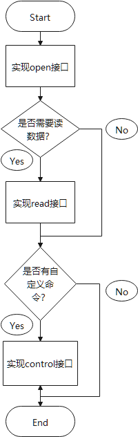

# 传感器管理组件（sensor manager）

***

## 1. 概述

在CI112X系列芯片中，传感器管理组件是不可或缺的一个组件；其目的是将设备中的传感器统一管理、为用户提供统一且友好的函数接口、最大限度减少客户二次开发代码的工作量；我们提供大量的传感器驱动程序和使用案例供客户尽快了解传感器管理组件、传感器驱动编写规范、应用程序如何使用传感器。

***

## 2. 目录介绍

| 文件名称           | 功能说明               |
| ------------------ | ---------------------- |
| sensor.c、sensor.h | 传感器管理组件源代码   |
| sensor_config.h    | 传感器管理组件配置信息 |
| sensor_test.c      | 传感器管理组件示例代码 |

***

## 3. 使用说明

### 3.1. 函数接口简介

> 以下API仅供传感器驱动程序调用

| 函数接口           | 说明           |
| ------------------ | -------------- |
| sensor_irq_inform  | 传感器中断通知 |
| sensor_data_inform | 传感器数据通知 |

> 以下API仅供应用程序调用

| 函数接口        | 说明                 |
| --------------- | -------------------- |
| sensor_register | 注册传感器           |
| sensor_open     | 打开传感器（初始化） |
| sensor_read     | 读取传感器数据       |
| sensor_control  | 执行传感器自定义命令 |

### 3.2. 传感器接入流程

* 根据实际情况实现以下API

 {: .center }

 <div align=center>图3-1 传感器接入流程</div>

* 配置sensor_config.h文件，填入传感器类型、数据类型、自定义命令

```c
/*-----------------------------------------------------------------------------
                        struct / enum / union
-----------------------------------------------------------------------------*/
/* 传感器自定义命令(此表可扩展) */
typedef enum
{
    asdasdas = 0,
}sensor_command_t;

/* 传感器类型(此表可扩展) */
typedef enum
{
    SENSOR_TYPE_TEMPERATURE     = 0,    /*!< 类型：温度传感器 */
    SENSOR_TYPE_HUMIDITY        = 1,    /*!< 类型：湿度传感器 */
    SENSOR_TYPE_MICROWAVE       = 2,    /*!< 类型：微波、雷达传感器*/
    SENSOR_TYPE_PARTICULATES    = 3,    /*!< 类型：悬浮粒子(PM2.5)传感器*/
    SENSOR_TYPE_GESTURE         = 4,    /*!< 类型：手势传感器*/
    SENSOR_TYPE_INFRARED_ARRAY  = 5,    /*!< 类型：红外阵列传感器 */
    SENSOR_TYPE_LASER_FINDER    = 6,    /*!< 类型：激光测距传感器 */
}sensor_type_t;

/* 传感器数据(此表可扩展) */
typedef union
{
    int32_t temperature;            /*!< 温度   单位：0.1℃*/
    float humidity;                 /*!< 湿度   单位：‰RH */
    float particulates;             /*!< 悬浮粒子(PM2.5)   单位：xx */
    double infrared_array[4 * 16];  /*!< 温度   单位：0.1℃*/
    uint16_t laser_finder;          /*!< 距离   单位：mm*/
}sensor_data_t;
```

* 传感器中断通知

某些传感器会在某种特定的情况下，以中断的形式通知APP发生了某事件，这时我们传感器驱动就需要实现中断回调函数：`void xxxx_callback(void)`，然后在此函数中调用传感器管理组件的中断通知API（`sensor_irq_inform(SENSOR_TYPE_XXXX);`）参数为此传感器类型，即可。

### 3.3. 传感器添加示例

```c
/**
 * @file RCWL_0801.c
 * @brief
 * @version 0.1
 * @date 2019-06-28
 *
 * @copyright Copyright (c) 2019  Chipintelli Technology Co., Ltd.
 *
 */
/*-----------------------------------------------------------------------------
                            include
-----------------------------------------------------------------------------*/
#include "RCWL_0801.h"
#include "ci_log.h"
#include "ci112x_uart.h"

/*-----------------------------------------------------------------------------
                            define
-----------------------------------------------------------------------------*/
#define RCWL_0801_RECEIVE_DATA_UART (UART1)/*!< 接收数据串口 */
#define RCWL_0801_RECEIVE_DATA_UART_IRQ (UART1_IRQn)/*!< 接收数据串口 */

#define RCWL_0801_INIT_CMD                      (0xA1)/*!< 初始化整个模块 */
#define RCWL_0801_OPEN_CMD                      (0xD0)/*!< 打开VL53L0X模块 */
#define RCWL_0801_CLOSE_CMD                     (0xD1)/*!< 关闭VL53L0X模块 */

#define RCWL_0801_READ_DATA_CMD                 (0xA0)/*!< 读取测量数据 */
#define RCWL_0801_READ_STATE_CMD                (0xF0)/*!< 读取当前状态 */

#define RCWL_0801_SET_RATE_9600_CMD             (0xB0)/*!< 波特率9600 */
#define RCWL_0801_SET_RATE_19200_CMD            (0xB1)/*!< 波特率19200 */
#define RCWL_0801_SET_RATE_115200_CMD           (0x02)/*!< 波特率115200 */

#define RCWL_0801_SET_MODE_DISTANCE_MODE_CMD    (0xC0)/*!< 长距离模式 */
#define RCWL_0801_SET_MODE_SPEED_MODE_CMD       (0xC1)/*!< 高速模式 */
#define RCWL_0801_SET_MODE_PRECISION_MODE_CMD   (0xC2)/*!< 高精度模式 */

/*-----------------------------------------------------------------------------
                            extern
-----------------------------------------------------------------------------*/

/*-----------------------------------------------------------------------------
                        struct / enum / union
-----------------------------------------------------------------------------*/

/*-----------------------------------------------------------------------------
                            global
-----------------------------------------------------------------------------*/
static uint8_t data_h,data_l;
static uint16_t rcwl_data = 0;

/*-----------------------------------------------------------------------------
                            declare
-----------------------------------------------------------------------------*/

/*-----------------------------------------------------------------------------
                            function
-----------------------------------------------------------------------------*/

/**
 * @brief rcwl_0801测试数据更新
 *
 */
void rcwl_0801_update(void)
{
    static uint8_t data_flag = 1;
    if(data_flag)
    {
        data_h = UART_RXDATA(RCWL_0801_RECEIVE_DATA_UART);
        data_flag = 0;
    }
    else
    {
        data_l = UART_RXDATA(RCWL_0801_RECEIVE_DATA_UART);
        rcwl_data = ((data_h << 8) + data_l);
        data_flag = 1;
    }
    UART_IntClear(RCWL_0801_RECEIVE_DATA_UART,UART_AllInt);
}

/**
 * @brief RCWL_0801传感器初始化
 *
 * @param irq_callback 中断回调
 * @retval RETURN_OK
 * @retval RETURN_ERR
 */
int32_t rcwl_0801_open(void)
{
    __eclic_irq_set_vector(RCWL_0801_RECEIVE_DATA_UART_IRQ,(uint32_t)rcwl_0801_update);
    UARTInterruptConfig(RCWL_0801_RECEIVE_DATA_UART,UART_BaudRate9600);
    /* init */
    UartPollingSenddata(RCWL_0801_RECEIVE_DATA_UART,RCWL_0801_INIT_CMD);
    UartPollingSenddone(RCWL_0801_RECEIVE_DATA_UART);
    return RETURN_OK;
}

/**
 * @brief RCWL_0801传感器读数据
 *
 * @param data 读到的数据
 * @retval RETURN_OK
 * @retval RETURN_ERR
 */
int32_t rcwl_0801_read(sensor_data_t *data)
{
    sensor_data_inform(SENSOR_TYPE_LASER_FINDER);
    data->laser_finder = rcwl_data;
    return RETURN_OK;
}

/**
 * @brief RCWL_0801传感器ops
 *
 */
sensor_ops_t rcwl_0801_ops =
{
    rcwl_0801_open,
    rcwl_0801_read,
};

/*-----------------------------------------------------------------------------
                            end of the file
-----------------------------------------------------------------------------*/
```
