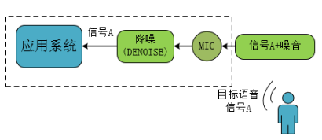
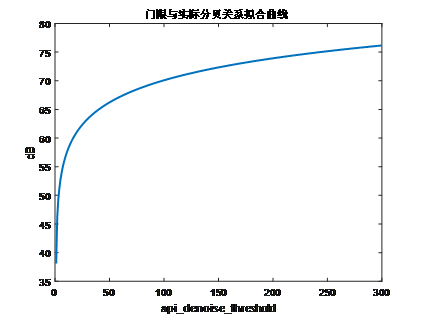
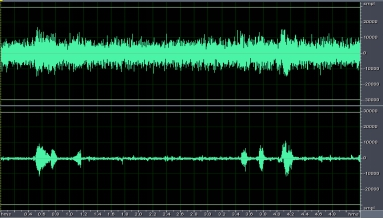
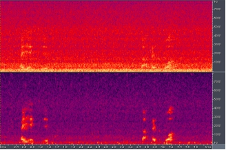

# 语音降噪使用说明

***
降噪（DENOISE）算法能有效抑制稳态噪声，在保证语音失真度的同时具有良好的噪声抑制效果。开启该功能后，可以通过降低稳态噪声的方式进行识别效果的提升，但是同时该功能会消耗24KB的芯片内部存储空间，并且会消耗CPU的带宽资源。本文档主要介绍降噪算法适用的场景，以及如何打开该功能。

***

## 1. **SDK中语音降噪算法的默认配置和对应硬件板**

CI112X的SDK支持降噪功能，具体为：

* 纯离线SDK：CI112X_SDK，降噪功能默认关闭，可配置为打开。该SDK可用于启英泰伦提供的模组板，或用户自行开发的模组板，具体硬件选型可咨询启英泰伦技术支持人员；

另如果用户需要测试降噪效果，还需要准备录音板（该录音板可在启英泰伦官网中的启英商城中购买）。用该录音板可以实现直接观察降噪的效果，用于调试。录音板的使用方法请参考语音AI平台中的《CI112X模组底噪录音分析》文档。

!!! important "提示"
    纯离线SDK，传入算法的是时域数据

***

## 2. **语音降噪算法应用方法**

语音降噪算法的应用原理示意框图如下，人声为目标语音信号A，噪音和信号A在应用环境进行复杂的混合后进入芯片，语音降噪算法可抑制噪音信号，提高信号A的信噪比，从而提升识别效果。

目前启英泰伦提供的语音降噪算法仅适用于稳态噪声。

{: .center }

<div align=center>图2-1 语音降噪算法应用原理示意框图</div>

***

## 3. **语音降噪算法软件配置方法**

用户可打开SDK包中的 \工程名称（如\sample\internal\sample_light）\src\user_config.h文件，修改下述宏定义配置语音降噪算法功能，如下：

```c
//打开语音降噪功能

#define USE_SINGLE_MIC_DENOISE        1

//关闭语音降噪功能

#define USE_SINGLE_MIC_DENOISE        0
```

语音降噪算法有以下常用函数可供用户使用：

* 降噪门限设置函数

```c
int ci_denoise_set_threshold( float denoise_threshold, int window_size );

/**

* @brief	降噪门限设置

   * @param api_eng_th   门限值决定当前噪声环境下是否进行降噪，默认值为4.5

   * @window_size        窗长大小用于处理判断是否进行降噪，默认值为20

   * @return int         0:降噪门限设置成功;其它:降噪门限设置失败

*/ 
```

上述函数中denoise_threshold为常用的设置参数，window_size使用默认值即可，下图是一个denoise_threshold的值与实际的分贝值的拟合关系曲线，可供用户参考。下图的数据与真实实测数据往往会存在误差，需调试人员根据实际噪音环境进行调试，判断在当前噪声条件下是否进行降噪。

{: .center }

<div align=center>图3-1 denoise_threshold值与实际分贝值的拟合关系曲线</div>

* 降噪状态获取函数

```c
int ci_denoise_get_status( void );

/**

   * @brief       获取当前降噪的状态，判断是否进行降噪 

   * @return int  0:没有进行降噪处理;1:进行降噪处理

*/
```

该函数可用于在软件程序中判断当前状态是否正在进行降噪处理。

***

## 4. **语音降噪算法软件配置方法**

为了产品效果更好，不同的产品开启降噪后，请使用对应的声学模型，如下：

| 场景介绍 | 使用距离 | 使用模型                |
| -------- | -------- | :---------------------- |
| 油烟机   | 2米以内  | 中文普通话单麦烟机SE159 |
| 风扇     | 5米以内  | 中文普通话SE150         |
| 卫浴     | 3米以内  | 中文普通话单麦水声SE130 |

***

## 5. **语音降噪算法软件调试说明**

* 为了更直观的观察算法的效果，用户可以借助录音板进行调试，录音板的使用方法请参考语音AI平台上的《CI112X模组底噪录音分析》文档。具体配置如下：

* 在SDK \components\audio_in_manage\alg_preprocess.c文件中，alg_preprocess_two_ch()函数调用的audio_pre_rslt_write_data(  (int16_t*)dst, (int16_t*)micl )函数为IIS输出的数据内容，开启后，录音板可以从IIS接口录制到声音，该函数说明如下：

  audio_pre_rslt_write_data函数中第一个参数为IIS输出的右声道的数据，第二个参数为IIS输出的左声道的数据，可以填写以下参数：

  dst：输出算法处理结果的数据

  Ref：输出原始获取到的参考声音

  Micl：输出麦克风左声道获取到的原始声音

  MicR：输出麦克风右声道获取到的原始声音

* 下图为录音板采音时域效果，该图上可以看到原始的左声道数据（上半图）为目标语音和噪音的混合，经过语音降噪算法处理后，抑制了噪声，提高了目标语音的信噪比（下半图）。

{: .center }

<div align=center>图5-1 录音板采音时域效果</div>

* 下面为同样该音频的频域显示。该结果为正常结果。

{: .center }

<div align=center>图5-1 音频的频域显示</div>