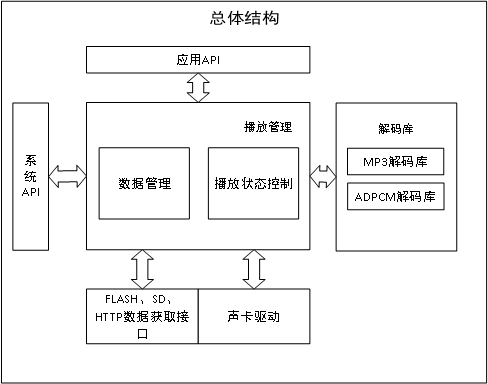
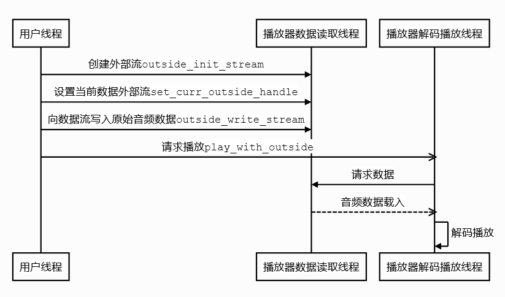
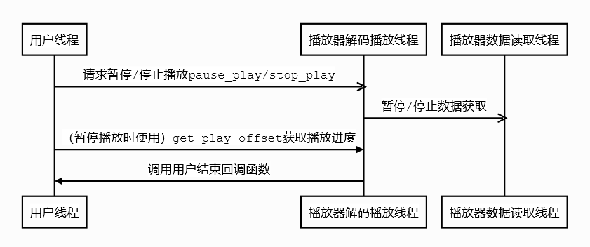
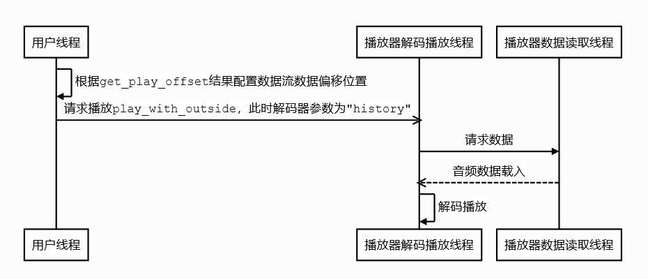
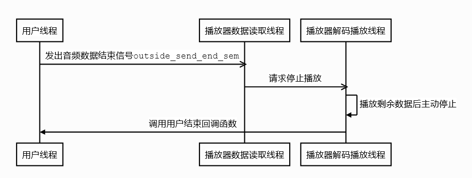

# 音频播放器(AUDIO PLAYER)

***

## 1. 概述

SDK内置组件轻量级音频播放器是一个非常重要的组件，CI112X作为一款语音识别芯片，在语音交互上语音播报是不可缺失的一环。该组件具有轻量、易用、可扩展的特点。播放组件可以支持解码器注册式扩展，用户可以自行注册音频解码器，例如MP3、M4A、ADPCM，完成相关解码器注册后即可使用通用播放器接口进行音频播放。播放器数据源获取已支持spiflash、sd卡、http网络下载和扩展写入接口。若是使用spiflash、sd卡、http网络下载可以直接使用相关api接口直接启动播放。而使用数据写入接口则可以自由调用写入函数将数据写入缓冲器，无需关心解码和硬件播放可以完成播放任务。

{: .center}

 <div align=center>图1-1 播放器结构</div>

***

## 2. 使用说明

### 2.1. 代码结构

| 源文件                                       | 说明             |
| -------------------------------------------- | ---------------- |
| audio_play_api.c<br>audio_play_api.h         | 播放器接口函数   |
| audio_play_decoder.c<br>audio_play_decoder.h | 解码器接口       |
| audio_play_device.c<br>audio_play_device.h   | 声卡硬件         |
| audio_play_os_port.c<br>audio_play_os_port.h | os抽象层         |
| audio_play_process.c<br>audio_play_process.h | 播放器调度主任务 |
| get_play_data.c<br>get_play_data.h           | 音频数据源获取   |

### 2.2. 解码器注册

播放器提供音频播放格式需要解码器的提供，解码器结构定义在audio_play_decoder中，在系统初始化时，需将使用到的音频格式相应的解码器通过registe_decoder_ops函数注册到播放器组件。

```c
registe_decoder_ops(&adpcm_decoder);  //注册adpcm解码器
registe_decoder_ops(&mp3_decoder);    //注册mp3解码器
```

!!! important "提示"
    相关音频播放格式需要解码器的提供，这里只提供注册ops接口

### 2.3. 预置数据源播放API

#### 2.3.1. 播放audio

play_audio函数提供了从SD卡和网络url播放音频文件的功能，使用示例如下：

```c
//播放来自文件系统/test128.mp3，0代表播放启始偏移，"mp3"为解码器类型带ID3V2头的标准mp3文件可以填NULL，播放器可以自动识别文件类型，NULL为播放完成时的回调函数注册
play_audio("/", "test128.mp3", 0, "mp3",NULL);
//播放来自网络192.168.31.1/test128.mp3，第二个参数填NULL，"mp3"为解码器类型，0代表播放启始偏移，NULL为播放完成时的回调函数注册
play_audio("192.168.31.1/test128.mp3", NULL, 0, "mp3",NULL);
```

#### 2.3.2. 播放语音命令词

play_prompt函数提供了从spiflash中播放adpcm播报词的功能，使用示例如下：

```c
//0x4000为flash内adpcm播报词音频地址，1为播放音频数量，NULL为播放完成时的回调
play_prompt(0x4000,1,NULL);
```

!!! important "提示"
    关于播报词音频在flash内的地址如何获取请使用cmd_info内的播放接口，目前播放器内接口已基本做为内部播放使用。

#### 2.3.3. 回调函数的利用

上述两个简单接口中均提到了播放完成时的回调函数，通过设置这个回调函数可以在播放完成时完成一些动作，比如设置恢复识别，发送播报结束信号，调度播放下一首等等。这里有一些实例：

* 循环连续播报词

```c
void play_index_next(void)
{
    static int index = 2;

    if(index >= 80)index = 1;
    play_prompt(0x4000+index*0x100,1,play_index_next);
}
//通过end回调、index计数连续播放adpcm
play_prompt(0x4000,1,play_index_next);
```

* 通过链表实现组合播放audio、adpcm等

```c
play_node_t *g_play_node = NULL;
void play_list_next(void)
{
    if(play_type_mp3 == g_play_node->play_info.play_type)
    {
        play_audio(g_play_node->play_info.audio_info.mp3_info.dir, g_play_node->play_info.audio_info.mp3_info.name, 0,"mp3", play_list_next);
    }
    else if(play_type_adpcm == g_play_node->play_info.play_type)
    {
        play_prompt(g_play_node->play_info.audio_info.adpcm_info.addr,1, play_list_next);
    }

    g_play_node = g_play_node->next_node;
}

//通过end回调、双向链表循环组合播放audio、播报词
play_info_t play_info;
play_list_t *play_list;

play_info.play_type = play_type_adpcm;
play_info.audio_info.adpcm_info.addr = 0x200;
play_list = creat_play_list(&play_info); //创建一个播放队列并添加adpcm播报词地址0x200

play_info.play_type = play_type_mp3;
play_info.audio_info.mp3_info.dir = "/";
play_info.audio_info.mp3_info.name = "tts16_1.mp3";
add_play_info(play_list,&play_info);    //向播放队列添加mp3 0:/tts16_1.mp3

play_info.play_type = play_type_adpcm;
play_info.audio_info.adpcm_info.addr = 0x800;
add_play_info(play_list,&play_info);    //向播报队列添加adpcm播报词地址0x800

play_info.play_type = play_type_mp3;
play_info.audio_info.mp3_info.dir = "/";
play_info.audio_info.mp3_info.name = "tts16.mp3";
add_play_info(play_list,&play_info);    //向播放队列添加mp3 0:/tts16.mp3

g_play_node = &(play_list->head_node);
play_list_next();                       //启动循环播放队列
```

* 通过回调实现打断继续播放功能,这里使用了pause_audio_play_prompt和continue_history_play两个API接口

```c
void play_continue(void)
{
    continue_history_play(NULL);
}
//先播放某个audio音频，每隔10S打断一次这个audio音频，播放另一个播报词，待播放结束后继续播放之前未完成的audio音频
int index = 1;
play_audio("/", "audio16.mp3", 0,"mp3", NULL);
for(;;)
{
    if(index >= 80) index = 1;
    vTaskDelay(pdMS_TO_TICKS(10000));
    pause_audio_play_prompt(0x4000+index*0x100,1,play_continue);
}
```

!!! important "提示"
    诸如此类示例在components\example\audio_play_sample.c中提供了更多参考代码。

### 2.4. 外部自定义数据源的使用

在audio_play_api中还提供了一组outside_*的接口，其目的是用于创建一个外部数据流，通过向数据流写入原始音频数据，就可以通过播放器的解码器到播放器实现播放功能。

| 接口名称                | 功能说明                                                 |
| ----------------------- | -------------------------------------------------------- |
| play_with_outside       | 请求播放外部数据                                         |
| outside_init_stream     | 创建外部数据流服务，需要传递数据流描述符和数据结束描述符 |
| outside_destroy_stream  | 销毁数据流                                               |
| set_curr_outside_handle | 设置当前播放器使用的数据流描述符                         |
| outside_send_end_sem    | 发送数据结束信号                                         |
| outside_write_stream    | 向数据流写入数据                                         |
| outside_clear_stream    | 清理数据流                                               |

这组接口中outside_init_stream函数可以创建一个外部数据流服务，通过set_curr_outside_handle设置当前播放器使用的数据流，即可通过outside_write_stream函数向数据流写入数据，此时调用播放接口播放器将自动从数据流中获取音频数据，并进行解码播放，当数据end时，使用outside_send_end_sem函数发送信号，这样在全部数据播放完成时，播放end回调函数将正常结束。使用外部数据流方式页同样可以使用播放器的开始暂停查询进度等接口。如图所示：

* 启动播放流程：

{: .center}

 <div align=center>图2-1 启动播放流程</div>

* 用户主动暂停/停止播放：

{: .center}

 <div align=center>图2-2 用户主动暂停/停止播放</div>

* 用户主动继续播放：

{: .center}

 <div align=center>图2-3 用户主动继续播放</div>

* 用户音频数据结束发出数据结束信号停止：

{: .center}

 <div align=center>图2-4 用户音频数据结束发出数据结束信号停止</div>

!!! note "注意"
    这组接口的数据管理需要用户自我管理，播放器将不负责数据进度信息
