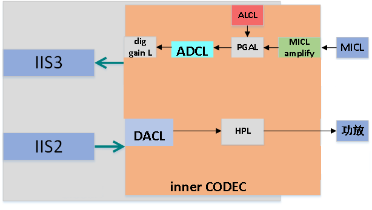

# 多媒体音频编解码器(CODEC)

***

## CODEC简介

 {:.center }
 
CODEC系统结构图

CI112X拥有一个内部的CODEC，在简单的应用场景中，无需再使用外部的CODEC芯片即可满足需求。内部CODEC可以接单路MIC，MIC输入的模拟信号经MIC增益，再经PGA放大。此PGA可通过CODEC本身的ALC控制,PGA之后，还可通过数字增益进行放大。

***

## CODEC特点

* DAC支持最多24bit，SNR可达92dB
* ADC支持最多24bit，SNR可达90dB
* 支持单端、差分的MIC输入和line-in输入
* 自带ALC（自动增益控制）
* 专门设计的ALC，更加适应CI112X，即ASR及算法使用
* 采样率支持：8k/12k/16k/24k/32k/44.1k/48k/96k
* 低功耗：单通道playback低至5mA；单通道采集语音低至5mA

***

## 使用示例

CODEC使用示例请查阅录音放音设备介绍。
