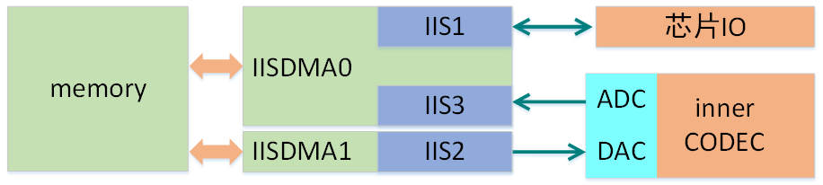

# 音频数字传输总线(IIS)

***

## IIS简介

{:.center }

IIS系统结构图

CI112X有3路IIS，这些IIS有通用或者特殊用途。IIS1为通用IIS，有TX和RX的功能，可外接其他CODEC芯片；IIS2专门给CI112X的内部CODEC DAC使用，管脚不外接，且只有TX功能；IIS3专门给内部CODEC ADC使用，管脚不外接，且只有RX功能。IIS1和IIS3共用一路IISDMA，IIS2单独使用一路IISDMA。

同时CI112X为IIS设计了专用IISDMA，专用于内存与IIS之间的数据传输。通过IISDMA不仅可以产生传输完成中断，还可以产生地址回卷中断，还可以直接与VAD模块联系起来。

***

## 使用示例

IIS&IISDMA使用示例请查阅录音放音设备介绍。
