# SDK Quick Start

***

## 1. 概述

本文为CI112X软件开发包（SDK）快速开发手册，旨在方便开发人员快速开发代码。

***

## 2. 用户指南

### 2.1. 开发环境

以下是开发过程中需要的软件和硬件：

* 软件：eclipse IDE
* SDK：CI112X_SDK_ASR_Offline
* 升级工具：PACK_UPDATE_TOOL.exe

#### 2.1.1. eclipse IDE

SDK 中所有的应用能够通过 eclipse 编译以及使用，所以在进行软件开发之前，首先取得并且安装 eclipse。

#### 2.1.2. CI112X_SDK_ASR_Offline

SDK包括示例工程，以及必要的工具。

#### 2.1.3. PACK_UPDATE_TOOL.exe

CI112X芯片串口升级工具，用于升级使用。关于串口升级步骤详见第4章烧录。

### 2.2. 硬件连接说明

* **串口：UART0_TX、UART0_RX**

  处于升级模式时，UART0_TX、UART0_RX用于串口升级使用，升级完成进入系统后，UART0_TX用于Log打印输出（Log打印输出详见第5章）。

* **模式选择：升级模式、正常模式**

  短接PG_EN到3.3V      ---> **升级模式**：通过本司的串口升级工具（PACK_UPDATE_TOOL.exe），更新Flash 里面的固件。

  不进行任何短接 ---> **正常模式**：不能进行串口升级。如果Flash里固件正确，系统正常启动。

!!! note "注意"
    短接PG_EN，必须重新上电，才会起作用。如果短接PG_EN到3.3V后，1s内没有使用串口升级工具进行升级，系统仍然会正常启动。

***

## 3. 应用程序

目前针对CI112X，已提供一套离线语音识别的SDK

### 3.1. SDK整体架构介绍

| 文件名     | 作用                                                         |
| ---------- | ------------------------------------------------------------ |
| components | 目录为组件，包括播放器、ASR识别、按键、传感器、FreeRTOS操作系统等 |
| driver     | 目录包括CI112X芯片底层驱动                                   |
| platform   | 目录包括平台相关配置                                         |
| sample     | 目录包括示例工程                                             |
| startup    | 目录包括CI112X启动代码                                       |
| system     | 目录包括系统相关代码、中断处理程序文件                       |
| tools      | 工具目录，主要是合并、打包升级工具                           |

### 3.2. CI112X_SDK示例工程介绍

为了帮助开发者快速创建应用程序，CI112X_SDK中已经创建了示例工程。通过学习示例工程，开发者可以很容易的熟悉SDK。

示例工程路径：CI112X_SDK\sample\internal\

| 工程文件                      | 作用                |
| ----------------------------- | ------------------- |
| sample_1122                  | CI1122 离线识别工程 |

***

## 4. 烧录

### 4.1. Images 相关

CI112X 应用要有5个images:asr.bin、dnn.bin、user.bin、user_file.bin和voice.bin

* asr.bin：语音模型

* dnn.bin：声学模型

* user.bin：开发者开发的应用程序

* user_file.bin：开发者定义的命令词列表以及开发者其他的bin文件

* voice.bin：播报音

### 4.2. Images 处理工具

* 路径：SDK\sample\internal\sample_1122\firmware\

* 名称：合成分区bin文件.bat

* 作用： 调用本脚本后，会在firmware\asr、dnn、user_file、voice各自目录下自动生成asr.bin、dnn.bin、user_file.bin和voice.bin文件。

### 4.3. 烧录方式

使用串口升级工具PACK_UPDATE_TOOL.exe进行升级固件，以sample_1122工程为例进行烧录。

#### 步骤1：串口升级硬件连线

（1）电源(5V/GND)

（2）短接PG_EN到3.3V

（3）TX0和RX0连接到USB转串口工具的RXD和TXD

（4）USB转串口工具，连接到PC

#### 步骤2：编译代码生成user.bin文件

（1）先双击eclipse IDE图标、或eclipse.exe文件打开编译器，点Browse选择工作目录（SDK软件包所在的任意上级目录均可），点击lunch后等待软件开启。

!!! note "注意"
    SDK软件包所在的任意上级目录名不能为中文

（2）打开软件后，如下图4-1所示，点击下列红框中橙色文字（Import exisiting project）查找SDK所在位置

 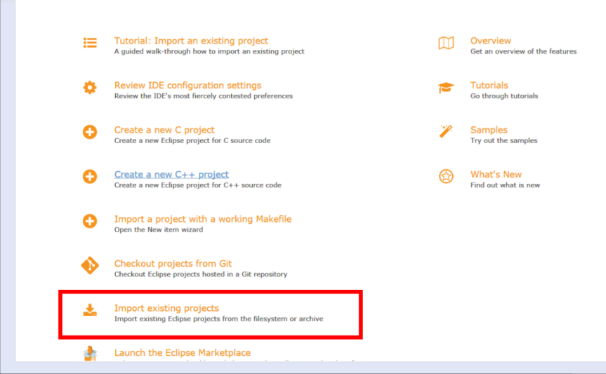{: .center }

 <div align=center>图4-1 软件起始页</div>

（3）来到查找SDK的界面，如下图4-2所示

  * **1：点Browse选择SDK所在目录，目录下包含SDK所有框架目录**
  * **2：选中SDK目录后，会自动勾选工程，如有多个工程，可只勾选自己需要的**
  * **3：点Finish即打开工程**

 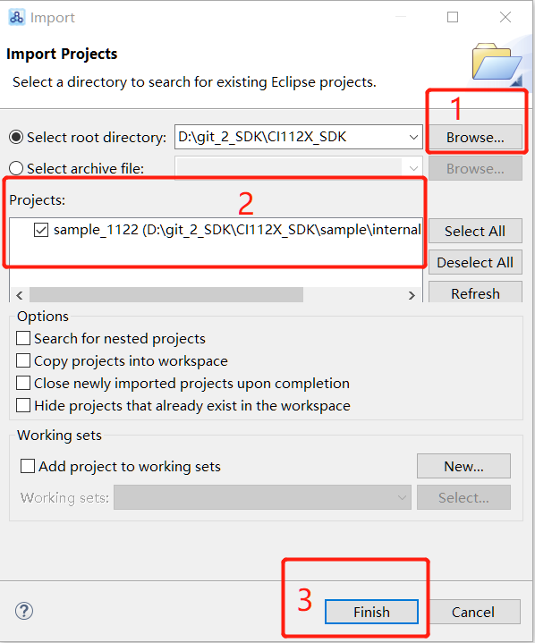{: .center }

 <div align=center>图4-2 查找工程</div>

（4）打开工程，有下列几个区域，如下图4-3所示

  * **1：工程文件目录**
  * **2：代码编辑区**
  * **3：编译log区**

 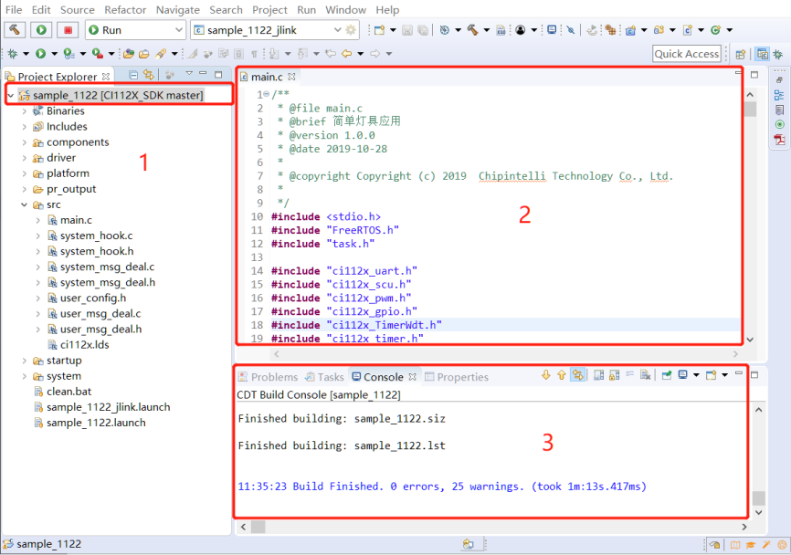{: .center }

 <div align=center>图4-3 编译器界面</div>

（5）编译工程，如图4-4所示

  * **1：右击工程文件目录的（sample_1122[CI112X_SDK master]）**
  * **2：先Refresh加载工程文件，再Clean project工程，再Build project**

 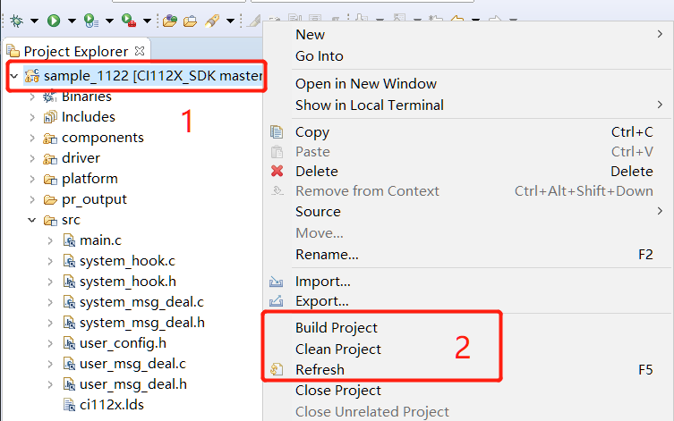{: .center }

 <div align=center>图4-4 编译</div>

（6）完成编译后，SDK\sample\internal\sample_1122\firmware\user_code生成的应用代码user.bin，如下图4-5 所示：

 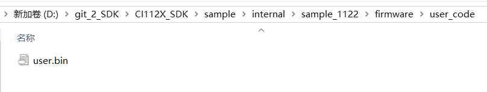{: .center }
 
 <div align=center>图4-5 user.bin生成</div>

#### 步骤3：生成其他所需4个bin文件

进入SDK\sample\internal\sample_1122\firmware\下， 如下图4-6所示：

 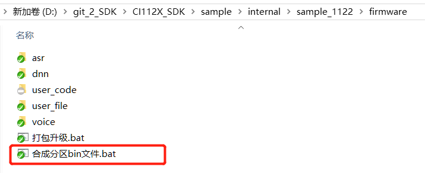{: .center }

 <div align=center>图4-6 firmware文件目录</div>

双击打开（合成分区bin文件.bat）如下图4-7所示，默认是MP3选项，按下enter键等待软件运行完成自动退出，调用脚本后，会在SDK\sample\internal\sample_1122\firmware\asr、dnn、user_file、voice各自目录下自动生成asr.bin、dnn.bin、user_file.bin和voice.bin文件。

!!! note "注意"
    * 根据标准SDK现有的命令词个数、音频个数，要选择播报音音频格式为mp3，才能打包成功。如果命令词个数、播报音个数较少，可以默认使用adpcm格式。
    * 10s处理完成后cmd.exe自动退出，如果没有自动退出，生成.bin文件失败，请检查asr、dnn、user_file、voice下文件或文件名是否正确。
    * 如果使用MP3格式，音频文件无改动，且已生成voice.bin，可以选择6跳过生成voice.bin的步骤，因为生成MP3格式比较耗时间。

 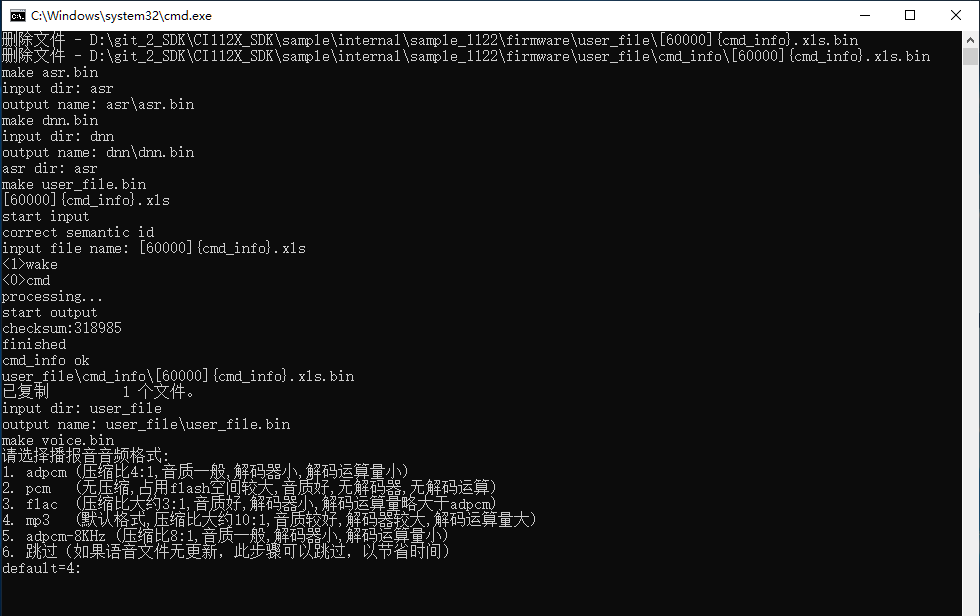{: .center }

 <div align=center>图4-7 合成分区文件界面</div>

#### 步骤4：将5个bin文件打包成一个bin文件

方式一：进入SDK\sample\internal\sample_1122\firmware\下， 如图4-6所示，双击打开（打包升级.bat），打开PACK_UPDATE_TOOL.exe

方式二：进入SDK\tools\，打开PACK_UPDATE_TOOL.exe，界面如下图4-8所示：

第一次打开时软件时，这里会弹出提示框，界面如下图4-7所示，这里需选择CI112X。

 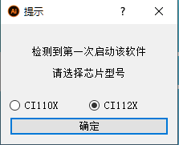{: .center }

 <div align=center>图4-7 串口升级工具选择界面</div>

 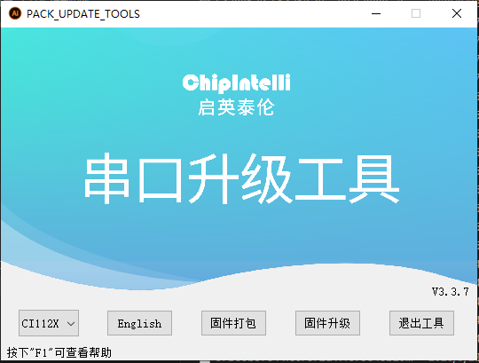{: .center }

 <div align=center>图4-8 串口升级工具主界面</div>

  * **CI112X：当前是CI112X使用模式**
  * **English：当前是中文显示，可点击切换成英文显示**
  * **固件打包：切换到固件打包界面**
  * **固件升级：切换到固件升级界面**
  * **按下“F1”查看帮助：关于升级工具的更多使用说明**

点击串口升级工具主界面的（固件打包）按钮，界面如下图4-9所示：

 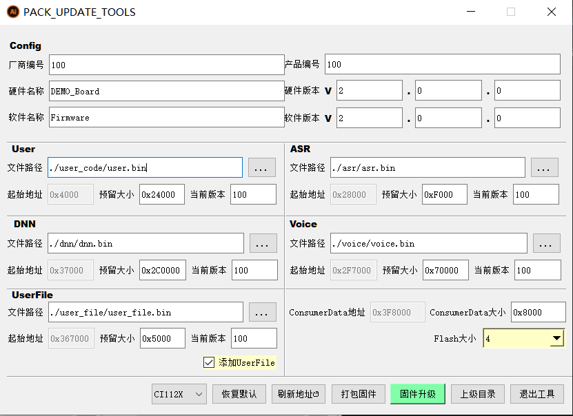{: .center }

 <div align=center>图4-9 串口升级工具固件打包界面</div>

确认5个分区预留大小是否适合，例如user.bin的实际大小为0x262A3字节，但是预留大小为0x23000字节。此时需要将user区的预留大小调整为0x27000字节，相应的可减少其他分区。voice.bin的实际大小为0XD80B9字节，voice预留大小为0x25000字节，此时将voice预留大小重新设置为0XD9000字节，相应的可减少其他分区。

!!! note "注意"
    1.预留大小按照0x1000的整数倍进行配置。

点击（打包固件）按钮，出现固件已生成的窗口，表示固件制作完成。

点击确定后，在SDK\sample\internal\sample_1122\firmware目录下生成一个.bin文件。.bin文件的名字由打包界面软件名称和软件版本组成。如下图4-10所示的Firmware_V200.bin：

 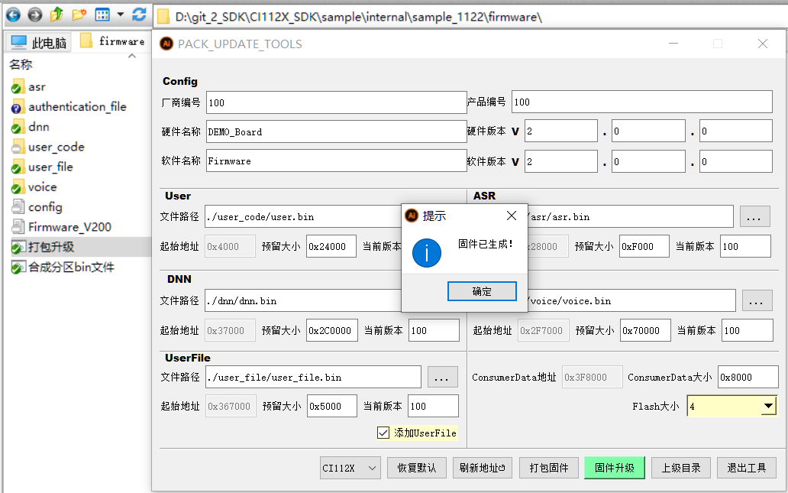{: .center }

 <div align=center>图4-10 串口升级工具打包成功界面</div>

#### 步骤5：升级固件

完成上述步骤后。建议进行下面的确认：

1.确保硬件连线正确（详见步骤1）

2.确保进入升级模式（详见2.2硬件连接介绍）

3.确保USB转串口连接到PC，PC能够识别到COM端口

4.确保固件生成正确

5.确保麦克风和喇叭正确连接开发板

点击图4-8或图4-10界面的固件升级按钮，界面如下图4-11所示：

* **1：选择步骤4生成的固件或者本司提供的固件**
* **2：选择正确的COM端口**
* **3：复位（可通过断电重启的方式）开发板，开发板自动开始升级。升级完成后显示update successful**

 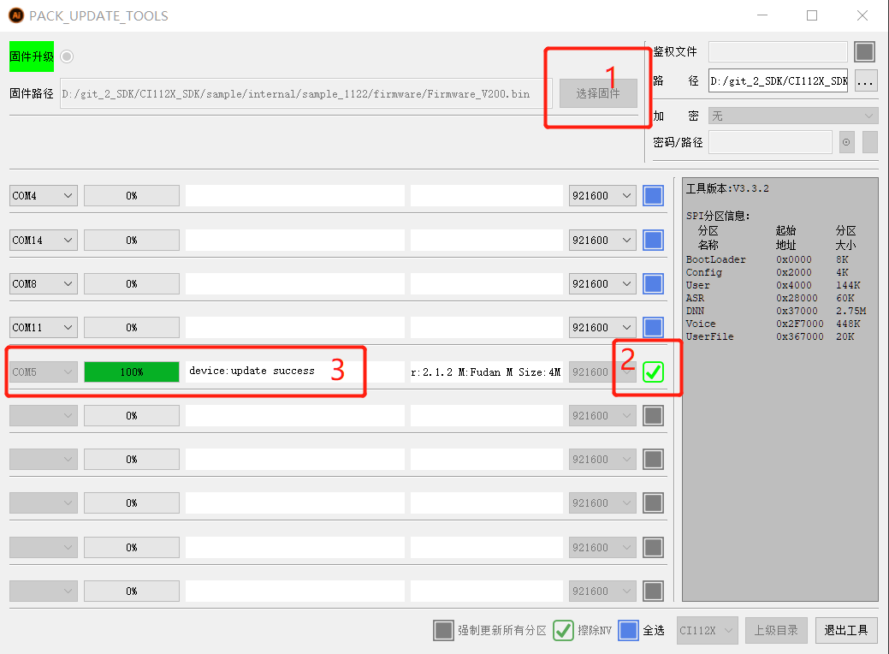{: .center }

 <div align=center>图4-11 串口升级工具升级界面</div>

!!! important "提示"
    更多固件制作信息可以访问 ☞[《命令词和固件制作指南》](./命令词和固件制作指南.md)页面，或从图4-8起始页按“F1”查看帮助。

#### 步骤6：验证固件

烧录完成后，系统会自动重启，sample_1122工程启动后会有语音播报。播报完成后，说唤醒词“智能管家”后，播报“你好”，表示升级成功。

***

## 5. 调试

有一种方式可以调试应用程序：

* 使用log 机制跟踪代码的执行和数据。

### 5.1. Log机制

通过串口打印log的方式来追踪应用程序的执行情况。

#### 5.1.1. Log 输出管脚配置

UART0_TX管脚是默认Log UART的输出引脚(也可将log功能重新配置其他引脚)。如果配置其他串口作为log输出，配置宏CONFIG_CI_LOG_UART。下图5-1以sample_1122工程（关于工程详见第三章）为例，使用UART1_TX作为Log输出，即在user_config.h里添加宏定义：

 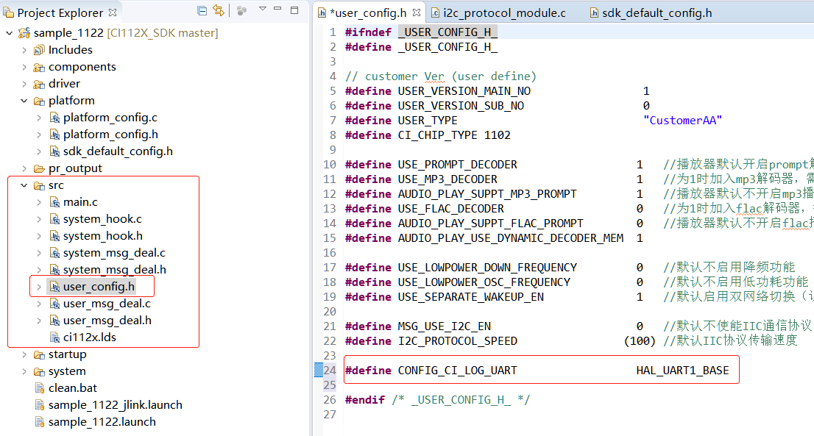{: .center }

 <div align=center>图5-1  sample_1122工程配置Log输出配置</div>

建议用户将该宏定义到工程目录下的user_config.h，不要直接修改sdk_default_config.h里面的宏定义。

#### 5.1.2. Log 串口工具配置

PC使用串口工具配置如下：

 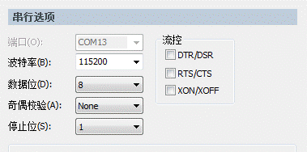{: .center }

 <div align=center>图5-2  PC串口工具配置</div>

!!! note "注意"
    由于串口输出的数据有中文，建议使用支持UTF-8字体的串口工具。

推荐串口工具SecureCRT，有关SecureCRT更多信息请问：☞https://www.vandyke.com/products/securecrt/

#### 5.1.3. Log 打印通用接口

通用log打印接口：

mprintf(fmt, args...)，用法和printf相同。

#### 5.1.4. Log 打印封装接口

为了方便用户调试，SDK封装以下接口：

**表5-1** **打印API**

| Debug API                                  | Funtion        |
| ------------------------------------------ | -------------- |
| ci_logverbose(comlevel, message, args...)  | 日志打印--详细 |
| ci_logdebug(comlevel,   message, args...)  | 日志打印--调试 |
| ci_loginfo(comlevel, message, args...)     | 日志打印--信息 |
| ci_logwarn(comlevel,   message, args...)   | 日志打印--警告 |
| ci_logerr(comlevel,   message, args...)    | 日志打印--错误 |
| ci_logassert(comlevel,   message, args...) | 日志打印--断言 |

调试等级，表示log要打印的级别。定义了7种类别：

**表5-2** **调试等级**

| Debug Level            | Usage Scenario               |
| ---------------------- | ---------------------------- |
| #define CI_LOG_VERBOSE | 全部打印                     |
| #define CI_LOG_DEBUG   | 调试、信息、警告，错误、断言 |
| #define CI_LOG_INFO    | 信息、警告，错误、断言       |
| #define CI_LOG_WARN    | 警告、错误、断言             |
| #define CI_LOG_ERROR   | 错误、断言                   |
| #define CI_LOG_ASSERT  | 断言                         |
| #define CI_LOG_NONE    | 不打印                       |

!!! note "注意"
    使用表5-1封装接口，必须将CONFIG_CI_LOG_EN定义为1。

#### 5.1.5. Log 打印长度配置

```c
#define UART_LOG_BUFF_SIZE          512
```

默认打印长度512个字节，可配置宏UART_LOG_BUFF_SIZE修改打印长度。
