# CI112X串口协议

***

## 1. 概述

本文档为CI(chipintelli) 标准语音模组串口协议设计说明书，方便快速开发代码和评审，维护人员了解代码框架。

### 1.1. 功能

* 完整传输包，包含：头尾，长度，校验，消息类型，消息序列号。
* 支持变长命令，方便扩展。
* 消息类型(命令，通知，回复)。
* 命令消息，可配置，回复ACK。通知消息无ACK。
* 消息格式将与bootloader升级的相同，通过header来与bootloader协议区分。
* 增加统一的语义ID，6字节。工具需要生成对应的头文件，方便平台制作固件使用。
* 默认波特率使用9600。默认串口使用UART1（该串口最快为1M）。
* 支持的命令：查询协议版本号，查询系统版本号，设置音量（音量分级在user_config.h中定义），播放本地播报音，复位命令，获取UNIQUEID，命令字尽量兼容CI1006上的标准板协议。

### 1.2. 性能

* 接收采用中断方式处理，输出采用polling方式处理，所以标准板上的不适合大数据量传输。
* 代码实现方面，为了减少不必要的malloc/free，用了copy的方式，所以此协议不适合数据量太大的长命令。

***

## 2. 协议简介

### 2.1. 串口命令格式概述

说明：该协议内非单字节数据，低字节在先，高字节在后。

 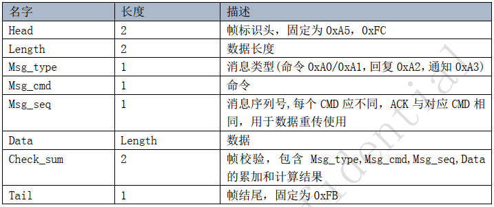{: .center }

 <div align=center>图2-1 串口命令格式</div>

### 2.2. 命令详细描述

#### 2.2.1. 错误回复

说明：当发送错误时使用该回复

ACK:

 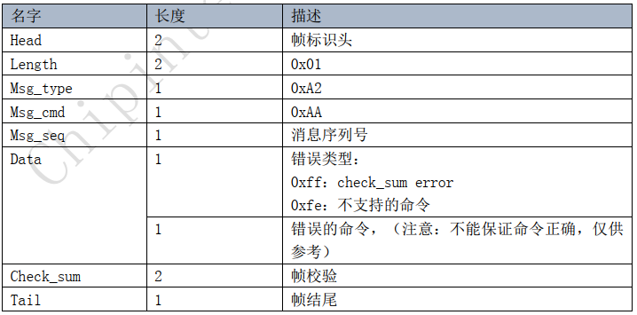{: .center }

 <div align=center>图2-2 当发送错误时回复</div>

#### 2.2.2. 语音识别结果

说明：语音模组在进入唤醒状态后，识别到结果后发送该消息（包含唤醒词）。

CMD: 

 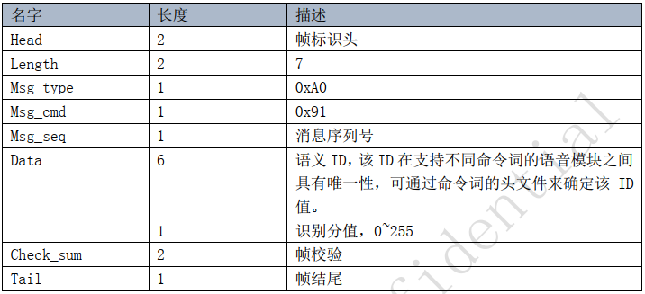{: .center }

 <div align=center>图2-3 识别到结果后发送该消息</div>

ACK包格式如下，但暂未实现该功能和重传机制。

 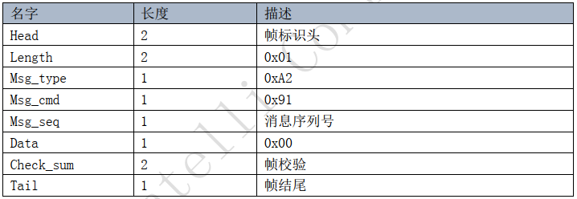{: .center }

 <div align=center>图2-4 ACK包格式</div>

#### 2.2.3. 播放本地播报音

说明：用于播放保存在语音模组固件内的播报音。

CMD:

 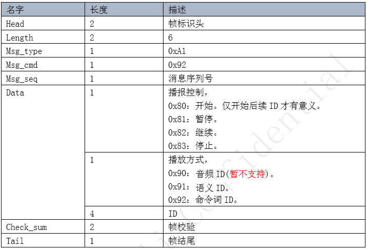{: .center }

 <div align=center>图2-5 播放播报音CMD</div>

ACK :

 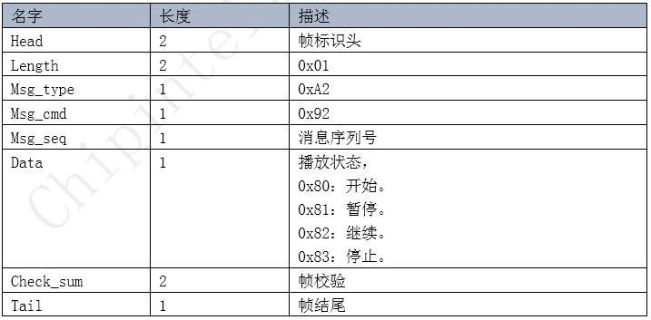{: .center }

 <div align=center>图2-6 播放播报音ACK</div>

#### 2.2.4. 获取UNIQUEID

说明：用于查询flash 的uniqueID，注意，此功能需要flash器件的支持。

CMD:

 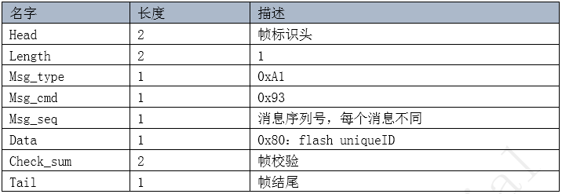{: .center }

 <div align=center>图2-7 查询flash的uniqueID-CMD</div>

ACK:

 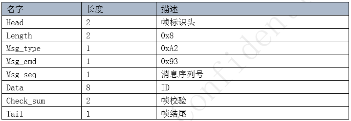{: .center }

 <div align=center>图2-8 查询flash的uniqueID-ACK</div>

#### 2.2.5. 获取版本号

说明：用于查询语音模组中的固件使用的SDK的版本号。

CMD:

 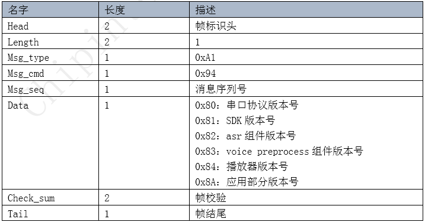{: .center }

 <div align=center>图2-9 查询SDK的版本号-CMD</div>
ACK:

 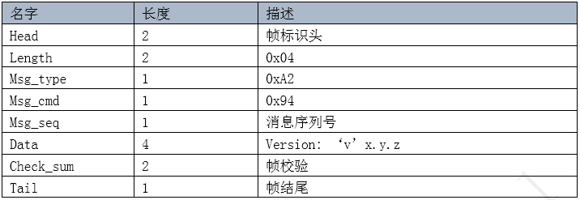{: .center }

 <div align=center>图2-10 查询SDK的版本号-ACK</div>

#### 2.2.6. 复位模组

说明：用于复位语音模组。

CMD:

 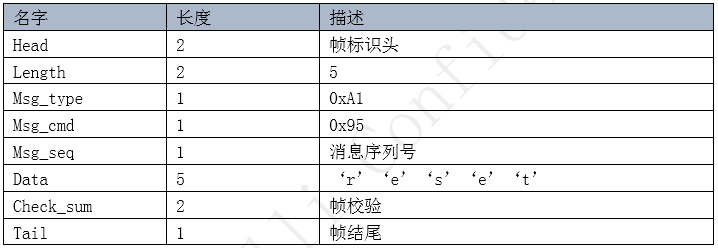{: .center }

 <div align=center>图2-11 复位语音模组-CMD</div>
ACK:

 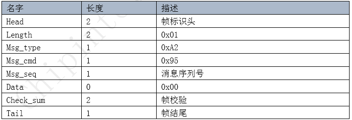{: .center }

 <div align=center>图2-12 复位语音模组-ACK</div>

#### 2.2.7. 设置功能

说明：用于设置模组和本串口协议的一些功能选项。

CMD:

 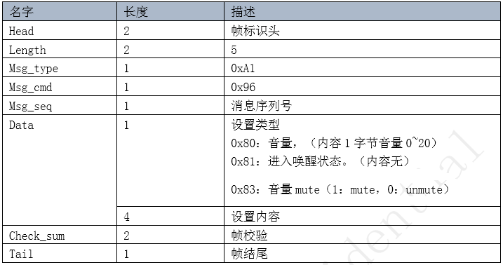{: .center }

 <div align=center>图2-13 设置功能选项-CMD</div>

ACK:

 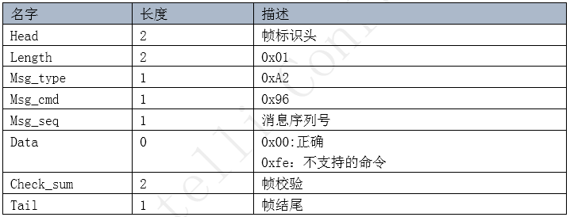{: .center }

 <div align=center>图2-14 设置功能选项-ACK</div>

#### 2.2.8. 状态通知

说明：用于发送语音模组状态改变的通知。

CMD:

 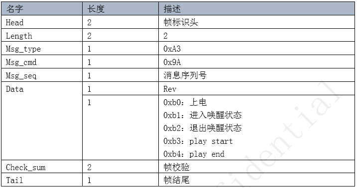{: .center }

 <div align=center>图2-15 语音模组状态改变的通知-CMD</div>

#### 2.2.9. 进入OTA模式

说明：用于设置语音模组进入OTA模式。

CMD:

 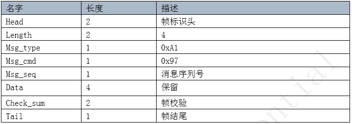{: .center }

 <div align=center>图2-16 进入OTA模式-CMD</div>

ACK:

 {: .center }

 <div align=center>图2-17 进入OTA模式-ACK</div>

***

## 3. 串口协议配置

串口通讯的具体配置:

 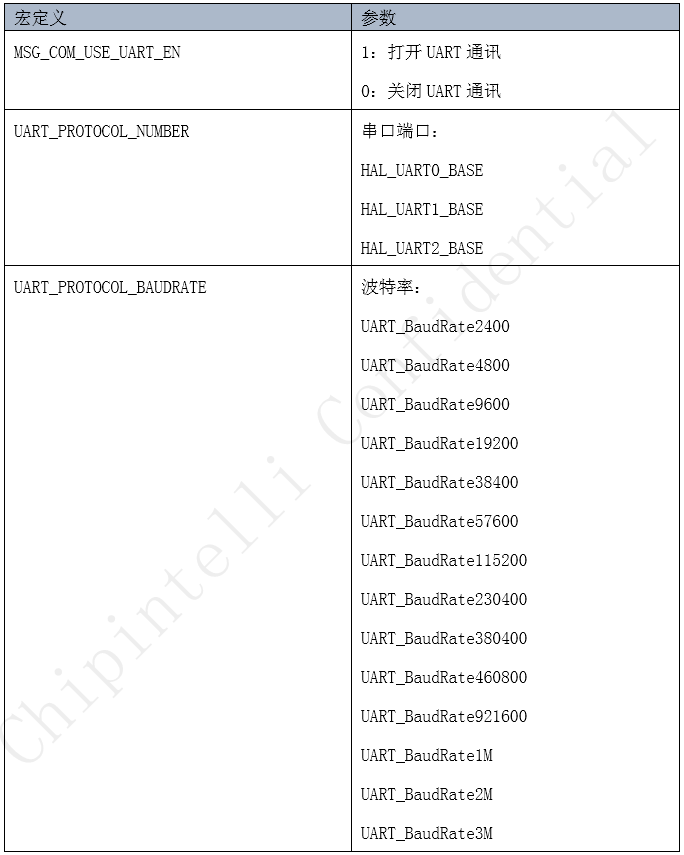{: .center }

 <div align=center>图2-18 串口通讯的具体配置</div>

建议开发者在自己工程路径下进行以下配置，不要修改sdk_default_config.h文件里面配置。下面以sample_light工程为例，修改串口通讯配置。打开SDK\sample\internal\sample_light\user_config.h。

```c
#define MSG_COM_USE_UART_EN                  1
#define UART_PROTOCOL_NUMBER            (HAL_UART1_BASE)
#define UART_PROTOCOL_BAUDRATE          (UART_BaudRate9600)
```

注意事项：

1.修改UART_PROTOCOL_NUMBER时，确认是否被占用，SDK默认使用UART0 作为Log (关于更多Log 详见 CI112X_Quit_Start文档)输出端口。

2.串口通讯默认其他参数：数据位：8位，停止位：1位，无奇偶数校验。如果需要修改，在对应的UART初始化接口（UARTInterruptConfig、UARTPollingConfig、UARTDMAConfig）里修改UART_LCRConfig函数的调用参数。
