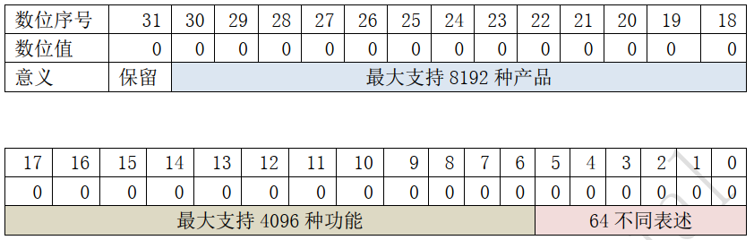
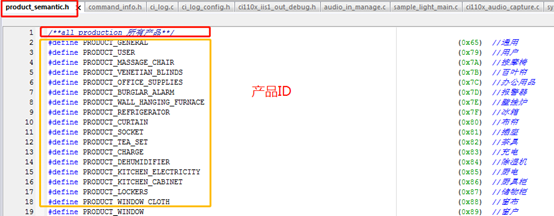
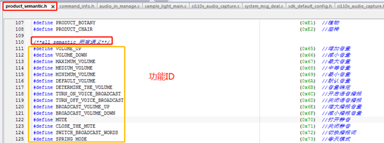
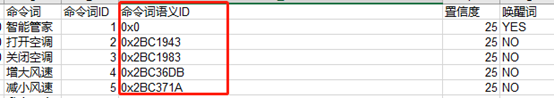

# CI112X语义ID说明

***

## 1. 概述

​CI112X_SDK 增加了语义ID的概念，为了方便开发者快速开发SDK,本文旨在对语义ID协议和使用进行说明。

***

## 2. 语义ID目的

### 2.1. 唯一性

​每个命令词的语义ID具有唯一性，方便多个产品之间交互。

### 2.2. 方便相同功能命令词处理

通常在具体产品应用中，同一个意思但是有不同的表述方式，例如“增大音量”、“声音大点”、“大声点”、“调高音量”等。开发者需要对这种逻辑进行专门的处理。在开发过程中，开发者可能随时增加或删除一些这类的词，此时代码维护起来就变的繁琐。命令词的语义ID很好的解决这个问题，只需要修改命令词EXCLE表和ASR模型，而不需要修改代码。

***

## 3. 语义ID协议详述

 {: .center }

 <div align=center>图3-1 语义ID协议详述</div>

* 语义ID总共4个字节（32位bit），最高位：保留。

* 第18位到30位：产品ID。最大支持8192种产品。例如：“空调打开”、“风扇打开”，通过空调（ID:0xAF）和风扇(ID:0x9D)的ID区别开来。产品ID具体定义在product_semantic.h文件的位置如下图所示：

 {: .center }

 <div align=center>图3-2 产品ID位置</div>

!!! note "注意"
      产品ID里面包含了通用（ID:0x65），表示一些产品通用的指令，例如音量调节，播报控制等。

* 第6位到第17位：功能ID。最大支持4096种功能。

  例如：“大点声”和“小点声”属于不同的功能，两者的功能ID不一致。“大点声”和“增加音量”属于相同的功能，两者的功能ID是一致的，方便相同功能的命令词的处理。 功能ID具体定义在product_semantic.h文件的位置如下图:

 {: .center }

 <div align=center>图3-3 功能ID位置</div>

* 第0位到第5位：表述ID。最大支持64种不同表述。 

  例如：“大声点”、“大点声”和“增大音量”这类词的功能都统一为增大音量，它们的产品ID和功能ID都是完全一致的，唯一不同的就是表述ID。表述ID是为了支持语义ID唯一性。如果开发者不考虑唯一性，可以忽略。

***

## 4. 语义ID具体说明

### 4.1. 语义ID函数

//获取产品ID

get_product_id_from_semantic_id(semantic_id);

//获取功能ID

get_function_id_from_semantic_id(semantic_id);

### 4.2. 语义ID文件

命令词语义ID由本公司提供，具有唯一性，开发者打包..\firmware\user_file\cmd_info\[60000]xxx.xls命令词列表文件时，[60000]xxx.xls语义ID会自动生成。如下图所示：

 {: .center }

 <div align=center>图4-1 命令词语义ID自动生成</div>

命令语义ID后续本公司逐渐完善，语义ID头文件路径：SDK\components\cmd_info\product_semantic.h。

***

## 5. 语义ID示例代码

### 5.1. 通用语义ID示例代码

```c
#define  PRODUCT_GENERAL (0x65)  //通用(语义ID头文件已定义)
uint32_t semantic_id = 0x19419C4;   //最大音量语义ID(命令词Excle表)
//获取产品ID
if(PRODUCT_GENERAL==get_product_id_from_semantic_id(semantic_id))
{
    //获取功能ID
    switch(get_function_id_from_semantic_id(semantic_id))
    {

      case VOLUME_UP:            //增大音量
           break;
      case VOLUME_DOWN:          //减小音量
           break;
      case MAXIMUM_VOLUME:       //最大音量
           vol_set(VOLUME_MAX);
           break;
      case MEDIUM_VOLUME:        //中等音量
           vol_set(VOLUME_MID);
           break;
      case MINIMUM_VOLUME:       //最小音量
           vol_set(VOLUME_MIN);
           break;
      default:
           break;
    }
}
```

上述示例代码为产品的通用控制，多个产品可以使用上述同一份代码，加速代码开发。

### 5.2. 灯控语义ID示例代码

```c
#define PRODUCT_LAMP_CONTROL (0x8D)   //灯控 （语义ID头文件已定义）
uint32_t semantic_id = 0x234DF84; 	//最高亮度语义ID(命令词Excle表)
//获取产品ID
if(PRODUCT_LAMP_CONTROL==get_product_id_from_semantic_id(semantic_id))
{
    //获取功能ID
    switch(get_function_id_from_semantic_id(semantic_id))
    {
        case MAXIMUM_BRIGHTNESS_OF_LIGHT:  //灯光最高亮度
            break;
        case MODERATE_BRIGHTNESS:          //中等亮度
            break;
        case MINIMUM_BRIGHTNESS_OF_LIGHT:  //灯光最低亮度
            break;
        case TURN_UP_THE_LIGHT:            //灯光调亮一点
            break;
        case DIM_THE_LIGHT:                //灯光调暗一点
            break;
        case RED_MODE:                     //红色模式
            break;
        case GREEN_MODE:                   //绿色模式
            break;
        case BLUE_MODE:                    //蓝色模式
            break;
        case COLORFUL_MODE:                //彩色模式
            break;
        default:
            break;
    }
}

```
