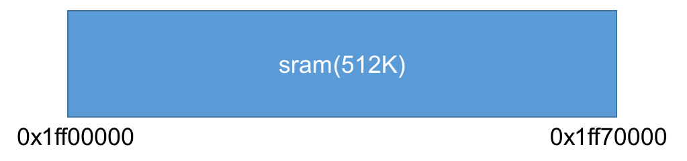

# 内存结构

***

## 1. 概述

CI112X系列目前仅包括CI1122一款芯片。其内存分配主要是通过工程lds链接脚本文件。下面对其的内存分配作以介绍：

### 1.1. CI1122

* 下图为内存地址映射图

 {: .center }

 <div align=center>图1-1 内存地址映射</div>

1.SRAM：512K，这片区域的内存空间使用没有任何限制

* 下图为系统初始化完成后的内存地址分配图

 {: .center }

 <div align=center>图1-2 内存地址分配</div>
1.从sram开始的地址0x1ff00000开始依次放置code、FHEAP、HEAP、RW、系统主栈/中断栈，其中HEAP区通过malloc申请free释放，提供算法使用，FHEAP通过pvPortMalloc申请vPortFree释放，用于应用开发使用和os使用（在任务中的局部变量使用任务栈，即使用的FHEAP区），code区包括text段和ro段，RW包括data段bss段（即有无初值的全局变量），同时在尾部包括4K的系统主栈，主栈用于os启动调度前的栈空间和中断服务函数内使用的栈空间

***

## 2. 如何修改各个区域大小（lds文件修改）

上文所述的典型的配置方案能满足绝大多数配置需求，但针对特定应用方案时往往需要对部分区域大小做适当调整，本节主要，描述系统链接脚本的修改方法

### 2.1. ci1122

以下代码块节选自ci1122工程模板lds文件

```
ROM_SIZE      = 1024*(110);
FHEAP_SIZE    = 1024*(83);
ASR_USED_SIZE = 1024*(300);
RAM_SIZE      = 1024*(19);
STACK_SIZE    = 0x1000;/*inclued in RW*/

ASSERT(((512)*1024 == (ROM_SIZE + FHEAP_SIZE + ASR_USED_SIZE + RAM_SIZE)), "Unsupported configuration size")
```

其中

* ROM_SIZE对应用户code区，通常增加代码会导致对该区域内存大小需求增加

* FHEAP_SIZE为用户堆区，通常用户使用pvPortMalloc函数申请动态内存即从此区域申请，同时freertos中的相关接口也从该区域申请内存，例如创建任务、信号量、队列、事件组等，若用户程序增加了以上内容则需要适量增加该区域大小

* RAM_SIZE对应用户数据区，通常增加全局变量会导致对该区域内存大小需求增加

* ASR_USED_SIZE对应sdk中语音识别、denoise等算法申请数据区大小，此区域通常情况是不需要变更的，但是注意在裁剪功能时可以对此区域进行减小，列如不需要使用denoise算法时，且其他用户代码对内存要求较多时可以适量减小此区域大小，这里给出一个参考内存需求，关于asr部分内存需求请参考平台生成模型时提供的内存需求参考大小。

| 算法    | 内存需求 |
| ------- | -------- |
| denoise | 31K      |

最后，了解了上述内存区域后，就可以自行修改这四个参数的大小，但要注意这四个参数之和为512K，如果大小不满这个要求，编译器将提示"Unsupported configuration size"错误。

***

## 3. 常见问题

* 不建议较大改动连接脚本内容，仅根据需要调整各部分区域size大小即可。
